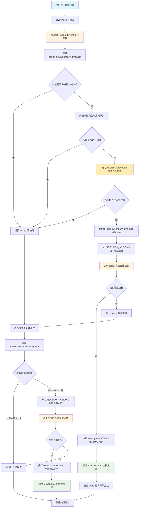

# 键盘焦点导航流程

```mermaid
flowchart TD
    A[用户按下键盘按键] --> B[keydown 事件触发]
    B --> C[handleKeyboardEvent 主控函数]
    C --> D[调用 handleInputBoundaryNavigation]

    D --> E{检查是否为支持的输入框}
    E -->|否| F[返回 false，不处理]
    E -->|是| G[获取按键类型和方向映射]
    G --> H{按键是否为方向键}
    H -->|否| F
    H -->|是| I[调用 isCursorAtBoundary 检查光标位置]

    I --> J{光标是否在边界位置}
    J -->|否| F
    J -->|是| K[shouldHandleBoundaryNavigation 返回 true]
    K --> L[从 DIRECTION_ACTIONS 获取导航函数]
    L --> M[调用相应的导航算法函数]
    M --> N{找到导航目标}
    N -->|是| O[执行 event.preventDefault 阻止默认行为]
    N -->|否| P[返回 false，导航失败]
    O --> Q[调用 focusElement 切换焦点]
    Q --> R[返回 true，边界导航成功]

    F --> S[边界模式未处理事件]
    P --> S
    S --> T[调用 handleModifierKeyNavigation]
    T --> U{检查修饰键状态}
    U -->|无 Ctrl/Cmd 键| V[不执行任何操作]
    U -->|有 Ctrl/Cmd 键| W[从 DIRECTION_ACTIONS 获取导航函数]
    W --> X[调用相应的导航算法函数]
    X --> Y{找到导航目标}
    Y -->|是| Z[执行 event.preventDefault 阻止默认行为]
    Y -->|否| V
    Z --> AA[调用 focusElement 切换焦点]

    R --> BB[事件处理完成]
    V --> BB
    AA --> BB

    style A fill:#e1f5fe
    style C fill:#fff3e0
    style I fill:#ffecb3
    style M fill:#fff3e0
    style X fill:#fff3e0
    style Q fill:#e8f5e8
    style AA fill:#e8f5e8
```

## 流程说明

键盘事件首先尝试处理输入框光标位于边界时的方向导航。只有当前元素属于受支持的输入框、按键属于方向键且光标位于对应边界时，系统才会查找导航目标并切换焦点。

如果边界导航未处理该事件，流程会继续检查 `Ctrl` 或 `Cmd` 修饰键导航。找到目标后阻止浏览器默认行为并切换焦点；否则不执行操作，事件处理结束。
