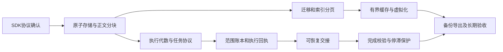

# Agent 四项剩余缺口：代码修复设计与执行工单

日期：2026-09-13。状态：**待实施方案，不是完成报告**。

目标读者：能够修改 TypeScript、运行 Vitest，但不熟悉 Synapse 架构的执行 Agent。

本方案针对用户附件中的四项问题：历史增长成本、界面容量、执行恢复、任务完成可信度。它补充并细化同日两份长运行性能/长任务可靠性计划中的未完成项，不覆盖它们的执行记录，不撤销已经完成的局部修复。本次只新增本文件，没有运行真实 Agent、迁移用户数据库或修改产品代码。

## 1. 先读结论与范围

按下面顺序实施：

1. 建立 SDK 协议测试和 DataRepository 原子追加、索引读取能力。
2. 分离会话摘要、历史描述符、正文载荷，迁移所有读取方，再迁移旧数据。
3. 把 Renderer 改成有预算的页缓存、平面虚拟行和分段正文，并修复断线追补。
4. 将上下文轮换改为持久状态机，引入执行代数、恢复确认及副作用回执。
5. 使用 SDK 原生 Task 工具与 hooks 提交进度，建立宿主覆盖账本与最终完成校验。
6. 完成迁移、故障注入、正式包容量和真实任务质量验收。

不把四项工作合成一个大提交；第 14 节给出可独立交接的工单与依赖。性能与可靠性共用同一套历史、内容引用、修订号和事务，禁止各建一套状态库。

**SDK 优先的决定**：继续使用现有 Claude Agent SDK `query()` 执行循环、`resume`、原生自动整理、`getContextUsage()`、工具 hooks、Task 工具与文件回退 API。宿主只补 SDK 没有提供的产品存储、容量控制、事务、证据校验。用户所说的“Cloud SDK”在这里按仓库实际使用的 **Claude Agent SDK** 理解；不改成 Claude Managed Agents 或另一种云端执行架构。

**保证的范围**：可以验证数据是否保存、哪些范围有证据、验收条件是否通过，以及恢复是否重复发送。不能证明模型真正理解全部语义，也不能承诺对任意外部工具实现 exactly-once。无法确认外部副作用时必须保留 `unknown` 并停止自动继续。

## 2. 证据基线与读取入口

本次读取的是包含未提交修改的工作区：HEAD `15678574e12f7afaf741ac8c61f1956a59ec8d2a`；desktop `0.2.457`；安装的 Claude Agent SDK `0.3.245`。执行开始前必须重新记录 HEAD、文件 diff 和 SDK 版本，不能假定行号或代码仍未变化。

| 缺口 | 已核实的当前路径与符号 | 保留的局部修复 | 本方案要替换的部分 |
| --- | --- | --- | --- |
| 历史增长 | `desktop/electron/services/agent-runtime/session-repository.ts`：`appendHistory`、`mergeLastHistoryMetadata`、问题响应；`runtime/data-repo/backends/sqlite.ts`：`upsert` | 会话级 mutation 队列、顶层 patch、标题保护 | 整 conversation 读取、数组复制和整 JSON 写回 |
| 全量读取 | `desktop/electron/modules/agent/ipc-shared.ts`：`historyPage`；`ipc-messages.ts`：`getTimelineContentChunk`；`desktop/app-capabilities/agent/main/control-service.ts`：`buildTimelinePage` | IPC 投影大小限制、MCP 脱敏与整轮语义 | 先取全 history 再裁剪、向前扫描整轮、全文接口先取整个对象 |
| Renderer 增长 | `use-chat-connection.ts`：`prependTimelineEntries`、`mergePersistedTimelineTail`、`backfillTimelineGap`；`desktop/src/lib/agent-timeline.ts` | 50 ms 合批、ACK、局部时钟、查看器释放 | 无限缓存/追补、长字符串累计、整列表重算 |
| DOM 增长 | `agent-timeline.tsx` 的外层和过程组内层 `map`；`agent-message-event.tsx` 的正文预处理 | shadcn/ScrollArea/Streamdown 与现有链接处理 | 巨大过程组整组挂载、不断重算完整活动正文 |
| 自动交接 | `conversation-router.ts`：`rotateContextSession`、`processLiveTurn`；`context-continuation.ts`：`persistContextContinuation` | steer 等待、取消复查、先存资料再关闭 | 内存阶段状态、清除 resume ID 后无事务身份、完整历史检查点 |
| 完成判断 | `processLiveTurn` 的 `rotationsWithoutProgress`；`turn-outcome.ts`；`ensureTaskListId` | 工具结果保存、稳定 taskListId、错误终态归一化 | 工具批次数充当业务进度、缺少覆盖与验收账本 |

同日执行记录中的 1k/10k/100k JSON 字节数字仅是合成存储基线，不是磁盘 IO、峰值内存、正式包卡顿归因。本次未重新执行这些测试，也未取得新的长跑成绩。

### 2.1 执行前必读

读取根 `AGENTS.md`，再读 `docs/agents/execution-rules.md`、`repository-guide.md`、`agent-runtime-security.md`、`knowledge-base.md`；涉及的专题读 `capability-registry.md`、`module-boundaries.md`、`.claude/rules/testing.md`、`frontend.md`、`api.md`。

设计入口：

- `docs/superpowers/specs/2026-09-13-agent-long-running-capacity-design.md`
- `docs/superpowers/specs/2026-09-12-agent-context-budget-governor-design.md`
- `docs/superpowers/specs/2026-09-12-agent-renderer-capacity-and-recovery-design.md`
- `docs/superpowers/plans/2026-09-13-agent-long-running-performance-execution.md`
- `docs/superpowers/plans/2026-09-13-agent-long-task-state-and-context-reliability-execution.md`
- `docs/superpowers/plans/2026-09-13-agent-long-task-state-and-context-reliability-plan.md`

UI 工单还须读取 `docs/agents/ui-and-product.md`、`.claude/rules/design.md`、`.claude/rules/ui-rules.md`、`desktop/components.json`、`desktop/src/styles/globals.css` 和现有组件。方案不要求重新设计界面。

### 2.2 不能隐式修改的产品规则

现规则明确说“模型是否调用 Read、调用次数和是否读完不属于 Synapse 的完成条件”。本方案的覆盖门禁**只用于具有明确完整覆盖要求的受跟踪任务**，不能给所有聊天/附件统一增加“必须 Read 全部内容”的条件。

实施严格覆盖前，需确认并同步这一限定后的产品边界；若尚未获批准，先完成底层账本及测试，严格门禁保持禁用，明确报告该项未交付。不能仅因计划里写了新规则，就静默改写长期约束。

其它边界保持：不新增公共 MCP 工具；不自动注入新的运行时 MCP server；不改变现有图片“受控路径 + 原生 Read”路径；不修改权限范围或用户模型；不自动重放网络/API 失败的整轮；不自动续跑进程重启前的本地交互任务。本方案不包含依赖安装授权、真实应用启动授权或发布授权。

## 3. SDK 官方能力核验与采用清单

在线资料以 2026-09-13 访问结果为准；API 是否存在还用本地 `desktop/node_modules/@anthropic-ai/claude-agent-sdk/sdk.d.ts` 和 `sdk-tools.d.ts` 核对。TypeScript 在线参考页本次因体积过大抓取失败，未把未读到的参考内容当证据。

| 需求 | 已确认的 API / 机制 | 本次方案中的用途 | 不能由它推导出的保证 |
| --- | --- | --- | --- |
| 原会话继续 | `query({ options: { resume: sdkSessionId } })`，默认持久化；可指定新 `sessionId` | 正常跨调用恢复使用精确 ID；新 generation 创建前预分配 UUID | `continue: true` 选择最近会话不适合多个 conversation；`send` 接纳不等于模型完成处理 |
| 历史辅助读取 | `getSessionMessages(id,{dir,limit,offset,includeSystemMessages})` | 故障后有限次数辅助核对 SDK 消息身份 | API 会重建 transcript 消息链，未承诺索引分页或内存有界；不接到 UI 热路径 |
| 上下文维护 | SDK 自动整理；`PreCompact`、`PostCompact.compact_summary`、`compact_boundary`；`Query.getContextUsage()` | 保留原生整理，监测边界和重新建立预算基线 | 未发现可采用的公共 `Query.compact()`；不能任意删写 SDK transcript |
| 工具结果控制 | `PostToolUse.updatedToolOutput`；`PostToolBatch.tool_calls` / `additionalContext` | 保存结果、返回原生结构的受控输出、在下一请求前提交批次状态 | hook 看见结果不代表真实请求携带了所有字节；其它用户/plugin hooks 可能参与改写 |
| 完成拦截 | `Stop` 的 `decision:'block'` / `reason`；`stop_hook_active` | 在正常结束前给出缺失项，有限次补齐 | hook 超时可能按 SDK 行为正常结束，因此宿主仍要二次检查终态 |
| 任务语义传输 | `TaskCreateInput.metadata`、`TaskUpdateInput.metadata`；TaskCreate/Get/List/Update | 借原生 Task 工具携带结构化计划/进度/恢复确认；不再新增同义 MCP 工具 | TaskGet/List 的当前输出不包含 metadata，不能依赖它们恢复宿主账本；宿主必须在 hook 中持久化 |
| 跨 session 任务身份 | `CLAUDE_CODE_TASK_LIST_ID` | 保留已有每 conversation 的稳定 ID 及 env/settings.env 双层覆盖 | 共享 ID 不等于条目、版本、证据已由 Synapse 备份 |
| 文件撤销 | `enableFileCheckpointing` + `Query.rewindFiles(uuid,{dryRun})` | 继续复用现有文件检查点服务 | 不回退模型上下文，不是通用文件系统事务，不覆盖 Bash/外部系统；跨代不能任意 rewind |
| 最终结构 | `outputFormat:{type:'json_schema',schema}`、`result.structured_output` | 只在原来就是结构化交付的入口用于最终报告校验 | schema 合法不等于证据真实；普通聊天不强制改成 JSON，也不新建隐藏 query |
| SDK transcript 存储 | `SessionStore.append/load`、`sessionStoreFlush`、`foldSessionSummary`，本地标注 alpha | 优先用于未来确有 SDK transcript 镜像需求的适配和协议测试 | 镜像失败会发 `mirror_error`，SDK 可能继续；`load` 返回完整数组，不是本方案 UI/事务基础 |

会话 API 的依据见 [SDK sessions](https://code.claude.com/docs/en/agent-sdk/sessions)；hooks 的时机与失败行为见 [SDK hooks](https://code.claude.com/docs/en/agent-sdk/hooks)；整理事件见 [agent loop](https://code.claude.com/docs/en/agent-sdk/agent-loop)。其余签名以本地类型为直接证据。

文件回退限制见 [file checkpointing](https://code.claude.com/docs/en/agent-sdk/file-checkpointing)，结构化输出见 [structured outputs](https://code.claude.com/docs/en/agent-sdk/structured-outputs)，稳定列表身份见 [task list](https://code.claude.com/docs/en/interactive-mode#task-list)。这些 API 均不能替代宿主事务与业务验收。

### 3.1 SessionStore 的明确取舍

[SessionStore 官方说明](https://code.claude.com/docs/en/agent-sdk/session-storage)描述的是本地 transcript 的外部镜像。本地类型还确认 `append` 失败有限重试后丢弃镜像批次并报告 `mirror_error`；`load` 一次返回完整会话；载荷应保持 deep-equal。

因此本次核心修复**不启用新的全量 transcript 镜像**：它增加一份可能包含敏感值的 SDK 私有数据，且无法单独解决四个问题。若后续确需跨设备恢复，必须复用 SessionStore API，不能自写 SDK JSONL 同步器；另外设计加密存储、所有权、镜像缺口、版本、删除和备份。禁止把脱敏后的条目作为原 SDK 会话原样 resume，禁止把异步镜像回调作为提交屏障。

### 3.2 必须扩充的真实 SDK 协议夹具

复用已有 `desktop/electron/services/agent-runtime/__tests__/sdk-native-long-task-contract.test.ts`：真实安装 SDK/native binary + 独立 HOME/config/cwd + 本地 loopback 响应服务；不读取用户凭据或 MCP，不调用收费 Provider。该夹具已覆盖部分 Read/Bash/MCP 替换、Stop 和列表身份；不要另造仅 mock 的“证明”。

新增用例：

1. 并行两次同名 Read，结果乱序，按 tool_use_id 验证请求中对应正文；加入其它 hook 改写，确认宿主证据的可信上限。
2. 在 PostToolBatch 等待时依次测试 getContextUsage、取消、interrupt/close；断言没有相互等待导致死锁，取消后不再发送请求。
3. 引出原生 compact，记录 hook / boundary / snapshot / 下一请求的真实顺序；通知重复、快照迟到时不能重复释放预算。
4. TaskCreate 返回 task.id；TaskUpdate metadata、status 变更成功/失败；TaskGet/List 缺 metadata；TaskCompleted hook 是否覆盖当前原生工具路径。未覆盖时仍以 PostToolUse 成功回执为准。
5. Stop block、第二次 Stop、Stop hook 抛错/超时、结构化输出结束、error result；宿主均不能把未验收状态写为完成。
6. 预分配 `sessionId` 与 `UserPromptSubmit` 持久确认；SessionStore 延迟/丢批只用测试适配器验证其局限，不在产品默认开启。

夹具记录脱敏摘要：SDK 版本、用例 ID、事件次序、请求体字节计数、结果。新版本 SDK 必须重跑，不引用一次通过作为永久保证。

## 4. OpenCode 的具体参考与边界

本次通过 GitHub API 固定源码提交 `95daf90670b7c039c436c85537da5fbfe2205b41`（提交时间 2026-09-11），读取以下实际文件；不将不断变化的 dev URL 当实现依据。

| 固定源码 | 实际做法 | 采用内容 / 不照搬内容 |
| --- | --- | --- |
| [core/session/sql.ts](https://github.com/anomalyco/opencode/blob/95daf90670b7c039c436c85537da5fbfe2205b41/packages/core/src/session/sql.ts) | session、message、part、todo 独立表；消息按 session/time/id 索引；另有新版 session_message/seq | 借鉴摘要与明细分离、稳定顺序索引；不引入 Drizzle/Effect 或第二数据库；不混用其两套消息模型 |
| [session/message-v2.ts](https://github.com/anomalyco/opencode/blob/95daf90670b7c039c436c85537da5fbfe2205b41/packages/opencode/src/session/message-v2.ts) | page 使用 time+id 游标、limit+1；再按消息 ID 取 parts；stream 逐页读取 | 借鉴 keyset 与读取迭代器；它一次 hydrate 一个消息的全部 parts，不能直接保证巨大单消息有界 |
| [timeline/message-timeline.tsx](https://github.com/anomalyco/opencode/blob/95daf90670b7c039c436c85537da5fbfe2205b41/packages/app/src/pages/session/timeline/message-timeline.tsx) / [rows.ts](https://github.com/anomalyco/opencode/blob/95daf90670b7c039c436c85537da5fbfe2205b41/packages/app/src/pages/session/timeline/rows.ts) | 平面显示行、稳定 key、动态测高、prepend 锚点、TanStack Solid 虚拟列表 | 借鉴平面行和锚点，不复制 Solid 组件；需额外分解 Synapse 巨大过程组和正文 |
| [global-sync/session-cache.ts](https://github.com/anomalyco/opencode/blob/95daf90670b7c039c436c85537da5fbfe2205b41/packages/app/src/context/global-sync/session-cache.ts) / [eviction.ts](https://github.com/anomalyco/opencode/blob/95daf90670b7c039c436c85537da5fbfe2205b41/packages/app/src/context/global-sync/eviction.ts) | 会话 LRU、保护集合；清除 message、part、delta、todo 等关联缓存；目录另有 TTL | 借鉴关联清理；上游 40 会话限制不等于单会话页/字节或多窗口预算，不直接采用 40 |
| [session/compaction.ts](https://github.com/anomalyco/opencode/blob/95daf90670b7c039c436c85537da5fbfe2205b41/packages/opencode/src/session/compaction.ts) | 旧工具输出标记 compacted，按预算保留尾部，摘要作为独立记录；存在用户消息 replay 分支 | 借鉴保留近期材料和独立摘要；Synapse 继续使用 SDK 原生整理，不复制 replay 或忽略图片的恢复策略 |
| [session/todo.ts](https://github.com/anomalyco/opencode/blob/95daf90670b7c039c436c85537da5fbfe2205b41/packages/opencode/src/session/todo.ts) | todo 事务替换，提交后通知 | 借鉴先提交后发布；任务勾选仍不能证明覆盖完成 |
| [session/processor.ts](https://github.com/anomalyco/opencode/blob/95daf90670b7c039c436c85537da5fbfe2205b41/packages/opencode/src/session/processor.ts) | 最近三次相同工具与 JSON 参数触发 doom_loop 权限判断 | 作为重复调用信号；增加跨 generation 的有效证据进展，不凭相同调用就判死循环 |
| [tool/truncate.ts](https://github.com/anomalyco/opencode/blob/95daf90670b7c039c436c85537da5fbfe2205b41/packages/opencode/src/tool/truncate.ts) | 输出按行/字节截断，完整输出有存储引用 | 保留现有 artifact 思路；不能把引用算成已交付全文，不复制其清理周期或子 Agent 建议 |

以上是局部实现参考，不表示 OpenCode 已解决本方案的崩溃事务、全应用内存或语义正确性问题。本方案的数据协议、预算和门禁是针对 Synapse 的设计决定。

## 5. 共用数据契约：先确定身份与提交语义

以下类型、namespace 和新文件名均为**拟新增**，不是声称现有 API 已存在。执行 Agent 必须先实现基础能力并导出类型，再接调用方。

### 5.1 身份与顺序

```ts
type ConversationScope = { projectId: string; conversationId: string }
type ExecutionIdentity = ConversationScope & {
  turnId: string
  generation: number       // 同一 conversation 内单调递增，不因新 turn 归零
  runId: string            // 宿主预分配 UUID；SDK sessionId 是独立字段
}
type HistoryPosition = {
  historySeq: number       // 从 1 开始，只增不复用；旧 historyIndex = seq - 1
  commitRevision: number   // 包括旧记录修订，不只包括追加
}
```

每个 conversation 有一个递增 `commitRevision`；每次原子操作至多增加一次。`historySeq` 决定记录顺序；`commitRevision` 决定快照可见性；`generation` 隔离旧执行；`requestEpoch` 只隔离 Renderer 旧响应。这四个量禁止混用。

### 5.2 数据形状

| 拟新增/调整结构 | 关键字段 | 大小与所有权 |
| --- | --- | --- |
| ConversationSummaryV2 | 原摘要字段、storageVersion、historyCount/lastHistorySeq、commitRevision、activeGeneration/runId、taskListId、lastTurnId | 无 history 数组；超大 userMeta/config 移到引用；普通读取不加载全文 |
| HistoryRecord | scope、entryId、seq、turnId、generation、kind/role、timestamp、toolUseId/requestId、preview、contentRef、metadataRef、createdRevision | 单记录序列化 ≤8 KiB；preview 默认 ≤2 KiB；原正文/大 metadata 不内嵌 |
| HistoryRecordRevision | entryId、revision、状态 patch 或新的 metadataRef | 问题响应、工具状态等保留版本；按固定 snapshotRevision 能回读旧状态 |
| TurnIndex / RelationIndex | turnId 的 firstSeq/lastSeq/投影字节合计；toolUseId/requestId 到 entryId | 可按轮次/关联键直接定位；不存无限 entryId 数组 |
| ContentManifest + ContentChunk | scope、contentId、版本、chunkOrdinal、UTF-8 byteStart/length、UTF-16 start/length、hash、artifactRef | manifest 分页，不把所有 chunk 描述符塞单条；正文实际载荷受控存储 |
| ExecutionRun / HandoffRecord | generation/runId、SDK ID、stage、checkpointRef、version、cancelRevision | 小记录 + CAS；内部 SDK 身份不暴露 MCP |
| Requirement / WorkUnit / Receipt / ProgressCommit | 第 11 节定义 | 全部独立行、scope 与稳定 ID；大结论和范围列表分页 |

历史文本载荷可以拆成有界记录，但源文件、图片、大文件原件不得以 Base64/BLOB 塞进 SQLite。默认统一复用现有 `AgentArtifactStore` 的受控文件保存、权限和引用生命周期，扩充流式写入/按块读取接口；DataRepository 保存 manifest/索引/提交引用。UI 只持有 contentId，不持有 artifact 路径。不要把用户可见历史载荷误标成 30 天可删除的诊断数据。

### 5.3 DataRepository 的必要扩展

现有 `DataNamespace` 只有 get/list/upsert/listWindow/count 等，没有跨记录事务、CAS 或范围游标。现有 `SqliteNamespace.upsert` 会读取 previous。不能写三个 `await upsert` 就宣称原子提交。

在 `runtime/data-repo/types.ts`、`backends/sqlite.ts`、`repository.ts`、`factory.ts` 和 schemas 中新增**通用**能力：

- `commitBatch`：同一 SQLite 数据库内，有限条操作 + expectedRevision/CAS + 唯一键；全部成功或全部回滚。传结构化操作，不给业务代码 SQL/DatabaseSync 句柄。
- `queryRange`：schema 声明过的索引字段、范围、方向、limit；参数绑定；严格校验列/索引白名单。禁止 Renderer 拼 SQL。
- 独立行 insert 能明确请求不加载 previous；只对新的 append namespace 生效，不改变现有普通 namespace 的 change event 契约。
- 事务内同步执行有限 SQL，提交后才发摘要变化事件；事件只带 ID/revision/count，不携带完整历史/正文。
- 任何 artifact IO、SDK 调用、权限等待都必须在事务外完成；事务内禁止 await 外部操作。
- 若采用 Worker 执行批量查询/写入，消息也要有条数和字节预算；不得把主线程巨数组整体传入 Worker。

必须声明索引：scope+seq，scope+entryId+revision，scope+turnId+seq，scope+toolUseId，scope+requestId，scope+contentId+chunkOrdinal，以及 scope+runId、scope+operationId 唯一约束。均在 schema 注册层声明，runtime 不导入 Agent service。

SQLite 当前是 WAL + synchronous=NORMAL。此方案默认保证进程崩溃一致性；突然断电的持久性需单独确定。若要求已确认接纳跨断电不丢，使用经过性能验证的 FULL 或等价持久策略，不能仅以事务存在作保证。

建议的最小公开形状如下；具体类型参数应复用 schema 的字段映射。`commitBatch` 的条件不满足必须返回冲突，不能返回空成功：

```ts
interface AtomicBatchRequest {
  guards: readonly {
    namespace: string
    id: string
    expected: Readonly<Record<string, string | number | boolean | null>>
  }[]
  operations: readonly (
    | { kind: 'insert'; namespace: string; id: string; value: unknown }
    | { kind: 'patch'; namespace: string; id: string; patch: unknown }
    | { kind: 'remove'; namespace: string; id: string }
  )[]
}
// 生产入口必须由schema把上述unknown收窄，拒绝未注册字段/namespace。
// 仅操作同一数据库，最大128项和256 KiB序列化数据；大迁移拆多批。
type AtomicBatchResult = { committed: true } | { committed: false; reason: 'conflict' }
```

主线程先读小 summary 得到 seq/revision，组装 CAS batch；竞争失败重读小 summary 后有限重试，并保留 operationId，不重写已经封存的正文。超过重试阈值返回可重试错误。不可在 `commitBatch` 内调用可能隐含独立写事务的普通 namespace.upsert；底层共用同一连接/同一事务。

### 5.4 一次历史追加的明确算法

1. 从工具/消息边界取得稳定 operationId；在受控 store 中流式保存超大正文和 metadata，完成 hash/字节校验。失败不返回成功、不发布 timeline。
2. 开启短 `commitBatch`，读取小 summary，检查 scope/generation/cancelRevision 和 operationId。
3. 相同 operationId、相同 payload hash 已提交：返回原 receipt；相同 ID、不同 payload：冲突错误，不覆盖。
4. 分配 seq，写 descriptor、正文引用、relation/turn 索引；更新小 summary 的计数、费用增量与 revision。
5. 原子提交后发布 revision 通知；返回 `{entryId,seq,commitRevision}`，**不返回完整 Conversation**。
6. 若第 1 步完成、第 4 步失败，文件成为可识别 staging/orphan；维护服务延迟回收。若第 5 步前进程退出，重开后事务全部可见或全部不可见。

目标成本：序列化/传输只与本次正文和有限元数据有关；B-tree 查找允许 O(log N)，不承诺磁盘写入严格 O(1)。测试禁止热路径重新物化 H 条历史。

### 5.5 存储自身也要处理活动正文

只修改 SQLite 不足以解决 `processLiveTurn` 的 `streamedText/streamedThinking/latestAssistantText/resultText` 累积。增加活动 MessageWriter：稳定 messageId、chunkOrdinal、最多一个活动尾块、已提交字节位置。

从 stream delta 进入时写有界尾块，达到 32 KiB 或 250 ms 刷盘；50 ms UI 合批保持独立。文件/描述符落盘后提升 persisted high-water。终态 assistant 整文若 SDK 再发一份，核对 hash/长度并封存，不再次在多处复制。若最终文本与 stream 不同，新建内容版本并让 UI resync；不得假设必定相同。

SDK 自身可能生成完整 assistant message：宿主只能尽快消费并释放，不能宣称控制 SDK 子进程内部内存。监测与验收必须分开记录 SDK RSS。未落盘的最后一个活动块在崩溃中可能丢失，标记 partial/gap；已经确认接纳的用户指令及结果回执不能依赖该易失尾块。

## 6. 旧数据迁移、读取方改造与回退

### 6.1 所有消费端必须一起登记

先用 `rg` 查 `ConversationEntryV1`、`.history`、`namespace.*conversations`、`appendHistory`、`:history:`，建立“调用方 → 新 API → 回归测试”清单。不能简单令旧类型的 history 变成空数组来绕过编译。

| 调用方 | 新读取方式 | 必测语义 |
| --- | --- | --- |
| SessionRepository / SessionManager / Lifecycle | getSummary、updateSummary；append 返回 receipt | 标题、费用、taskListId、active、SDK 身份不互相覆盖 |
| sidebar、Deep Link 查找、MCP observe | 摘要索引和 historyCount/revision | 对话列表不读正文；所有来源和跨项目隔离保持 |
| UI timeline / 全文 | getHistoryPage、getContentChunk | 新 cursor、稳定 ID、旧 offset 明确定义 |
| MCP inspect | indexed TurnIndex + 描述符投影 | 整轮旧契约、有界 truncatedTurn，不读完再截断 |
| 问题/权限状态更新 | requestId→entryId；追加 revision | 已处理问题幂等、晚到回复被拒绝 |
| context-continuation / manual recovery | checkpoint manifest + 任务当前状态/引用 | 不复制完整 history；自动/手动恢复的路径脱敏规则继续分离 |
| conversation-export-service | 固定 revision 的 AsyncIterable | 所有导出文件同一快照、分段写入、工具结果关联不丢 |
| config-backup-service / DataRepository export/import | 新 namespace 与 artifact manifest 联动 | 备份包括新的历史载荷；引用完整；旧包可迁移，新包不可被旧版悄悄截断 |
| delete conversation / 维护 | tombstone 后分批清引用和内容 | 不误删其它项目、活动回执、恢复点、用户文件 |
| usage / AgentRuntimeTurnResult / Relay/Workflow/Automation | 小摘要或内容引用；按入口生成所需结果 | 外部文本结果仍完整；不能将 UI 32 KiB 投影当后端完整输出 |

小文本结果保持兼容。需要返回任意长文本的内部调用方迁移为内容迭代器或受控引用，再在真正要求字符串的出口显式物化并设入口容量；不得将原本完整结果静默改成预览。超限必须明确失败或提供可读取的完整产物。

### 6.2 可恢复迁移状态

拟新增 MigrationRecord：`scope, sourceVersion, targetVersion, stage, sourceRevision, sourceByteLength, nextSourceOffset, nextHistoryIndex, nextChunkOrdinal, lastCommittedBatch, copiedRecords, checksumStateRef, errorCode`。

状态：`pending → copying → validating → readyToSwitch → committed`；失败为 `retryable` 或 `blocked`，保留最后已提交进度。

**第一版选择会话写锁迁移，不做双写。** 主窗口创建后经既有维护 Worker 调度；只迁移当前无运行 turn、无 pending permission、无已接纳 steer 的 conversation。短事务 CAS 取得持久 migration lock 后，所有写入口先检查锁。迁移中的该会话暂不能发送/改标题/删除，别的会话继续使用；采用简短“历史整理中”状态，不阻塞整个应用。

不允许读旧 JSON、同时接受新历史写入、最后靠 updatedAt 比较来猜是否丢消息。读锁前就已接纳的操作先排空；进程重启依据 journal 恢复，不能靠内存 mutex。

### 6.3 旧巨型 JSON 的实际处理

迁移源是 SQLite 中一个巨大 TEXT，没有现成节点级流式读取保证。实现不能是 `get()` 后搬到 Worker 做 `JSON.parse`。

分两步落地并设门禁：

1. **通用 raw-value 分块读取适配器**放在 DataRepository Worker 内，返回固定 64 KiB 的 UTF-8 片段。可先实现参数化 `substr(CAST(value AS BLOB), byteOffset, chunkBytes)`；只在已锁定的源 row 上读取，不能重复 CAST 后把完整 value 传回主线程。
2. 对该流用专用 JSON token 状态机解析：跟踪 object/array 深度、字符串/转义、跨块 `\\u`、surrogate pair 和数字；仅在 `history` 的当前小 descriptor 内构造对象。正文和超大 metadata 字符串直接写内容块；未知字段保留为引用。每批保存 parser 状态和源 byteOffset，重启无需从头重扫已确认的历史。

重要限制：`substr` 返回有界不代表 SQLite 内部读取/拷贝有界；可能重复触碰整个值。P02 必须用隔离文件库测 native RSS、累计读取耗时和取消响应。若巨型行在该方案下无法满足迁移预算，不允许发布自动迁移；需要在 DataRepository 内实现经过验证的流式源访问，或取得新增适配依赖的批准。不能让低级 Agent 把这一性能假设隐藏在“分块完成”里。

默认迁移只自动处理通过夹具验证的源大小档位，超出者保持 `blocked`，保留原数据并给出可重试状态；这属于明确未完成的迁移覆盖，不算全部修复完成。最终发版必须至少覆盖现有合成 100k 会话、巨大单条正文以及已声明支持的最大旧记录。不能以拒绝所有大对话的方式通过容量验收。

解析器必须独立 fuzz：中文、emoji、引号、反斜杠、换行、空 history、未知字段、超长无换行字符串、嵌套 metadata、损坏 JSON、截断转义。使用小输入与 JSON.parse 的结果对照，大输入验证流式 hash 和受控内存。只有单条/单字段分段仍会超限时要显式阻塞，不能截断为“迁移成功”。

### 6.4 原子切换与回退

1. 先写新的 descriptor/content/revision/索引，仍不可被正常读取方当作权威版本。
2. validating 验证 record count、顺序、各 role、toolUseId/requestId、附件引用、费用、任务身份、逐内容 hash；仅凭总条数相同不够。
3. 切换前重新 CAS sourceRevision/migration lock；一个短事务将 storageVersion、summary、historyCount 和 manifest 指向 V2，并标记 committed。
4. 旧 row/备份保持不可变；不要在切换同一事务中删除所有历史载荷。清理需另一个可审计维护步骤及已确认保留策略。
5. 切换前崩溃：旧版本仍权威，继续 copying/validating。切换后崩溃：只读新版本，重复恢复不能重复追加。
6. 回退 UI/门禁可关闭对应内部策略；数据写入一旦切换 V2，不回退为旧整 JSON 双写。旧版本程序必须识别不支持格式并停止写入，不能重新消费旧快照。
7. 必须测试迁移中用户尝试删除、项目切换、storage root 迁移、备份；会话迁移与全局迁移/导入互斥，拒绝或排队必须有确定返回。

## 7. 索引分页和快照协议

### 7.1 UI 新分页契约

复用原 UI operation id，升级请求/响应 schema 与 preload；不新增旧 action 别名。使用显式 `version:2` 区分新格式；旧 beforeIndex 是迁移期间的参数适配，不保留第二条 IPC channel。

```ts
type HistoryPageRequestV2 = ConversationScope & {
  version: 2
  cursor?: string           // 宿主编码并验证的游标
  direction: 'older' | 'newer'
  limit?: number            // 1..100
  anchorEntryId?: string    // 仅首次跳转定位；与 cursor 互斥
}
type HistoryPageV2 = {
  entries: HistoryDescriptor[]
  snapshotRevision: number
  persistedHighWaterSeq: number
  total: number
  olderCursor: string | null
  newerCursor: string | null
  hasOlder: boolean
  hasNewer: boolean
}
```

cursor 至少包含 `{v,scope,storageEpoch,snapshotRevision,boundarySeq,direction}`；严格限长、校验所有权、边界与数据版本。编码不是授权，不信任客户端填写 scope。按 seq keyset 查询，不使用 OFFSET 深翻页。

首次读尾页在同一数据库快照取得 revision/count/highWater；后续页面固定此 revision。旧记录被问题响应修改时，根据 HistoryRecordRevision 取 `revision <= snapshotRevision` 的最新值。不得只限制最大 seq 却读到未来 metadata，称作“一致快照”。

页面至多查询 101 个 ≤8 KiB 描述符（多一条用于 hasMore），累计序列化预算在追加投影前判断；沿用更严格的现有 1000 KiB 页面内容上限，response 外壳另核算。禁止先构造超大数组再反复 JSON.stringify/shift。

单轮不要求在 UI 一页完整呈现。每条描述符都有 turnId、关系键；跨页展示“同一执行过程”的必要标题即可，不把整个 turn 取回来。工具结果在另一页时按 toolUseId 有界查关联描述符，正文按需读取；失败/未知不能按同名工具猜归属。

全文 cursor 是 `{contentId,contentVersion,chunkOrdinal,offset}`。当前旧 offset 按 UTF-16 code unit 解释，V2 chunk manifest 同时存 byte/UTF-16 位置，通过索引定位，避免中文偏移错误。IPC 每次正文 ≤64 KiB UTF-8、总响应保持现有 68 KiB 上限；不能接受路径、越权 contentId 或未来 offset。

### 7.2 MCP 整轮兼容

保留 `app.agent.conversation.inspect` 的旧 beforeIndex 整轮语义：用 TurnIndex 查 firstSeq/lastSeq 与预算元数据，不从 history 向前扫描。单轮超过现有页面容量，直接给现有 `truncatedTurn` 描述，不取整轮正文。

为确实要读巨大轮次的调用方，在**同一 capability** 增加可选的版本化 record cursor 模式，互斥校验 beforeIndex/recordCursor；返回有界记录和 next cursor。公共能力数量不变，但 schema、描述、MCP 测试、权威 Skill 示例及能力清单说明必须同批更新。不得默默改变旧 beforeIndex 的边界含义。

MCP cursor 不含原始 SDK ID、绝对路径、artifact URL 或正文。现有 64 KiB 单项、整页 1 MiB、scope 权限和脱敏继续执行。

## 8. Renderer 全链路预算与断线恢复

### 8.1 第一轮实现预算

以下为**拟实施初始值**，不是已测最优值。全部集中在 `desktop/config.ts` 并加单位、用途注释，通过现有配置导出路径给 renderer；不可在多文件复制常量。

| 层 | 初始上限 | 超限动作 |
| --- | --- | --- |
| 单页 | 100 描述符 / 1000 KiB 投影 | 提前结束页并给游标 |
| 单 conversation 热页 | 6 页、600 描述符、4 MiB 文本，任一先到即限流 | 淘汰远离视口页；视口/活动尾部优先 |
| 单 Renderer 所有热页 | 8 MiB；无活动视口会话优先释放到仅摘要 | 统一缓存所有者执行 LRU，不按 hook 各算一次 |
| 全应用 timeline 内容投影 | 32 MiB，可用 lease 合计不得超限 | 主进程分配/撤回租约；新窗口先以小配额进入 |
| 活动尾块 | 32 KiB；复杂语法工作集最多 64 KiB | 封存正文块或降为分页源码显示；不截断原件 |
| 虚拟化挂载 | 已有最小行高约束下，视口范围 + 两侧各 8 行；测试视口 ≤120 行 | 不额外挂整组；极端大视口按实际可见行数计量 |
| 全文查看器 | 保留现有 64 KiB 当前段 / 128 游标 | 关闭释放；超长复制走流式导出 |
| 现有事件链 | 50 ms；128 条 / 64 KiB；每 Renderer/conversation 1 个未 ACK；等待 ≤512 KiB | 超限合并状态、转 resync，不能丢语义事实 |
| 新增全局 Renderer 等待队列 | 主进程所有窗口合计 4 MiB | 先撤后台正文流，发送轻量 revision；语义状态仍由持久化查询恢复 |

上述字节是应用逻辑载荷，不是精确 JS heap。还必须统计对象、DOM、React 缓存与 SDK RSS，不能把 32 MiB 推导为应用总 RSS 32 MiB。可见页/高亮结果/关系补查/Markdown 缓存全部计入同一预算，不能在 Map 里藏第二份。

预算保护 pin 也有限：焦点表单只保留当前操作所需状态；权限列表分页，不能因有 2000 个 pending request 就强制挂载 2000 行。后台 Automation/Workflow/Relay 不因 UI 配额耗尽被停止；本地交互 Renderer 真正崩溃时仍沿用现有归属停止规则。

### 8.2 页缓存所有权与淘汰算法

拟新增 `desktop/src/modules/agent/hooks/use-timeline-page-cache.ts` 与同目录纯缓存模块；替换 `prependTimelineEntries` 等无限数组操作。

缓存 key：scope + storageEpoch + snapshotRevision + 页范围。每页保存 immutable descriptors、encodedBytes、lastAccess、pin 原因；正文另按 contentId/version/chunk 缓存，不能在 descriptor 与正文缓存重复记全值。

加载或合并前预留预算；先淘汰非 pin 且距视口最远的页，再按 LRU；不足则缩小预取范围，不能超限后再“等 GC”。视口页过大时拆页，不把 pin 当豁免。切对话时保留小 anchor `{entryId,pixelOffset}`，释放不可见正文与订阅。

页淘汰同步清理：tool relation 临时投影、已完成正文 parse cache、process-group open overrides、测高缓存、request controllers、搜索 snippet；只保留容量受控的锚点和展开偏好。取消请求后旧响应仍可能抵达，使用 scope+requestEpoch 拒绝写入。

### 8.3 断线恢复改为一次快照衔接

删除“必须把 loadedEndIndex 到最新尾部所有缺口补齐”的循环。恢复算法：

1. 订阅轻量 revision 通知并设置新的 requestEpoch；暂停应用旧代正文 delta。
2. 读取当前视口 anchor 页或最新尾页快照 R，以及当前运行/权限状态。
3. 原来浏览历史时保持 anchor，最新尾部作为独立区段；中间是可按需读取的 gap 游标，禁止自动枚举缺口。
4. 只接受 R 之后已提交的增量和当前 generation 的活动尾块；≤R 的重复项按 entryId/revision 去重。
5. 过渡缓冲超限：放弃该缓冲再读最新 R，不积累第二份补齐数组。快照重试有次数/退避和取消，失败保留可见旧页并显示重试。
6. Renderer ACK 只代表进入受控 reducer/cache；另计未 React commit 的字节和提交延迟。不能用 ACK 清空主进程后让 React 更新队列无限堆积。

对权限请求、最终结果、已接纳用户指令等语义事件，先写持久事实再发布通知。高频视觉 delta 可合并/丢弃后由快照恢复；语义事实不能仅依赖有界内存旁路。

全局预算租约按 webContents 身份发放，不信任 renderer 自报已释放。缩减租约先等释放 ACK；无 ACK 保持原预留，不把额度立即双发；窗口销毁后回收。非活动窗口只保留摘要订阅，前台争用按公平份额分配。

## 9. 虚拟行、活动 Markdown 与交互保持

### 9.1 不增加依赖的默认实现

OpenCode 使用 TanStack Solid Virtual；Synapse 当前没有通用时间线虚拟列表直接依赖。方案默认不装包：热页最多 600 条，做模块内有限范围虚拟化，prefix heights 的有界数组已足够，不实现面向无限列表的复杂树结构。

拟新增 `use-agent-timeline-virtualizer.ts`：输入平面 rows、viewportRef、anchor；输出渲染范围、上下 spacer、measure ref 与定位函数。稳定 key 由 entryId/blockId 得出；单个 ResizeObserver 批量读尺寸，每帧至多一次写入。动态 spacer height/translate 属于允许的计算 style，其它视觉继续用现有组件与 token。

如果团队批准新增成熟依赖，则用 `@tanstack/react-virtual` 替换这个测量内核，其余平面 rows/cache/anchor 契约不变；安装前固定版本并复核本地 API。官方 [Virtualizer](https://tanstack.com/virtual/latest/docs/api/virtualizer) 与 [Chat](https://tanstack.com/virtual/latest/docs/chat) 可作为实现和用例参考，不直接使用传递依赖或照抄 Solid API。

### 9.2 平面行结构

```ts
type TimelineRow =
  | { kind: 'messageBlock'; key: string; entryId: string; blockId: string }
  | { kind: 'processHeader'; key: string; turnId: string; open: boolean }
  | { kind: 'tool'; key: string; entryId: string; toolUseId?: string }
  | { kind: 'permission'; key: string; requestId: string }
  | { kind: 'phase'; key: string; entryId: string }
  | { kind: 'gap'; key: string; cursor: string }
```

`agent-timeline-display.ts` 输出这种平面结构；processGroup open 只控制子行是否参与投影。禁止一个虚拟行的 children 再 map 全部 process entries。长工具输出默认预览 + 全文查看器；长回答拆成 block 行。

折叠组以 turnId 稳定定位；展开 2000 条工具记录先加载视口附近记录，继续滚动才取后续页。不能为算“组高度”先把 2000 条全文加载到前端。

### 9.3 活动正文分段，保留现有解析器

本地 Streamdown `2.5.0` 类型已包含 `Block`、`BlockComponent`、`parseMarkdownIntoBlocks`、`parseMarkdownIntoBlocksFn`、`isIncomplete` 等接口。先复用其解析/渲染能力，不另写完整 Markdown 渲染器；这些接口本身不承诺增量解析和字节有界。

实现步骤：

1. messageId 下保存 sealed blocks + active tail；sealed block 以 content hash/version 为 key，只在内容变更时执行脱敏、链接和本地引用预处理。
2. active tail 每批仅追加本批 delta；用现有 parser 处理**有界尾部**。不能再把所有 sealed blocks join 后传入 Streamdown。
3. 语法状态至少覆盖 fenced code、list/blockquote、table header、HTML、跨块引用式链接。空行不是通用安全切点；后来的 reference definition 可能修改先前语义，受影响 block 按依赖局部重算。
4. 未闭合代码/表格/HTML 或超长段落超过 64 KiB 时，不把两个任意字符串片段伪装成独立完整 Markdown。该超大语法单元转为有界源码分段查看，保留全文复制/导出；短内容继续正常渲染。
5. 超大代码块内部按源码行/字节页虚拟化，不能语法高亮整块后再切 DOM。超长单行按 byte chunk 切片，显示偏移；原文保持逐字节可恢复。
6. 终态封存最后 block，逐块 hash 和完整正文 hash 对照；SDK 最终纠正文本时使相关版本失效。thinking 使用同一存储/缓存基础，保留不同展示组件。

**脱敏不能简单分块跑正则**：Authorization/Bearer、JSON token、附件路径可能被 delta 拆开。复用共享脱敏规则并增加跨块解析状态；未完成敏感字段暂不展示或整体遮盖，不能泄出前半值再在下一帧补遮盖。对无法有界识别的长 token 使用安全省略占位并保留宿主受控引用；不要缓存未脱敏的 renderer 正文。不得把显示脱敏后的值回传为真实工具输入。

### 9.4 必保交互

- 滚动前记录第一个可见 entry/block 的像素偏移；prepend、淘汰、展开、宽度/字体变化后恢复相同锚点。只有用户原本跟随底部才继续自动滚到底部。
- 焦点及权限表单值存于独立状态容器，行卸载不丢回答；离开视口后不保留无限 DOM。提交仍校验 requestId/turnId/generation。
- 普通浏览器查找只能搜索已挂载 DOM。产品内对话搜索走后端有界分页，返回 entryId/片段并加载 anchor 页；不能声称浏览器 Ctrl+F 能查全部历史。
- 行内复制读取对应完整 contentRef，不能复制预览。超大内容不经巨型 IPC/clipboard 字符串，提供现有保存/导出流程。选区跨淘汰边界时使用有界逻辑选区或转“复制消息”，不可默默复制残缺内容。
- 使用语义列表/可访问名称，键盘上下移动到未挂载行时按需加载并聚焦；读屏需有按页阅读能力，不为可访问性挂载全历史。

## 10. 可恢复上下文交接与跨代隔离

### 10.1 两种 checkpoint 必须分开

**执行 checkpoint**记录目标、约束、任务/证据 revision、历史高水位、待处理结果、下一 work unit、旧/新运行身份和权限引用。它是本方案新增的恢复权威。

**文件 checkpoint**继续由现有 `AgentFileCheckpointService` + SDK rewindFiles 负责。它只支持现有范围的文件撤销，不能拿来恢复任务状态，不能把 generation 切换解释成文件回滚。

执行 manifest 不复制历史数组。它只记录少量 root refs：requirementsRoot、workUnitsRoot、receiptsRoot、historySnapshotRevision、pendingResultsCursor、taskMirrorRevision、workspaceIdentity、permissionSnapshotRef、previousCheckpointRef。每个 root 指向可分页不可变记录；链太长时用新的完整索引 root，不能启动时递归读取无限 checkpoint 链。

### 10.2 状态机与提交点

```text
running(g)
  → quiescing(g)
  → checkpoint_prepared(g)
  → handoff_committed(g revoked, g+1 reserved)
  → starting(g+1)
  → input_prepared(g+1)
  → input_submitted(g+1)
  → recovery_acknowledged(g+1)
  → running(g+1)

任何阶段 → cancelled / failed_recoverable / needs_reconciliation
```

`HandoffRecord` 至少包含：scope、turnId、operationId、version、fromGeneration、toGeneration、oldRunId/newRunId、oldSdkSessionId/newSdkSessionId、checkpointId/hash、requirementsRevision、progressRevision、stage、preparedInputId/hash、inputAcceptedAt、recoveryAckRevision、cancelRevision、lastErrorCode。

new SDK UUID 在 starting 之前生成并保存，再传 `Options.sessionId`；绝不在发送后才第一次知道新执行身份。旧 SDK ID 作为历史字段保留，替换 active 指针，不能先抹掉唯一可核对的 resume 信息。

### 10.3 正常交接的逐步协议

1. 在已验证的 PostToolBatch 请求边界将旧 SDK 暂停。关闭 steer admission，并 await 所有已接纳 steer 的 historyPersistence；新 steer 明确排队或拒绝，不应先成功接纳再丢弃。该批次完成不等于后台任务/子进程全部静止：核对 runtime 登记的在途工具、后台 SDK task 和权限等待；存在仍可能写入的后台工作时先按原控制语义排空/停止，不能排空就暂停交接，不创建并发新代。
2. flush 当前文本块、语义事件、工具结果回执；保存 pending questions 与 SDK 完成批次身份。若任何必要结果保存失败，停为可恢复错误，旧 generation 不再发下一请求。
3. 在旧 Session 尚存且已静止时捕获现有文件 checkpoint，再读取小任务快照，生成 immutable checkpoint manifest。所有外部载荷 hash/引用存在、权限范围未扩大后写 checkpoint_prepared。
4. 在同一短事务中 CAS 旧 generation/version/cancelRevision，提交 checkpoint 指针、撤销 g 的写入资格并保留 g+1 身份，写 handoff_committed。这是交接权威点。
5. 关闭旧 SDK 并封存已捕获的文件 checkpoint 状态；验证已退出或已经被宿主隔离。关闭超时进入 needs_reconciliation，不能同时放行两代工具执行。
6. 走现有 SessionManager、PermissionGuard、AuditSink 创建 g+1；workspace、provider、persona、taskListId 与允许目录从提交状态读取。创建前后再次检查取消。
7. 构造 ≤32 KiB 恢复输入：目标/最新纠正、不可删除约束、明确下一工作单元、未处理结果范围、禁止重放清单、checkpoint 版本、完整索引引用。若核心约束装不下，分层准备/确认，不能截去约束后执行。
8. 在发送前保存 preparedInputId/hash；send 调用后只记 submitted/uncertain。原生 UserPromptSubmit hook 在返回前校验并提交 `inputAccepted`；它证明 SDK 接纳了该输入，不证明模型理解。
9. 新 generation 处于恢复确认模式，只允许受原权限控制的只读查证及确认用 Task 工具；拒绝任何业务写/网络变更工具。模型用第 11 节的 Task metadata 回传 checkpointId/hash/revision 与下一 workUnit；宿主验证后原子写 recovery_acknowledged。
10. 再次检查 cancelRevision，才恢复业务工具与 steer admission。模型照抄 hash 只说明协议确认，不能拿来填充内容覆盖率。

文件 checkpoint 在第 3 步实际捕获，关闭前再验证无新文件写入。第 5 步只做持久状态封存，不在关闭后调用 SDK 捕获；保持现有 last checkpoint/superseded 语义。

如果 Task 工具不可用，自动交接不能声称完成了模型恢复确认。使用现有失败可恢复路径保留资料，不偷偷启用新 MCP、隐藏 query 或改变模型。普通 SDK resume 可继续按原产品规则使用，但不升级为强可靠恢复。

### 10.4 各崩溃窗口的确定动作

| 重启时最后持久状态 | 可确认的事实 | 恢复动作 |
| --- | --- | --- |
| quiescing | 未提交交接 | 标记旧运行 interrupted；核对已落库结果；不能假定进程死亡前没有副作用 |
| checkpoint_prepared | 资料齐但旧代仍权威 | 保留 checkpoint；不自动创建新代；允许显式继续前校验旧运行/回执 |
| handoff_committed | 旧代已撤权，新代尚未明确发送 | 只使用已提交 checkpoint；确认旧进程退出后才允许创建已预分配新 ID |
| starting / input_prepared | 新 SDK 身份已知，但没有确认输入执行 | 检查 SDK 记录和宿主输入回执；“没有回执”不是未发送证明；无法确定则停待核对 |
| input_submitted | 输入可能已进入 SDK | 不再次发送相同交接；按精确 SDK ID 和消息身份核对，不能凭时间猜；不明确则 needs_reconciliation |
| recovery_acknowledged / running | 已确认状态版本，可能有业务副作用 | 复用 receipts 判断可继续单元；存在 unknown 副作用则暂停；本地交互由用户显式继续 |
| cancelled | 用户取消已提交 | 任何 worker、晚到 hook、SDK 重连都不得恢复执行 |

应用启动只做轻量识别，将恢复排到主窗口建立后执行。用户点击“继续”仍须经过相同核对；显式继续不授权重放一个不明结果的支付/发送/部署操作。

### 10.5 Generation fence 放在哪些入口

不得只在 `emitEvent()` 比较 turnId。在以下入口都带 `ExecutionIdentity` 并校验 active generation：

- SDK event bridge → history、usage/result、timeline 投影。
- PreToolUse、canUseTool、用户权限响应和 AskUserQuestion 回填。
- artifact 结果回执提交、PostToolUse/PostToolBatch 与进度提交。
- SessionManager 初始化完成、SDK ID 保存、异步任务完成和轮换回调。
- 内部 invoke/router 的敏感操作执行前，以及对外回复派发前。

fence 的判断与对应数据库写入在同一事务；不能先 await 检查、再裸 upsert。进程内还保留立即撤销标记减少延迟；持久 CAS 才是跨重启权威。schema 校验和安全日志只记录 scope/ID/reason，不记录正文。

过期 generation 的进度、权限、终态都拒绝；但**已经发生的外部副作用及费用不能被当作不存在**。允许通过独立的只追加“迟到执行证据”通道记录 stale receipt，标记 stale/unknown，不能改变当前任务进度或状态；下一恢复校验必须看到它。区分拒绝旧代控制权与丢弃事实证据。

### 10.6 副作用协议与幂等

每次可观察的工具调用建立 `ToolExecutionReceipt`：`operationId, generation, toolUseId, toolName, inputHash, effectClass, stage, outputRef, resultStatus, reconciliationRef`。

阶段：`prepared → execution_started → succeeded/failed/unknown`。prepared 先持久化；外部动作发生前写 execution_started；成功回执晚于实际动作，因此崩溃后 execution_started 没有结果只能视为 unknown。

- 只读动作：重复读取允许重新执行，但资源版本改变时不能复用旧覆盖；不算重复业务进度。
- 已有服务支持 idempotency key：继续用该服务的键，并增加客户端/scope 隔离；恢复先查询回执再决定是否重试。
- 文件修改：比对受权限保护的 after 指纹；可确认已完成时记 receipt，不自动再 Edit；不明确就停。
- 任意 Bash/MCP/外部请求：未证明幂等即视为有副作用；无状态查询时不能自动重放。
- 新 generation 的“继续”只调度未完成 work unit，不重新发送整轮用户原 prompt 来碰运气。

跨数据库与外部工具不存在单个本地事务；禁止宣传 exactly-once。文件检查点也不能撤销已发邮件或远端提交。

## 11. 覆盖账本、SDK Task 语义镜像与完成门禁

### 11.1 从明确要求创建任务契约

拟新增 `RequirementRevision`：`id, sourceUserEntryId, revision, parentRevision, scopeManifestRef, expectedScopeCount, methodConstraints, acceptanceRules, status`。

普通聊天不建立强覆盖契约。遇到“100 个文件全部分析，每个有结论”等明确要求，先把用户已给出的文件集合/目录枚举保存为 scope manifest；宿主校验枚举结果、目录范围、显式排除项。模型提出的拆分只能是 candidate，不能把 100 改成 10 并当已验证需求。

自然语言不能完全确定性解析：保存原始用户要求和来源引用；机器可直接确定的 scope/count/path/rule 由宿主建立，其它语义条件标记 `requiresReview`。不确定到影响范围时提出一次针对性的澄清，继续不依赖该答案的工作；禁止低级 Agent 编造完整验收清单。

用户追加/纠正创建新 requirement revision，关联 sourceUserEntryId；模型进度操作无权删除、降级要求或更改禁止网络/子 Agent 等方法约束。无新用户授权的范围减少一律拒绝。新增要求使旧完成校验失效；无关已验证单元可以保留，但必须重新绑定最新契约。

### 11.2 工作单元与资源范围

```ts
type WorkUnit = {
  id: string
  requirementId: string
  requirementRevision: number
  resourceId: string
  resourceVersion: string
  requiredRangesRef: string
  acquiredRangesRef?: string
  deliveryEvidenceRef?: string
  conclusionRef?: string
  verificationRevision?: number
  status: 'pending' | 'in_progress' | 'submitted' | 'verified' | 'blocked'
}
type ResourceRange =
  | { unit: 'utf8-byte'; start: number; endExclusive: number }
  | { unit: 'page'; start: number; endExclusive: number }
  | { unit: 'item'; id: string }
```

文本规范范围为解码前内容的 UTF-8 半开区间；行号只作展示/原生 Read 输入，必须通过同一资源版本的行索引转换。图片为明确 resource item，PDF 为 page；不能把 OCR 文本覆盖当原图已看。空文件有一个明确 empty-resource 工作单元，不因空范围自动被统计遗漏。

resourceId 是受控身份，resourceVersion 优先不可变上传版本或稳定读取快照 hash。本地文件 stat 只用于变更检测，不足以证明读取期间稳定；边读边计算 hash，并核对源是否变化。不能事后读一次不同文件再用新 hash 标注旧结果。

原生 Read 返回 offset/limit 的一部分，或有 native truncation 时，只登记能够证明的已取得范围。Grep 的命中集合是检索结果，不能当整个源文件已获取。WebFetch 转换摘要也不能证明原网页全文。未知形状一律 `coverage:unknown`，不要凭输出长度反推完整覆盖。

### 11.3 四层证据，不自动逐级升级

| 层 | 保存内容 | 判定方式 |
| --- | --- | --- |
| executed | toolUseId、真实执行成功/失败、输入身份、开始/结束 | SDK/宿主执行回执；不代表全文 |
| persisted/acquired | outputRef、hash、实际资源/版本/范围、截断标记 | store 提交及读取范围验证 |
| delivery evidence | 输出替换 hash、预计范围、hook/batch/message 关联、证据强度 | 区分 prepared、SDK-accepted、request-observed；生产没观测不能填写 request-observed |
| processed/verified | 明确结论、引用的真实 receipt/ranges、检查器结果 | 模型提交是 submitted；宿主验证通过才是 verified |

真实 SDK loopback 用例可以证明某种适配实现的出站字节；不能据此声称生产每一次请求都已捕获。SDK 没有通用逐字节模型理解 ACK。模型回传“已看”或 hash 只提供 protocol acknowledgment。

严格任务中，结论证据至少要求取得范围可证、对应输出已由兼容性验证过的原生工具交付路径接纳、receipt 匹配，并由独立检查验证结果覆盖。若所要求的“逐字节请求交付证明”不可取得，该验收项为 blocked/unknown，不能偷偷降低为“路径存在”。不要为此新建生产 HTTP 中间人或记录所有原始请求。

### 11.4 范围合并算法

对同一 `(resourceId,resourceVersion,requirementRevision,rangeUnit)` 的区间按 start/end 排序，去重并合并重叠或相邻区间；使用半开区间，避免 inclusive end 的 off-by-one。只把通过证据验证的范围纳入 verified union。

```text
required = [0, 10000)
receipts: [0, 4000), [3000, 7000), [8000, 10000)
union:   [0, 7000), [8000, 10000)
gap:     [7000, 8000)        => 不允许完成
```

一个 receipt 可引用多个范围，但最多 64 个/次提交，更多拆页；同一 receipt 重复引用不能重复加进度。资源从 version A 变到 B，不可把 A 的前半与 B 的后半合成全文；重新获取受影响范围或阻塞。目录任务还必须检查 required resource ID 集合相等，不仅检查每个“已登记的文件”。

### 11.5 优先复用原生 Task metadata 的宿主协议

不新增 declareWorkPlan/commitProgress 的 MCP 工具。把这些操作作为原生 TaskCreate/TaskUpdate 的 `metadata.synapse` 消息，由同一个 `claude-sdk-session.ts` 组合 hook 读取、校验、持久化；SDK task 工具正常执行，宿主只维护语义镜像。

```ts
// 拟新增私有应用协议；metadata 的可用性由本地 SDK 类型和 P01 夹具确认。
type TaskProtocolMessage = {
  protocolVersion: 1
  operationId: string
  kind: 'declare' | 'progress' | 'recovery_ack'
  expectedRequirementRevision: number
  expectedProgressRevision: number
  workUnitIds?: string[]
  evidenceIds?: string[]
  conclusionRef?: string
  conclusionText?: string   // 短结论≤8 KiB，与conclusionRef互斥
  checkpointId?: string
  checkpointHash?: string
}
```

scope/generation/runId 来自宿主闭包，**不接受模型自行填写覆盖**。单条 metadata ≤16 KiB、workUnitIds/evidenceIds 各 ≤64；错误返回短 reason + 首批缺口 + 分页引用，不能让账本重新膨胀上下文。

操作顺序：

1. PreToolUse 检查 metadata schema、revision、引用所有权、幂等键和方法约束。invalid 以 SDK 支持的 deny 返回，不让 SDK 任务先显示完成。
2. 保存 `TaskOperationIntent`（prepared）；不在 pre hook 提前记“工具成功”。
3. 原生 Task 工具执行；PostToolUse 检查 success/task.id/statusChange，再提交 task mirror + progress receipt。失败保留 intent=failed，不能提交进度。
4. 给后续模型的 `additionalContext` 返回 `acceptedRevision` 与缺口。TaskGet/List 当前不返回 metadata，恢复始终从宿主 checkpoint 获得这份信息。
5. 同一 operationId 重试幂等。若 SDK TaskUpdate 成功后宿主事务失败，镜像标为待核对且本 turn 不完成；下一次对该 task 的状态读取可帮助核对原生 status，但不能凭 status 补造丢失证据。
6. 原生 SDK task 标为 completed 只映射为 sdkStatus=completed；宿主 effectiveStatus 只有验证通过才为 verified。TaskCompleted hook 是额外信号，不是唯一完成入口。

Task 镜像包含 taskListId、sdkTaskId、宿主 taskId、subject、descriptionRef、sdkStatus、effectiveStatus、requirementIds、workUnitIdsRef、revision、lastReceiptId。SDK 原生 Task 列表身份保持原样；不要直接扫描/改写 `~/.claude/tasks` 作为 CRUD API。

Task 工具缺失、被 Persona 禁用或兼容性夹具失败时，宿主不强行开启它。受跟踪任务进入明确 unsupported/blocked 状态并保留计划；普通聊天沿用原模式。该限制必须在功能验收报告中说明，不能假称所有 provider/tool 配置都支持严格任务模式。

#### 证据 ID 与结论引用如何送到模型

执行 Agent 不得省略协议的“发现”部分，否则模型无法知道 evidenceId/workUnitId：

1. 宿主封存 scope manifest 后分配 requirement/workUnit ID，在初始上下文或 PostToolBatch additionalContext 返回当前工作单元及 requirement/progress revision；单次最多64项，其余保存成已授权可读的分页资料。原始要求依旧直接呈现，不能只给ID。
2. PostToolUse 保存结果成功后，向同一次受控工具结果的 additionalContext 提供 `receiptId,resourceId,resourceVersion,actualRanges,truncated/unknown`；原生 tool result 结构仍由既有 governor 处理。只发该批必需的短描述，不能把整个账本重新注入。
3. 模型通过 TaskUpdate 的 metadata 提交短 `conclusionText`，宿主验证并保存为自己的 conclusionRef；长结论可以分多次工作单元提交。若必须引用文件，使用原来已授权目录中的真实 Write 产物，宿主通过现有受控读取/ArtifactStore 冻结内容，再发给模型引用ID；不能让模型给任意文件路径绕过权限。
4. 模型不能自创 receiptId/conclusionRef；引用必须属于已登记输出、同scope、匹配资源版本。若无法取得原生工具实际范围，回执保留unknown，提供具体窄范围读取建议，不把未知范围换算成完整。
5. TaskUpdate成功之后，下一个additionalContext返回 `acceptedProgressRevision` 和尚缺项；模型下一次操作用新revision。只有收到该回执，才认为宿主已接受提交。

例：文件A要求 `[0,10000)`，第一次Read只取得`[0,4000)`。宿主发送回执E1及缺口`[4000,10000)`；模型继续Read得到E2，再以E1/E2和结论提交TaskUpdate。宿主检查范围union、版本和结论存在后标记该工作单元verified。若只引用E1，无论原生Task是否写completed，最终验收都失败。

恢复确认选择已有任务列表中的一个相关任务，通过TaskUpdate metadata提交，不新建无意义的“恢复任务”刷屏；没有任何任务时可用第一个实际工作单元的TaskCreate携带确认。恢复模式的宿主只放行这种经过schema核对的Task操作，不把通用Task文字改动当恢复ACK。

### 11.6 Stop + 宿主终态双门禁

```text
evaluateCompletion(requirementRevision, progressRevision):
  若没有严格契约：按已有 turn-outcome 规则返回
  若 scope 未封存或 requirement revision 已变化：incomplete
  若任何必需 resource/range 缺失或版本无效：incomplete
  若任何 work unit 缺结论/合法证据：incomplete
  若必需测试/检查 failed、unknown、未执行：incomplete
  若存在 unknown 副作用、未解决授权或恢复确认：blocked
  否则提交 VerificationReceipt，并以 CAS 标记 verified
```

Stop hook 在缺可修复项时 `decision:'block'`，返回有限列表（例如前 10 项）和剩余游标；每次 block 持久计数。补齐次数初始最多 2 次且跨 generation 保留；没有新增有效进度就停止继续消耗。取消/API error/StopFailure 不被完成门禁重新启动。

即使 Stop 被超时、其它 hook 或异常结束绕过，`turn-outcome.ts` 在落库 success 前仍调用同一个纯检查器及事务提交。未通过者保留 assistant 最终文本为“未验收的输出”，结果状态为 incomplete/blocked，不能因模型写了“完成”或 SDK subtype=success 而显示已完成。

独立测试结果需包含 checkId、命令/配置引用、目标版本、exit code、receipt 与时间；模型 Task metadata 中写 `testsPassed:true` 不具有任何权威性。质量类评审单独记 reviewer/evaluation，不能伪装成范围校验。

### 11.7 停滞治理

用持久 `ProgressState` 替代 `completedBatches > 0`：维护 `lastVerifiedProgressRevision`、各维度新增量、重复签名、consecutiveNoProgressRotations、补齐次数、跨代用量。

有意义的进度是：新增有效 acquired 范围、有效交付阶段推进、首次有证据结论、首次通过必需检查、用户明确解决阻塞。不同阶段各有独立单调计数；不得通过一个范围 acquired/verified 双计来扩大覆盖率。

恢复读取、重复 TaskCreate/TaskList、重新提交相同证据、反复列目录、只改任务文字不重置无进展计数。单纯执行很久不等于停滞；正在合法执行的大工具保持 running/heartbeat，但不能伪造 verified 进度。

初始规则：连续 2 次轮换无新增有效进度，下一次自动轮换前停止为可恢复阻塞；沿用本 turn 剩余费用/时间约束，不以换 session 重置配额。相同工具+规范化参数连续 3 次只是告警信号，必须结合资源版本/新范围/进度判断；合法分页读取和轮询不直接判死循环。

## 12. 配置、文档、能力与安全同步清单

本次只写计划，不预先修改规则让未实施功能看似存在。实施对应阶段必须同批完成：

| 变化 | 必须同步 |
| --- | --- |
| history V2、内容 manifest、迁移/备份归属 | `repository-guide.md`、capacity design、相关 schema/backup 文档；历史载荷不得混入诊断 TTL |
| generation、交接事务、结果回执 | `agent-runtime-security.md`、context governor design、session/turn lifecycle design |
| 严格任务模式及完成条件 | `agent-runtime-security.md` 的 Read 条款限定、`module-boundaries.md`、Agent 指南；需确认第 2.2 节边界 |
| Task metadata 协议 | runtime 指南和兼容性矩阵；原生 Task 不变成公共 Synapse capability，不增加 mcpServers 注入例外 |
| UI record cursor / MCP inspect cursor | schema、preload、生成 IPC、capability 描述与测试、`docs/agents/capability-registry.md` 表格/数量/例外 |
| 对外 Agent 能力说明 | `desktop/app-capabilities/synapse-skill/skill-package/` 下对应权威指南；不只修改已安装 skill 副本 |
| 分块/Worker/资源打包 | build/test 路由、正式包资源检查；新增 Worker 不得遗漏 packaged-asar |
| 用户可感知修复 | 每次实现都更新根 `RELEASE_NOTES_PENDING.md`；只写已实现且已验证的收益，不写“所有长期任务永不丢失” |

新增执行状态是生命周期判别联合，不是新增 System App/能力硬编码枚举；若实现扩展工具/能力类别，仍必须按 ExtensionPoint 规则注册。内部策略字段不暴露为未经设计的大量设置项。

日志只记数量、字节、耗时、scope、revision、generation、reason；权限/脱敏沿用共享 helper。回归用假 canary，不读取用户真实凭据。artifact 路径和原始内容不进入 MCP、普通导出或诊断正文；受控历史载荷与执行原始结果保持不同可见性。

## 13. 验收矩阵与发布门禁

### 13.1 必须自动化的功能与故障测试

| ID | 输入/故障 | 必须断言 |
| --- | --- | --- |
| S01 | 1k/10k/100k 历史各追加 100 条 | 读取/序列化旧历史条数为 0；新字节与本批有关；无整对象 previous |
| S02 | 32 并发 append + rename + usage + Task ID | 顺序不丢、费用去重、标题/SDK 字段都保留 |
| S03 | 相同 operationId 同载荷/异载荷 | 前者同 receipt，后者冲突；不重复计数 |
| S04 | 100k 单轮工具事件、跨页 toolUse/result | 页描述符 ≤100、无整轮读取；匹配只按 toolUseId |
| S05 | 中文/emoji/超大 metadata/单条 16 MiB 正文 | 内容分块无损；offset 与字节边界正确；摘要保持有界 |
| S06 | 对任意事务 SQL 步骤注入失败 | summary/history/index/receipt 全有或全无；提交前没有用户通知 |
| M01 | 每个迁移阶段强制终止 Worker 后重开 | 从持久进度恢复、无重复/丢失；切换前后权威唯一 |
| M02 | 迁移时发送/改标题/删除/备份/全局迁移 | 无静默接纳后丢失；互斥返回明确；其它会话不受阻 |
| M03 | 超长 JSON 字符串、损坏转义、SQLite busy/磁盘满 | 不截断成功、不覆盖旧数据；预算/超时可验证 |
| V01 | 反复翻 1000 页再回到原 anchor | 页/字节/缓存对象总量有界；可重读，锚点正确 |
| V02 | 单过程组展开 2000 工具事件 | 挂载条目符合视口预算，组内不整组 map |
| V03 | 断线期间新增 100k 事件 | 恢复请求数不随缺口线性增长；首次最多当前页+尾页+有限状态读取 |
| V04 | 旧快照迟到、重复 delta、ACK 快于 commit | 无旧页覆盖新数据、无重排/重复、队列有界 |
| V05 | 超长未闭合 fence/table/reference、跨块 token | 无丢字/Markdown 伪解析/敏感值闪现；超大单元有完整查看路径 |
| V06 | 4 窗口、多后台会话、关闭/失联/撤租约 | 32 MiB 内容租约与4 MiB主队列不超分；不停止后台独立任务 |
| V07 | 300 次切换/展开/查看器/权限表单挂卸 | timer/observer/listener/controller/map 返回基线；表单与焦点保留 |
| R01 | 第10节每一步落盘前/后崩溃 | 恢复动作与表一致；不能不明状态自动重发 |
| R02 | 旧代迟到文本/权限/结果/费用 | 旧控制权拒绝；副作用/费用证据另存且不重复计费 |
| R03 | 取消与启动/确认/Stop/steer 并发 | 已提交取消胜出；不复活 turn、不发送旧权限答案 |
| R04 | send 已成功但 input_submitted 未保存 | 使用已预分配 ID 核对；无法确认停 needs_reconciliation |
| R05 | 外部动作成功、receipt 写入失败 | 标 unknown、不自动重放；保留人工/服务核对入口 |
| R06 | checkpoint 文件缺块/hash 错/权限变化 | 不创建业务执行，不忽略缺块继续 |
| C01 | 要求100文件，模型只登记/分析99 | scope集合检查失败，不接受“99/99 已完成” |
| C02 | 范围重叠但留洞/乱序/重复/跨版本 | union/gap 正确；不能重复累加或混合资源版本 |
| C03 | 只有工具成功/文件路径/任务 completed | 不算 verified；缺结论或证据阻止成功 |
| C04 | 伪造 evidenceId、跨项目引用、陈旧 revision | 拒绝，不修改账本，不扩大权限 |
| C05 | SDK Task 成功但镜像写入失败、TaskGet不含metadata | 不补造证据；能够显式核对/恢复 |
| C06 | Stop 被 block、hook 超时/抛错、error result | 宿主终态检查仍有效；补齐有界，无无限循环 |
| C07 | 重读恢复文件和重复 TaskList 跨20代 | 不重置有效进度计数；达到规则后明确暂停 |
| C08 | 用户新增要求、撤销范围与模型自行降级 | 只有用户授权修订生效；旧验收自动失效 |
| X01 | 执行时导出、分页期间旧记录状态修改 | 导出文件共享同一 snapshotRevision，正文与metadata一致 |
| X02 | 备份/恢复/删除含共享引用及其它项目 | 正文/引用完整；删除不跨scope、不删活动证据 |

### 13.2 性能测量口径

自动化计数要区分逻辑 JSON 字节、实际 SQLite/WAL 文件增量、JS heap、进程 RSS、DOM nodes。对 hot path 使用计数断言比 CI 固定毫秒阈值更可靠；对真实机器采 p50/p95，并记录机器、SDK、构建、窗口/视口、事件速率及输出字节速率。

基准场景固定：1k/10k/100k 历史；单轮 2000 工具事件；单条至少 16 MiB 文本；4 Renderer；前台回看 + 后台新增；生产快于消费；大型迁移和恢复。

最终运行时验收沿用已有目标：本地输入/滚动/切换/停止响应 p95 ≤100 ms；稳态主线程长任务占比 <5%，不重复出现 >200 ms 历史全量重算；第8小时相对第30分钟交互p95退化≤20%；预热后堆回收低水位无持续上升，最后一小时增幅≤10%。必须分别测主进程、Renderer、GPU、SDK，不能只报单窗口 heap。

先做加速事件回放及迁移故障测试，再做授权后的正式包 8 小时耐久；24 小时作为更长发布观察。8 小时没有真正运行就填 0 小时。需要真实 Provider 的任务另记录请求数、费用、模型、覆盖校验与结论质量；合成响应只能验证协议，不能验证模型理解。

### 13.3 检查命令

以下均在仓库根执行；不要为了跑单测启动应用。新增测试放进现有 Vitest include 路由，禁止加了测试文件却未被收集。

```bash
pnpm --filter @synapse/desktop exec vitest run tests/perf/agent-long-running-storage.test.ts
pnpm --filter @synapse/desktop exec vitest run electron/runtime/data-repo/__tests__
pnpm --filter @synapse/desktop exec vitest run electron/services/agent-runtime/__tests__
pnpm --filter @synapse/desktop exec vitest run electron/modules/agent/__tests__
pnpm --filter @synapse/desktop exec vitest run src/modules/agent
pnpm --filter @synapse/desktop exec vitest run app-capabilities/agent
pnpm --filter @synapse/desktop run typecheck
pnpm --filter @synapse/desktop run check:hard-constraints
pnpm --filter @synapse/desktop run check:ipc-codegen
pnpm --filter @synapse/desktop exec eslint <本工单修改的生产文件>
git diff --check
```

每张工单先跑新增/受影响用例即可，稳定集成点再跑上述目录与全量 `pnpm --filter @synapse/desktop run test`。新增/改变 Worker 或打包边界时运行 `pnpm --filter @synapse/desktop run check:packaged-asar` 并检查本次正式包；旧 release 产物不能证明新 Worker 已打包。

## 14. 可直接派发的实施工单

推荐的单 Agent 顺序：**P00→P01→P02→P03→P04→P05→P06→P07→P08→P09→P11→P12→P10→P13→P14→P15→P16**。P10 使用 P11 的恢复确认协议，因此编号不代表依赖顺序。没有显式授权时不启动多 Agent。



基础阶段先在隔离夹具中接通 V2，新写入与真实迁移默认不切换。P03/P04 可以交付可编译的基础模块和测试；只有 P05、P15 的全部消费端完成迁移、备份/回退检查通过后，才允许在 P16 打开产品存储切换。各中间提交都必须可编译，不能让旧消费端读取到没有 history 的 V2 后崩溃。

每个工单输出：修改文件清单、需求到代码映射、测试命令/结果、剩余问题、规则/release notes 同步情况。依赖没通过不得勾完成，不用 mock 绕过未实现基础。工单中的“新增”路径是建议位置；发现等价模块先复用，并在执行记录说明最终位置。

### P00：冻结证据和消费者清单

- 依赖：无。只读，不改产品。
- 文件：本计划第2节所有入口、两份同日执行记录、当前 DataRepository 类型、SDK d.ts。
- 步骤：记录 HEAD/dirty 文件与依赖版本；rg 枚举全 history 消费者；归类 UI、MCP、runtime、导出、备份、Relay/Workflow；保存当前特定文件 hash；建立 S01 基线和最终结果形状清单。
- 测试：运行现有 storage perf 与 session repository 专项；记录已有失败，不改无关断言。
- 完成：每个 history 消费点都有新 API 归属和测试；能够指出哪些现有优化必须保留。

### P01：SDK 适配协议与 Task metadata 可行性

- 依赖：P00。
- 修改：已有 `sdk-native-long-task-contract.test.ts`、`claude-sdk-session.test.ts`；必要时新增 `sdk-native-recovery-contract.test.ts`、`sdk-native-task-contract.test.ts`。
- 步骤：按第3.2节逐项建受控响应脚本；确认 Task 输入/输出、PostToolBatch 暂停取消、UserPromptSubmit、Stop失败路径；把可用/不可用能力作为明确适配结果，不按 provider 名猜。
- 测试：真实 native binary 夹具；必须断言实际下次 request 内容，而不只是 hook 参数。
- 完成：列出可依赖的 hooks 时序与证据强度；Task metadata 失败则不得继续实现默认严格协议，先提交明确不兼容原因与候选修复。

### P02：DataRepository 原子批次、CAS 与索引范围

- 依赖：P00。
- 修改：`desktop/electron/runtime/data-repo/{types,repository,factory,index}.ts`、`backends/sqlite.ts`、schemas；新增相应 transaction/range 单测。
- 步骤：实现第5.3节通用操作；限制 SQL 列白名单、批次条数/字节；提交后发布事件；实现 append 无 previous；真实 SQLite 验证唯一键与 CAS 冲突；旧 namespace 行为保持。
- 测试：S03/S06；两连接竞争相同 revision；SQLite busy、关闭、事务中异常；EXPLAIN QUERY PLAN 使用预期索引。
- 完成：业务代码可通过 typed API 原子更新多个小记录；不暴露裸 SQL，不假定现有 namespace 已支持事务。

### P03：摘要、历史描述符和正文块

- 依赖：P01、P02。
- 修改：`session-repository.ts`、`artifact-store.ts`、`conversation-router.ts`、runtime types；新增 `history-repository.ts`、`history-content-store.ts`；schemas 内新增 V2 结构。
- 步骤：先让新建 conversation 使用新存储；实现 append receipt/idempotency/relations/revisions；实现 MessageWriter 消除主进程多份全量 string；artifact stage→commit→orphan 状态；替换所有返回整 conversation 的追加调用。
- 测试：S01/S02/S03/S05/S06；SDK 最终正文与 stream 不一致；异常部分尾块；output store 磁盘满。
- 完成：新会话历史追加不读旧 history；新接口类型不含伪造空 history；主进程活动字符串也有边界。

### P04：旧会话后台迁移

- 依赖：P02、P03。
- 修改：既有 `runtime/data-repo/maintenance/{engine,worker,runner}.ts`、相关 schema；新增通用流式 JSON/迁移模块及 fuzz tests；模块组装留在 bootstrap。
- 步骤：持久会话写锁；raw-value chunk reader 测量；增量 parser/checkpoint；校验索引/正文/关联；原子切换；重开恢复；不扫描运行中的会话；处理超预算阻塞。
- 测试：M01/M02/M03，源大小分档/native RSS；每个批次后 terminate + reopen；migration lock 与 app close。
- 完成：100k与巨大单条场景无损恢复，源解析峰值/取消响应有证据；未通过不能默认开启真实迁移。

### P05：UI/MCP 查询与全文游标

- 依赖：P03；旧数据上线依赖P04。
- 修改：`ipc-shared.ts`、`ipc-messages.ts`、`preload.ts`、生成 IPC；`desktop/src/types/{agent,bridge}.ts`；`app-capabilities/agent/{main/control-service,shared/schema}.ts`。
- 步骤：实现第7节页/正文契约；MCP保留整轮旧模式并增加明确cursor模式；scope/游标/offset校验；relation补查；observe/list摘要化。
- 测试：S04/S05/X01、UI/MCP schema兼容；恶意cursor/跨项目contentId；分页同时追加和修订。
- 完成：UI/全文/MCP 均不调用完整 conversation loader；能力指南与清单同步，旧 channel无新增别名。

### P06：有界页缓存与 resync

- 依赖：P05。
- 修改：`use-chat-connection.ts`、`use-chat-reducer.ts`、`use-chat-events.ts`；新增 `use-timeline-page-cache.ts` 及纯缓存 helper；`desktop/config.ts`。
- 步骤：cache独立所有者；预留字节；LRU/距离淘汰；anchor与requestEpoch；删除无界backfill；snapshot R 与增量融合；统一清理关联Map。
- 测试：V01/V03/V04/V07；至少1000页循环，晚到请求，恢复缓冲超限重置。
- 完成：加载总页数增加不增加稳态缓存；新缺口不会触发与长度成正比的自动追补。

### P07：过程组平面化与视口虚拟化

- 依赖：P06。
- 修改：`agent-timeline.tsx`、`agent-timeline-display.ts`、`agent-process-group.tsx`、`use-stick-to-bottom.ts`；新增 `use-agent-timeline-virtualizer.ts`。
- 步骤：输出平面rows；稳定key；唯一测量observer；动态spacer；开合按需取页；权限表单/焦点外置；anchor恢复；继续用现有shadcn样式。
- 测试：V02/V07，2000工具单组、折叠重开、prepend、font/width变化；正式交互测试留P16授权后执行。
- 完成：无无限嵌套map；测试视口挂载≤120行，真实可见范围不缺行；停止/权限交互可用。

### P08：Markdown/思考分段与全文操作

- 依赖：P03、P07。
- 修改：`desktop/src/lib/agent-timeline.ts`、`agent-message-event.tsx`、`agent-thinking-event.tsx`、全文hooks/dialog；新增模块内分段器并复用Streamdown。
- 步骤：sealed block/active tail；语法安全边界；超大单元源码分页；共享脱敏跨块状态；copy/search定位；最终修订版本处理。
- 测试：V05/S05/V07；中文emoji、跨块secret、未闭合Markdown、16MiB单回答；验证拼接原文hash与预处理扫描量。
- 完成：每个delta不重扫完整历史/正文；超大复杂Markdown有完整且有界的阅读路径。

### P09：持久运行身份与 fence

- 依赖：P03。
- 修改：`types.ts`、`sdk-event-bridge.ts`、`claude-sdk-session.ts`、`session-manager.ts`、`conversation-router.ts`、权限响应入口；新增 `execution-repository.ts`。
- 步骤：分配generation/runId；传播闭包身份；CAS event/permission/progress；取消revision；迟到证据专门记录但不改变任务；费用幂等。
- 测试：R02/R03、相同turn多代并行迟到、权限卡片晚点击、跨进程重开。
- 完成：任何过期回调都不能让旧代恢复控制权；已发生副作用不因fence被隐去。

### P10：增量 checkpoint 与交接状态机

- 依赖：P09、P11的基础Task协议（可先使用只读确认夹具，不启用业务执行）。
- 修改：`context-continuation.ts`、`context-recovery.ts`、`conversation-router.ts`、`session-lifecycle.ts`；新增 `handoff-coordinator.ts` 和 recovery tests。
- 步骤：第10节状态与原子提交；old/new SDK ID保留；预分配input ID；artifact refs验证；文件checkpoint关闭前捕获；prepared/submitted/ack区分；控制等待取消释放。
- 测试：R01/R03/R04/R06；每个外部await前后崩溃；hook-close死锁；取消胜出。
- 完成：所有状态都有重启处理；没有“猜测完成后再次发送”；失败保留可恢复资料。

### P11：任务契约、Task metadata 与语义镜像

- 依赖：P01、P03、P09。先于P10落地基础协议。
- 修改：`claude-sdk-session.ts`、`session-repository.ts`、schemas；新增 `task-contract.ts`、`task-state-repository.ts`、`task-protocol.ts`。
- 步骤：原生Task metadata schema；intent→SDK成功→镜像提交；req/progress CAS；恢复ack；版本化scope manifest；TaskGet缺metadata处理；能力不足明确阻塞。
- 测试：C01/C04/C05/C08，TaskCreate/Update失败、metadata为null删除、重复operationId、跨scope伪造。
- 完成：任务列表与宿主证据状态独立可恢复；不新增同义MCP工具，不直接改SDK tasks文件。

### P12：资源范围、执行回执与证据提交

- 依赖：P11。
- 修改：`tool-output-governor.ts`、`artifact-store.ts`、SDK hooks；新增 `work-ledger.ts`、`range-coverage.ts`、`tool-execution-receipts.ts`。
- 步骤：版本/范围标准化；原生Read范围可靠解析；未知截断标记；四层证据；union/gaps；progress引用校验；不可确定副作用核对流程。
- 测试：C02/C03/C04/R05，部分读/检索/图片/PDF、重叠范围、资源变化、伪造测试成功。
- 完成：工具次数/路径/任务勾选均不能提升verified；每个已验证结论有可追溯证据。

### P13：完成门禁、停滞和用量连续性

- 依赖：P10、P12；严格模式启用须满足第2.2节规则确认。
- 修改：`turn-outcome.ts`、`conversation-router.ts`、`claude-sdk-session.ts`、usage；新增 `completion-verifier.ts`、`progress-detector.ts`。
- 步骤：同一检查器用于Stop与宿主终态；CAS验收receipt；跨代无进度计数；补齐最多2次；用户改需求使旧结果失效；保留不完整最终输出。
- 测试：C03/C06/C07/C08/R03；SDK success+is_error、缺result、hook超时；普通聊天不被强制Read门禁影响。
- 完成：100文件缺1必失败；连续空转停止且保留状态；不得以禁用所有严格任务作为通过。

### P14：多窗口预算与事件压力

- 依赖：P06、P08、P09。
- 修改：`conversation-router.ts`既有batch/ACK、EventBus broadcaster、窗口服务/renderer-health；新增主进程投影预算管理模块，经ServiceRegistry组装。
- 步骤：全局lease预留；撤回ACK；窗口销毁回收；React未commit计量；语义先持久化；后台只发revision；无界旁路审计。
- 测试：V04/V06/V07，4窗口超配/失联/前台切换、快速生产慢消费。
- 完成：预算不是每个窗口单独乘无限倍；后台任务不因UI预算被误停。

### P15：导出、备份、删除与旧接口收口

- 依赖：P04、P05、P10、P12。
- 修改：`conversation-export-service.ts`、`config-backup-service.ts`、DataRepository export/import与维护、Agent删除路径。
- 步骤：固定snapshotRevision迭代输出；chunk manifest复制/hash验证；恢复schema；tombstone后分批删；scope引用核验；再次rg全量history消费清单。
- 测试：X01/X02/M02，导出期间更新问题状态、删除共享资料、恢复中断、旧包导入。
- 完成：新格式全部消费者迁移，无隐藏“为了兼容”整history getter；声明不支持的旧包/旧应用写入明确拒绝。

### P16：最终验收与发布准备

- 依赖：全部工单通过。
- 修改：受影响规则/能力/Skill/RELEASE_NOTES_PENDING与执行报告；只修本范围验证发现的问题。
- 步骤：冻结工作区目标文件hash；分层专项、typecheck、hard constraints、IPC、ESLint、全量test；正式包检查；授权后真实应用/8小时/真实Provider任务验收；质量审查与工程验证分开报告。
- 测试：第13节全矩阵。
- 完成：附实际命令、版本、时长、测量文件和失败项；没有真实长跑就明确未通过该门禁，不能把部分实施称为四项问题全部解决。

## 15. 交给执行 Agent 的统一提示

将以下内容与本文件一起交给执行 Agent；指定一张或连续几张工单，避免让它自行猜测范围。

```text
按《2026-09-13-agent-four-gaps-remediation-plan.md》执行指定工单。
先阅读 AGENTS.md 与该工单对应规则，并核对工作区已有未提交修改。
本计划里的新类型/API 是拟新增，不得在基础接口未实现时虚构调用。
保留已有会话队列、SDK原生整理、权限、脱敏、ACK和文件检查点保护。
严格按“失败复现/协议确认 → 最小实现 → 对应回归 → 规则及release notes”完成。
不安装依赖、不启动应用或收费模型、不迁移真实用户数据、不发布，除非另有授权。
不得通过截断权威原文、返回空history、删除测试、自动重放或放宽验收来通过。
若遇本计划列出的规则边界或SDK不兼容，完成独立基础工作并准确报告阻塞项。
每完成一张工单，写出修改文件、测试结果、剩余风险和下一张依赖。
不要重置/清理他人的工作区，不顺手修改无关代码。
```

最终交付应是：历史热路径与前端投影有明确资源边界；任何交接中断可定位到确定状态；任务是否完成由已登记范围、真实证据和验收记录决定。每项保证都必须有对应测试或实际运行证据，不能以更长提示词和更多工具调用替代。
