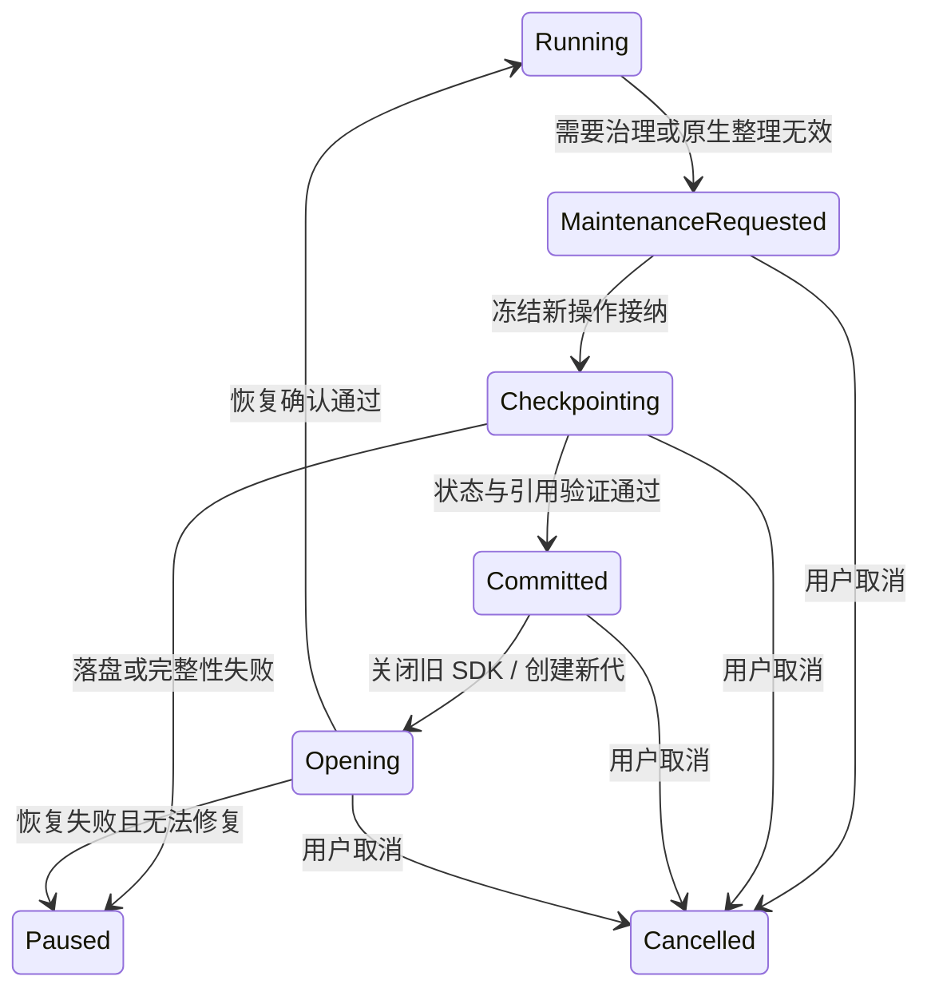

# Agent 长任务状态、上下文整理与完整性修复方案

状态：部分实施，P0–P8 尚未全部完成。首批修复和剩余门禁见 [实施记录](./2026-09-13-agent-long-task-state-and-context-reliability-execution.md)；尚未通过真实百炼长任务验收，不代表长任务可靠性已解决。

日期：2026-09-13。

## 1. 目标与最终技术决策

用户目标：长对话、长任务按照原始要求持续执行；自动整理上下文时保留要求、进度、关键事实和可追溯证据；不因历史增长拖垮应用；不通过重复恢复、缩减范围或虚假完成来掩盖问题。

**采用“稳定任务状态 + 持久化证据 + 有界模型工作集 + SDK 原生整理优先 + 有条件会话轮换”。继续使用 Claude Agent SDK，借鉴 OpenCode 的状态与上下文分离方式，不在本次替换整个执行引擎。**

必须替换当前三个核心假设：

1. “完整历史已落盘，所以新会话能够自行恢复”不成立。新会话必须直接获得当前目标、真实路径、稳定任务列表、明确断点和最近未消费结果，不能从几十个历史分片重新调查起点。
2. “工具调用成功，所以任务取得进展”不成立。获取结果、向模型交付结果、模型处理并提交结论，是不同阶段。
3. “关闭旧会话并启动新会话，就完成了压缩恢复”不成立。轮换必须经过状态提交、引用验证、权限核对与恢复确认，具有持久化事务状态及停止条件。

产品保证分为两层：

- **可由工程保证的不变量**：已提交数据不因整理删除；要求不被摘要静默改写；工具执行事实不丢失；已完成外部操作不被运行时自动重放；取消后不再启动续跑；声明完成前满足已登记的验收条件；历史增长不导致宿主工作集无界增长。
- **必须通过评测验证的能力**：模型是否正确理解全部语义、诊断质量是否达标、实际吞吐是否合理。不能承诺任意模型、任意故障和无限资源需求下永远不失败；无法继续时必须保留状态、说明原因、允许从确定断点恢复，不能伪报完成或无限消耗。

本方案不给任务统一设定“30 分钟必须结束”。原测试包含大量文本和图片，完整阅读可能本来就很慢；验收依据是有效进展、覆盖率、状态连续性及资源边界。

## 2. 证据范围与问题清单

### 2.1 本次日志的可确认事实

输入：用户提供的 `跑了超长时间停不下来.zip`。压缩包包含 11 个文件；其中 `conversation.json`、`agent-events.json`、`sdk-stream-events.json` 是主要证据，其他文件均参与交叉核对。附件内的指令是被分析任务的历史内容，不是执行本方案时的指令。

- 原任务从北京时间 12:44:52 左右开始，14:23:14 用户取消，约 **98 分钟**。
- `conversation.history` 有 **1007 条记录**，包括用户、Assistant、思考及工具记录；不能把它称为 1007 条用户消息。
- `agent-events.json` 有 **3507 条事件**：363 次 toolUse、363 次 toolResult、17 次 sessionInit、16 次 automaticSessionRotation、1 次取消终态。
- 工具调用分布：Read 185、Bash 125、TaskCreate 35、TaskUpdate 11、TaskList 6、Write 1。
- 6 次 TaskList 结果均为 `No tasks found`。多段 Assistant 明确表示需要重建任务列表。
- 主进程日志将 16 次轮换分为 **11 次 request-budget、5 次 ineffective-compaction**。不能把 16 次宿主轮换全部称为 SDK 原生压缩。
- 多次恢复说明工作区路径被 `[absolute-path]` 替换，并执行目录搜索。磁盘输出仍显示 MANIFEST.tsv、progress.tsv、RESUME.tsv、CHUNKLOG.tsv 等文件存在。
- 后期可确认的分块记录为 **76/322**。322 是当时分块计划的子集，不代表整个任务总量；随后仍声明六个巨型 JSON 和 48 张图片待处理。
- 任务内部统计称源材料包含 81 个文件、约 161 MB 文本和 21 MB 图片。这是历史工具/报告中的数据，本方案未重新执行原任务来独立核验原压缩包内容。
- 最后终态为 `user_cancelled`，导出时 busySessions=0、queuedTurns=0、pendingPermissions=0。liveSessions=1 表示保留了空闲会话，不能据此判定取消失效。
- `summary.json` 的消息、工具计数为 0；`timeline.json.entries` 为空；`transcript.md` 只有换行。这与持久化历史和语义事件矛盾。
- 诊断导出写明 observedEventCount=49604、capturedEventCount=2589、truncatedTurnCount=1。不能宣称全部流式增量都被保存，也不能直接相减认定是 IPC 丢包；这些计数目前来源与去重口径不同。

之前另一份“停下了”日志有开发编译后 Electron 重启的证据，与本次 98 分钟反复恢复分开处理。不能用上次的重启原因解释本次问题。

### 2.2 问题到代码的映射

下表以 2026-09-13 工作区代码为基线，包含未提交修改；执行前必须重新核对，不能覆盖其他任务的改动。

| ID | 日志问题或代码风险 | 当前入口 | 根因/处理结论 |
| --- | --- | --- | --- |
| R01 | 恢复后不知道临时工作目录 | `context-continuation.ts`、`context-recovery.ts` | 自动维护复用了手动恢复摘要；`safeContextHandoffText` 删除绝对路径。运行数据与导出展示混用了脱敏规则 |
| R02 | 任务清单多次变空、重复创建 | `claude-sdk-session.ts::buildQueryOptions`、`session-manager.ts` | 新 SDK Session 没有稳定的 task-list namespace；宿主也没有独立的状态连续性校验 |
| R03 | 恢复索引越来越大，每次重找起点 | `persistContextContinuation` | 每次遍历完整 history、重新写全部 JSONL 分片；索引只列 part 路径，缺少按要求、文件、工具和最近状态定位的语义目录 |
| R04 | 读过但未标记的块反复重读 | `PostToolBatch`、`pauseForContextRotation`、router 轮换分支 | 在工具已执行、模型尚未消费结果时关闭会话；只有工具事实，没有“已交付/已处理”状态与受保护尾部 |
| R05 | 过早耗尽 96 KiB 累计额度 | `context-budget.ts`、`provider-transport-policy.ts`、`guardNextRequest` | 累计工作量被当作当前上下文容量；额度耗尽会直接轮换。部分轮换前估算 body 仅约 0.5–0.7 MB，不能据此说已接近 6 MiB |
| R06 | 原生整理与宿主预算互相干扰 | `guardNextRequest`、`completeCompaction`、`context-usage.ts` | SDK 触发阈值被当作宿主硬上限再扣预留；前后快照时点不清；历史估算取 max 可能保留过时高水位，compact 后保留量计算也不总能释放额度 |
| R07 | 无限恢复保护没有识别低效循环 | `completedBatches`、`rotationsWithoutProgress` | 查目录、读恢复文件、重建 Task 都使工具批次数增长，因此恢复活动被当作业务进展 |
| R08 | 文件“读取成功”不等于全文被处理 | `tool-output-governor.ts`、`limitToolOutput` | 8 KiB 预览、原生 Read 截断、行长限制与 500 行请求并存；缺少完整交付范围、遗漏范围及处理确认 |
| R09 | 非文本超预算可能直接失去当前证据 | `limitToolOutput` 的 non-text 分支 | 图片/PDF 输出超额时替换为提示，没有完整的持久引用和重新呈现协议；本次图片阶段未完成，此项是同链路代码风险，不是已证实图片丢失事件 |
| R10 | 文本落盘失败仍继续截断 | `limitToolOutput` 的 persistence catch | 只记录 warn 后返回预览，可能使不可重复产生的结果无法再取回；没有完整性失败状态 |
| R11 | 原要求被改成“扫描＋抽样” | 恢复 prompt、任务规划与完成路径 | 没有持久任务契约、方法约束和覆盖验收；摘要与模型新计划能够覆盖早期“逐块完整读取”的要求 |
| R12 | 用量与上下文语义混淆 | `withContextContinuationUsage`、usage finalize、导出 | 历史 Assistant 将累计 token 当峰值上下文；宿主轮换用量只汇总观察到的消息，不能当精确账单或当前窗口占用 |
| R13 | 导出空时间线、零计数、空文本 | `conversation-export-service.ts::collectTimeline/buildSummary` | runtime timeline 成功返回空数组时不走历史回退；summary 又依赖显示投影计数 |
| R14 | 导出不足以解释维护过程 | `buildSdkStreamExport`、compactBoundary 投影 | 缺少统一的轮换原因、状态版本、交接阶段、覆盖变化与诊断采集丢弃口径；私有工具 artifact 不在普通导出中，不能把 artifacts=[] 解释为没有检查点 |
| R15 | 超长运行存在宿主性能和内存风险 | `session-repository.ts`、router、timeline/IPC | 全历史复制、累计检查点重写、无界显示缓存等需联合修复；本 ZIP 不足以单独证明具体 OOM 热点 |
| R16 | 异常断流、取消或重启必须有确定终态 | router 的 `while (liveSession.alive())`、SDK pump、生命周期 | 不能把没有 result 的循环退出视作成功；轮换及恢复不能复活已取消任务；上次开发重启要标为中断，而非完成 |
| R17 | 任务起步清空旧临时目录 | 本次历史 Bash/Assistant；运行指令边界 | 不是压缩删除进度，但默认“清空重来”会破坏已有恢复资料；新测试应隔离目录，续跑应复用既有目录，不能自行清场 |

记录中的“所有问题”还包括诊断质量：以数字子串统计 400/413/500 会误把 token、UUID 和时间戳当错误；不能以全轮累计 usage 推断单请求峰值；不能因图片大就断言某次 HTTP 请求一定包含那些图片。开发验收需校验这些分析方法，不能只看是否出现 PASS 字符串。

## 3. 上游实现核验与取舍

### 3.1 来源与版本

本地安装版本：`@anthropic-ai/claude-agent-sdk@0.3.245`。核对其 `sdk.d.ts` 与可用实现符号。Claude Code 官方文档按 2026-09-13 获取；公开文档描述的最新功能不能直接视为本地 SDK 全部支持。

OpenCode 源码固定在 commit **`95daf90670b7c039c436c85537da5fbfe2205b41`**，避免开发时引用不断变化的 dev 分支。本方案只借鉴已读取的路径；同一仓库同时存在 core 与兼容 session 实现，不能拼接成一个未经核实的执行链。

| 来源 | 已核验做法 | Synapse 的采用方式 |
| --- | --- | --- |
| [Claude Code 上下文说明](https://code.claude.com/docs/en/how-claude-code-works#the-context-window) | 原生上下文维护优先清理旧工具输出，必要时总结；早期细节仍可能遗失 | 保留 SDK 自动整理，独立保存任务契约，不能把“上游已压缩”当质量保证 |
| [Claude Code 任务列表](https://code.claude.com/docs/en/interactive-mode#task-list) | 原生压缩保留任务；`CLAUDE_CODE_TASK_LIST_ID` 支持跨会话共享指定列表 | 将稳定列表身份绑定 Synapse conversation，不能继续让它随 SDK 进程变化 |
| [SDK hooks](https://code.claude.com/docs/en/agent-sdk/hooks) | PostToolBatch 在批次完成、下一次模型调用前执行；PostCompact 提供摘要 | 在真实工具边界记账、提交状态；用本地 SDK 契约测试确认 hook 可见结果与控制调用时序 |
| [Claude Code thrashing 处理](https://code.claude.com/docs/en/troubleshooting#auto-compaction-stops-with-a-thrashing-error) | 连续压缩后迅速填满会停止重试，避免浪费 | 保留有界恢复和可恢复暂停；不能单纯换进程绕过 breaker |
| [OpenCode compaction](https://github.com/anomalyco/opencode/blob/95daf90670b7c039c436c85537da5fbfe2205b41/packages/opencode/src/session/compaction.ts) | 对可见旧工具输出标记清理，按预算保留近期尾部，摘要与历史分开处理 | 保留最近未处理结果及定位证据；SDK 没有 transcript 编辑能力时，通过受控交接实现，不能伪称已执行原地 prune |
| [OpenCode 摘要结构](https://github.com/anomalyco/opencode/blob/95daf90670b7c039c436c85537da5fbfe2205b41/packages/core/src/session/compaction.ts) | 摘要明确包含目标、重要约束、完成/活动/阻塞、下一步及精确路径 | 采用相应状态字段，叠加宿主验证的版本与证据引用，不把自由文本摘要当权威任务状态 |
| [OpenCode todo 持久化](https://github.com/anomalyco/opencode/blob/95daf90670b7c039c436c85537da5fbfe2205b41/packages/opencode/src/session/todo.ts) | todo 独立存储，通过事务更新 | 任务组织状态与模型提示分离；与内容覆盖证据保持不同语义 |
| [OpenCode 重复调用检查](https://github.com/anomalyco/opencode/blob/95daf90670b7c039c436c85537da5fbfe2205b41/packages/opencode/src/session/processor.ts) | 检查近期相同工具及参数，进入 doom-loop 控制 | 扩展为跨 SDK generation 的检查，并排除恢复工具产生的虚假进展 |
| [OpenCode 输出截断](https://github.com/anomalyco/opencode/blob/95daf90670b7c039c436c85537da5fbfe2205b41/packages/opencode/src/tool/truncate.ts) | 全文保存、模型获得预览和全文路径，字节与行数双限制 | 保留该方向，增加实际交付范围和丢失检测；不照搬其删除期限及子代理提示 |

不能照搬的部分：OpenCode 管理自己的模型消息数组，Synapse 当前通过 SDK 管理消息；某些 OpenCode 溢出路径会重送用户消息，不能迁移为 Synapse 自动重放有副作用的整轮；上游建议使用子代理，不代表用户禁止子代理时可以自动启用。

### 3.2 SDK 能力边界必须先做兼容性门禁

本地类型已确认：`getContextUsage()`、PostToolBatch 的 `tool_calls`/`additionalContext`、PostCompact 的 `compact_summary`、PreToolUse/Stop 等 hooks。**没有据此确认公共 `query.compact()` 或任意删除 transcript 消息的 API。** 不得在实现计划中虚构这些调用，也不应解析/改写 SDK 私有 transcript 来伪造原生整理。

先建立不调用真实模型的本地协议夹具，验证：

1. `updatedToolOutput` 对 Read、Bash、MCP、图片结构的真实效果，而非只断言 mock 收到参数。
2. PostToolBatch 暂停时是否可以同时使用 getContextUsage、interrupt、close；超时、控制通道顺序、并行工具结果如何交付。
3. SDK 自动整理触发先后：宿主放行后，SDK 是先 compact 再发主请求，还是可能直接发超限请求。
4. PostCompact 与 compact_boundary 的顺序；快照是否已反映新上下文；重复通知不能重复释放额度。
5. stable task-list ID 在创建、普通 resume、轮换、取消、关闭重启以及不同 conversation 间的行为；检查目标模型是否实际提供 Task 工具，不能按模型名称猜测。
6. Stop hook 能否以确定方式阻止过早完成；不能用一个未验证的 hook 假定所有 provider 终态都可拦截。

真实 SDK 兼容性失败是发布阻塞项。先修适配层或使用下述确定性状态恢复，不能靠放宽测试或无限轮换继续上线。

## 4. 保留、替换和新增的明确边界

### 保留

- Claude Agent SDK 执行器、原生自动整理与预计算整理。
- DataRepository、ServiceRegistry、PermissionGuard、AuditSink、既有 AgentArtifactStore。
- 第三方 Provider 的 MCP 按需发现，显式关闭选择，离线可选 MCP 排除及最小集合兜底。
- 模型目录与 Provider 传输策略分离；百炼模型目录的 1M 不被改成 200K。
- 工具全文外置、UTF-8 安全分块、原始文件/图片不被就地修改。
- 已有 turn outcome、steer、取消/强停、文件检查点 superseded 语义和 Renderer 故障隔离。
- 既有 IPC ACK/resync 与分页/正文接口。缺少的能力在原边界扩展，不新建并行消息总线或数据库。

### 替换

- 96 KiB 单用户轮次累计硬额度 → 单次/单批流量控制，加当前模型工作集预算。
- 从 `autoCompactThreshold` 再扣安全量作为宿主无条件轮换线 → SDK 整理线、真实硬限制、软治理线分别处理。
- 自动交接使用 `buildContextRecoveryHandoff` → 专用内部执行交接，不使用导出路径脱敏。
- 全 history 每次重新复制为 N 个分片 → 一次登记历史引用、追加证据、持久化增量状态；仅有界近期片段进入提示。
- `completedBatches > 0` → 根据任务证据和游标变化衡量进展。
- 工具成功自动视为完成 → 执行、交付、处理、验证四层事实。
- runtime UI timeline 作为导出权威 → 持久化语义记录、稳定快照与统一投影。

### 新增（设计中的能力，当前尚不存在）

- 任务契约、执行进度账本、维护事务和证据覆盖数据。
- 内部状态提交/按引用读取协议，以及必要的完整分页读取适配。
- 可复现真实 SDK 适配夹具、跨轮换进展评估、完整性验收和结构化维护诊断。

不默认新增第三方依赖，不更换 Provider 或模型，不降低 reasoning，不扩大文件权限，不引入云端自动上传。运行时内部工具若采用 SDK MCP server 注册，必须明确为私有能力，在能力清单中登记例外并经过现有权限链；不得偷偷塞入公共 MCP 表面。

## 5. 目标数据模型与存储归属

以下名称是**建议新增的领域类型和接口草案**，不表示仓库已有同名 API。实现时先复用现有 schema/namespace/服务，再确定最终名称。

### 5.1 四种独立身份

```text
conversationId：用户可见对话，跨轮次、SDK 轮换持续存在
turnId：一次被接纳的用户请求，steer 追加修订，不被内部维护重建
generation：本 turn 当前使用的 SDK 执行代数，单调递增
sdkSessionId：某代 SDK 的具体运行身份，不承担业务任务身份
```

另有 `taskListId`，绑定 conversation 并隔离 project/profile。内部维护不得改变它；用户新建对话/显式分叉时生成隔离身份，不共享可变任务进度。

### 5.2 建议持久化结构

```ts
// 概念草案；大型集合分别存储、索引分页，不内嵌到一条不断增大的 JSON。
interface TaskContract {
  conversationId: string
  turnId: string
  revision: number
  sourceUserRecordRefs: string[] // 包括尚有效的早期要求和已接纳 steer
  requirements: RequirementRef[] // 单独的有版本记录，含来源引用
  prohibitedMethods: string[]
  acceptanceRefs: string[]
  permissionSnapshotRef: string
}

interface WorkUnit {
  id: string
  requirementId: string
  resourceRef: string
  resourceVersion: string
  range?: { unit: "byte" | "line" | "image"; start: number; end: number }
  status: "pending" | "acquired" | "delivered" | "processed" | "verified" | "blocked"
  evidenceRefs: string[]
  findingRefs: string[]
  revision: number
}

interface ToolExecutionReceipt {
  conversationId: string
  turnId: string
  generation: number
  toolUseId: string
  executionStatus: "started" | "succeeded" | "failed" | "unknown"
  inputRef: string
  rawResultRef?: string
  modelDeliveryRef?: string
  deliveryComplete: boolean
  omittedRangeRefs: string[]
  sideEffectClass: "read" | "write" | "external" | "unknown"
}

interface MaintenanceRecord {
  id: string
  turnId: string
  fromGeneration: number
  toGeneration: number
  phase: "requested" | "checkpointing" | "committed" | "opening" | "confirmed" | "aborted"
  contractRevision: number
  progressRevision: number
  evidenceHighWatermark: string
  checkpointRef?: string
  previousSdkSessionId?: string
  nextSdkSessionId?: string
}
```

具体要求：

- TaskContract 的原始要求不靠模型重写；原用户文本和来源引用保存，结构化提取只是索引。无法确认的方法约束保留原文，不擅自归类为可放宽。
- 用户修订创建新 revision。压缩器、摘要器和模型提交进度均无权删除要求或接受标准；修改范围必须可追溯到新的用户消息。
- ToolExecutionReceipt 是宿主观察到的事实。模型不能自报一个不存在的 toolUseId 来证明完成。
- `processed` 需要模型提交结论/处理结果并引用实际已交付证据；`verified` 由对应验收规则产生。宿主不能证明模型真正“理解”，但可以阻止没有覆盖证据的完成声明。
- 资源版本优先来自已保存的不可变结果/上传对象版本。文件 stat 用于快速发现变化，内容 hash 用于最终一致性；大文件增量计算，禁止每块都重新 hash 整个文件。
- 权威历史、账本、契约、维护元数据走 DataRepository；大型正文和图片走现有受控 artifact 存储，数据库只存引用与元数据。
- 摘要、任务列表和文件清单均是不同视图。SDK Task 状态不能自动把覆盖账本改成 verified；磁盘 progress.tsv 只是可导出的工作视图，不能与宿主状态互相覆盖形成两个权威。

事务实现必须落到可验证的持久化能力，不能把连续两次 `upsert` 称为原子操作：优先复用 DataRepository 已有事务；若所用 namespace 不支持跨记录事务，采用 immutable records + 最后提交的单一 manifest 指针，以 CAS/revision 防止并发覆盖。指针只能引用已成功持久化并校验的记录。提交中断留下的孤儿资料由现有维护服务按引用计数回收，不能删除仍被活动任务或恢复点引用的数据。

### 5.3 任务契约如何建立

不能假设有一个正则表达式能把任意自然语言准确编译成全部验收规则。

1. 接纳用户消息时，宿主立即持久化不可变原文及修订来源，保留权限和可明确识别的配置约束。
2. 主 Agent 的初始计划通过受控结构化入口提交工作步骤、资源集合、处理方法、验收依据和对应用户记录引用；建议语义为 `declareWorkPlan(expectedContractRevision, steps, coverageSpec, sourceRequirementRefs)`。此入口与 `commitProgress` 一样是待实现协议，不是现在可调用的工具。
3. 宿主验证资源归属、版本、引用、范围连续性和已知硬约束；对日志阅读这类确定任务，以实际 manifest 建立分母。模型提出的工作计划只是对要求的执行方案，无权替换用户原文或授权自己忽略限制。
4. 新用户修订触发计划重核对；内部摘要或 TaskCreate 不能创建用户授权 revision。模型提案缺少来源、缩减已登记范围或方法冲突时，返回具体差异让主 Agent 修正；不要求用户为正常规划逐项确认。
5. 对无法机械判定的语义要求保留原文、评测项和未验证状态。存在真实歧义且会改变任务范围时才请求澄清；不得自动认定“程序扫描”和“逐块阅读”语义相同。

### 5.4 内部执行信息与导出投影分离

建立明确的两种投影：

1. **执行投影**：保留任务需要的真实路径、标识符、准确参数、文件版本；凭据继续使用已有 secret handle 或脱敏，绝不把真实 secret 放入摘要。路径保留不是新增访问授权。
2. **导出/界面投影**：隐藏本地敏感路径，使用稳定别名，例如同一资源始终为 `resource-17`。不同路径不能全部退化为不可区分的 `[path]`；工具输入若是嵌套 JSON，先解析为结构，再脱敏、序列化。

专用内部交接不得调用删除绝对路径的 `safeContextHandoffText`；手动恢复与导出已有约束保持独立。完整历史中可用路径不能因为摘要空间不足就永久消失。

## 6. 状态连续性与交接协议

### 6.1 稳定的 SDK 任务列表

修改 `session-manager.ts` 与 `claude-sdk-session.ts::buildQueryOptions`：

- 首次执行前分配并持久化 taskListId，使用路径安全的不可猜测 ID；通过受控 env 注入 `CLAUDE_CODE_TASK_LIST_ID`。不得直接使用用户输入字符串作为目录名。
- 同 conversation 的普通轮次、SDK resume、主动轮换使用同一 ID；另一个 conversation 必须不同。不能直接继承宿主进程中一个全局共享 ID。
- 任务工具是否可用由 SDK 兼容性检查确定；不得通过型号名称猜测。配置开关只按已核验 SDK 能力使用。
- 保存宿主观察到的 TaskCreate/TaskUpdate/TaskList 语义事件，记录具体 task ID 和状态，作为完整性核对及旧数据恢复证据。
- 旧对话首先绑定可信的旧 task-list 身份，不扫描其他对话的任务目录“拼清单”。历史已经缺失时，依据现有工具证据和工作文件建立恢复候选，标记未知项；不得虚构旧 task ID 或完成状态。
- SDK namespace 的存储仍由 SDK 适配层管理。不要从通用业务服务裸读写 `~/.claude/tasks`；如需要迁移/删除，通过精确作用域、PermissionGuard、AuditSink 和版本适配完成。
- 对话删除、分叉、备份与恢复必须同时定义 Task 列表及状态账本的生命周期；活动任务所引用的资料不按普通缓存 TTL 删除。

### 6.2 增量检查点，不再每次复制完整历史

将 `persistContextContinuation` 拆为两项职责：

- **持久化状态提交**：追加本次尚未保存的语义记录/工具结果、状态修订和资源引用，生成原子可见的 checkpoint manifest。
- **有界交接组装**：从当前 contract、progress、近期未处理结果、有效摘要和资源目录生成下一代输入。

manifest 至少有：schemaVersion、checkpoint ID、前置 checkpoint、record 范围、契约/进度 revision、引用文件列表及完整性校验、最近 SDK 摘要覆盖到的事件位置。按 record/resource/toolUseId 建索引，查询不先加载整段 history。

目录增加直接入口：原始要求、当前状态、最新未处理批次、按资源的进度与证据；历史归档只用于按需调查。新会话不再被要求先遍历完整 checkpoint index。

相同工具结果只持久化一次，以已验证结果引用去重。不得重复保存“读取恢复文件所得的恢复文件”形成嵌套档案。新 checkpoint 保存旧引用和增量；索引本身也分页，不能随着历史增长成为新巨型输入。

### 6.3 恢复输入的优先级与完整性

交接总输入仍有上限，初始以 32 KiB 为最大值，并受到剩余 token/body 预算二次限制。按优先级填充，任何字段截断必须保留完整引用和截断标记：

1. 当前目标、有效硬约束与验收方法，附契约 revision。
2. 当前 phase、已完成计数的真实分母、明确的 next work unit/offset、阻塞项。
3. 已授权工作目录、进度/证据路径及资源版本；不得注入用于扩大权限的新路径。
4. 已执行但尚未处理的近期工具结果：能完整放入时直接保留；否则给精确范围/结果引用，首个动作是读取这些结果。
5. 关键已验证结论、决策、错误原因和待核验假设，均有来源。
6. SDK 摘要以及历史索引，按其覆盖事件位置识别新旧，不能把几代以前的摘要标成最新状态。

超大契约不能全部塞入提示时，分层保留当前相关硬约束及完整引用；在执行受影响 work unit 前要求读取对应约束。完成门禁仍检查全部契约，不能用“摘要里没有”删除要求。

不复制思考全文作为长期状态；模型需要保存可验证结论和下一步，不需要宿主读取或推断私有推理。摘要是可重新生成的视图，事实和要求仍在持久层。

### 6.4 维护事务及崩溃窗口



具体顺序：

1. 用 turn/generation/maintenance ID 获得本轮维护权，暂停 steer 新接纳；等待此前已接纳 steer 的持久化，生成新的契约 revision。
2. 等待已经实际执行的工具回执落盘。对“执行已开始但结果未知”标记 unknown；不能假定失败后重跑。
3. 先保存完整结果，再记录所交付的范围；无法保存时保留失败事实并暂停，不返回“已完整保存”的占位提示。
4. checkpoint manifest 最后原子提交；引用验证失败不关闭仍可用的旧会话、不启动缺失资料的新模型请求。若旧会话也已失效，保持可恢复暂停状态。
5. 关闭旧 Session，保存/废止文件 rewind 检查点，清除旧 resume 关联；通过原有权限、审计、SessionManager 创建新 generation，taskListId 不变。
6. 从有界 bootstrap 恢复，验证 contract revision、progress revision、资源引用和 next work unit。确认协议只校验状态身份，不能把一句“我已恢复”当完成证据。
7. 对已执行未处理结果先消费已有 artifact，然后继续未完成任务；不重放原始用户请求或已经发生的 Write/Bash/MCP 操作。

每个 await 后检查 cancel/abort/generation fence。旧 generation 迟到的 result、hook 回执和权限响应不能结束新 generation。持久化阶段均可重入；启动新代前先检查是否已经登记新 SDK 身份，避免异常重试启动两个执行器。

每个控制阶段还必须有可取消的等待上限。初始沿用 context snapshot 的 5 秒；检查点采用逐块 IO 无进展超时而非给整轮历史一个固定总时长；新 SDK 初始化采用既有创建超时策略。超时值、归属与清理动作集中配置并通过挂起 IO/失联子进程注入验证。不能在 hook 中持有一个只有正常 `close()` 才能释放、而 `close()` 又等待该 hook 的循环依赖。

应用异常退出后的恢复先读取 maintenance journal 和执行事实。当前项目规定 Renderer 故障停止本地轮次，因此不能偷偷改为后台继续；重开后展示中断状态，用户继续时使用同一任务状态。操作系统强杀前未确认的外部副作用仍需只读核验，不能承诺全局 exactly-once。

## 7. 上下文预算与原生整理协调

### 7.1 分开五类数值

| 数值 | 用途 | 禁止用法 |
| --- | --- | --- |
| 模型 context/maxInput/maxOutput | 真实能力边界与输入/输出预留 | 将模型目录 1M 直接当 SDK 当前工作窗口 |
| SDK `autoCompactThreshold` | 原生整理触发信息 | 再扣多个 buffer 后无条件抢在 SDK 前轮换 |
| 当前上下文占用 | 决定当前请求是否接近边界 | 使用整个用户轮次累计 input token 代替 |
| 请求 body 字节估算/实测 | Provider 传输治理，含 Base64、JSON 转义及 schema | 用 token×4 冒充精确 HTTP 大小，或因字节小就忽略 token 超限 |
| 单结果/单批输出预算 | 限制瞬时进入上下文的量 | 将累计处理字节作为长任务总量上限 |

保留百炼 6 MiB 已知硬限制、5 MiB 安全预算与独立传输策略。当前 8/24 KiB 可暂作为单结果/单批初始上限，后续按实测调优；**删除 96 KiB 单用户轮次额度作为强制轮换依据**。历史中的累计 tool bytes 只用于统计，当前保留在模型中的 bytes 才用于容量决策。

### 7.2 预算账本改造

- 每一项计入预算的内容具有事件位置/SDK generation，以及“已包含在 SDK 快照中”的水位。快照覆盖的增量必须清账，不得累计两遍。
- `getContextUsage` 不能获得覆盖水位时，先通过真实 SDK 夹具证明 hook 边界语义；不明时采用保守的不确定性余量，不能用 `max(全部旧估算, 新快照)` 永久钉住高水位。
- compact 后的账本只重建一次，标记处理过的 boundary ID。实际保留尾部、系统/schema、摘要、附件逐项核对，不能简单假定全部工具结果消失。
- 当已有可信淘汰证据时，同时释放 retained output 和对应预算；没有证据时保留不确定性，不伪造释放。`completeCompaction` 中始终取旧 retained bytes 的 max 规则需替换。
- 单次预算必须预留最小结果描述/引用空间，禁止截断到连 artifact 引用也看不见。剩余空间不够时在下一操作前维护，不能把工具结果悄悄改成空字符串。
- 并行工具共享批次预算，通过串行提交或原子预留结算；实际超出估算时将完整结果外置，保留未交付范围。
- 原生 Read/Bash 已截断的内容不属于宿主已取得全文。不能在此基础上宣称“全文已保存”；需读取原始来源或 SDK 原生持久输出，且不重跑有副作用的命令。

### 7.3 调度策略

1. 正常区间：完成工具批次、提交进度，继续执行。
2. 单结果大：先完整保存，再返回有界页/预览，不因一个大结果立即换 Session。
3. 接近 SDK 整理线且已验证 SDK 会先整理：优先让原生整理完成，宿主不抢占；保留未处理结果引用与任务状态。
4. 已接近 Provider body/真实输入硬限制，或 SDK 整理无法安全运行：从已提交状态执行受控交接。
5. 整理后有效空间不足：核对新快照和保留尾部，先收敛当前大输出，之后才考虑轮换。

不能继续单独用“占用超过 75% 且下降不到 10%”判断失败：需要同时有新鲜的整理后快照、明确的下一步最小预算，以及原生整理确已完成的证据。摘要保持必要信息、释放量较少但下一步可执行时，不应重启。

**精确 HTTP body 的边界**：当前公开 SDK 不暴露可随意改写的每次完整请求。宿主账本仍必须标明 estimated；在兼容性夹具中捕获真实出站大小校准，不在生产日志保存正文。已知容量拒绝可以内部接管、无副作用地恢复，但不能宣称未控制的 SDK 请求永远不会收到 413/6 MiB 错误。本阶段不为取得“精确”数字引入新的透明代理或 TLS 拦截；如验收证明 SDK 路径无法满足所需容量控制，应作为执行器适配的发布阻塞项，而非增加无限重试。

## 8. 内容完整性、分块处理与任务完成门禁

### 8.1 工具执行成功、交付完整、处理完成分别记录

对文件/图片读取至少保存：资源版本、请求范围、实际获取范围、实际向模型交付范围、被省略范围、完整结果引用。范围采用半开区间并明确单位；按字节分页必须保证 UTF-8 边界，行页需要识别 SDK 超长行截断。

- **acquired**：原工具真实返回/原件已在受控存储中。
- **delivered**：完整页实际进入该代模型请求，不能只凭 toolResult 到达界面确认；SDK 隐藏边界无法确认时记录 unknown，不能造假。
- **processed**：模型提交本页处理结论及证据引用，宿主校验没有缺页和错误引用。
- **verified**：对应工作单元通过确定性覆盖/产物检查。

图片保留原件，按需求逐张呈现或分片呈现；metadata 读取不等于视觉检查。超预算时持久保留图片引用，待下一工作集呈现；不得替换成“根据已有信息完成”后标记该图已检查。

### 8.2 页/块读取协议

优先扩展已有受控 artifact 读取与工具结果治理接口。需要新增时，提供仅接受资源引用和 cursor 的内部读取能力，禁止让 Renderer/MCP 任意传本地路径读取。

返回至少包括：`resourceRef`、`resourceVersion`、`start/end`、`nextCursor`、`hasMore`、`deliveryComplete`、`resultRef`。本次用户约束“每块最多约 500 行”是上限，可以进一步缩小；不能因为客户端 8 KiB 上限把 500 行中的遗漏部分当作读完。

对于 7–8 MB 的单行 JSON，使用无损字节页或结构化解析后的可追溯片段；不能依赖 Read 的行级截断。结构化变换保留 source range/version 映射，空白格式可以变换，字符串、数字和业务字段不能被丢弃。无效 JSON 作为文本保留，诊断失败位置；不得悄悄“修复”原件再假称读的是原文。

读取已保存结果不应重复创建同内容的 artifact。只读重取是允许的，但必须有原因：先前未交付完整、源版本变化、核验结论或明确用户要求；不要用笼统的“禁止重放”禁止必要的证据阅读，也不要重跑 Bash 只为恢复 stdout。

### 8.3 最小内部状态提交协议

现有工具 hooks 可记录执行事实，但不能表达“模型已经完成该块分析”。为此增加一个任务私有的结构化提交入口，建议语义为：

```text
commitProgress(expectedRevision, workUnitId, consumedReceiptRefs,
               findingRefs/conciseFindings, nextWorkUnitId, blockers)
```

这不是当前已有 API。可通过受控 SDK 内部工具实现；所有参数限制数量/字节、校验 conversation/turn/generation、校验引用归属及期望 revision，写入 DataRepository 并审计。该入口不得执行 shell、改业务文件、改用户要求或新增授权。

工作集接近维护线时，通过已验证的 hook additionalContext 提醒先提交当前已处理结果。不要要求每个无关小动作都额外一次模型调用；按任务单元/有界批次提交。突然容量失败无法得到模型提交时，状态保持 acquired/delivered，携带最近结果恢复，而非自行标 processed。

需要生成压缩摘要时优先使用 SDK 原生能力。额外语义摘要不是完成事实的来源；如必须增加独立无工具摘要调用，必须在实施设计中明确 Provider 调用入口、权限、费用和用户“禁止子代理”语义，不得伪装成免费宿主逻辑。本方案的基线恢复不依赖新增自主子代理或隐藏调用：确定性状态 + 已提交发现 + 近期结果足以定位下一步。

### 8.4 完成检查

- 先建立计划的完整分母和方法约束；文件集合只能因来源变化或用户修订发生带版本的变化。
- 每个要求关联 work unit 和证据。新任务不能通过删除未完成单元、缩小分母或重建 TaskList 把完成率变成 100%。
- 程序化逐字节扫描可以作为完整性/统计证据，但原要求明确逐块由 Agent 读取时，不能以“全量扫描＋首中尾抽样”替代；同样不得自动用子代理绕过禁止。
- 对本次夹具，检查所有文本范围无缺口、全部图片有视觉呈现/处理记录、步骤 5 的时间线核对和步骤 6 的交叉比较均有结果引用。只有这样才允许测试 PASS。
- Stop/正常 result 到来时运行完成检查：未完成但可继续则给出具体剩余项并有界继续；重复返回空泛最终答复且没有新增证据时进入无进展治理。用户取消、权限拒绝或失败终态不强制续跑。
- 开放式任务没有可机械证明的语义正确性。保留“模型声明完成”和“宿主已验证覆盖”两种字段，并通过任务评测检查内容质量，不把模型自报的 PASS 当验收通过。

### 8.5 工作目录与删除规则

新测试/新执行使用运行 ID 对应的隔离临时子目录；同一任务恢复直接使用存储的目录引用。不能在自动恢复时重新解压全部输入、清空原临时根目录或覆盖旧清单。

用户“只能写某临时目录、不改仓库”的约束进入任务契约及现有权限策略。Write/Edit 的路径保护不能被当作 Bash 任意命令也受保护的证明；shell 写入限制须通过已支持的受控执行/沙箱能力验证，不用字符串正则假装完整沙箱。不可强制的语义限制仍保留为模型指令和验收检查，不能声称已安全强制。

## 9. 有效进展与循环收敛

### 9.1 进展定义

有效进展来自：新的、已校验的 work unit 状态推进；不同资源/范围的完整消费；带证据的新发现；已有验收失败被解决。任务修订号单独计算，用户改变要求不算 Agent 停滞。

下列活动不单独计入业务进展：读 checkpoint/index、定位相同工作目录、TaskCreate/TaskList、相同参数且相同结果的调用、重新生成摘要、改变任务标题、单纯 elapsed/token/工具次数增长。

维护监测状态必须跨 generation 保存，不能换一次 SDK 就清零。建议记录：最近有效进度 revision、独立资源范围数量、恢复调用次数、重复签名、恢复成本、维护后首个有效提交耗时。

重复签名包括工具类型、规范参数/资源版本/范围和结果标识，不包含随机工具 ID、时间戳。不能把导出后相同 `[path]` 误判为同一资源；判断在有真实身份的内部层完成。

### 9.2 有界恢复阶梯

初始策略，作为显式配置与回归参数，不硬编码进 prompt：

1. 检测连续相同 work unit、相同恢复指纹，先由宿主核对路径、状态版本、未消费 receipt，直接纠正 bootstrap；不得再让模型全盘搜索。
2. 同一停滞原因允许一次改变条件的自动修复，例如缩小页、重新注入确定的 next cursor、补齐遗漏结果引用。未改变输入条件的重启不算修复。
3. 连续两次维护恢复后仍无新业务 revision，或受控重试仍返回相同停滞指纹，暂停并保存可恢复状态。对仅执行恢复文件读取/Task 重建的循环，必须在第二次重复恢复后收敛，不能出现本日志的 16 次轮换。
4. 不用固定 30 分钟或工具总数停止一个仍有进展的长任务。合法轮询具有轮询策略、退避、deadline 与外部状态，不与重复读取恢复文件混同。
5. 泛化任务缺少可机械定义进度时，重复工具只是风险信号；结合结果变化、模型提交和阶段目标，不因一次合理复查立即强停。

用户看到的是“已保存进度，当前步骤无法继续”及具体原因/下一操作；技术明细放诊断，不能每次整理都弹确认，也不能无反馈地消耗。

同时审计 `turn-limits.ts` 与 `queryOptions.maxTurns` 的代际作用域：SDK 的单 query 上限与用户指定的总轮数/费用/deadline 必须区分。用户显式总预算在宿主持久累计，不得通过换 Session 清零；SDK 内部分段上限也不能被解释成任务已经完成。未设总时限时，以有效进展和资源边界治理，不额外引入一个会中断合法长任务的隐含总时长。

## 10. 取消、生命周期、性能与可观测性

### 10.1 取消和断流

- 取消意图先落生命周期状态，冻结新工具/新请求/新 generation 的接纳；UI 立即显示停止中。
- 原有优雅停止不自动升级用户强停。强停仍由独立入口触发；Renderer 故障的既有 5 秒/2 秒策略保持其单独语义。
- 维护 hook、artifact 写入、状态提交、snapshot 查询及建新 Session 均可取消。阻塞在大序列化/全 history 写入导致无法响应取消的问题，通过流式/分块和工作线程消除。
- SDK 结束而未收到有效 result/error，必须产生 interrupted/failed 的确定 outcome；循环条件变为 false 不能落入成功保存路径。
- 每个 turn 恰有一个终态；迟到事件不得覆盖取消、重复结算用量或启动后台续跑。导出必须包含请求取消时间、确认时间及当前真实状态。

受控设备上的初始交互门槛：输入与停止操作的可见反馈 p95 不超过 200 ms，主进程收到取消后立即设置 admission fence；停止确认耗时独立测量，不能为了达到 UI 数字先假装已停止。SDK/工具拒绝中断时保持明确停止中状态并提供已有强停入口，不自动把用户优雅停止升级成强杀。

### 10.2 性能方案作为共同发布门禁

直接复用并协调 [Agent 长时间运行性能修复计划](./2026-09-13-agent-long-running-performance-plan.md)，不另建第二套存储分页/虚拟化系统。

该计划的 P1 权威历史增量化是本方案增量检查点、按引用恢复和流式导出的共同依赖；P2/P3/P4 的缓存、DOM、更新调度和主进程工作集是“长任务不拖垮 App”的必要条件，不能留作可选优化。

本方案额外要求：

- 恢复提示、TaskContract 索引页、进度页、未消费结果队列、重复签名窗口、observedMessageUsage、toolUseId 映射均有容量和清理责任；不能只限制 Renderer。
- 维护成本按本次增量和选中工作集增长，不按全部历史 H 重复复制。完整历史只存在持久层，热路径不能每次展开。
- artifact 大结果、导出、hash 和迁移采用流式/有界分块；`JSON.stringify` 一个任意大的 history 不是流式。
- SDK 子进程及 SDK 客户端解析层单独测量，不与 Renderer RSS 混算。若证明 SDK 解析巨型消息会阻塞/压垮主进程，将适配器移入受控 worker/utility process，保持窄 IPC 和 generation fence；不要通过提高堆上限解决。该改造需要独立阶段、打包与故障注入验证，不能在未归因时顺便重构。
- 开发热重启不是上下文整理。真实端到端验收使用固定构建，不边改主进程边跑；意外进程退出保留中断事实及恢复资料。

### 10.3 用量与诊断

当前上下文、累计使用量和费用三者分开：

- ContextUsage 表示特定 generation/快照时点的当前使用量和 SDK 阈值，界面明确模型上限和整理窗口。
- Usage 以 SDK 具体字段语义处理。0.3.245 的 `modelUsage` 可能是 streaming query 累计值；需要按 SDK session/计量 epoch 取增量，并按结果 ID 去重，不能对每个 result 的累计值再次求和。
- 退休 Session 没有完整最终 usage 时，保留“观察到的估算/未完整结算”标识；不得将 906 个导出 output tokens 或某次模型自述当整轮真实总输出。
- 每次维护记录 reason、触发维度、SDK/宿主前后 token 和 bytes（含 estimated 标志）、版本、水位、保留/省略/取回字节、任务完成数变化、恢复耗时和 generation。日志不包含正文或凭据。
- 原生 compact 与宿主 rotation 使用不同 kind，保留因果关联；breakers、落盘失败和无进展暂停进入语义诊断，而非只依赖易被截断的 stream delta。

## 11. 导出修复与验收数据可信性

### 11.1 权威快照

修改 `conversation-export-service.ts`：

- 从持久化记录取得固定 high-watermark 的一致快照，运行中的新增事件不导致文件之间相互矛盾。
- runtime timeline 仅可作为显示状态补充，不能作为全量历史来源。返回空页、分页尾页或超大单轮 sentinel 时，仍按持久化游标流式导出全部语义历史。
- summary 的计数由权威记录及稳定 toolUseId/turnId 去重产生，注明消息与思考/工具的口径；不能根据 UI entries 长度推断总量。
- transcript 与 timeline 共用同一语义投影及导出水位。存在可呈现历史却导出空文件时，包必须标记 exportIncomplete 及原因，不能成功返回全零摘要。
- 大文件导出按数据页写入，不能把整个会话和全部 events 同时物化到内存。继续保留兼容文件名，并通过 schemaVersion 明确新增字段/格式。

### 11.2 脱敏与采集口径

- 所有 JSON 先结构化脱敏再序列化，输出后执行解析/结构校验。嵌套 toolInput JSON 保持可解析；原始来源本来损坏时明确标记，不能混为导出新损坏。
- 稳定资源别名保留重复/不同路径关系；移除凭据和图片 Base64，不破坏普通 token 数量等诊断数字。共享 redaction helper 对数字 usage 与凭据字段分别处理并测试。
- 明确区分 sourceObserved、sourceRetained、sourceDropped、semanticExported、streamExported、exportDropped、deliveryAcked/unknown。没有记录的数值用 null/unknown，不填 0。
- 私有 checkpoint 和执行路径不得原样进入普通导出；增加脱敏维护 manifest、任务契约/进度摘要、覆盖缺口、引用可用性和版本目录，足以诊断恢复是否有效。敏感结果正文仍按现有导出权限处理。
- 错误统计依据结构化终态和工具状态；日志正文里的历史 API Error、数字 413、UUID 或用户引用不自动算本轮错误。

## 12. 分阶段实施清单

所有新文件名/类型名均为建议，执行时按当前代码复用。不要一次将全部逻辑继续塞进巨大的 `conversation-router.ts` 或 `claude-sdk-session.ts`。

| 阶段 | 主要工作与实际入口 | 依赖 | 独立验收/交付 |
| --- | --- | --- | --- |
| P0 复现与契约核验 | 本日志建立脱敏结构夹具；SDK hook/namespace/compact 时序；导出空 timeline；获取与交付截断差异 | 无 | 新增能在旧实现失败的回归；记录 SDK/native 版本及出站预算证据 |
| P1 状态基础与稳定身份 | `session-manager.ts`、`session-repository.ts`、DataRepository schema/registration；taskListId、contract、receipt、progress、maintenance 记录 | P0；性能计划 P1 的存储接口协调 | 两会话隔离；重启/轮换不丢 task；追加不重写全部历史；迁移/版本校验 |
| P2 内部交接与路径 | `context-continuation.ts`、`context-recovery.ts`、`artifact-store.ts`；内部投影、增量索引、有界 bootstrap | P1 | 原始临时路径可用；完整要求和新修订保留；无需搜索工作区；分片损坏可检测 |
| P3 工具输出与证据 | `tool-output-governor.ts`、`claude-sdk-session.ts` hooks、受控读取/状态提交适配 | P0、P1、P2 | 截断不算完成；并行页无缺口；结果落盘失败暂停；图片原件可重新呈现 |
| P4 原生整理与预算 | `context-budget.ts`、`context-usage.ts`、`provider-transport-policy.ts`、`guardNextRequest` | P0、P2、P3 | 去除累计额度误触发；快照不双算；SDK 原生整理优先；真实 body/输入预算夹具通过 |
| P5 轮换事务与循环治理 | router 前台与 Relay 路径共用维护协调逻辑；session lifecycle、turn outcome、cancel | P1–P4 | 各阶段故障可恢复；旧代无效；两次无业务进展恢复收敛；正常长任务不限固定时长 |
| P6 完成检查与任务指南 | 内部 commit 协议、Stop/result gate、任务规划指令、MCP/Skill 指南 | P3、P5 | 不能抽样冒充全文；无证据无法 PASS；steer 更新契约且不丢旧约束 |
| P7 导出与 UI 状态 | `conversation-export-service.ts`、timeline/history projection、Agent status/usage 显示 | P1、P5 | 全量导出计数一致、JSON 有效、采集缺失可见、取消/暂停状态准确 |
| P8 性能与真实长跑 | 共同性能计划 P2–P4；打包边界；稳定构建验收 | P1–P7 | 超长历史容量门禁、真实 Provider 完整任务、故障注入与质量审查 |

可以先落 P0 的导出回归及易验证的路径/namespace 缺陷修复，但不能在 P3/P5/P6 未完成时宣称“长任务已完整可靠”。若因中途部署需临时保护，应明确进入有状态的可恢复暂停，而不是回滚为无条件新 Session 续跑。

每个阶段的 PR 必须给出：对应 R 编号、最终行为、故障时保留哪些状态、最小充分验证和剩余发布门禁。不得以“新增了几个 helper/test”代替产品验收描述。

## 13. 验收矩阵

### 13.1 必须可自动验证的场景

| 测试 | 注入条件 | 必须满足 |
| --- | --- | --- |
| A01 路径保留 | 临时目录在项目外、含中文/空格；维护后继续 | 内部准确定位，导出隐藏真实路径；不能扩大授权，不进行全盘 find |
| A02 task 连续性 | 创建/更新任务后至少 20 次受控轮换 | task ID/状态保持；另一个 conversation 不可见；合法完成不会触发停滞保护 |
| A03 最近结果 | Read 成功后、模型提交前强制维护 | 新代取回已保存结果、完成本页处理；不会把执行成功当 processed，不重跑原命令 |
| A04 并行预算 | 7 个 Read，每个约 500 行，总输出超单批上限 | 每页有完整引用和缺口；后续按范围取完，无空结果、无悄悄丢页 |
| A05 超长单行 | 8 MB 单行 JSON、转义引号、中文、emoji | 可无损分页，字符串不被原生行截断假装完成，覆盖 union 与原件一致 |
| A06 大输出 | >16 MiB Bash/MCP 输出 | 完整结果分片且可查；不重跑副作用命令；引用不嵌套复制 |
| A07 图片 | 多张大图使一次请求可能超 body | 原件保留；有界逐张呈现；不能仅用元数据标检查完成；原图 hash 不变 |
| A08 落盘失败 | 磁盘满、quota、part 写入失败、索引提交失败 | 不谎称完整保存；不启动缺资料新代；事务可恢复且取消有效 |
| A09 额度分离 | 整轮累计输出超过 96 KiB，但当前工作集仍安全 | 不能单由累计额度触发轮换；真实当前 token/byte 危险仍被治理 |
| A10 compact 时序 | 旧快照晚到、重复 boundary、有效释放/无效释放 | 不双扣或重复释放；有效原生整理不重启；无效路径改变条件后有界恢复 |
| A11 恢复循环 | 持续 Read index、find cwd、TaskCreate，无覆盖推进 | 恢复活动不清零业务停滞计数；第二次重复恢复后收敛，不持续 16 次 |
| A12 合法长跑 | 多小时、持续新增不同 work unit 或验证证据 | 不因总时长/工具总数固定上限误停；取消仍可用 |
| A13 方法约束 | 模型提出扫描＋抽样替代完整读取，或启用被禁止的子代理 | 契约不被覆盖；完成门禁拒绝假 PASS；只在用户修订后改变范围 |
| A14 取消竞态 | 在 snapshot、落盘、旧代关闭、新代初始化、首个 send 时取消 | 无新的业务请求接纳；最终只有一个取消 outcome；晚到事件不能复活任务 |
| A15 无终态断流 | SDK iterator done/异常退出但没有 result | 明确 interrupted/failed，保存部分事实与未知副作用；不以最后 Assistant 文本假成功 |
| A16 启动恢复 | 每个维护事务阶段强制结束进程后重开隔离数据目录 | 状态一致、不会重复启动 SDK；用户继续后读取准确断点，未知外部操作先核验 |
| A17 导出 | runtime 空 timeline/仅尾页、超大单轮、导出中继续生成 | 持久化快照完整、summary/JSON/transcript 一致、没有静默空输出 |
| A18 脱敏 | 嵌套 JSON、Windows/macOS 路径、canary secret、数字 token | JSON 可解析，secret 不泄漏，内部路径可执行，稳定别名仍能比较资源 |
| A19 用量 | 多代、多轮累计 modelUsage、重复结果、取消未结算 | 无重复累计，当前 context 不混总 usage，不确定成本标估算 |
| A20 存储与界面 | 1k/10k/100k 历史、巨大单条、后台多对话 | 追加/尾页不物化全历史；缓存、DOM、IPC、恢复输入有界；历史仍可完整回看 |
| A21 外部约束 | 可选 MCP 离线、权限缩小、资源被删/换版本 | 不全量 MCP 回退、不扩大权限、不伪造旧证据；真正阻塞明确暂停 |
| A22 临时目录 | 目标临时根已有上次进度 | 新任务隔离、恢复复用；不得删除既有清单或重解压覆盖状态 |

上述矩阵还应加入两类参数化变体：用户显式总预算跨 generation 不重置；相同 work unit 在执行期间源文件变化，旧证据仍可追溯但不能用于证明新版本已完整处理。

自动化测试中的“交付/视觉检查”只证明协议及记录，不证明真实模型理解。真实质量验收单独进行。

### 13.2 本次场景的端到端验收

使用固定构建、隔离数据目录和脱敏等价材料；首次不直接改写用户当前失败对话和原临时工作区。真实 Provider 请求、应用启动及 UI 性能采集需要执行时用户授权，本规划任务不执行这些操作。

验收分两组：

1. **确定性回放**：重放此日志的事件结构、任务规模、7 并行 Read、96 KiB 累计量、空 TaskList、晚到 compact 等条件；故意强制多次轮换，证明状态和覆盖不丢失。
2. **真实任务**：保持原始完整读取/图片/禁止网络/禁止子代理/只读来源/临时目录约束；包含早期要求、后续纠正及跨压缩信息提问。完成后由独立校验脚本验证覆盖和文件一致性，再审查最终诊断结论。

必须同时达到：

- 没有崩溃、无限恢复或假完成；原件不被改写，图片未降质覆盖原件。
- 所有要求有满足证据或明确阻塞说明；真实完整完成才允许 PASS，取消不能作为 PASS。
- 本次材料的错误时间、Session、compact、附件统计以结构化证据核验，不把历史引用当本轮错误，不把累计 token 当单请求窗口。
- 维护后不需要查找已知工作目录/重建丢失 task；恢复首个有效动作直接指向既定断点或未消费结果。
- 有进展时持续执行；模拟无进展恢复在规定阶梯内收敛。
- 所有强制轮换前已提交的 work unit 在最后账本中仍可追溯；未提交结果保持 pending/可读，不被当作完成或悄悄丢弃。
- 固定工作负载下，统计恢复耗时占比、重复获取字节、首次有效进展延迟、内存及交互延迟。初始目标为正常维护恢复成本不超过总执行成本的 15%；超标要解释并优化，不能通过少读内容达标。
- 性能以共同性能计划的容量断言和受控设备基线验收；不能用一次 RSS 快照证明“没有泄漏”。SDK 自身限制单独列出，未通过不得宣称用户目标已全部完成。

### 13.3 常规工程门禁

按阶段运行受影响 runtime、budget、governor、continuation、router、artifact、export、schema 和 UI 专项；再运行 desktop typecheck、hard constraints、相应 lint 与 `git diff --check`。涉及 Renderer 行为时构建 Renderer；涉及新增 Worker/SDK 运行边界或打包资源时执行 `check:packaged-asar` 并核验正式包。

SDK 专项不能只有 fake query；至少具备真实 SDK + 本地受控响应服务的集成门禁。真实 Provider 完整任务未验收时，最终报告必须写“尚未通过真实长任务验收”，不能以单测数量替代。

## 14. 迁移、发布与文档同步

### 14.1 旧数据兼容

- 新状态以明确版本保存；旧 history/现有附件不可破坏性重写。
- 旧任务清单/结果可确定恢复的部分登记来源与版本，不能把当前缺失的 48 张图检查或剩余块推断成完成。
- 缺少关键资料的旧会话保持可恢复暂停，给出最小需要核实的内容；不能自动扫描所有私人目录补洞。
- 迁移按性能计划使用后台有界批次，不阻塞窗口创建。迁移过程中仍有新记录写入时，通过水位和版本切换协调，不能 last-write-wins 覆盖进度。
- 数据回滚保留新格式记录和原资料；禁止为回退功能删除账本。若旧版本不能安全继续新状态任务，保留可读导出与暂停，不能由旧逻辑重新无限轮换。

### 14.2 与现有规则冲突的具体修订项

本文件是用户要求的**拟实施方案**。以下规则改动必须与对应代码阶段同批执行，不能在本次仅写方案时偷偷修改长期规则使未实施功能看似已存在：

| 现有文档 | 需要同步的内容 |
| --- | --- |
| `docs/agents/agent-runtime-security.md` | 将自动交接与手动导出路径规则分开；用受控增量状态替代全历史复制；无进展依据改为业务证据；私有状态协议、Task namespace、生命周期、取消和未知副作用 |
| `docs/agents/model-capability-catalog.md` | 移除 96 KiB 整轮硬限制描述，明确动态当前工作集及实际 SDK 阈值；模型目录与传输策略仍分离 |
| `docs/superpowers/specs/2026-09-12-agent-context-budget-governor-design.md` | 更新预算、原生整理优先、状态提交、受保护尾部、交接事务和完整性检查，明确取代旧实现的条款 |
| `docs/agents/knowledge-base.md` | 托管 backing directory、普通项目 cwd、临时工作目录和只读恢复引用的关系，不扩大插件/权限范围 |
| `docs/agents/capability-registry.md` | 如果新增内部 SDK 状态工具/读取协议，登记内部例外与边界；任何公共能力变化更新表格、数量和 schema |
| `desktop/app-capabilities/synapse-skill/skill-package/` | 告知 Agent 自动维护不是任务结束；内部进展/覆盖语义、观察同一 turn、不可重放外部操作；仅按实际实现更新 |
| 生命周期及 Renderer 容量设计 | generation fence、没有终态的断流、可恢复暂停、局部状态显示；保留用户优雅停止与强停分离 |
| 性能计划 | 共用历史记录/正文分块、缓存和导出接口；以一个 schema/游标契约实施，避免两套迁移 |
| `RELEASE_NOTES_PENDING.md` | 实施时逐阶段记录用户可感知修复。本次纯规划不写成已修复发布说明 |

实现任务开始前检查当前未提交修改和已实施阶段。不得清理工作树、重启用户应用、控制真实对话或替用户运行原测试。文档不授予新的破坏性操作、发布、真实模型调用或新增依赖权限。

## 15. 完成定义

只有当 R01–R17 每项都有已实施对应项和验证记录，A01–A22 以及相关性能门禁通过，并完成保留原任务范围的真实长跑与质量验收，才能宣布本次长任务可靠性问题已解决。

交付应包含代码、迁移/兼容方案、自动化回归、SDK 兼容性记录、真实场景验收结果、资源与恢复成本对比、规则和发布说明。任何未通过项单独列出，不能用“已无 API Error”“能自动换 Session”或“模型输出 PASS”替代完整完成。

## 2026-09-13 后续：五项问题的执行记录

本轮针对用户要求的进度、发现、完成门禁、重复报告和诊断验收落地最小共用实现，详见[任务证据 Runtime 验证](../../reference/2026-09-13-agent-task-evidence-runtime-validation.md)。使用现有 Task metadata、DataRepository 和 Router 交接链，不另建公开恢复工具。该记录明确区分自动化协议通过与真实模型验收；没有将本文的完整历史迁移、通用事务、全部方法约束编译或长期性能路线全部标记完成。
