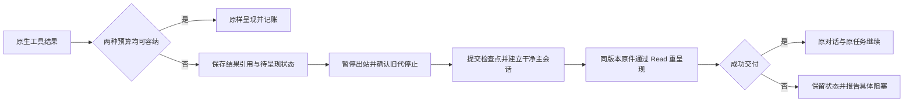

# 基于百炼实测的上下文修复与持续对话方案

日期：2026-09-13。本文前半部分保留原分析基线；后续已按用户批准的图片闭环范围实施预算、停止屏障和持久续接。当前验收与明确边界见[图片交接实施记录](2026-09-13-agent-image-handoff-execution.md)。未恢复或改写原失败对话，未启动应用、迁移全面历史或发布。

## 1. 目标与依赖

用户目标是长时间流畅对话，遇到上下文容量时自动维护并继续，不因为累计消息或文件数量增多就要求用户重开对话。工程目标是：**同一个产品对话身份 + 持久历史和任务状态 + 有界模型工作集 + 自动整理与会话交接**。

单次模型输入、6 MiB 请求体、单件附件、输出、用户费用配额、磁盘、网络与权限仍有边界。不能承诺一个请求装入无限历史，或在任意故障下永不暂停；不能通过省略材料、重复副作用、降低原图质量或虚报完成伪造连续性。

本方案补充已有计划，不创建平行存储、调度器、进度协议或执行器：

- [实测方案与结果](../../reference/2026-09-13-bailian-qwen-context-probe.md)：本次直接 Provider 边界证据。
- [预算设计](../specs/2026-09-12-agent-context-budget-governor-design.md)：双预算、SDK 边界与本地策略。
- [监视整改计划](2026-09-13-agent-monitoring-findings-remediation-plan.md)及[实施记录](2026-09-13-agent-monitoring-findings-remediation-execution.md)：PendingPresentation、图片关闭屏障、回执与原件生命周期。
- [四项缺口计划](2026-09-13-agent-four-gaps-remediation-plan.md)及[实施记录](2026-09-13-agent-four-gaps-remediation-execution.md)：权威历史、HandoffRecord、Task metadata、Renderer 有界缓存。
- [长任务可靠性计划](2026-09-13-agent-long-task-state-and-context-reliability-plan.md)、[容量设计](../specs/2026-09-13-agent-long-running-capacity-design.md)：增量检查点、覆盖、背压与性能验收。

直接 API 探测不能将原有工单改为完成。后续图片重呈现的状态以独立 Runtime/原生 SDK/真实百炼验收为准；其它长期性能与历史改造范围仍按原计划保留。

## 2. 已证实事实与归因边界

### 2.1 Provider 并非只能接收 200K

直接请求实测：关闭思考 991,808 输入 token、开启思考 983,616 输入 token 均成功，超过对应边界一个校准 token 被拒绝；6 MiB body 成功，多一个字节被拒绝。模型目录的 1M、Provider 输入边界、本地 200K 整理配置、SDK 实际工作窗口/整理阈值、5 MiB 安全预算是不同概念。

满输入请求分别耗时约 59 秒和 81 秒，只有单次样本。这证明“能接收”不等于“交互足够快”，不能把每轮都逼近百万 token 当作流畅对话方案。

### 2.2 本轮监视的停止发生在本地输出治理

本轮监视最后看到：首次图片 Read 后出现“图片或非文本结果超过当前上下文预算，尚未完成处理”，持久 `turnOutcome.status=failed`、`recoverable=true`，运行状态变为 idle。没有成功图片结果记录，也没有观察到该次 Read 对应的 Provider 6 MiB 错误。

这份观察与早先整改文档中 `recoverable=false`、完成 10 个文本的历史基线不同，不能合并为同一次运行或覆盖旧证据。本轮文本清单曾修正为 33 done、48 pending，但这仍只是 Agent 标记和扫描统计。

当前源码 `claude-sdk-session.ts` 的 `limitToolOutput` 在 `PostToolUse` 中比较非文本结果的序列化字节与 `availableModelVisibleBytes()`；不足则调用 `stopForOutputIntegrity`。该分支不会进入 `pauseForContextRotation`，因此图片结果未能呈现就结束了当前执行。后续 `PostToolBatch` 请求预检不能恢复已经失败的会话。

### 2.3 可复现的容量误判：把非文本字节作为 token 成本

源码核对基线：`2ec0bece8`，desktop `0.2.457`，依赖 SDK `0.3.245`。基线只标识本次分析的代码，不证明已安装应用恰好来自该提交。

`context-budget.ts` 存在以下保守近似：

- `availableModelVisibleBytes()` 取剩余 token 数与剩余 body 字节数的较小值，返回为 bytes。
- `recordToolOutput(bytes)` 将完整结果字节加入 `pendingModelVisibleBytes`，后者又作为 token 数加入 `estimatedRequestTokens`。
- `guardNextRequest` 还可能将新增 payload 字节与 SDK token 快照相加。是否重复计量依赖快照覆盖水位，需要专项核验，当前证据不能断言本次发生了重复记账。

文本的“一字节按一个 token 保守预留”不能直接用作视觉结果的 token 成本。图片 Base64 传输长度可能远大于模型视觉 token 消耗。

本轮第一张图片元数据为 339,821 字节，其 Base64 至少占 `4 × ceil(339821 / 3) = 453096` 字节，还未计 JSON 和消息外壳。使用**当前实际预算类**执行纯计算：

```js
import { AgentContextBudget } from "./desktop/electron/services/agent-runtime/context-budget.ts"

const budget = new AgentContextBudget({
  maxToolResultBytes: 8192,
  maxToolBatchBytes: 24576,
  maxContextTokens: 200000,
  maxRequestBodyBytes: 6 * 1024 * 1024,
  requestBodyBudgetBytes: 5 * 1024 * 1024,
})
const base64Bytes = 4 * Math.ceil(339821 / 3)
// 实际结果：availableModelVisibleBytes() === 200000
// base64Bytes === 453096；空工作集也无法通过现有非文本比较。
// 同时 453096 < 5242880，并未仅凭此占满 body 安全预算。
```

本次用 Node `--experimental-strip-types --input-type=module` 从仓库根目录导入该文件运行，未调用 SDK、Provider 或读取图片原件。**复现证明当前算法在 200K 工作窗口下可拒绝这种大小的图片；不证明历史失败瞬间的真实 token、实际窗口或 HTTP body，也未测该图片的视觉 token。** 历史报错缺少这些数值，所以应分别修复预算近似过严与图片恢复未接上的问题。

## 3. 第一优先级：分别核算 token 与字节

修改范围集中在已有 `context-budget.ts`、`context-usage.ts`、`claude-sdk-session.ts` 和预算测试，不通过提高模型目录/本地窗口掩盖误判。

建议把待请求成本拆成两个有单位的维度：

```text
projectedInputTokens = freshObservedInputTokens + notYetCoveredInputTokens
projectedBodyBytes   = retainedBodyEstimateBytes + notYetCoveredSerializedBytes

检查输入：projectedInputTokens + inputSafetyMargin <= effectiveInputLimit
检查总窗口：projectedInputTokens + outputReservation <= effectiveContextWindow
检查传输：projectedBodyBytes + bodySafetyMargin <= providerHardBodyLimit
```

这些是拟议语义，不是现有 SDK API。输入限制应区分工作窗口、已核实的模型最大输入和思考模式；输出/思考预留按适配协议核验，不能从 SDK 已扣减的阈值再次扣同一 buffer。

1. token 使用可信 SDK 快照与经验证的新增内容估算，记录 generation/batch 覆盖水位；普通快照、迟到事件、compact 前后不能清空未覆盖增量或重复添加已覆盖内容。
2. Base64 全量计入 body；非文本 token 使用 SDK 可信计量或经真实协议夹具校准的通用估算。无法取得时标为 unknown，走有界预留/交接判断；不能捏造 token 数、直接记零或按 Base64 一字节一 token 判永久不可处理。
3. 附件处理继续与 Provider/模型能力目录解耦，不为 Qwen 写视觉白名单。模型目录维持上下文职责，传输策略维持已知端点作用域。
4. 原生 hook 结果结构不等于实际线级 image block。body 估算包含 Base64、JSON 转义、静态工具、历史封装及 compact 请求空间，用隔离 loopback 的真实发送大小校准；生产未观测时仍标记 estimated。
5. 保持当前 5 MiB 安全预算、6 MiB 硬上限和 200K 整理配置；正确预算与真实吞吐评测完成后，再讨论工作窗口调优。
6. 下一步预留跟随待呈现结果与并行批次规模，不只检查“还剩 4,096”。并行结果原子预留，不能消费同一份余额两次。
7. 诊断区分 token 工作窗口不足、body 安全预算不足、估算未知、单件在干净上下文也超限、SDK 屏障失败。记录数值、单位、来源、快照水位与维护结果，不记录正文、Base64 或凭据。

## 4. 第二优先级：自动维护与图片重呈现

工作集装不下下一张图时，先尝试从确定状态交接；原件在干净请求里仍超过硬上限，才是需要用户改变输入的容量阻塞。只增大阈值无法覆盖后续长任务。

复用原计划的 PendingPresentation 与 HandoffRecord：



执行顺序与边界：

1. 尽量在工具执行前按可获得元数据预留，执行后以实际结果校核。已完成副作用与未呈现结果分别记录，已执行不等于已消费。
2. 保持 SDK 原生自动整理，在已验证请求边界检查新鲜快照，仍不足时走同一 turn 的干净 Session 交接。不得在挂起 hook 内调用未验证的 compact API，不能假设 `Query.compact()` 存在。
3. 原生图片夹具已发现单独 `close()` 后仍可能发出含原图的下一请求；测试中的 interrupt 确认路径只覆盖特定场景。必须完成出站屏障、取消/超时和其它 hook 组合门禁，不能只删除停止分支或把 close 返回当作安全证明。
4. 先保全结果/原件身份和检查点，再通过持久 generation fence 撤销旧代控制权、建立新代。维持 conversation、turn、Task 身份、待用户输入、费用与权限；取消优先，进程重启后不自动重放交互任务。
5. 新主 query 只获得目标、计划、最新进度、未消费结果引用与必要近期上下文，再通过原生 Read 呈现同一原件。只读文件可按协议重呈现，截图、Bash、上传、发送消息等副作用不可为恢复结果重跑。
6. 同一图片容量恢复最多一次干净代尝试；仍无进展、原件变化、授权撤销或 SDK 协议不受支持时明确阻塞，不能无限轮换。
7. 不静默压图、OCR、切片、换模型、创建隐藏子会话或省略图片；这些改变输入语义，当前方案不包含此类边界调整。

门禁完成前保留保护性停止。`recoverable=true` 仅表示恢复可能性，不代表已经自动恢复。

## 5. 持续流畅对话的完整路径

| 层 | 保留什么 | 怎样避免随总历史无限增长 | 现有计划归属 |
| --- | --- | --- | --- |
| 权威历史 | 用户要求、消息、结果、费用、版本与引用 | 增量追加、正文分块、稳定游标；大内容保留在受控 artifact | 四项缺口的历史与 MessageWriter |
| 当前执行状态 | 当前任务、已做/未做、待呈现结果、权限、generation | 持久小索引与检查点 root refs；确定断点恢复 | HandoffRecord、Task metadata、进度账本 |
| 模型工作集 | 原始目标、近期必要交互、当前结果、历史引用 | 自动整理与新代交接；按引用读全文，摘要不是唯一事实源 | 预算与长任务可靠性 |
| Renderer | 当前视口、有限热页、流式增量 | 有界页缓存、虚拟化、ACK/背压、持久水位重同步 | 四项缺口与容量设计 |

不能把全部历史或多层累计摘要塞入每次恢复请求。用户可查看完整历史，模型通过受控引用按需恢复早期细节；已接受的修改要求和关键决定必须持续保留。多代费用、重试次数和资源限额累计，不能换 Session 后清零。

普通聊天不新增“所有文件必须全读”的完成门槛。明确要求完整覆盖的任务，沿用既有计划中待确认的严格模式边界；区分读取、SDK 接纳、出站观测、模型声明与语义验收。Task 勾选或扫描次数不能保证理解，本方案也不构成启用严格模式的授权。

体验目标是正常对话无需反复点击继续、重述任务或另开对话。自动维护使用已有状态表达，只在需要用户处理时报告具体阻塞；本文未授权新增 UI 页面或说明文案。

## 6. 实施顺序与验收

| 阶段 | 最小交付 | 必须取得的证据 |
| --- | --- | --- |
| P0：预算与诊断 | 拆分 token/body 成本、快照水位、拒绝原因 | 453,096 Base64 字节不再仅因大于 200K 数值判 token 超限；未知计量不伪造；ASCII/中文/图片、缓存、并行、compact 无漏记或重复记账 |
| P1：SDK 出站屏障 | 统一适配正常维护、超时、取消和强停 | 真实 SDK + 隔离 loopback，挂起图片 hook 后旧代不再发请求；修复 close 缺陷，不能把缺陷复现计作通过 |
| P2：持久交接与图片 | 接入共用 HandoffRecord、PendingPresentation、原件生命周期 | 当前上下文不足但干净工作集可容纳时自动续跑；崩溃不丢引用、不重放副作用；单件仍超限一次尝试后阻塞 |
| P3：长期流畅性 | 增量历史、执行索引、Renderer 页缓存/背压接入生产 | 1k/10k/100k 历史规模、100 次受控交接、8 小时耐久的内存/追加成本/界面响应和正确性记录，原始目标不丢失 |
| P4：目标构建验收 | 确认安装包源码身份，在真实 Provider 下复测 | 同类 33 文本+48 图片任务逐项取得要求的证据，多轮继续；区分传输、SDK、语义结果，不只报 PASS |

P3 数次和时长是待执行目标，不是当前测量。P2 依赖共用持久交接基础，不能为首图修复另建轮换循环。P4 涉及真实模型费用、应用运行与原件访问，实施时按当前会话授权范围执行；本次仅编写方案，没有执行 P4。

优先级结论：**先纠正图片预算单位和确认出站屏障，再接通持久重呈现；随后完成增量历史与有界界面。** 上调到百万窗口、扩大 body 安全预算、抑制报错或仅添加“请继续”提示，都不能代替这条路径。

## 6. 图片闭环后续实施

已拆开 token/body 成本，接入 interrupt 确认后的停止屏障与 conversation 内的最小持久交接；同一原图最多一次自动重呈现，未接收图片不能完成任务。详见[实施及验收记录](2026-09-13-agent-image-handoff-execution.md)。200K 整理、5 MiB 安全预算和 6 MiB 传输上限保持不变。
