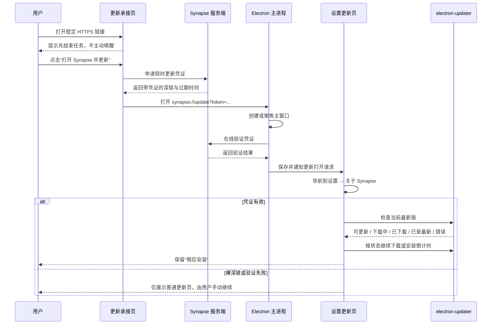

# 桌面端一键更新承接链路设计

- 状态：已实现；生产可用性与真实更新主路径待部署后验收
- 日期：2026-07-21
- 稳定入口：`https://synapse.d2.pub/desktop/update`
- 相关决策：`docs/adr/0028-use-an-https-handoff-for-shared-update-links.md`、`docs/adr/0029-require-a-short-lived-credential-for-automatic-update-deep-links.md`

## 1. 摘要

每次 Synapse 发版后，GitHub Release 提供一个长期稳定的普通 HTTPS 链接。用户打开后进入独立公开的更新承接页；页面不登录、不加载 Dashboard 布局，也不会在加载时主动唤醒客户端。

页面提示用户先结束正在进行的任务。用户点击“打开 Synapse 并更新”即完成确认：页面向 Synapse 服务端申请短时更新凭证，再打开 `synapse://update?token=<credential>`。客户端始终先聚焦并进入“设置 → 关于 Synapse”的更新区域；只有在线验证凭证成功后，才自动检查最新版、下载、进入现有三秒安装倒计时，并沿用现有退出、安装和重启链路。

裸深链、无效凭证、过期凭证或验证服务不可用时，只允许打开客户端更新页面，不得自动下载、安装或重启。网页不提供安装包下载；唤醒失败或旧客户端不支持完整动作时，只提示用户在客户端设置中手动更新。

## 2. 已确认的产品边界

### 2.1 必须支持

- 对外只分享稳定 HTTPS 地址 `https://synapse.d2.pub/desktop/update`。
- URL 不携带目标版本；语义始终是“更新到当前可用最新版”。
- 页面位于 `synapse.d2.pub`，但独立于 Dashboard 的路由、布局、鉴权和会话初始化。
- 页面加载后保持静止，不自动调用自定义协议。
- 页面明确提示更新会关闭并重新启动 Synapse，用户应先结束正在进行的任务。
- 不增加复选框，也不增加第二次确认；主按钮本身就是用户确认。
- 点击后申请短时凭证，并打开带凭证的 `synapse://update`。
- 页面保留“再次打开 Synapse”和手动前往“设置 → 关于 Synapse”的回退说明。
- 客户端自动更新复用现有的检查、下载、三秒倒计时、“稍后安装”、退出、安装与重启流程。
- 重复点击或重复收到深链时幂等合并，不并发发起重复检查、下载或安装。
- 每次 GitHub Release 的正文都包含该稳定链接。

### 2.2 明确不做

- 网页不展示、代理或下载任何平台安装包。
- 网页不判断客户端是否真正完成了导航、下载或安装。
- 网页不根据 `blur`、`visibilitychange` 等浏览器信号宣称唤醒成功。
- 客户端不扫描 Agent、Workflow、Automation 或其它运行任务。
- 不在深链中传递版本号、安装模式、跳过倒计时等流程开关。
- 不把自定义协议地址作为公开分享链接。
- 不新增登录要求，不复用 Dashboard 用户会话。
- 不为短时凭证新增数据库表、一次性消费记录或清理任务。
- 不改变更新包的来源、签名校验或 `electron-updater` 的制品信任链。

### 2.3 保留的既有安全门

客户端不新增通用任务扫描，但现有 Knowledge Base 存储迁移退出拦截必须继续生效。自动更新只能进入现有退出流程，不能绕过 `before-quit` 中的强制阻塞条件。

## 3. 现有链路与可复用能力

### 3.1 自定义协议与窗口唤醒

- `desktop/package.json` 已注册 `synapse` 协议。
- `desktop/electron/main.ts` 已统一接收：
  - 首次启动参数中的 `synapse://...`；
  - macOS `open-url`；
  - Windows/Linux 单实例 `second-instance` 参数。
- `desktop/electron/bootstrap/protocol-router.ts` 当前处理登录回调和 Skill 安装；未知协议只聚焦主窗口。
- `desktop/electron/bootstrap/app-ready.ts` 会在服务就绪后排空启动期间收到的协议 URL。
- `desktop/electron/bootstrap/main-window.ts` 已提供创建、显示和聚焦主窗口的能力。

因此新增更新入口应扩展现有 protocol router，不另建第二套协议监听或窗口生命周期。

### 3.2 更新服务与设置页

- `desktop/electron/services/update-service.ts` 使用 `electron-updater`，并明确设置 `autoDownload = false`；检查和下载是分开的动作。
- `desktop/electron/modules/update/ipc.ts`、`desktop/electron/preload.ts`、`desktop/src/types/bridge.ts` 与 `desktop/src/types/update.ts` 已构成主进程到 renderer 的更新桥接。
- `desktop/src/App.tsx` 已监听“打开更新页面”事件，激活设置并请求打开“关于 Synapse”。
- `desktop/src/app-shell/navigation.ts` 已处理 renderer 内部的设置分类请求与组件挂载时序。
- `desktop/src/modules/settings/components/about-panel.tsx` 已具备：
  - 进入页面检查更新；
  - 点击“下载并安装”后下载；
  - 下载完成后三秒倒计时；
  - “稍后安装”；
  - 离开页面时取消自动安装意图。
- `desktop/electron/bootstrap/before-quit.ts` 已串联安装退出与 Knowledge Base 迁移阻塞。

本功能应把“有效更新深链”接入这条既有状态链，不复制更新器、不另写安装命令。

### 3.3 当前可靠性缺口

`desktop/electron/runtime/window/manager.ts` 的广播是即时事件，没有 renderer 未就绪时的消息队列。冷启动阶段如果只广播“打开更新页面”，事件可能在 React 订阅前丢失。因此本功能不能只增加一个 broadcast；主进程必须保留待处理的更新打开请求，renderer 在挂载时主动拉取，处理完成后再确认消费。

### 3.4 网站与发布现状

- Dashboard 生产构建挂载在 `/console`，入口会初始化 Dashboard 会话并使用其布局和 Router。
- `server/nginx.conf` 当前把根路径引导至 `/console`。
- `desktop/scripts/release/prepare-cdn-release-artifacts.mjs` 负责生成 Release 正文和 CDN 制品链接。
- `.github/workflows/release.yml` 负责正式 GitHub Release 发布。

因此 `/desktop/update` 必须有独立 HTML 入口，不能只是 Dashboard Router 中新增一个公开 route。

## 4. 稳定契约

### 4.1 HTTPS 承接链接

```text
https://synapse.d2.pub/desktop/update
```

约束：

- 路径长期稳定。
- 不接受也不生成版本参数。
- 后续即使网页实现、Dashboard 框架或 CDN 结构变化，也应维持该地址。
- Release 文案只放该 HTTPS 地址，不放 `synapse://` 地址。

建议在 `shared/src/urls.ts` 中集中声明路径和构造函数，供网页、发布脚本与测试复用，避免三处手写漂移。

### 4.2 更新深链

```text
synapse://update
synapse://update?token=<credential>
```

协议解析必须严格限定：

- scheme 为 `synapse:`；
- hostname 为 `update`；
- pathname 仅允许空或 `/`；
- 自动动作只读取单个 `token` 参数；
- 不接受版本号、下载地址或安装控制参数；
- 对 token 设置合理长度上限，异常输入按无效凭证处理；
- 日志不得记录原始 URL 或 token。

`synapse://update` 表达产品意图，不等同于 renderer 内部路由。未来设置结构调整时，深链语义保持不变。

### 4.3 更新打开请求

主进程向 renderer 暴露的内部请求不包含凭证：

```ts
interface SynapseAppUpdateOpenRequest {
  id: number
  automatic: boolean
}
```

- `id`：进程内单调递增的请求标识，用于幂等和确认消费。
- `automatic: true`：凭证已由主进程在线验证，可进入完整自动更新流程。
- `automatic: false`：只导航到更新页，由用户在客户端继续操作。

凭证验证完成后即丢弃原始 token，不把它传给 renderer，也不持久化到磁盘。

## 5. 端到端流程



网页发起自定义协议后始终展示回退信息。浏览器无法可靠证明客户端处理结果，因此不设计“已成功打开”状态。

## 6. 独立更新承接页

### 6.1 构建与路由

建议在现有 Dashboard Vite 工程中新增独立多页面入口，例如：

```text
server/dashboard/desktop-update.html
server/dashboard/src/desktop-update/main.tsx
server/dashboard/src/desktop-update/page.tsx
```

Vite `build.rollupOptions.input` 同时声明 Dashboard `index.html` 和更新页 HTML。更新页可以复用现有全局主题 token、字体、shadcn 组件和基础样式，但不得导入：

- Dashboard Router；
- Dashboard layout；
- Dashboard session bootstrap；
- 登录守卫；
- Dashboard 导航或业务 providers。

`server/nginx.conf` 为 `location = /desktop/update` 精确返回独立 HTML，不重定向 `/console`。本地开发中也要把该路径映射到独立入口，以保证开发和生产一致。

### 6.2 页面状态

页面保持四个简单状态：

| 状态 | 主操作 | 行为 |
|---|---|---|
| 初始 | 打开 Synapse 并更新 | 申请凭证后打开深链 |
| 正在申请 | 按钮禁用并显示加载 | 防止并发申请 |
| 已尝试打开 | 再次打开 Synapse | 重新申请新凭证并再次打开 |
| 申请失败 | 重试 | 显示必要错误和手动更新路径 |

页面只在点击处理函数的内存中短暂持有 token，不把 token 写入页面 URL、localStorage、sessionStorage 或日志。每次重试都申请新凭证。

### 6.3 页面文案

建议最终文案保持最小必要信息：

- 标题：`更新 Synapse`
- 提示：`更新将关闭并重新启动 Synapse，请先结束正在进行的任务。`
- 主按钮：`打开 Synapse 并更新`
- 重试按钮：`再次打开 Synapse`
- 回退：`如果没有自动打开软件更新页面，请在 Synapse 中前往“设置 → 关于 Synapse”检查更新。`

不增加功能介绍、营销描述、安装包入口、复选框或二次弹窗。

### 6.4 页面安全响应头

该精确路径至少设置：

- `Content-Security-Policy`：脚本、样式和连接仅允许自身实际需要的来源；禁止 object；
- `frame-ancestors 'none'` 或等价 `X-Frame-Options: DENY`，避免按钮被嵌入诱导点击；
- `Referrer-Policy: no-referrer`；
- 合理的 `Cache-Control`，HTML 不长期固化，静态 hash 资源可长期缓存。

## 7. 更新凭证服务

### 7.1 接口

建议新增两个服务端接口：

```http
POST /api/desktop/update-intents
```

用途：只供官方更新承接页在用户点击后签发凭证。

成功响应：

```json
{
  "deepLinkUrl": "synapse://update?token=<credential>",
  "expiresAt": "2026-07-21T12:00:00.000Z"
}
```

```http
POST /api/desktop/update-intents/verify
Content-Type: application/json

{
  "token": "<credential>"
}
```

用途：只供桌面主进程验证。成功只返回最小授权结果；过期、篡改、错误 audience/scope/type 统一按无效处理，不泄露校验细节。

两个接口都返回 `Cache-Control: no-store`。

### 7.2 签发限制

签发接口不要求用户登录，但必须：

- 在生产环境精确校验 `Origin` 为配置后的官方公开站点 origin；
- 配合浏览器同源策略，拒绝无 Origin 或第三方 Origin 的网页签发请求；
- 使用现有 `@nestjs/throttler` 为签发和验证设置更严格的 endpoint 限流；
- 不在错误、访问或审计日志中记录 token、完整响应或验证 body；
- 开发和测试环境的放宽条件显式配置和测试，不能隐式跳过生产校验。

Origin 校验用于约束浏览器签发入口；真正授权仍由服务端签名和客户端在线验证承担，不能把 Origin 当作深链来源证明。

### 7.3 凭证内容与生命周期

使用服务端现有 JWT 能力，但采用独立密钥和严格固定声明：

```json
{
  "typ": "desktop-update-intent",
  "aud": "synapse-desktop",
  "scope": "update:latest",
  "iat": 0,
  "exp": 0,
  "jti": "random-id"
}
```

- 算法：服务端固定允许的对称签名算法，不接受 token 自报的其它算法。
- 有效期：120 秒。
- `jti`：随机值，降低同秒签发结果重复；不落库、不做一次性消费。
- 有效期内允许重放；客户端状态机负责幂等。
- 不包含用户身份、客户端身份、目标版本或制品地址。
- 校验时严格检查签名、算法、`typ`、`aud`、`scope`、`iat` 和 `exp`，只允许很小的时钟误差。

### 7.4 独立密钥

新增：

```text
DESKTOP_UPDATE_INTENT_SECRET
```

要求：

- 生产环境必填，使用高熵随机值；
- 不得复用用户 JWT、管理员 JWT 或其它用途的 secret；
- 环境校验应同时检查长度和与现有 JWT secret 的不相等约束；
- 示例配置只放说明和占位，不提交真实 secret。

实现时必须同步更新：

- `server/src/config/env.ts` 与 `server/src/config/env.spec.ts`；
- `server/compose.yml`；
- `server/.env.example`；
- 部署和初始化脚本；
- 服务端 README；
- 根 `AGENTS.md` 中稳定的配置与安全边界。

## 8. 桌面主进程设计

### 8.1 Protocol router

在现有 `createProtocolUrlRouter` 中增加 update route：

1. 严格解析 URL，识别是否为更新深链。
2. 立即创建、显示并聚焦主窗口；不等待网络验证后才唤醒。
3. 裸深链直接形成 `automatic: false` 请求。
4. 带 token 时调用专用验证 service，设置短超时。
5. 验证成功形成 `automatic: true` 请求；任何失败形成 `automatic: false` 请求。
6. 保存最新待处理请求，并通知已就绪 renderer。

验证失败不得阻止导航，也不得显示阻塞式主进程错误。结构化日志只记录结果类别，例如 `valid`、`expired_or_invalid`、`timeout`、`service_unavailable`，不记录原始 URL 或 token。

### 8.2 服务端地址

验证 service 复用桌面端现有部署配置中的 API base URL，不在协议 handler 内硬编码生产域名。网络超时、非 2xx、响应 schema 错误均降级为手动模式。

服务端“不可达”不能 fail open。无法验证就不自动下载和重启。

### 8.3 待处理请求与确认消费

在主进程保留一个进程内 pending request，提供：

- 获取当前待处理请求；
- 订阅新请求事件；
- 按 `id` 确认处理；
- 忽略旧 request 的迟到确认。

采用 at-least-once 交付：

- renderer 挂载时先订阅，再主动读取 pending request；
- 主进程有新请求时更新 pending 并发送事件；
- AboutPanel 已完成导航且已接管对应自动状态后才确认；
- renderer 重载或事件丢失时仍可再次读取；
- 进程退出后无需持久化，启动参数或系统协议事件会重新建立请求。

如果短时间内收到多个请求，保留最新请求并依靠更新状态机合并；不得并发调用 updater。

### 8.4 Bridge 类型

在既有 updater bridge 上增加最小的 pending request 获取、订阅和确认方法，并同步更新 preload 与 renderer 类型。不要建立新的全局 `window` namespace，也不要把验证或 JWT 解析放进 renderer。

## 9. Renderer 导航与更新状态机

### 9.1 导航职责

`App.tsx` 继续负责把更新打开请求转换为“打开设置并选中关于 Synapse”。AboutPanel 负责消费请求并决定是否自动推进更新。

renderer 内现有 `requestOpenSettingsAbout` 可以继续处理设置组件尚未挂载的时序；主进程 pending request 则覆盖整个 renderer 尚未启动或重载的更早时序。两者职责不同，不互相替代。

### 9.2 自动状态机

有效凭证把 `automatic update intent` 置为 armed，然后根据当前 updater 状态继续：

| 当前状态 | 自动行为 |
|---|---|
| idle / 初始 | 立即检查更新 |
| checking | 等待检查结果，不重复检查 |
| available | 开始下载 |
| downloading | 保持下载，等待完成 |
| downloaded | 启动现有三秒安装倒计时 |
| not-available / 已是最新 | 保持已是最新，不再动作 |
| error | 展示现有错误和重试入口，不无限自动重试 |

检查结果发生变化时继续推进：

- `checking → available`：下载；
- `checking → not-available`：结束自动意图；
- `downloading → downloaded`：倒计时；
- 任意步骤进入 error：解除自动推进，保留用户重试。

有效深链触发的显式检查不应被“进入页面自动检查”的冷却时间阻断。裸深链和验证失败只执行普通页面进入逻辑，不启用自动安装意图。

### 9.3 与现有手动流程合并

现有“下载并安装”点击和有效深链必须共享同一个控制器或 hook：

- 同一份 `installArmed` 状态；
- 同一份下载完成监听；
- 同一份三秒倒计时；
- 同一份“稍后安装”和 unmount 清理；
- 同一份错误展示。

不要在 `App.tsx`、AboutPanel 和 update service 中各复制一套状态判断。

### 9.4 取消与离开页面

维持现有安全行为：

- 用户点击“稍后安装”后取消本次倒计时和自动安装意图；
- 用户离开 AboutPanel 时清除 timer 和 renderer 侧 armed 状态；
- 下载本身可以按现有 updater 行为继续，但不得因为已离开页面而自动安装；
- 用户之后重新进入页面，可根据 `downloaded` 状态自行选择安装；
- 新的有效更新深链可重新 armed 并恢复倒计时。

## 10. 异常与兼容行为

| 场景 | 预期结果 |
|---|---|
| 浏览器阻止自定义协议 | 网页保留“再次打开”和手动设置提示 |
| Synapse 未安装 | 网页只提示手动打开/更新，不提供下载 |
| 旧客户端只识别 scheme、不识别 update route | 可能仅聚焦客户端；网页不能宣称成功，用户按提示手动进入设置 |
| 裸 `synapse://update` | 打开设置更新页，不自动下载或安装 |
| token 过期、篡改或声明错误 | 打开设置更新页，不自动下载或安装 |
| 验证服务超时或不可用 | fail closed，退化为手动模式 |
| updater 检查失败 | 显示既有错误和重试，不循环重试 |
| 已是最新版 | 停留在“已是最新”状态 |
| 已在下载 | 不重复下载，等待完成后按 armed 状态继续 |
| 已下载 | 进入现有三秒倒计时 |
| 用户点击“稍后安装” | 取消本次自动安装 |
| Knowledge Base 迁移阻止退出 | 沿用现有阻塞，不能强制绕过 |
| 重复点击网页按钮 | 重新签发凭证；客户端幂等合并 |

## 11. 发布与部署顺序

### 11.1 GitHub Release

修改 `desktop/scripts/release/prepare-cdn-release-artifacts.mjs`，让所有生成的 Release 正文固定包含：

```text
一键更新：https://synapse.d2.pub/desktop/update
```

不根据版本拼接 URL。对应发布脚本测试必须验证：

- 文案存在且只有稳定 HTTPS 链接；
- 不出现 `synapse://`；
- 不附加版本 query；
- macOS 本地发布生成的 release body artifact 同样包含该链接。

### 11.2 部署后可用性检查

`deploy.sh` 在新服务完成切换、容器内健康检查通过后检查：

- `https://synapse.d2.pub/desktop/update` 可访问并最终返回 2xx；
- 返回的是独立更新页，而不是 `/console` 登录页或重定向；

该公网检查属于生产部署后的验收门禁。服务端/页面尚未部署时，生产地址仍指向旧页面或跳转 `/console/` 是预期现状，不作为本地测试或部署前发版准备失败；首次上线必须先通过部署后门禁，再发布客户端。

`.github/workflows/release.yml` 在创建 Release 前只静态确认准备发布的 Release body 包含稳定链接且不含自定义协议或版本参数，不主动探测生产页面。

### 11.3 正式包协议验收

macOS 与 Windows runner 必须在上传安装包前验证正式打包产物的协议注册，并分别覆盖冷启动和热启动。smoke 不只检查进程存活，还必须通过现有结构化 renderer 日志确认请求已被消费并导航到“关于 Synapse”；裸深链只验证手动导航，不启用自动更新。

### 11.4 首次上线顺序

首次发布必须按顺序：

1. 配置生产 `DESKTOP_UPDATE_INTENT_SECRET`。
2. 部署服务端签发/验证接口和独立更新页。
3. 验证稳定 URL、页面按钮和接口健康状态。
4. 再发布支持 `synapse://update` 的新版桌面客户端。

这样第一条 Release 链接即使被旧客户端打开，也仍有明确的手动设置回退。之后的客户端版本继续复用相同 HTTPS 与深链契约。

`server/deploy.sh` 的部署健康检查应增加 `/desktop/update`，并以不泄露 token 的方式验证签发/验证链路配置完整。

部署后验收还必须使用已安装的候选正式包从公开页面实际点击一次，确认凭证签发、客户端验证、页面导航、检查、下载、倒计时和安装主路径；同时复核浏览器拦截、旧客户端手动设置回退及设计列出的主要失败/幂等场景。该真实生产链路在服务端/页面尚未部署时不可执行，属于部署后验收项，不作为本地测试或部署前 Release workflow 的失败条件。

## 12. 安全与隐私

- 自定义协议本身不能证明来源页面；自动更新权限必须来自短时凭证。
- 裸深链永远不能直接触发下载、安装或重启。
- 验证失败一律 fail closed，但仍允许导航到普通更新页。
- token 不进入浏览器地址栏、localStorage、renderer、数据库或持久化日志。
- Electron 日志、协议解析错误和诊断导出必须掩码 `token` query。
- 服务端 HTTP 日志不得记录验证请求 body 或签发响应。
- 页面禁止 iframe 嵌入，减少 clickjacking。
- 签发和验证接口分别限流，防止滥用和无意义验签负载。
- 更新制品仍由现有 `electron-updater` provider 与签名机制校验；凭证只授权有中断性的自动流程，不代替制品完整性校验。
- 用户点击网页按钮表示对本次中断性更新的确认，但不代表系统已检查任务安全。

该方案防止第三方网页仅靠构造裸深链直接触发自动更新，并降低链接误触和过期链接重放的风险；它不把自定义协议或公开签发接口当作本机恶意进程的权限边界。能够主动伪造 HTTP 请求并调用本机协议的恶意进程仍可能模拟官方页面流程。若未来需要抵御该级别威胁，必须增加客户端内确认或受信平台证明；这与本次已确认的“网页点击后不再二次确认”边界冲突，不在当前范围内。

## 13. 预计修改范围

以下是实现阶段的预期范围，文件名可按现有模块组织微调，但职责不可漂移。

### 13.1 Shared

- `shared/src/urls.ts`：稳定 HTTPS 路径、深链常量和安全构造函数。
- 对应单元测试：确保无版本参数和 URL 漂移。

### 13.2 Server 与独立页面

- `server/dashboard`：新增 Vite MPA 独立入口和更新页。
- Dashboard Vite 配置：注册多页面构建入口。
- Server 新增 desktop update intent controller/service/schema。
- `server/src/config/env.ts` 与相关配置、测试、部署文件。
- `server/nginx.conf`：精确静态路由和安全头。
- `server/deploy.sh`：健康检查。
- 服务端 README 与根 `AGENTS.md`：记录稳定配置和安全边界。

### 13.3 Desktop

- `desktop/electron/bootstrap/protocol-router.ts`：update route。
- Electron 主进程：凭证验证 service 与 pending request 管理。
- `desktop/electron/modules/update/ipc.ts`：pending request IPC。
- `desktop/electron/preload.ts`、`desktop/src/types/bridge.ts`、`desktop/src/types/update.ts`：桥接类型。
- `desktop/src/App.tsx`：可靠读取/订阅并导航。
- `desktop/src/modules/settings/components/about-panel.tsx`：统一自动状态机。
- 必要的现有 updater service 测试；不重写 updater provider。

### 13.4 Release

- `desktop/scripts/release/prepare-cdn-release-artifacts.mjs`。
- `.github/workflows/release.yml`。
- 发布制品与 workflow 相关测试。

实现产生用户可感知行为后，需要更新根 `RELEASE_NOTES_PENDING.md`。

## 14. 测试矩阵

### 14.1 Shared 与 URL

- 稳定 HTTPS URL 精确等于确认值。
- 深链构造只允许 token，不接受版本或流程参数。
- token 正确编码，异常长度被拒绝。

### 14.2 服务端

- 官方 Origin 可签发；第三方、缺失或错误 Origin 在生产规则下被拒绝。
- 签发结果具有固定 type、audience、scope 和 120 秒有效期。
- 有效 token 通过验证。
- 过期、篡改、错误算法、错误 type/audience/scope 均失败。
- 密钥缺失、过短或与其它 JWT secret 相同会阻止生产配置启动。
- 签发与验证响应均为 `no-store`。
- endpoint 限流生效。
- 日志快照不包含 token。

### 14.3 网页

- 直接加载页面不会触发自定义协议，也不会请求签发接口。
- 页面不请求 Dashboard 会话，不进入登录流程。
- 点击按钮后只发起一次签发；重复快速点击被禁用合并。
- 成功后打开服务端返回的深链并显示再次打开/手动回退。
- 失败时可重试，且无安装包下载链接。
- 页面键盘操作、焦点、加载和错误状态可访问。
- `/desktop/update` 在开发与生产都返回独立入口，不重定向 `/console`。

### 14.4 Electron 协议与可靠交付

- macOS `open-url`、首次启动 argv、Windows `second-instance` 均识别 update route。
- 冷启动时协议早于 renderer 初始化仍能在挂载后取到请求。
- 热启动时立即聚焦窗口并通知 renderer。
- renderer 重载前未确认的请求仍可重新获取。
- 确认消费后不再重复返回；旧 id 的确认不清除新请求。
- 裸深链、非法路径、未知参数、过长 token 均不能取得自动更新权限。
- 验证成功为 `automatic: true`；超时、非 2xx、响应结构错误和无效 token 均为 `automatic: false`。
- 日志和诊断中不出现原始 token。

### 14.5 更新状态机

- `idle → checking → available → downloading → downloaded → countdown → install`。
- 收到请求时已经 checking、downloading 或 downloaded 的恢复行为符合状态表。
- 已是最新版时不下载。
- 错误时不无限自动重试。
- 重复 automatic request 不产生重复 updater 调用或重复 timer。
- “稍后安装”取消倒计时。
- 离开 AboutPanel 后下载完成不会自动安装；保留现有回归测试。
- 新的有效请求可以重新 armed。
- Knowledge Base 迁移退出门仍可阻止安装退出。

### 14.6 发布与兼容

- Release body 固定包含稳定 HTTPS 链接，不包含自定义协议和版本参数。
- 部署后 URL 健康检查能区分独立更新页和 `/console` 页面；部署前 Release workflow 只静态校验正文。
- 已安装旧客户端时，网页始终展示可执行的手动设置回退。
- macOS 与 Windows 正式打包产物各做一次协议注册、冷启动和热启动 smoke test，并从结构化日志确认已导航到“关于 Synapse”。
- 公开页面到实际安装的生产主路径及依赖真实生产状态的兼容/失败场景在部署后执行验收。

## 15. 版本与其它能力影响

- Workflow 文档 schema：不变。
- Workflow 分享包格式：不变。
- Workflow 节点 capability：不变。
- Synapse MCP capability 与系统 Skill 指南：不变；本功能不新增 MCP 操作。
- 桌面应用版本：随实际实现进入正常发版版本，不写入稳定链接或深链。
- Server API：新增公开签发接口和桌面验证接口，需要随服务端先行部署。

## 16. 验收标准

满足以下条件才算链路完成：

1. 未登录用户可以直接打开稳定 HTTPS 页面，且页面没有 Dashboard 框架或会话请求。
2. 页面加载不会唤醒客户端；只有点击主按钮才申请凭证并打开深链。
3. 有效凭证可以在冷启动和热启动场景可靠导航至“关于 Synapse”并自动推进现有更新流程。
4. 裸深链及所有验证失败场景最多只打开更新页，绝不自动下载、安装或重启。
5. 自动流程正确处理检查中、可更新、下载中、已下载、已是最新和错误状态，重复触发保持幂等。
6. “稍后安装”、离页清理和 Knowledge Base 迁移退出门继续有效。
7. 网页不提供下载，不谎报唤醒成功，并始终给出手动设置回退。
8. 每次 GitHub Release 都包含稳定 HTTPS 链接；生产服务部署后必须验证页面可用，首次上线通过该门禁后才发布客户端。
9. token 和独立 secret 不出现在 URL 日志、renderer、数据库、发布产物或仓库真实配置中。

## 17. macOS 安装交接自愈

macOS 更新下载完成不等于 ShipIt 已经接管安装。客户端在调用安装前持久化目标版本和安装尝试，并在 Electron 原生 `before-quit-for-update` 事件到达后才放开退出门；原生交接超时则保留当前进程和已下载状态。

下次启动时，客户端以当前版本是否达到目标版本作为安装后置条件：

- 已达到目标版本时清除安装记录。
- 第一次未达到时，只卸载本应用的 ShipIt launchd job，并清理 `@synapsedesktop-updater` 与 `com.fairyever.synapse.ShipIt` 两个缓存目录；随后重新检查和下载，但不自动安装。
- 用户再次明确安装后仍未达到目标版本时停止自动恢复，在“关于 Synapse”提供该版本官方 DMG；公开网页仍不提供安装包。
- 恢复准备完成后，如果用户在再次安装前正常关闭应用，下次启动只继续下载，不重复清理，也不计为第二次安装失败。

该恢复不改变更新源、签名校验、公证要求或 `electron-updater` 制品信任链。launchd 与缓存操作必须经过 PermissionGuard、AuditSink 和受控进程执行器，并严格限制在当前用户的两个预期缓存目录。递归删除缓存遇到 `ENOTEMPTY`、`EBUSY`、`EPERM` 等瞬时文件系统错误时必须使用有界线性退避重试；只有重试耗尽后才进入人工安装状态。

更新诊断必须能按安装请求时间串联下载完成、原生 Squirrel 暂存、`before-quit-for-update` 退出交接和下次启动恢复。第一次安装未生效时，在卸载旧 job 前通过受控进程执行器读取并结构化记录 ShipIt launchd 的 `state`、`runs`、`last exit code` 与 pending spawn 状态；读取失败不得阻断既有恢复流程。诊断脚本同时收集持久化恢复状态、全部保留期内的更新相关应用日志、当前 launchd 状态及最近 ShipIt 系统日志，历史安装成功证据仍必须晚于最近一次安装请求才可计入本次判断。
