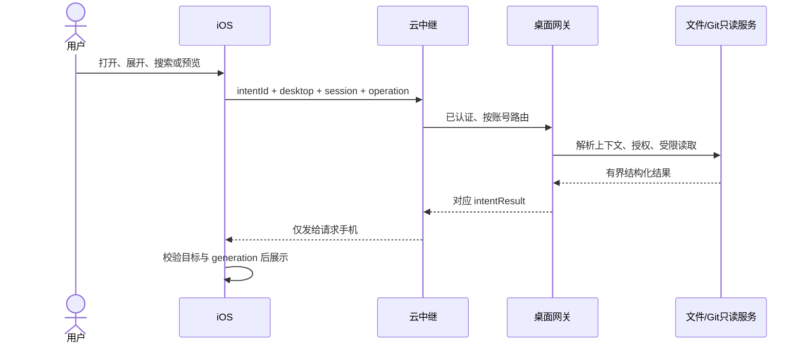

# iOS 工作区文件与文件变化：截图分析及产品设计

日期：2026-10-03

状态：原始截图分析与设计依据，未实施。正式功能、协议、预算与验收条件以 [V1 spec](2026-10-03-mobile-workspace-files-and-changes-spec.md) 为准；实施顺序见[开发计划](../plans/2026-10-03-mobile-workspace-files-and-changes-plan.md)。本文保留设计推导，不再作为独立实现契约。

范围：在现有手机终端内浏览桌面工作区、阅读 Git 差异、插入文件或目录引用。

## 1. 结论与范围

采用一个「工作区文件」面板，包含「已修改 / 所有文件」两个视图。用户在手机发起请求，桌面解析会话与目录、读取文件或运行 Git，服务端点对点中转，手机等待结果并展示。

现有 SY iOS 的「创建对话」启动的是桌面 Claude Code **终端会话**，详情仍是终端画布。它没有 Codex 截图中的原生聊天消息时间线。因此首期完整实现工作区文件浏览与 Git 文件审查；截图里回复后的「本轮文件变化卡片」列为后续原生 Agent 会话设计，不能从终端文字推测轮次或冒充已具备能力。

本提案明确接续旧 `2026-09-21-mobile-terminal-git-design.md` 的阶段范围：其 §3 决策六、§6 非目标、§7 已定口径第 6 项及验收第 40 项禁止下发文件清单和 diff。本次用户明确要求设计这些功能，新的按需只读范围拟取代这四处限制。现有全量提交、默认不推送、不提供文件级暂存、不解决合并冲突、Git 不登记仓库等边界继续保留。本文不修改运行代码；实施时同步修订旧规格与现行规则。

## 2. 六张截图能说明什么

| 截图 | 可见功能与交互 | 对设计的启发 |
| --- | --- | --- |
| 1 | 对话回复后的摘要显示 14 个文件、+600 / −28，前三个文件及「查看另外 11 个文件」；下方另有「文件」面板，选中所有文件，deploy 在原位展开 | 变更摘要是入口，完整内容进入辅助面板；目录按层浏览 |
| 2 | 面板选中已修改；标题为「未暂存」、+10349 / −435；CONTEXT.md 有单文件计数，第 58–94 行有片段计数，下面是等宽代码与增删行 | 总量、文件、差异片段是三个层级；代码采用单列 unified diff |
| 3 | 面板接近全高；多个文件只显示标题、目录副标题和计数，存在同名 README.md；底部有无内联文本提示 | 可以先浏览文件概要，再展开代码；目录副标题用于区分同名文件 |
| 4 | 同一个大面板内展开 CONTEXT.md，显示旧内容删除、新内容增加与未变更上下文 | 展开内容不必再盖一张弹窗；手机竖屏适合单列阅读 |
| 5 | deploy/caddy 的上下文菜单处于展开状态，通常通过长按唤起；行被突出显示，出现「在聊天中插入链接」；下方保留文件列表和搜索 | 文件夹也可作为上下文引用；浏览与插入输入是关联但不同的动作 |
| 6 | 所有文件视图显示根目录列表，文件夹可展开，底部有搜索文件 | 文件浏览范围包括工作区目录；搜索与目录导航在同一面板 |

必须保留的判断限制：

- 回复摘要的 **14 / +600 / −28** 与面板的 **未暂存 / +10349 / −435** 不同。可推断两者有不同统计范围，但截图不能证明前者的精确基线或是否为不可变快照。SY 必须显式区分「本轮」与「当前 Git 状态」。
- 「未暂存」后的下拉箭头表明存在范围选择；其他选项并未出现。本文后续建议的「已暂存」是 SY 产品选择。
- 方框箭头是一个独立文件操作，截图不能证明它打开预览、编辑器、分享或桌面应用。
- 无内联文本提示不能被直接解释为二进制、大文件或错误。SY 应由桌面返回具体原因。
- 截图无法证明 Codex 使用 SwiftUI、UIKit、哪种 diff 算法、是否预加载文件、如何远程传输。以下技术映射是实现 SY 的可选方式。

## 3. Swift UI 模式映射与官方依据

Swift 是语言，SwiftUI / UIKit 才是界面框架。两种框架都能实现截图中的形态；SY 已使用 SwiftUI，可以沿用它。

| 形态 | SY 可采用的模式 | Apple 依据 |
| --- | --- | --- |
| 可拖动、关闭、调高度的面板 | `.sheet`、`presentationDetents([.medium, .large], selection:)`、`presentationDragIndicator(.visible)`；扩大按钮改变 detent | [Sheets](https://developer.apple.com/design/human-interface-guidelines/sheets)、[presentationDetents](https://developer.apple.com/documentation/swiftui/view/presentationdetents(_:selection:))：适用于与当前上下文相关的有限任务，可提供高度档位与抓手 |
| 已修改 / 所有文件 | `Picker` 配 `.segmented` | [Segmented controls](https://developer.apple.com/design/human-interface-guidelines/segmented-controls)：切换紧密相关的视图 |
| 文件夹、文件与差异展开 | `List` + 明确展开状态，适当使用 `DisclosureGroup`；远程树在展开时获取下一层 | [Lists and tables](https://developer.apple.com/design/human-interface-guidelines/lists-and-tables)、[DisclosureGroup](https://developer.apple.com/documentation/swiftui/disclosuregroup) |
| 长按引用 | `.contextMenu`，详情提供同一操作 | [Context menus](https://developer.apple.com/design/human-interface-guidelines/context-menus)：内容相关动作也应有可发现入口 |
| 搜索 | `.searchable`，用户提交搜索、取消旧请求 | [Search fields](https://developer.apple.com/design/human-interface-guidelines/search-fields)、[Performing a search operation](https://developer.apple.com/documentation/swiftui/performing-a-search-operation) |
| iPad 列表与详情 | 同一系统面板内 `NavigationSplitView`；窄窗口折叠为导航栈 | [Split views](https://developer.apple.com/design/human-interface-guidelines/split-views)、[NavigationSplitView](https://developer.apple.com/documentation/swiftui/navigationsplitview) |
| unified diff | 结构化行模型 + 等宽 `Text` + 有界懒渲染；没有 SwiftUI 内置 Git diff 控件 | [LazyVStack](https://developer.apple.com/documentation/swiftui/lazyvstack)、[Typography](https://developer.apple.com/design/human-interface-guidelines/typography) |

UIKit 对应组件是 `UISheetPresentationController`、`UISegmentedControl`、`UITableView/UICollectionView`、`UIContextMenuInteraction`、`UISearchController`；需要大量文本复用时可使用 UIKit 渲染内容、SwiftUI 负责导航。首期先使用有界 SwiftUI 行模型，不为视觉引入依赖。

工程最低 iOS 18，支持 iPhone 与 iPad。上述基础控件可用；[`presentationSizing`](https://developer.apple.com/documentation/swiftui/view/presentationsizing(_:)) 最低 iOS 18，[`glassEffect`](https://developer.apple.com/documentation/swiftui/view/glasseffect(_:in:)) 最低 iOS 26。磨砂外观不能证明用了 Liquid Glass，系统版本外观交给系统控件，不在 iOS 18 自行仿造。

## 4. 已核实的 SY 现状

完整路径相对仓库根目录；证据中的 iOS `App/`、`Features/`、`Core/` 缩写相对 `SynapseMobile/SynapseMobile/`，桌面 `git-client/` 缩写相对 `desktop/electron/services/`。行号是本次审查位置，后续修改可能移动。

| 现有实现 | 证据 | 复用或缺口 |
| --- | --- | --- |
| iOS 会话详情统一进终端 | `SynapseMobile/SynapseMobile/Features/Root/RootView.swift:296`；`App/SynapseAppModel.swift:2169` | 可直接为现有 Claude Code 终端提供文件功能；没有原生对话 turn/checkpoint 标识 |
| 更多菜单、手机上传文件 | `Features/Terminal/TerminalScreen.swift:1185,1739` | 更多菜单可加浏览入口；「＋ → 文件」已经表示从手机上传，不能混用 |
| Git 面板与改动数量 | `Features/Terminal/Git/TerminalGitPanel.swift:120`；`Core/Protocol/LiveProtocol.swift:69` | 当前只有状态摘要，改动行可接新入口；没有文件清单与 diff |
| 输入草稿及大输入面板 | `Features/Terminal/TerminalScreen.swift:20,816` | 引用应追加同一草稿，不新增第二个输入区 |
| 会话资源 inspector | `Features/Terminal/TerminalScreen.swift:819`；`TerminalResourcesSheet.swift:57` | 是从终端输出提取的 URL，并非工作区文件；可借鉴自适应状态组织 |
| 唯一请求漏斗 | `App/SynapseAppModel.swift:2403,2427` | 复用 intent 发送与待答机制，但需补取消、文件预算和上下文校验 |
| 网络主线程边界 | `Core/Realtime/RealtimeClient.swift:95`；`Core/Protocol/LiveProtocol.swift:138` | 客户端为 MainActor；不能在这里同步解析整份大 diff |
| 桌面文件树 | `desktop/electron/services/workspace-file-tree-service.ts:74,128,179` | 已有路径、列目录、scope 语义；只面向 Electron owner，自动 watcher、无远端分页，不能直接转发 |
| 终端实时目录 | `desktop/app-capabilities/terminal/main/workspace-tree-ipc.ts:37` | 用 `probeCurrentWorkingDirectory(sessionId)`，手机不能靠摘要 cwd 猜根 |
| Git 状态与 diff | `desktop/electron/services/terminal-git/terminal-git-status.ts:76`；`git-client/git-status-service.ts:248` | 按路径复用命令执行器与解析器；移动 terminal Git 缺分层 diff 接口，不登记代码仓库 |
| 移动权限 | `desktop/electron/services/mobile-gateway/controller.ts:5,41` | actor 为 `agent:mobile-gateway`；现有 allowlist 没有工作区文件读取授权 |
| 本轮文件检查点 | `desktop/electron/services/agent-runtime/agent-file-checkpoint-service.ts:163` | 已有桌面 SDK Agent 私有能力；不属于手机启动的 Claude Code 终端 |

当前 `mobile.intent` → 云 relay → 桌面 gateway → `mobile.intentResult` 链路已经存在。服务端只中继，手机不直连桌面 loopback API；本功能不借云盘上传或 COS 存储源码。

## 5. 入口与页面组织

### 5.1 三个入口，共用一个面板

| 入口 | 打开结果 | 用途 |
| --- | --- | --- |
| 终端详情「⋯ → 工作区文件」 | 当前目录 scope，默认所有文件 | 浏览正在操作的目录，Git 与非 Git 都可用 |
| Git 面板的「改动」行 | 仓库 scope，默认已修改 | 审查现有仓库级改动数对应的文件；操作/辅助标签明确为「查看仓库更改」 |
| 输入栏「＋ → 工作区文件」 | 当前目录 scope，所有文件，允许选择引用 | 向现有输入草稿添加桌面文件或目录 |

现有「＋ → 文件」保持手机文件选择与上传语义。底部主页/终端/我的不新增栏目；文件属于当前电脑、当前终端的上下文。

顶栏第二行继续只读，不把已有分支状态突然改成入口。电脑离线时入口可说明连接状态，不能排队执行目录读取。

Git 面板跳到文件面板时先关闭前者，再由终端的统一 presentation route 打开后者，记住来源以支持返回 Git；不得 sheet 叠 sheet。文件预览在文件面板内部导航或展开。

### 5.2 面板结构

```text
关闭                 工作区文件                  刷新
范围：当前目录 · service     或     范围：仓库 · Synapse

              已修改 | 所有文件

已修改：范围菜单 → 文件概要 → 展开的差异片段
所有文件：目录展开 / 搜索结果 → 文件预览
```

范围行用于说明实际读取边界，不放功能介绍。普通浏览以目录和文件名为主；同名文件增加相对父目录；数字右对齐。界面使用系统列表与现有 Theme，不复制截图里的圆角卡片背景，不叠卡片、阴影和边框。

iPhone 常规竖屏浏览概要可从 medium 开始；展开代码、文件预览和搜索进入 large，用户可拖动或用扩大/收起按钮切档。垂直紧凑环境（如横屏）的 medium 不可用，遵循系统呈现自适应，只有多个有效档位时显示切档按钮。截图不能证明实际采用 `.sheet` 还是 `.fullScreenCover`。[medium](https://developer.apple.com/documentation/swiftui/presentationdetent/medium)、[presentationCompactAdaptation](https://developer.apple.com/documentation/swiftui/view/presentationcompactadaptation(_:))

iPad 使用系统 page/form sheet 的自适应呈现；内容空间足够时面板内部显示列表＋详情，窄窗口折叠导航。按实际窗口空间决定，不按设备型号强制两栏。面板覆盖在终端上，保留底层终端画布几何，浏览文件不产生新的 attach、写租约或 resize。

依据：[Sheets](https://developer.apple.com/design/human-interface-guidelines/sheets)、[Layout](https://developer.apple.com/design/human-interface-guidelines/layout)。面板缩放、旋转或切 tab 保留目录展开、选择项和输入草稿；不创建第二个 `SynapseAppModel`。

## 6. 文件变化设计

### 6.1 范围及正确基线

「已修改」表示当前 scope 内可审查的 Git 状态，不表示本轮 Agent 修改。顶部菜单首期提供两种精确范围：

| 范围 | 比较基线 | 文件集合 |
| --- | --- | --- |
| 未暂存 | index → working tree | 有工作区变化的跟踪文件，以及单独标记的新文件；新文件用空内容作基线 |
| 已暂存 | HEAD → index | 暂存区变化；未有 HEAD 的仓库以空树为基线 |

两种范围分别统计，不把同一路径两层变化合并为一份难以解释的 diff。默认未暂存；如果仅已暂存有变化，桌面返回两个范围的摘要，首次打开选择已暂存，并在标题明确显示。用户切过范围后尊重选择。Git 原有 changeCount 是两层变化的去重文件数，不能直接作为当前范围列表或当前目录子树的数量。

每个文件概要含显示路径、类型（新增/修改/删除/重命名/冲突）、所选范围的增删数及可预览状态。rename 显示旧路径 → 新路径；deleted 文件从对应 Git 基线读取，不能因磁盘上不存在而报普通文件不存在。

rename 的两端都在 scope 内时才显示完整旧新路径及比较；仅一端在 scope 内时，按范围内新增或删除展示，不透露范围外路径、不读取另一端 blob。所有路径匹配按分段与真实边界校验，不能用字符串前缀判断子目录。

无 HEAD、staged-only 文件、同一路径同时有 staged/worktree 改动、删除、重命名、gitlink/submodule、二进制、类型替换和冲突都要有明确行为。gitlink 只显示引用变化；浏览子模块目录时重新建立它自己的目录或仓库 scope。冲突首期只读说明，不提供解决或继续合并。

### 6.2 展开与 diff 阅读

首次只拉文件概要；用户展开某个文件后再请求该范围的 hunks。手机窄屏使用 unified diff，展示旧/新行号、`+ / −`、上下文行及片段范围。默认只展开正在查看的一个文件，可收起并保持列表位置；读取全文是独立操作。

文件统计来自完整可计算比较，hunk 统计只属于当前片段。正文分页、截断或统计未计算不能伪装为完整总量，也不能显示未知为 0。新增未跟踪文件的精确行数允许按需补算；不得为了第一屏总量读取所有新文件正文。

正文等宽并支持 Dynamic Type，默认换行；换行后的视觉行共享原始代码行号。可切换不换行并水平滚动。插入/删除正文使用可读语义文字色，增删标记通过 Theme 集中映射系统语义色；同时保留符号和 VoiceOver 语义，不只靠红绿。

SwiftUI 按有界行模型渲染；大 patch 解析在后台。若验收证明 List 性能不足，再采用 UIKit 虚拟化内容视图，不能直接把终端 ANSI 网格当 diff 控件。

### 6.3 失败与特殊状态

加载、未计算统计、没有改动、非 Git、权限拒绝、文件变化、差异过大、二进制、不可识别编码、版本不支持分别返回状态。文案在对应内容区出现，例如「二进制文件，无法显示文本差异」「内容已变化，请刷新」。理由由桌面决定；手机不能把所有失败翻译成同一条虚构原因。

## 7. 所有文件与插入引用

### 7.1 浏览、搜索与预览

- 打开只请求根目录一层；展开目录再读取下一层。保留现有排除规则（如 `.git` 管理目录）；`node_modules` 等目录可见但保持折叠，不自动递归加载。
- 搜索只按文件名/相对路径，不搜索正文。范围是本次冻结 scope 根的所有层级，与树上展开了哪个目录无关，绝不扩大到祖先仓库。用户在系统搜索框输入后按「搜索」提交，桌面执行有界遍历并返回分页结果；编辑查询时取消旧搜索。这样能够寻找嵌套文件，同时不会每输入一个字就扫描巨型仓库。
- 跨层搜索不跟随 symlink；已扫描结果、未完成与已完成要可区分。达到时间/节点预算时返回继续游标或明确截断，不把有限扫描的无命中说成「没有这个文件」。
- 轻点普通文件打开只读预览，文件夹展开；搜索结果展示相对路径，并能定位回目录。首期支持 UTF-8 文本和有界 Markdown，其他类型显示文件元数据与不支持预览状态。
- 原文代码与 diff 使用独立视图模型；Markdown 复用已有 `MarkdownContent`，源码不加载为网页、不执行 HTML/脚本，不为文本预览启动 WebView 或桌面程序。
- symlink 可显示但首期不跟随、不作为引用目标；FIFO、设备节点、socket、Windows 重解析点等特殊对象不可读取。文件名可显示，不意味着一定可插入输入。

目录优先、名称排序；分页在桌面受控枚举后产生游标，单目录超限返回明确状态。手机不能一次下载整棵树再靠 `DisclosureGroup` 伪装按需。

### 7.2 插入到输入框

截图说「在聊天中插入链接」，SY 首期采用符合现有终端能力的「插入到输入框」：插入的是桌面路径引用，不是公网 URL，不是上传副本，也不代表 Agent 已读取文件。

文件/目录长按菜单提供此动作，文件详情工具栏及当前目录操作也提供可发现入口。用户选择后：

1. 手机发送引用准备请求，指定 scope 与桌面发给它的 entry 标识。
2. 桌面重新验证归属、实际目标与权限，用当前平台的路径引用 formatter 生成文本；不让手机自行拼绝对路径或 shell 转义。
3. 手机核对账号、电脑、会话与草稿 generation，在原草稿当前插入位置添加引用，保留已有内容，关闭面板，显示文字输入模式；不改用户持久语音偏好。
4. **不调用 PTY paste/input/key，不发送回车，不自动执行，不自动发送，也不自动弹键盘。** 用户照既有输入栏完成后续操作。

首期引用使用桌面生成的绝对目标路径，避免插入后 `cd` 使相对引用指向别处；它是用户明确选择后在草稿中可见的文本，不下发整机路径目录。退出账号、切电脑或切会话时不得把文件引用带到另一目标。

formatting 复用并抽离桌面拖入路径的纯 helper，主进程不导入 renderer。处理空格、引号、`$`、反引号及 shell 特殊字符；拒绝 NUL、CR/LF 和控制字符。不能把 POSIX 转义宣称为 PowerShell/CMD 安全；现有 formatter 无法可靠支持的平台返回明确 unsupported，不猜。

引用请求失败或草稿在等待中发生变化时，不覆盖草稿；让用户重新选择插入。实际输入仍遵守原终端输入权限和租约，不因引用准备成功取得额外执行权限。

## 8. 请求、身份及权限

### 8.1 完整链路



目录打开、范围切换、分页、刷新、预览与引用准备都从 iOS 用户操作发起。面板不存在时不抓取；回到前台不自动重新扫仓库。不增加持续订阅、仓库 watcher 或主动源码推送。

### 8.2 scope 的根必须一致

普通入口建立 `currentDirectory` scope：桌面按不可变 sessionId 探测当次真实 cwd。已修改与所有文件均限制到它的后代，cwd 是仓库子目录时只统计子树变化。

Git 入口建立 `repository` scope：桌面解析当前 session 实际 worktree top-level，显示「范围：仓库」，为这个精确根另行授权。它不调用 `add_local`，不写 repositories 注册表。Git 返回根和 cwd 不同是合法情形，不能用项目名或主仓库目录替代 worktree。

打开时冻结根，之后 `cd` 不静默把列表换成别的目录。刷新、切范围或引用准备都重查会话上下文；发现 cwd/root 已变时将旧结果标为过期，让用户重新打开。分支/index/文件变化使对应读取版本失效，不把旧 hunks 接到新文件上。

scope owner 必须包含认证账号、desktop 实例、mobile 实例与 session，不用 Electron sender.id，也不接受客户端提供的任意根路径。服务端提供可信用户/连接身份，不能信任 payload 自称的用户。

### 8.3 只读授权与路径校验

保持 `agent:mobile-gateway` actor。新增精确 scope 资源的只读策略；不能把 `fs.read.outside-userdata` 无条件加入现有 allowlist，更不能复用 `user:renderer` 落入 user 自动允许策略。目录列表、Git 派生内容、源码读取和引用准备均经 PermissionGuard 与 AuditSink。

每次请求校验 scope ownership、有效期、session 存活、相对路径词法边界与实际路径边界；禁止路径穿越和跨根 symlink，检查叶节点与祖先身份。Git blob 的 ref/path 由桌面限定到所选 HEAD/index，不接受任意 revision、表达式、命令或绝对路径。特殊对象、设备命名空间、ADS/重解析逃逸拒绝。UNC 如沿用现有框架，需要先做既有网络授权与硬超时，不能绕过。

Git 执行使用受控 argv、终止超时与输出预算，关闭外部 diff/textconv，不写工作区/index、不运行用户 hook、不触碰 PTY。只读命令使用 `--no-optional-locks`、`--literal-pathspecs`，关闭 `core.fsmonitor`，diff 明确指定 `--no-ext-diff --no-textconv`；缺少本地对象时禁止隐式 lazy-fetch，返回不可读取状态。现有高层 `getDiff` 会使用临时 index 投影并涉及对象写入/filter，不能直接接入这条远端只读通道；只复用它的命令 runner、路径校验与解析 helper，不调用高层投影。[Git status](https://git-scm.com/docs/git-status)、[Git options](https://git-scm.com/docs/git/2.45.0)、[Git diff](https://git-scm.com/docs/git-diff)

关闭外部 diff/textconv 不会自动关闭工作树比较可能触发的 clean/process filter。首期先检查属性与配置，对需要执行外部 filter 的工作树文件仅显示摘要，返回不支持差异的具体状态。已暂存的 blob 比较只读受控本地对象，先验证类型/大小，不使用 `cat-file --filters/--textconv/--follow-symlinks`。无 HEAD 使用不指定 commit 的 cached diff 空基线语义，不写树对象、不硬编码 SHA-1 空树 OID；较旧 Git 缺必要隔离能力时拒绝该操作，不降级执行扩展或联网。[Git attributes](https://git-scm.com/docs/gitattributes)、[Git cat-file](https://git-scm.com/docs/git-cat-file.html)

跨进程校验不是原子事务：读取前后比对身份和版本，变化时返回 stale，而不是承诺能消除所有竞态。

新文件请求/响应中的源码、patch 和完整路径不进入普通日志、移动诊断正文或遥测；用户后续主动发送的输入仍遵循既有诊断开关与脱敏规则，不新增捕获通道。审计遵循既有资源身份规范记录授权与结果，不记录文件正文。云端只瞬时转发，不进入 summary 缓存、数据库、COS 或广播。

## 9. 拟新增的窄协议

以下是语义草案，实施时接入现有 `MobileIntent` 与统一结果校验，不作为公共 MCP 工具注册。

| 请求 | 输入语义 | 桌面响应 |
| --- | --- | --- |
| open | sessionId、scopeMode | scopeId、根显示名、上下文版本、Git 可用性 |
| directory | scopeId、目录 entry、cursor | entries、nextCursor、目录版本、是否完整 |
| search | scopeId、query、cursor；始终限制为该 scope 子树 | 路径命中、nextCursor、搜索完成/截断状态 |
| changes | scopeId、unstaged/staged、cursor | 当前范围概要、文件列表、版本、计数完整性 |
| diff | scopeId、changeId、范围版本、cursor | file/hunk/line 结构、旧新行号、下一页、不可内联原因 |
| preview | scopeId、diskEntryId 或 changeId+before/after、内容版本、cursor | 类型、文本页或元数据、下一页 |
| reference | scopeId、entryId | 引用文本、目标上下文版本 |
| close/cancel | scopeId/原请求标识 | 释放临时资源/终止读取；是否完成取消如实返回 |

既有 `intentId` 用作往返关联，不再另造第二个等价 requestId。所有结果带请求上下文与操作种类；手机再检查本地 scope generation。未知操作、版本或超预算的结果不能被当作空列表。

preview 的磁盘 entry 与 change 版本两种目标互斥。change 的 before/after 由桌面根据 staged/unstaged 范围绑定到 HEAD/index/disk 与已校验对象，手机不传 revision、OID 或 Git 表达式；因此删除文件仍可读 before，已暂存文件可读 index，不误开成当前磁盘内容。

scope、entry、change 和游标都是绑定 owner 的短期句柄，不是权限凭据。scope 关闭、账号/电脑/会话切换、已确认 session 结束和桌面重启时失效；连接丢失不被误判为 session 结束。桌面另设有界 TTL 回收，即使 close 请求丢失也能释放。

现有 `MobileIntentExecutor` 会在执行前命中结果缓存，全网关最多 256 条；新文件正文不能原样进入这一按条数限制的缓存。只读内容采用独立的字节/TTL 预算，或不缓存正文；返回缓存页之前仍校验 owner、scope 与版本，close/失效时清理对应结果。幂等处理不得让过期源码绕过授权重放。

首期所有有界文件结果走 intentResult；不塞进 `mobile.summary`、`mobile.frame` 或 `mobile.gitStatus`，后者继续只管已有状态。新 schema 在 TS 与 Swift 同步维护，服务端校验及 WS/HTTP fallback 均覆盖。不能用 HTTP fallback 绕开旧服务端不识别操作的问题。

老服务端可能拒绝未知 kind 并关闭连接，老桌面可能不给回答。新增可选协议能力版本用于手机显示「需要更新电脑端」；服务端仍先部署，再桌面，最后 iOS。不能只增加 Swift enum 就发上线。

## 10. 性能与状态组织

### 10.1 初始预算（新方案建议值，需实测调整）

| 项目 | 建议预算与行为 |
| --- | --- |
| 目录/变更/搜索一页 | 最多 100 项、显示载荷 64 KiB；同时限制最终序列化信封 128 KiB，超限减少项数 |
| 文本/diff 一页 | UTF-8 显示载荷最多 64 KiB；按完整行/结构边界分页，最终信封仍受 128 KiB 限制 |
| 单次内联文件 | 首期最多预览 2 MiB；超出显示摘要与明确截断状态，不读取全部字节再裁剪 |
| 单行 | 最多展示 8 KiB；标明长行截断，避免一个 minified 行拖垮布局 |
| 搜索 | 用户提交后请求，编辑查询取消旧任务；一次桌面遍历最多约 2 秒/20,000 个条目，有游标续查或明确截断 |
| 并发 | 每手机最多 2 个读取；主动预览优先，搜索变化取消旧搜索；用户连续点击合并重复请求 |
| iOS 临时缓存 | 每当前电脑最多 4 MiB LRU；仅内存，不持久化源码，不进入 iCloud 备份 |
| 桌面 scope | 空闲约 10 分钟回收；目录候选、Git 输出、游标与执行队列另有总量上限 |

当前 desktop → server 的 WS 入站上限是 256 KiB（`server/src/live/live-desktop.gateway.ts:165,373`）；phone → server 则为 2 MiB（`server/src/mobile-live/mobile-live.types.ts:53`），不能用后者估算源码回包。拟定 128 KiB 信封低于桌面链路上限，仍需最终边界测试。上限按**序列化后的 UTF-8 字节**再次检查；JSON 转义和多字节字符不能让 64 KiB 原文变成超限消息。源码页与终端帧不共用「允许丢帧」语义。

desktop live socket 有 512 KiB 发送缓冲边界，现有慢链路可丢消息；server → phone 当前也缺少发送背压检查。新文件响应需要覆盖两跳：发送前将 `bufferedAmount + 最终消息字节数` 一并计入预算，连接与待发队列有界。文件页在容量不足时返回可重试状态或由待答超时明确结束；不能静默漏一页后继续接后面的内容。共享传输需要优先保证终端交互，内容请求排队有界，不靠提高 socket 上限解决。

分页只控制传输还不够：目录枚举、排序、Git stdout 收集、未跟踪文件计数、diff 解析都要有后台预算。现有目录 `readdir` 全量返回与打开即 watcher 的实现只复用路径规则，远端适配不能原样使用。大目录使用受控枚举、候选上限与稳定游标；超限明确提示缩小范围。现有未跟踪文件完整读入数行的逻辑不能进入常驻摘要。

### 10.2 状态与文件组织

实施时建议在既有 `Features/Terminal/` 内增加 Files 子目录，按职责拆分：面板呈现、目录/搜索列表、变更列表、diff/文本内容、独立 FilesFlow/Store 与纯展示模型。名称为建议，不预设这些文件已经存在。

`TerminalScreen` 只持有 presentation route、草稿插入回调；`SynapseAppModel` 继续提供身份、设备选择与统一 intent 漏斗。FilesFlow 管 pending、加载/失败/过期与导航；后台 actor 处理有界解析与缓存。桌面新增 mobile 专用只读适配器，通过 ServiceRegistry 注入现有目录/Git helper，不复制权限判断到每个 handler，不让 runtime 导入业务服务。

每个请求都绑定账号、desktop、session、scope、generation；同一文件再点复用 pending/cache，范围切换只保留匹配版本的缓存。关闭面板取消待答/后台任务并释放 scope，迟到结果不改变界面、草稿或剪贴板。

只读缓存返回时标记读取时间与是否过期；断线保留已经看到的旧快照，并在原位置显示连接状态，禁止新读取和引用准备。重连后由用户刷新，不自动换电脑、不自动重放操作。明确结束/删除会话、切目标或退出则清除对应状态。

文件读取错误在文件面板就地显示，插入失败在对应操作位置显示；无归属的短确认复用 NoticeBar，文件面板挂自己的 notice overlay。不得新开第三条通知通道，也不得遮挡返回、关闭或输入控件。

## 11. 本轮卡片与后续扩展

未来若将桌面原生 Agent 对话开放给手机，需要另行设计 conversation/turn 的读取与状态协议。届时可复用桌面 checkpoint 的本轮摘要，回复下显示前三个文件及剩余文件入口，点击进入同一文件审查内容。

checkpoint 与 Git 变化使用不同 source 标识、基线和缓存键。SDK checkpoint 只覆盖既有受支持 Write/Edit 等文件操作，不覆盖 Bash、MCP、普通 subagent 或任意终端程序；不能把 Git 工作区变化标为「本轮」或「可撤销」。不导出 transcriptPath/pid/SDK 内部会话 id，不新增后台 transcript 扫描。

首期不增加远程 rewind、文件修改/删除、暂存、历史提交/分支比较、冲突解决、全仓库正文搜索或仓库镜像。文件审查本身不授予以上操作。

## 12. 验收与实施顺序

1. **先做窄读取协议与权限**：scope 归属、当前目录/仓库边界、路径与特殊文件拒绝、有界目录/文本读取、取消、背压和服务端转发测试。
2. **接所有文件**：三个入口的路由、目录展开、搜索、预览、引用准备与草稿插入；验证没有自动输入 PTY。
3. **接 Git 审查**：分层状态与 diff、HEAD 不存在、未跟踪/删除/重命名/冲突、统计完整性、hunk 展开与分页。
4. **完成跨端验收与规则同步**：服务端 → 桌面 → iOS；旧客户端正常使用已有终端，未知新操作有明确升级状态。

最低验收场景：

- cwd 在仓库子目录、普通目录、实际 worktree、子模块；两个 tab 始终同根，Git 入口明确仓库范围。
- 已暂存、未暂存及同一路径两层修改；删除从正确基线读，未跟踪单列，计数不混范围。
- 千级/万级目录、依赖目录、大文件、长行、中文/空格/引号路径；输出与内存预算有效，终端输入不中断。
- 跨账号/电脑/session/scope 请求、伪造句柄、路径穿越、symlink 与祖先替换、Windows 路径逃逸全部拒绝。
- 用户快速切 tab、切目录、切电脑、关闭面板、断网重连、桌面重启；迟到结果不污染当前内容和草稿。
- 引用插入保留原草稿，文件夹可引用；没有 input/key/回车副作用，切电脑不误投路径。
- iPhone 竖横屏、iPad 宽/半窗/窄窗和实际缩放；系统 18/26、深浅色、最大 Dynamic Type、VoiceOver、键盘/指针、减弱动态效果。
- VoiceOver 可读出文件状态、增删行、旧/新行号与展开状态；颜色不是唯一信息。焦点在加载和展开后稳定。[Accessibility](https://developer.apple.com/design/human-interface-guidelines/accessibility)、[VoiceOver](https://developer.apple.com/design/human-interface-guidelines/voiceover)

代码实施时按风险运行 shared/server/desktop 专项测试、desktop typecheck 与 hard constraints、Swift 单元测试及必要真机/模拟器验收；未获用户明确要求不主动启动应用。上线前更新 `RELEASE_NOTES_PENDING.md`、`docs/agents/mobile-runtime-contracts.md`、相关旧 Git 规格与 `docs/agents/capability-registry.md` 的移动私有例外说明。MCP 工具/schema、系统 Skill 与 Agent 指南需要核对，但本方案不新增公开 MCP、System App、Workflow 或 Deep Link，不虚增其数量。

本次仅设计文档，无运行时变化，不新增待发布说明。
