# CC Connect 如何连接本地 CLI

源码基准：`/Users/liyang/Documents/code/demo/cc-connect-main`

本文只说明 CC Connect 与用户本机命令行 Agent 的交互方案，重点覆盖 Codex、Claude Code，以及可复用到其他 CLI Agent 的通用设计。读完本文后，应能基于同样思路实现另一套“聊天平台/远程入口 -> 本地 CLI Agent -> 回传结果”的系统。

## 1. 结论

CC Connect 的核心不是“直接调用某一个 CLI”，而是把系统拆成三层：

1. 平台层：把飞书、企业微信、Telegram、Web Bridge 等入口收到的消息统一转成 `core.Message`。
2. 引擎层：`core.Engine` 负责会话绑定、忙碌队列、权限确认、附件处理、状态持久化和回传。
3. Agent 层：每个本地 CLI 适配成统一的 `core.Agent` / `core.AgentSession`，通过本机进程的 stdin/stdout、命令行参数、JSON Lines 或 JSON-RPC 与 CLI 交互。

最终链路是：

```mermaid
flowchart LR
  User["用户/聊天平台"] --> Platform["Platform.Start(handler)"]
  Platform --> Message["core.Message"]
  Message --> Engine["core.Engine.handleMessage"]
  Engine --> State["interactiveState + SessionManager"]
  State --> Agent["core.Agent.StartSession"]
  Agent --> Session["core.AgentSession"]
  Session --> CLI["本机 CLI 进程"]
  CLI --> Events["stdout JSON / JSON-RPC -> core.Event"]
  Events --> EngineLoop["Engine.processInteractiveEvents"]
  EngineLoop --> PlatformSend["Platform.Send / Reply"]
  PlatformSend --> User
```



其中“发送消息给 Codex / Claude Code”的本质是：

- Codex exec 后端：每轮启动一次 `codex exec ... --json -`，把用户 prompt 写入 stdin，从 stdout 逐行读取 JSON 事件。
- Codex app-server 后端：启动长期 `codex app-server` 进程，通过 stdin/stdout 传 JSON-RPC，发送 `turn/start`，接收 `turn/*` 通知。
- Claude Code：启动长期 `claude` 进程，参数包含 `--input-format stream-json`、`--output-format stream-json`、`--permission-prompt-tool stdio`，每次把 `{"type":"user",...}` 写入 stdin，从 stdout 读取 stream-json。

## 2. 产品设计

### 2.1 用户模型

CC Connect 解决的是“用户不在本机终端里，也能驱动本机 AI CLI”的问题。它让用户从聊天平台或 Web Bridge 发送消息，然后由用户本机的 CC Connect 进程调用本机已经安装、已经登录或已经配置好的 CLI Agent。

产品上它保留了几个关键体验：

- 一个项目绑定一个默认 Agent，例如 `codex` 或 `claudecode`。
- 一个项目可绑定多个平台入口。
- 每个聊天会话映射到一个本地 Agent 会话，保证多轮上下文可恢复。
- 本地 CLI 需要权限确认时，把权限请求转成平台消息或按钮，让用户远程批准/拒绝。
- CLI 生成图片、文件或需要主动发送附件时，可通过本机 `cc-connect send` 走内部 API 回到当前平台会话。
- CLI 运行在用户本机，所以本机文件、Git、依赖、凭据仍按 CLI 自己的机制工作。

### 2.2 产品边界

CC Connect 没有重新实现 Codex 或 Claude Code 的能力，也不接管模型推理。它只做连接器：

- 输入侧：把平台消息、图片、文件、语音转为统一消息。
- 调度侧：决定要投递给哪个 Agent 会话、是否排队、是否恢复上下文。
- 执行侧：启动或复用本机 CLI 进程。
- 输出侧：把 CLI 流式事件、工具调用、最终结果、错误、权限请求转回平台。

这个边界很重要。要复刻另一套系统，不需要重新设计模型协议，只需要实现“平台消息标准化”和“CLI Agent 适配器标准化”。

## 3. 架构设计

### 3.1 核心接口

核心接口都在 `core/interfaces.go`。

#### Platform

位置：`core/interfaces.go:8-15`

```go
type Platform interface {
    Name() string
    Start(handler MessageHandler) error
    Reply(ctx context.Context, replyCtx any, content string) error
    Send(ctx context.Context, replyCtx any, content string) error
    Stop() error
}
```

职责：

- `Start(handler)`：平台适配器启动后，一旦收到用户消息，就调用传入的 `handler`。
- `Reply` / `Send`：把 Engine 产生的文本回传到原平台。
- `replyCtx` 是平台私有的回复上下文，例如聊天 ID、消息 ID、线程 ID。Engine 不理解其结构，只透传。

#### Message

位置：`core/message.go:139-157`

关键字段：

- `SessionKey`：平台侧会话键，是 CC Connect 绑定本地 Agent 会话的主键。
- `Platform`：来源平台名称。
- `MessageID`、`UserID`、`UserName`、`ChatName`：消息元数据。
- `Content`：用户文本。
- `Images`、`Files`、`Audio`、`Location`：附件与其他输入。
- `ExtraContent`：由平台或预处理逻辑拼接的补充上下文。
- `ChannelKey`：群、频道或平台通道标识。
- `ReplyCtx`：回传时需要的平台上下文。
- `ModeOverride`：临时覆盖 Agent 模式。

这个结构是平台到 Engine 的唯一标准输入。复刻系统时应先定义类似的规范，不要让 Agent 适配器直接依赖某个平台字段。

#### Agent / AgentSession

位置：`core/interfaces.go:228-256`

```go
type Agent interface {
    Name() string
    StartSession(ctx context.Context, sessionID string) (AgentSession, error)
}

type AgentSession interface {
    Send(prompt string, images []ImageData, files []FileData) error
    RespondPermission(requestID string, result PermissionResult) error
    Events() <-chan Event
    CurrentSessionID() string
    Alive() bool
    Close() error
}
```

职责拆分：

- `Agent` 是工厂，负责按配置启动一个会话。
- `AgentSession` 是一个活跃本地 CLI 会话，负责把 prompt 发给 CLI，并把 CLI stdout/stderr 或 JSON-RPC 转换成 `core.Event`。
- `Send` 只负责投递本轮用户输入。
- `Events` 是 Agent 到 Engine 的标准事件流。
- `CurrentSessionID` 把 Codex thread id、Claude session id、Gemini session id 等 CLI 原生会话 ID 暴露给 Engine 持久化。
- `RespondPermission` 用于权限请求回写。Claude Code 实现了真正回写，Codex exec 后端是 no-op。

#### Event

位置：`core/message.go:162-170`、`core/message.go:186-204`

主要事件类型：

- `EventText`：模型输出文本片段。
- `EventThinking`：思考内容。
- `EventToolUse`：工具调用开始。
- `EventToolResult`：工具结果。
- `EventPermissionRequest`：需要用户确认权限。
- `EventResult`：本轮完成，包含最终文本、token、session id。
- `EventError`：执行失败。

Agent 适配器必须把不同 CLI 的原始事件映射成这些事件，Engine 才能统一处理平台回传、权限和历史记录。

### 3.2 注册机制

CC Connect 用注册表解耦 core 与具体 agent/platform。

位置：`core/registry.go`

- `RegisterAgent(name, factory)`：Agent 包在 `init()` 中注册自己。
- `CreateAgent(name, opts)`：主程序按配置创建 Agent。
- `RegisterPlatform(name, factory)` / `CreatePlatform`：平台同理。

Codex 注册：

- `cmd/cc-connect/plugin_agent_codex.go:1-5`：通过空 import 引入 `agent/codex`，受 build tag `!no_codex` 控制。
- `agent/codex/codex.go:19-21`：`init()` 调用 `core.RegisterAgent("codex", New)`。

Claude Code 注册：

- `cmd/cc-connect/plugin_agent_claudecode.go:1-5`：通过空 import 引入 `agent/claudecode`，受 build tag `!no_claudecode` 控制。
- `agent/claudecode/claudecode.go:23-25`：`init()` 调用 `core.RegisterAgent("claudecode", New)`。

这样 core 层不 import 任何具体 Agent 包，新增一个 CLI Agent 时只要实现接口并注册。

### 3.3 启动配置

项目配置结构在 `config/config.go:292-344`：

- `ProjectConfig.Name`：项目名。
- `ProjectConfig.Agent`：项目默认 Agent 配置。
- `ProjectConfig.Platforms`：绑定的平台列表。
- `ProjectConfig.RunAsUser` / `RunAsEnv`：可注入到 Agent options。
- `AgentConfig.Type`：例如 `codex`、`claudecode`。
- `AgentConfig.Options`：传给 Agent 工厂的参数。
- `AgentConfig.ProviderRefs` / `Providers`：模型供应商切换配置。

主程序创建项目运行时的位置：`cmd/cc-connect/main.go:186-259`

关键流程：

1. 遍历配置中的 `projects`。
2. 把 `run_as_user`、`run_as_env` 注入 `proj.Agent.Options`。
3. 调 `core.CreateAgent(proj.Agent.Type, buildAgentOptions(...))` 创建 Agent。
4. 调 `core.CreatePlatform(...)` 创建平台。
5. 计算 session store 文件路径。
6. 调 `core.NewEngine(...)` 创建 Engine。
7. 设置 Engine 选项，例如上下文提示、附件发送、外部 session 过滤、base workdir。

`buildAgentOptions` 在 `cmd/cc-connect/main.go:1517-1524`，除了复制 TOML 中的 Agent options，还会注入：

- `cc_data_dir`
- `cc_project`

这些参数供 Agent 或内部 API 使用。

Session 文件路径在 `cmd/cc-connect/main.go:1030-1098` 生成，会把 `work_dir` hash 进路径，避免同名项目不同工作目录互相覆盖。

## 4. Engine 如何把用户消息发给本地 CLI

### 4.1 Engine 初始化

位置：`core/engine.go:373-409`

`NewEngine` 初始化：

- `SessionManager`
- 命令系统 `commands`
- 技能系统 `skills`
- `interactiveStates map[string]*interactiveState`
- 流式显示、工具显示、预览等默认配置

`interactiveState` 定义在 `core/engine.go:241-292`，关键字段：

- `agentSession AgentSession`：当前活跃本地 CLI 会话。
- `platform Platform`：本轮消息来源平台。
- `replyCtx any`：回传上下文。
- `workspaceDir string`：当前工作目录。
- `pendingMessages []queuedMessage`：忙碌期间排队的消息。
- `pending *pendingPermission`：等待用户处理的权限请求。
- `approveAll bool`：本轮后续权限自动允许。
- `sideText string`：通过 `cc-connect send` 主动发送过的文本，用于避免最终结果重复发送。

### 4.2 平台消息进入 Engine

位置：`core/engine.go:1253-1294`

`Engine.Start()` 对每个平台执行：

```go
p.Start(e.handleMessage)
```

也就是说平台适配器不直接调用 Agent，它只负责把消息转为 `core.Message`，然后调用 `Engine.handleMessage`。

Bridge 平台的例子：

- `core/bridge.go:614-744`：WebSocket 连接认证、注册 adapter、读取 JSON frame。
- `core/bridge.go:750-817`：`bridgeAdapter.handleMessage` 把 bridge 消息解码成 `core.Message`，再调用 `ref.platform.handler(ref.platform, msg)`。
- `web/src/hooks/useBridgeSocket.ts:48-59`：Web 前端发送 `{type:"message", msg_id, session_key, user_id, content, reply_ctx, project}`。

这个设计说明：任何平台都只要能构造 `core.Message`，就能接入同一套本地 CLI 调度。

### 4.3 handleMessage 的调度逻辑

位置：`core/engine.go:1465-1676`

`handleMessage` 的主要步骤：

1. 记录日志和 hook。
2. 处理语音、别名、`ExtraContent`。
3. 做限流和禁词检查。
4. 如启用多工作区，解析 workspace。
5. 如果是 slash command，走 `handleCommand`。
6. 如果当前会话正在等待权限，走 `handlePendingPermission`。
7. 通过 `msg.SessionKey` 获取或创建 CC Connect 内部 session。
8. 根据 session 锁判断当前会话是否忙碌。
9. 不忙则启动 `processInteractiveMessageWith`。
10. 忙碌则排队，或者 `/btw` 作为中途追加消息直接投递给活跃 AgentSession。

忙碌队列在 `core/engine.go:1728-1778`：

- `queueMessageForBusySession` 把用户消息追加到 `state.pendingMessages`。
- 最大队列长度是 `maxQueuedMessages=5`。
- 排队时不会立刻写入 CLI stdin，避免破坏某些 CLI 的单轮协议。

占位状态在 `core/engine.go:1780-1794`：

- `ensureInteractiveStateForQueueing` 在 AgentSession 还没创建完成时也能记录排队消息。

特殊 `/btw` 逻辑在 `core/engine.go:1624-1641`：

- 如果会话忙碌但用户发送 `/btw ...`，Engine 会调用 `state.agentSession.Send(btw, nil, nil)`。
- 这依赖对应 CLI 支持 mid-turn 输入；普通消息仍走队列更稳。

### 4.4 创建或复用 AgentSession

位置：`core/engine.go:2324-2475`

`getOrCreateInteractiveStateWith` 是连接本地 CLI 的关键函数。

它做了这些事：

1. 如果已有 `interactiveState` 且 `state.agentSession.Alive()`，并且当前 CLI session id 与 CC Connect session 绑定一致，则复用。
2. 如果 CLI 原生 session id 与 CC Connect 当前绑定不一致，则关闭旧进程，重新启动。
3. 如果多工作区选择了 agent override，则使用 override agent。
4. 如果 Agent 实现 `SessionEnvInjector`，注入环境变量：
   - `CC_PROJECT=<project>`
   - `CC_SESSION_KEY=<session key>`
   - 把 cc-connect 二进制目录 prepend 到 `PATH`
   位置：`core/engine.go:2370-2385`
5. 如果 Agent 实现 `PlatformPromptInjector`，注入平台格式化提示词。
   位置：`core/engine.go:2387-2396`
6. 从内部 session 取出已保存的 CLI session id：
   - `startSessionID := session.GetAgentSessionID()`
7. 调用：
   - `agent.StartSession(e.ctx, startSessionID)`
   位置：`core/engine.go:2408-2415`
8. 如果带 session id 启动失败，回退为新会话：
   - `agent.StartSession(e.ctx, "")`
   位置：`core/engine.go:2416-2429`
9. 如果 `agentSession.CurrentSessionID()` 非空，写回内部 session：
   - `session.CompareAndSetAgentSessionID(...)`
   位置：`core/engine.go:2449-2457`
10. 把 `agentSession` 存入 `interactiveStates`。

这里有一个重要模式：CC Connect 自己维护平台 session 与 CLI 原生 session 的映射。CLI 的上下文恢复不靠聊天平台，而靠 AgentSession 暴露的 `CurrentSessionID()`。

### 4.5 Send 与事件循环必须并发

位置：`core/engine.go:2068-2195`

`processInteractiveMessageWith` 在拿到 `interactiveState` 后，会：

1. 把用户消息加入历史。
2. 启动平台 typing indicator。
3. `drainEvents` 清掉旧事件。
4. 构造最终 prompt。
5. 用 goroutine 调用：

```go
state.agentSession.Send(promptContent, msg.Images, msg.Files)
```

6. 同时在当前 goroutine 运行：

```go
e.processInteractiveEvents(...)
```

并发设计是必须的。原因是 Claude Code 这类长期进程可能在 `Send` 之后立刻通过 stdout 发权限请求或流式事件；如果 Engine 等 `Send` 返回后才开始读 `Events()`，可能造成阻塞、延迟或错过需要同步处理的控制事件。

### 4.6 事件转平台消息

位置：`core/engine.go:2579-3273`

`processInteractiveEvents` 持续 select：

- `state.agentSession.Events()`
- `sendDone`
- idle timeout
- engine context

事件处理重点：

- `EventThinking`：记录或展示思考。
- `EventToolUse`：展示工具调用。
- `EventToolResult`：展示工具结果。
- `EventText`：累积文本片段；如果带 `SessionID`，持久化 CLI session id。
  位置：`core/engine.go:2846-2854`
- `EventPermissionRequest`：生成 `pendingPermission`，调用 `sendPermissionPrompt` 发给用户，然后等待用户响应。
  位置：`core/engine.go:2856-2927`
- `EventResult`：本轮结束，保存 session id、历史、token 统计，把最终结果通过平台发出。
  位置：`core/engine.go:2934-3205`
- `EventError`：回传错误。

普通文本发送最终通过 `sendWithError` / `send` 包装 `Platform.Send`。

位置：`core/engine.go:7470-7493`

## 5. 权限请求如何闭环

### 5.1 Agent 发起权限请求

Agent 适配器遇到 CLI 的权限事件时，发送：

```go
core.Event{
    Type:        core.EventPermissionRequest,
    RequestID:   "...",
    ToolName:    "...",
    ToolInput:   "...",
    ToolInputRaw: ...,
}
```

Claude Code 的实现位置：`agent/claudecode/session.go:453-511`

- 解析 `control_request`。
- subtype 是 `can_use_tool` 时，读取 `request_id`、工具名、工具输入。
- 如果符合自动批准策略则直接写回 allow。
- 否则 emit `EventPermissionRequest`。
- `AskUserQuestion` 会通过 `parseUserQuestions` 解析成问题。

Codex exec 后端当前没有类似 stdin 权限回写，`RespondPermission` 是 no-op。

位置：`agent/codex/session.go:717-729`

### 5.2 Engine 发给用户

位置：`core/engine.go:7231-7290`

`sendPermissionPrompt` 优先级：

1. 如果平台支持 `InlineButtonSender`，发送按钮。
2. 如果平台支持 `CardSender`，发送卡片。
3. 否则发送纯文本提示。

### 5.3 用户回复后回写 Agent

位置：`core/engine.go:1871-1970`

`handlePendingPermission` 根据用户回复或按钮 action 构造 `core.PermissionResult`：

- allow
- deny
- allow all
- AskUserQuestion 的回答

然后调用：

```go
state.agentSession.RespondPermission(requestID, result)
```

Claude Code 的真正回写位置：`agent/claudecode/session.go:600-638`

它向 Claude stdin 写：

```json
{
  "type": "control_response",
  "request_id": "...",
  "response": {
    "behavior": "allow"
  }
}
```

底层写入函数是 `writeJSON`，位置：`agent/claudecode/session.go:640-652`。

## 6. Codex 适配器

Codex 适配器位于 `agent/codex/`。它支持两种后端：

- `exec`：每轮调用 `codex exec`。
- `app_server`：长期运行 `codex app-server`，通过 JSON-RPC 通信。

### 6.1 Agent 配置和创建

位置：`agent/codex/codex.go:23-42`

`Agent` 的关键字段：

- `workDir`：CLI 工作目录。
- `model`：模型名。
- `reasoningEffort`：推理强度。
- `mode`：权限/沙箱模式。
- `backend`：`exec` 或 `app_server`。
- `appServerURL`：app-server 监听地址，默认 `ws://127.0.0.1:3845`。
- `codexHome`：Codex 配置目录。
- `providers` / `activeIdx`：供应商切换。
- `sessionEnv`：Engine 注入的 `CC_PROJECT`、`CC_SESSION_KEY`、PATH。

位置：`agent/codex/codex.go:44-76`

`New` 读取 options：

- `work_dir`
- `model`
- `reasoning_effort`
- `mode`
- `backend`
- `app_server_url`
- `codex_home`

同时检查本机是否能找到 `codex`：

```go
exec.LookPath("codex")
```

如果后端未配置，默认是 `exec`。

模式与 reasoning effort 归一化在 `agent/codex/codex.go:87-115`。

### 6.2 StartSession

位置：`agent/codex/codex.go:315-352`

`StartSession(ctx, sessionID)` 的流程：

1. 加锁读取当前 Agent 配置快照。
2. 如果有 active provider，可能覆盖模型、base URL、环境变量。
3. 如配置了 provider，调用：
   - `ensureCodexProviderConfig`
   - `ensureCodexAuth`
4. 如果 `backend == "app_server"`，返回 `newAppServerSession(...)`。
5. 否则把 `CODEX_HOME` 合入 env，返回 `newCodexSession(...)`。

Provider 写配置：

- `agent/codex/provider_config.go:12-39`：`ensureCodexProviderConfig` 写入或更新 `$CODEX_HOME/config.toml` 的 `[model_providers.<name>]`。
- `agent/codex/provider_config.go:41-70`：`ensureCodexAuth` 写 `$CODEX_HOME/auth.json`，包含 `OPENAI_API_KEY` 和 `auth_mode`。

### 6.3 Codex exec 后端：每轮一个进程

结构体位置：`agent/codex/session.go:24-55`

`codexSession` 关键字段：

- `threadID atomic.Value`：Codex thread id。
- `events chan core.Event`：输出给 Engine 的事件通道。
- `cmds map[*exec.Cmd]struct{}`：当前活跃子进程集合。
- `ctx` / `cancel`：会话生命周期。
- `lastUsage` / `currentUsage`：token 和上下文使用量。

创建位置：`agent/codex/session.go:64-87`

`newCodexSession` 会初始化 events，并把传入的 resume id 存入 `threadID`。

#### Send

位置：`agent/codex/session.go:89-136`

`Send(prompt, images, files)` 做以下事情：

1. 如果有文件附件，调用 `core.SaveFilesToDisk` 保存到工作目录附近，并把文件路径追加进 prompt。
2. 如果有图片，写到 `.cc-connect/images`，后续通过 `--image` 参数传给 Codex。
3. 调 `buildExecArgs` 构造命令行参数。
4. 创建本机进程：

```go
cmd := exec.CommandContext(cs.ctx, "codex", args...)
cmd.Dir = cs.workDir
cmd.Stdin = strings.NewReader(prompt)
stdout, _ := cmd.StdoutPipe()
```

5. 合并环境变量。
6. 启动进程并记录到 `cmds`。
7. goroutine 中执行 `readLoop(cmd, stdout, stderr)`。

也就是说 Codex exec 后端发送用户消息的方式是：prompt 通过 stdin 写入，参数末尾是 `-`。

#### buildExecArgs

位置：`agent/codex/session.go:166-214`

新会话：

```text
codex exec --skip-git-repo-check ... --json --cd <workDir> -
```

恢复会话：

```text
codex exec resume --skip-git-repo-check ... <threadID> --json -
```

关键参数：

- `--json`：要求 stdout 输出机器可读 JSON Lines。
- `--cd <workDir>`：指定工作目录。
- `-`：prompt 从 stdin 读取。
- `--model <model>`：指定模型。
- `--image <path>`：传图片。
- `-c model_provider=...`：指定 provider。
- `-c openai_base_url=...`：指定 base URL。
- `-c model_reasoning_effort=...`：指定 reasoning effort。
- `--full-auto`：auto/full 模式。
- `--dangerously-bypass-approvals-and-sandbox`：yolo 模式。

#### 读取 Codex 输出

位置：`agent/codex/session.go:229-275`

`readLoop` 从 stdout 按 JSON Lines 读取，然后调用 `handleEvent`。进程结束时：

- `cmd.Wait()` 返回错误且 stderr 非空，会 emit `EventError`。
- 最后调用 `patchSessionSource` 修正 session 来源信息。

JSON Lines 读取位置：`agent/codex/session.go:277-300`

#### 事件映射

位置：`agent/codex/session.go:302-366`

`handleEvent` 映射 Codex 原始事件：

- `thread.started`：保存 `thread_id`。
- `turn.started`：重置 pending。
- `item.started`：交给 `handleItemStarted`。
- `item.completed`：交给 `handleItemCompleted`。
- `turn.completed`：刷新 usage，flush pending message，emit `EventResult`。
- `turn.failed`：emit `EventError`。

`handleItemStarted` 在 `agent/codex/session.go:414-451`：

- 非 message item 先 flush pending text 为 thinking。
- `command_execution` 映射为 `EventToolUse{ToolName:"Bash"}`。
- `function_call` 映射为工具调用。

`handleItemCompleted` 在 `agent/codex/session.go:453-551`：

- `reasoning` -> `EventThinking`
- `agent_message` / `message` -> buffer 文本
- `command_execution` -> `EventToolResult`
- `function_call` -> `EventToolResult`
- `web_search` / `file_search` 等已知工具类型 -> `EventToolUse`

关闭逻辑：

- `agent/codex/session.go:823-865`：`Close` cancel context，等待并强杀残留进程。
- Unix 进程组处理：`agent/codex/proc_unix.go:12-30`，`SysProcAttr.Setpgid = true`，强杀 `-pid`。
- Windows 处理：`agent/codex/proc_windows.go:16-31`，用 `taskkill /T /F /PID`。

### 6.4 Codex app-server 后端：长期进程 + JSON-RPC

结构体位置：`agent/codex/appserver_session.go:114-151`

`appServerSession` 关键字段：

- `cmd *exec.Cmd`：长期 `codex app-server` 进程。
- `stdin io.WriteCloser`：写 JSON-RPC 请求。
- `pending map[id]chan`：请求 id 到响应 channel 的映射。
- `threadID`：当前 Codex thread。
- `events chan core.Event`：发给 Engine 的事件。

创建位置：`agent/codex/appserver_session.go:158-193`

`newAppServerSession` 流程：

1. `connect`
2. `initialize`
3. `ensureThread`
4. `refreshUsage`

启动 app-server 位置：`agent/codex/appserver_session.go:196-239`

实际命令：

```text
codex app-server [--listen <url>]
```

拿到 stdin/stdout/stderr 后启动：

- `readLoop`
- `stderrLoop`
- `waitLoop`

初始化协议位置：`agent/codex/appserver_session.go:241-269`

- 发送 JSON-RPC `initialize`
- 再发 notification `initialized`

thread 创建/恢复位置：`agent/codex/appserver_session.go:271-301`

- 有 session id 时发 `thread/resume`
- 没有时发 `thread/start`

权限和沙箱模式映射位置：`agent/codex/appserver_session.go:303-329`

- `auto` / `full`：approval `never`，sandbox `workspace-write`
- `yolo`：approval `never`，sandbox `danger-full-access`
- 默认：approval `on-request`，sandbox `read-only`

#### app-server Send

位置：`agent/codex/appserver_session.go:391-451`

`Send` 会把输入组装成 JSON-RPC `turn/start`：

- 文本 block
- 图片 local path block
- thread id
- 当前 model/provider/mode

再通过 `requestWithTimeout` 或 `notify` 写入 stdin。

底层写入位置：

- `agent/codex/appserver_session.go:1139-1218`：`requestWithTimeout`、`notify`、`writeJSON`

读取输出位置：

- `agent/codex/appserver_session.go:565-622`：`readLoop` 读取 JSON-RPC response 和 notification。
- `agent/codex/appserver_session.go:684-736`：`handleNotification` 处理 `turn/started`、`item/started`、`item/completed`、`turn/completed`、error。
- `agent/codex/appserver_session.go:739-854`：把 item 映射为 `EventToolUse`、`EventThinking`、`EventText`、`EventToolResult`。

app-server 权限回写同样是 no-op：

- `agent/codex/appserver_session.go:482-493`

## 7. Claude Code 适配器

Claude Code 适配器位于 `agent/claudecode/`。它的设计与 Codex exec 最大不同是：Claude Code 是长期运行的 stdin/stdout stream-json 进程。

### 7.1 Agent 配置和创建

文件头注释位置：`agent/claudecode/claudecode.go:27-36`

注释明确说明它通过以下能力驱动 Claude Code：

- `--input-format stream-json`
- `--permission-prompt-tool stdio`

`Agent` 字段位置：`agent/claudecode/claudecode.go:36-62`

关键字段：

- `workDir`
- `cliBin`
- `cliExtraArgs`
- `cliArgsFlag`
- `model`
- `reasoningEffort`
- `mode`
- `allowedTools` / `disallowedTools`
- `providerEnv`
- `platformPrompt`
- `spawnOpts`

`New` 位置：`agent/claudecode/claudecode.go:106-205`

读取配置：

- `work_dir`
- `cli_path`
- `cli_args_flag`
- `model`
- `reasoning_effort`
- `mode`
- tools
- max context
- router
- run_as

如果没有 `run_as_user`，会检查 `exec.LookPath(cliBin)`。如果配置了 run-as，可能由目标用户环境解析 CLI 路径。

权限模式归一化在 `agent/claudecode/claudecode.go:225-242`。

### 7.2 Engine 注入信息

Claude Agent 实现了：

- `SetSessionEnv`：`agent/claudecode/claudecode.go:369-373`
- `SetPlatformPrompt`：`agent/claudecode/claudecode.go:375-379`

因此 Engine 创建会话前注入的 `CC_PROJECT`、`CC_SESSION_KEY`、PATH 和平台格式化要求会进入 Claude 子进程。

### 7.3 StartSession

位置：`agent/claudecode/claudecode.go:381-414`

`StartSession` 做配置快照，然后调用 `newClaudeSession(...)`。如果使用 provider router，会关闭 verbose，避免非 JSON 内容污染 stream-json。

Provider 环境处理位置：`agent/claudecode/claudecode.go:897-969`

它会设置：

- `ANTHROPIC_BASE_URL`
- `ANTHROPIC_AUTH_TOKEN` 或 `ANTHROPIC_API_KEY`
- `CLAUDE_CODE_PROVIDER_MANAGED_BY_HOST=1`

如需要 thinking rewrite 或路由，会启本地 `ProviderProxy`。

### 7.4 newClaudeSession：启动本地长期进程

位置：`agent/claudecode/session.go:54-207`

构造的核心参数：

```text
--output-format stream-json
--input-format stream-json
--permission-prompt-tool stdio
--verbose
```

其他参数：

- `--permission-mode <mode>`
- `--resume <sessionID>`：恢复 Claude Code 原生 session。
- `--allowedTools ...`
- `--disallowedTools ...`
- `--append-system-prompt <prompt>`：注入 CC Connect 系统提示。
- `--effort <reasoningEffort>`
- `--max-context-tokens <n>`
- `--model <model>`

系统提示来自 `core.AgentSystemPrompt()`，平台格式化要求会追加进去。

位置：

- `core/interfaces.go:58-111`：`AgentSystemPrompt`
- `agent/claudecode/session.go:54-207`：追加到 `--append-system-prompt`

进程创建：

```go
cmd, cleanup, err := core.BuildSpawnCommand(sessionCtx, spawnOpts, cliBin, allArgs...)
cmd.Dir = workDir
stdin, _ := cmd.StdinPipe()
stdout, _ := cmd.StdoutPipe()
```

环境处理：

- 过滤 `CLAUDECODE` 相关变量。
- 合并 provider env、session env。
- 调 `core.FilterEnvForSpawn`。

启动后创建 `claudeSession`，并 goroutine 运行 `readLoop`。

### 7.5 Claude Send：向 stdin 写 stream-json

位置：`agent/claudecode/session.go:513-585`

无附件时写入：

```json
{
  "type": "user",
  "message": {
    "role": "user",
    "content": "用户 prompt"
  }
}
```

有附件时：

- 图片保存后转 base64，作为 multimodal content。
- 文件保存到磁盘，把文件路径追加到文本里。

最终调用 `writeJSON`。

位置：`agent/claudecode/session.go:640-652`

`writeJSON` 使用 `stdinMu` 加锁，把 JSON marshal 后追加换行写入 stdin。这说明 Claude Code 的交互协议是“长期进程 + 每条输入一行 JSON”。

### 7.6 Claude 输出读取与事件映射

位置：`agent/claudecode/session.go:209-330`

`readLoop` 按行读取 stdout JSON，按 `type` 分发：

- `system`
- `assistant`
- `user`
- `result`
- `control_request`

系统事件：

- `agent/claudecode/session.go:332-342`
- `handleSystem` 保存 `session_id`，并 emit 带 `SessionID` 的空 `EventText`，让 Engine 及时持久化。

助手事件：

- `agent/claudecode/session.go:344-392`
- `text` -> `EventText`
- `thinking` -> `EventThinking`
- `tool_use` -> `EventToolUse`

结果事件：

- `agent/claudecode/session.go:419-451`
- `handleResult` 读取最终结果、`session_id`、usage token，emit `EventResult`。

权限事件：

- `agent/claudecode/session.go:453-511`
- `handleControlRequest` 解析 `can_use_tool`，自动批准或 emit `EventPermissionRequest`。

### 7.7 Claude Close

位置：`agent/claudecode/session.go:692-733`

关闭顺序：

1. 关闭 stdin，给 Claude graceful exit 机会。
2. 等待进程结束。
3. 超时后 SIGTERM。
4. 再超时后 SIGKILL。

## 8. 其他 CLI Agent 的共性模式

虽然用户重点问 Codex 和 Claude Code，但其他适配器验证了这套抽象的通用性。

| Agent | 文件 | 交互方式 | 关键点 |
| --- | --- | --- | --- |
| Gemini | `agent/gemini/session.go:66-198` | 每轮启动 `gemini` | `--output-format stream-json`，`--resume`，`-p <prompt>` |
| Gemini | `agent/gemini/session.go:259-450` | stdout JSON 事件 | init 保存 session id，message/tool/result 映射到 `core.Event` |
| Cursor | `agent/cursor/session.go:62-125` | 每轮启动 `agent --print` | `--output-format stream-json`，`--resume`，`--workspace <workDir>` |
| Cursor | `agent/cursor/session.go:176-318` | stdout JSON 事件 | system session id、assistant text、tool/interactions 映射 |
| ACP | `agent/acp/session.go:84-158` | 长期进程 + JSON-RPC | stdin/stdout transport，handshake |
| ACP | `agent/acp/rpc.go:35-60` | newline JSON-RPC | 通用 request/response transport |
| ACP | `agent/acp/session.go:588-628` | `session/prompt` | prompt 请求后 streaming updates -> `EventResult` |
| ACP | `agent/acp/session.go:666-690` | 权限回写 | 把 `PermissionResult` 转成 ACP response |

可复用规律：

- 如果 CLI 是一次性命令：`Send` 启进程，prompt 走参数或 stdin，stdout JSON Lines 转事件。
- 如果 CLI 是长期会话：`StartSession` 启进程，`Send` 写 stdin，`readLoop` 常驻读 stdout。
- 如果 CLI 支持 resume：把 CLI session id 暴露给 Engine 持久化。
- 如果 CLI 支持权限控制：把 CLI 权限事件转 `EventPermissionRequest`，再在 `RespondPermission` 写回 CLI。

## 9. 本地 CLI 如何主动给平台发附件或消息

除了用户消息驱动 Agent，CC Connect 还提供了一个反向通道：Agent 运行过程中可以调用本机 `cc-connect send`，主动把文件、图片或文本发送到当前平台会话。

### 9.1 系统提示告诉 Agent 怎么调用

位置：`core/interfaces.go:58-111`

`AgentSystemPrompt()` 里说明：

- 普通文本回复会自动发送，不要额外调用命令。
- 只有生成图片、文件、附件时，调用：
  - `cc-connect send --image <path> --message "..."`
  - `cc-connect send --file <path> --message "..."`
- 环境变量已注入：
  - `CC_PROJECT`
  - `CC_SESSION_KEY`
- 因此 Agent 通常不需要显式传 `--project`、`--session`。

Claude Code 通过 `--append-system-prompt` 注入该提示。Codex 等不一定有同样的系统提示注入能力，具体要看对应 Agent 是否实现 `SystemPromptSupporter` 或其他注入机制。

### 9.2 Engine 注入环境变量

位置：`core/engine.go:2370-2385`

如果 Agent 实现 `SessionEnvInjector`，Engine 会调用 `SetSessionEnv`，注入：

- `CC_PROJECT`
- `CC_SESSION_KEY`
- `PATH`：prepend 当前 cc-connect 二进制所在目录

这样 CLI Agent 在 shell 工具中执行 `cc-connect send` 时，可以直接找到本机 cc-connect 命令，并自动定位当前项目和会话。

Codex 注入位置：

- `agent/codex/codex.go:309-313`：`SetSessionEnv`

Claude 注入位置：

- `agent/claudecode/claudecode.go:369-373`：`SetSessionEnv`

### 9.3 内部 API Server

位置：`cmd/cc-connect/main.go:956-990`

主程序会启动：

```go
core.NewAPIServer(cfg.DataDir)
```

并注册：

- engines
- relay
- cron

API Server 定义位置：`core/api.go:16-27`

它监听本地 Unix socket：

- `core/api.go:38-76`：路径是 `<data_dir>/run/api.sock`，并设置权限 `0600`。
- `core/api.go:103-111`：用 HTTP server 跑在 Unix listener 上。

`SendRequest` 定义在 `core/api.go:29-36`：

- `project`
- `session_key`
- `message`
- `images`
- `files`

`handleSend` 位置：`core/api.go:132-176`

处理流程：

1. 解码 JSON body。
2. 按 `project` 找 Engine；如果没传且只有一个 Engine，则使用唯一 Engine。
3. 调：

```go
engine.SendToSessionWithAttachments(req.SessionKey, req.Message, req.Images, req.Files)
```

### 9.4 cc-connect send 命令

位置：`cmd/cc-connect/send.go:20-66`

`runSend`：

1. 解析 CLI 参数。
2. 读取图片/文件。
3. 找 socket path。
4. 用自定义 `http.Client` 通过 Unix socket POST `/send`。

参数解析位置：`cmd/cc-connect/send.go:70-158`

支持：

- `--project` / `-p`
- `--session` / `-s`
- `--message` / `-m`
- `--image`
- `--file`
- `--stdin`
- `--data-dir`

默认值：

- `Project` 来自 `CC_PROJECT`
- `SessionKey` 来自 `CC_SESSION_KEY`

附件读取位置：`cmd/cc-connect/send.go:160-205`

- 自动检测 MIME。
- 单文件最大 50MB。

默认 socket 位置：`cmd/cc-connect/send.go:235-243`

- `~/.cc-connect/run/api.sock`

### 9.5 Engine 把 side-channel 输出回平台

位置：`core/engine.go:7084-7227`

`SendToSessionWithAttachments`：

1. 根据 `sessionKey` 找当前 `interactiveState`。
2. 如果没有活跃 state，尝试通过 `ReplyContextReconstructor` 重建平台回复上下文。
3. 校验平台是否支持图片/文件发送。
4. 调用：
   - `Platform.Send`
   - `ImageSender.SendImage`
   - `FileSender.SendFile`
5. 如果发送了文本，把 `state.sideText` 设置为该文本，避免本轮最终结果重复发送同一段文字。

这条 side-channel 是实现“Agent 生成附件后主动回传”的关键。复刻系统时强烈建议保留类似本地 socket API，而不是让 Agent 直接耦合某个平台 SDK。

## 10. 代码级复刻方案

如果要实现另一套系统，可以按下面的模块拆解。

### 10.1 定义平台输入

定义一个标准消息结构，至少包含：

```go
type Message struct {
    SessionKey string
    Platform   string
    MessageID  string
    UserID     string
    UserName   string
    Content    string
    Images     []ImageData
    Files      []FileData
    ReplyCtx   any
}
```

参考：`core/message.go:139-157`

原则：

- `SessionKey` 必须稳定，同一个聊天线程始终相同。
- `ReplyCtx` 对 Engine 不透明，由平台适配器自己解析。
- 附件先标准化为内存结构或本地临时文件引用。

### 10.2 定义 Agent 适配接口

参考：`core/interfaces.go:228-256`

至少需要：

```go
type Agent interface {
    StartSession(ctx context.Context, sessionID string) (AgentSession, error)
}

type AgentSession interface {
    Send(prompt string, images []ImageData, files []FileData) error
    Events() <-chan Event
    RespondPermission(requestID string, result PermissionResult) error
    CurrentSessionID() string
    Alive() bool
    Close() error
}
```

不要让 Engine 知道“Codex 是 `codex exec`，Claude 是 stream-json”。Engine 只应该知道 `Send` 和 `Events`。

### 10.3 Engine 主循环

参考：

- `core/engine.go:1465-1676`：`handleMessage`
- `core/engine.go:2068-2195`：`processInteractiveMessageWith`
- `core/engine.go:2579-3273`：`processInteractiveEvents`

伪代码：

```go
func handleMessage(platform Platform, msg Message) {
    session := sessionManager.GetOrCreate(msg.SessionKey)

    if isPermissionReply(msg) {
        handlePendingPermission(msg)
        return
    }

    if !session.TryLock() {
        queueMessage(msg)
        return
    }

    go func() {
        defer session.Unlock()

        state := getOrCreateAgentSession(session, platform, msg.ReplyCtx)
        sendDone := make(chan error, 1)

        go func() {
            sendDone <- state.agentSession.Send(buildPrompt(msg), msg.Images, msg.Files)
        }()

        processEvents(state, sendDone)
        drainQueuedMessages(state)
    }()
}
```

核心要求：

- 同一个 `SessionKey` 同时只跑一轮普通消息。
- 忙碌消息排队，不要随意写入 stdin。
- `Send` 与事件读取并发。
- `EventResult` 到达后再释放锁并处理队列。

### 10.4 Codex exec 适配器实现

参考：

- `agent/codex/session.go:89-136`：`Send`
- `agent/codex/session.go:166-214`：`buildExecArgs`
- `agent/codex/session.go:229-366`：读取和事件映射

伪代码：

```go
func (s *CodexSession) Send(prompt string, images []ImageData, files []FileData) error {
    args := []string{"exec", "--skip-git-repo-check", "--json", "--cd", s.workDir}

    if s.threadID != "" {
        args = []string{"exec", "resume", "--skip-git-repo-check", s.threadID, "--json"}
    }

    args = append(args, "-")

    cmd := exec.CommandContext(s.ctx, "codex", args...)
    cmd.Dir = s.workDir
    cmd.Stdin = strings.NewReader(prompt)
    stdout, _ := cmd.StdoutPipe()
    stderr := &bytes.Buffer{}
    cmd.Stderr = stderr

    if err := cmd.Start(); err != nil {
        return err
    }

    go s.readLoop(cmd, stdout, stderr)
    return nil
}
```

读取 stdout 时：

- 每行必须是 JSON。
- `thread.started` 保存 thread id。
- `turn.completed` emit `EventResult`。
- `command_execution` 映射 Bash 工具调用。
- stderr 只在进程失败时作为错误输出。

### 10.5 Codex app-server 适配器实现

参考：

- `agent/codex/appserver_session.go:196-239`：启动 `codex app-server`
- `agent/codex/appserver_session.go:241-301`：initialize 和 thread start/resume
- `agent/codex/appserver_session.go:391-451`：`Send`
- `agent/codex/appserver_session.go:565-854`：读取通知和事件映射

实现要点：

- 进程长期存在。
- stdin/stdout 上传输 JSON-RPC。
- request 需要 id 和 pending map。
- notification 直接映射成 `core.Event`。
- 断线或进程退出时关闭 session，并让 Engine 下次重建。

### 10.6 Claude Code 适配器实现

参考：

- `agent/claudecode/session.go:54-207`：启动长期 Claude 进程。
- `agent/claudecode/session.go:513-585`：`Send` 写 user JSON。
- `agent/claudecode/session.go:209-511`：读取 stream-json 并映射事件。
- `agent/claudecode/session.go:600-652`：权限回写。

伪代码：

```go
func newClaudeSession(sessionID string) (*ClaudeSession, error) {
    args := []string{
        "--output-format", "stream-json",
        "--input-format", "stream-json",
        "--permission-prompt-tool", "stdio",
        "--verbose",
    }
    if sessionID != "" {
        args = append(args, "--resume", sessionID)
    }

    cmd := exec.CommandContext(ctx, "claude", args...)
    cmd.Dir = workDir
    stdin, _ := cmd.StdinPipe()
    stdout, _ := cmd.StdoutPipe()

    cmd.Start()

    s := &ClaudeSession{stdin: stdin, events: make(chan Event, 128)}
    go s.readLoop(stdout)
    return s, nil
}

func (s *ClaudeSession) Send(prompt string, images []ImageData, files []FileData) error {
    return s.writeJSON(map[string]any{
        "type": "user",
        "message": map[string]any{
            "role": "user",
            "content": prompt,
        },
    })
}
```

权限回写伪代码：

```go
func (s *ClaudeSession) RespondPermission(id string, result PermissionResult) error {
    behavior := "deny"
    if result.Allow {
        behavior = "allow"
    }
    return s.writeJSON(map[string]any{
        "type": "control_response",
        "request_id": id,
        "response": map[string]any{"behavior": behavior},
    })
}
```

### 10.7 本地 side-channel

参考：

- `core/interfaces.go:58-111`：系统提示。
- `core/engine.go:2370-2385`：注入 `CC_PROJECT`、`CC_SESSION_KEY`、PATH。
- `core/api.go:38-76`：Unix socket API。
- `cmd/cc-connect/send.go:20-66`：CLI 调 API。
- `core/engine.go:7084-7227`：把 side-channel 输出发回平台。

复刻时可以设计：

```text
agent process
  -> runs: your-connect send --file output.png --message "done"
  -> local unix socket / named pipe / localhost locked port
  -> engine.SendToSession(sessionKey, attachments)
  -> platform.SendFile / SendImage
```

安全建议：

- socket 文件权限设为 `0600`。
- 默认只监听本机 Unix socket，不开放公网端口。
- project/session 优先从环境变量读取，不让 Agent 猜平台上下文。

## 11. 关键注意点

### 11.1 不同 CLI 的生命周期不同

Codex exec、Gemini、Cursor 是偏“每轮一个进程”的模型；Claude Code、Codex app-server、ACP 是“长期进程”的模型。统一接口可以相同，但实现细节不同：

- 每轮进程：`Send` 启动进程，进程结束代表本轮结束。
- 长期进程：`StartSession` 启动进程，`Send` 只写 stdin，本轮结束靠 stdout 的 result/turn.completed 判断。

### 11.2 Send 和 Events 必须并发处理

参考：`core/engine.go:2068-2195`

不要写成：

```go
session.Send(...)
for event := range session.Events() { ... }
```

这会让长期进程、权限事件或输出缓冲变得危险。正确做法是 goroutine 中 Send，主流程同时处理 Events。

### 11.3 忙碌期间不要随便写 stdin

参考：

- `core/engine.go:1728-1778`：普通消息排队。
- `core/engine.go:1624-1641`：只有 `/btw` 直接 mid-turn 发送。

很多 CLI 协议是一轮输入对应一轮输出，中途写 stdin 可能造成协议混乱。默认排队是更稳的产品策略。

### 11.4 一定要持久化 CLI 原生 session id

参考：

- `core/engine.go:2449-2457`：启动后写回。
- `core/engine.go:2846-2854`：`EventText.SessionID` 写回。
- `core/engine.go:2934-3205`：`EventResult` 写回。

没有这一步，平台上的多轮会话无法恢复到 Codex thread 或 Claude session。

### 11.5 stdout 必须保持机器可读

Claude 适配器在 provider router 下会禁用 verbose，原因是非 JSON 文本会污染 stream-json。

位置：`agent/claudecode/claudecode.go:381-414`

实现新适配器时要保证：

- stdout 用于协议输出。
- stderr 用于日志或错误。
- 如果 CLI 会输出 banner、warning，需要过滤或关闭。

### 11.6 权限模型要按 CLI 能力设计

Claude Code 支持 stdio 权限请求和 `control_response`，所以能远程批准。

Codex exec 后端权限回写是 no-op，主要靠启动参数控制 approval/sandbox。不要假设所有 CLI 都能在运行中回写权限。

### 11.7 附件处理要区分图片和普通文件

Codex exec：

- 图片保存成本地路径，通过 `--image` 参数传入。
- 文件保存到磁盘，把路径追加到 prompt。

Claude Code：

- 图片保存后 base64 编码进 multimodal content。
- 文件保存到磁盘，把路径追加到文本。

因此附件策略要跟 CLI 原生协议一致，不要强行统一到底层。

### 11.8 进程清理必须处理子进程树

Codex exec 有进程组处理：

- Unix：`agent/codex/proc_unix.go:12-30`
- Windows：`agent/codex/proc_windows.go:16-31`

Claude Code 先 close stdin，再 SIGTERM/SIGKILL：

- `agent/claudecode/session.go:692-733`

如果新系统不处理子进程树，工具调用中的 shell 子进程可能残留。

### 11.9 run-as 是进程启动能力，不是 Engine 能力

位置：

- `core/runas.go:1-53`：说明使用 `sudo -n -iu <target-user> --`。
- `core/runas.go:79-147`：`BuildSpawnCommand`。
- `core/runas.go:150-174`：`FilterEnvForSpawn`。

Claude Code 使用 `core.BuildSpawnCommand`，因此支持更完整的 run-as 启动。适配其他 Agent 时，如果需要切换用户，也应走统一 spawn helper，而不是在业务代码里拼 sudo。

### 11.10 本地 API socket 是强能力入口

`cc-connect send` 可以把本地文件发送到平台，所以必须限制在本机并保护权限。

CC Connect 的做法：

- Unix socket 位于 data dir 下。
- `chmod 0600`。
- 请求需要 project/session，默认来自 Engine 注入的环境变量。

如果迁移到 Windows，需要设计等价的 named pipe 或 localhost token 机制，因为当前 `send.go` 使用 Unix socket。

### 11.11 Engine 不应该理解具体 CLI 协议

这是整套架构最值得保留的点。Engine 只处理：

- session
- queue
- permission
- event
- platform send

Codex/Claude/Gemini/Cursor/ACP 的差异全部封装在 AgentSession 内。这样新增一个 CLI 不需要动 Engine 主循环。

## 12. 文件索引

核心抽象：

- `core/interfaces.go:8-15`：`Platform`
- `core/interfaces.go:58-111`：`AgentSystemPrompt`
- `core/interfaces.go:228-256`：`Agent` / `AgentSession`
- `core/message.go:139-157`：`Message`
- `core/message.go:162-204`：`Event`
- `core/registry.go`：Agent / Platform 注册表

Engine：

- `core/engine.go:241-292`：`interactiveState`
- `core/engine.go:373-409`：`NewEngine`
- `core/engine.go:1253-1294`：`Engine.Start`
- `core/engine.go:1465-1676`：`handleMessage`
- `core/engine.go:1728-1778`：忙碌消息排队
- `core/engine.go:1871-1970`：权限回复处理
- `core/engine.go:2068-2195`：发送给 Agent 并并发处理事件
- `core/engine.go:2324-2475`：创建/复用 AgentSession
- `core/engine.go:2579-3273`：事件处理主循环
- `core/engine.go:7084-7227`：`SendToSessionWithAttachments`
- `core/engine.go:7231-7290`：权限提示发送
- `core/engine.go:7470-7493`：平台发送封装

启动配置：

- `config/config.go:292-344`：Project / Agent 配置结构
- `cmd/cc-connect/main.go:186-259`：创建 Agent、Platform、Engine
- `cmd/cc-connect/main.go:956-990`：启动本地 API Server
- `cmd/cc-connect/main.go:1030-1098`：session store 路径
- `cmd/cc-connect/main.go:1493-1547`：provider switcher
- `cmd/cc-connect/main.go:1517-1524`：`buildAgentOptions`

Codex：

- `cmd/cc-connect/plugin_agent_codex.go:1-5`：插件 import
- `agent/codex/codex.go:19-21`：注册
- `agent/codex/codex.go:23-42`：Agent 字段
- `agent/codex/codex.go:44-76`：`New`
- `agent/codex/codex.go:87-115`：模式和 reasoning effort 归一化
- `agent/codex/codex.go:309-313`：`SetSessionEnv`
- `agent/codex/codex.go:315-352`：`StartSession`
- `agent/codex/provider_config.go:12-70`：Codex provider/auth 配置
- `agent/codex/session.go:24-55`：`codexSession`
- `agent/codex/session.go:64-87`：`newCodexSession`
- `agent/codex/session.go:89-136`：`Send`
- `agent/codex/session.go:166-214`：`buildExecArgs`
- `agent/codex/session.go:229-366`：读取 JSON Lines 与事件分发
- `agent/codex/session.go:414-551`：item started/completed 映射
- `agent/codex/session.go:717-729`：权限 no-op 与 session 接口
- `agent/codex/session.go:823-865`：关闭和强杀进程
- `agent/codex/appserver_session.go:114-151`：app-server session 字段
- `agent/codex/appserver_session.go:158-329`：连接、初始化、thread、模式映射
- `agent/codex/appserver_session.go:391-451`：app-server `Send`
- `agent/codex/appserver_session.go:565-854`：JSON-RPC 读取和事件映射
- `agent/codex/appserver_session.go:1139-1218`：JSON-RPC 写入

Claude Code：

- `cmd/cc-connect/plugin_agent_claudecode.go:1-5`：插件 import
- `agent/claudecode/claudecode.go:23-25`：注册
- `agent/claudecode/claudecode.go:27-36`：协议说明注释
- `agent/claudecode/claudecode.go:36-62`：Agent 字段
- `agent/claudecode/claudecode.go:106-205`：`New`
- `agent/claudecode/claudecode.go:225-242`：权限模式归一化
- `agent/claudecode/claudecode.go:369-379`：环境和平台提示注入
- `agent/claudecode/claudecode.go:381-414`：`StartSession`
- `agent/claudecode/claudecode.go:897-969`：provider env/proxy
- `agent/claudecode/session.go:25-52`：`claudeSession`
- `agent/claudecode/session.go:54-207`：启动 Claude 长期进程
- `agent/claudecode/session.go:209-330`：stdout stream-json 主循环
- `agent/claudecode/session.go:332-342`：system/session id
- `agent/claudecode/session.go:344-392`：assistant 文本、thinking、tool_use
- `agent/claudecode/session.go:419-451`：result
- `agent/claudecode/session.go:453-511`：control_request 权限请求
- `agent/claudecode/session.go:513-585`：`Send`
- `agent/claudecode/session.go:600-652`：权限回写与 stdin JSON 写入
- `agent/claudecode/session.go:679-690`：session 状态接口
- `agent/claudecode/session.go:692-733`：关闭流程

本地 API / send：

- `core/api.go:16-76`：Unix socket API Server
- `core/api.go:132-176`：`handleSend`
- `cmd/cc-connect/send.go:20-66`：`runSend`
- `cmd/cc-connect/send.go:70-158`：参数解析
- `cmd/cc-connect/send.go:160-205`：附件读取
- `cmd/cc-connect/send.go:235-243`：默认 socket path

Bridge 平台：

- `core/bridge.go:107-116`：bridge wire message
- `core/bridge.go:300-324`：`BridgePlatform` 的 `Start` / `Reply` / `Send`
- `core/bridge.go:614-744`：WebSocket 连接与消息循环
- `core/bridge.go:750-817`：bridge message 转 `core.Message`
- `core/bridge.go:820-900`：card action 转消息
- `core/bridge.go:1154-1162`：发消息到 adapter

## 13. 最小可实现版本

如果只实现“聊天消息发送给本地 Codex/Claude 并回传结果”，最小闭环如下：

1. 实现一个 `Platform`，收到用户输入后构造 `Message{SessionKey, Content, ReplyCtx}`。
2. 实现 `Engine.handleMessage`，按 `SessionKey` 加锁。
3. 实现 `AgentSession`：
   - Codex：`exec.Command("codex", "exec", "--json", "--cd", workDir, "-")`，stdin 写 prompt。
   - Claude：长期 `exec.Command("claude", "--input-format", "stream-json", "--output-format", "stream-json", "--permission-prompt-tool", "stdio")`，stdin 写 user JSON。
4. 读取 stdout JSON Lines，至少映射：
   - 文本 -> `EventText`
   - 完成 -> `EventResult`
   - 错误 -> `EventError`
5. Engine 收到 `EventResult` 后调用 `Platform.Send(replyCtx, text)`。
6. 保存 CLI 原生 session id，下轮传给 `StartSession(ctx, sessionID)` 恢复。

在此基础上再加：

- 权限请求 `EventPermissionRequest` + `RespondPermission`
- 附件输入
- 忙碌队列
- `cc-connect send` 式 side-channel
- 多平台、多项目、多 provider

这就是 CC Connect 在这部分的完整方案。
