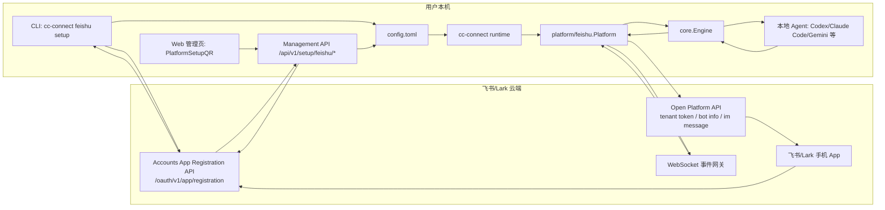
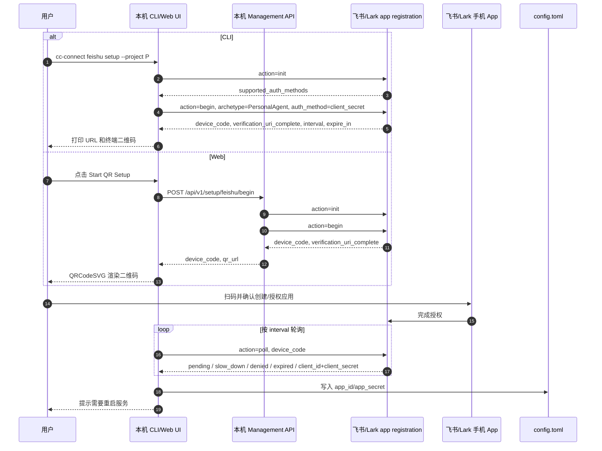
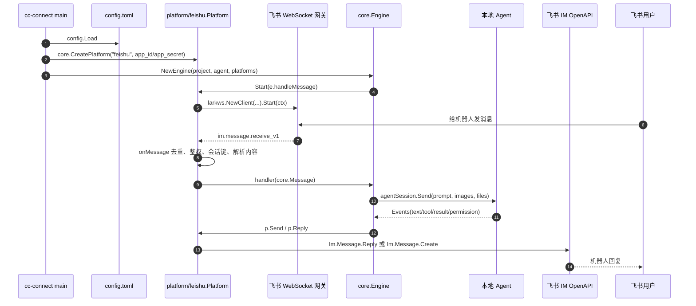

# CC Connect 如何通过飞书实现扫码连接与远程控制

本文只基于 `/Users/liyang/Documents/code/demo/cc-connect-main` 源码整理，不依赖任何外部记忆。

核心结论：CC Connect 的飞书接入分成两个阶段。

1. 扫码配置阶段：本机调用飞书/Lark 的 app registration 接口，拿到 `device_code` 和 `verification_uri_complete`，把后者渲染成二维码。用户用飞书/Lark 手机端扫码并授权创建应用后，本机用 `device_code` 轮询同一个注册接口，直到返回 `client_id/client_secret`，再把它们写入 `config.toml`。
2. 运行收消息阶段：服务重启后重新读取配置，按 `app_id/app_secret` 创建飞书平台实例，通过飞书 SDK 建立 WebSocket 长连接订阅事件。用户在飞书发消息时，飞书把 `im.message.receive_v1` 事件推到本机长连接；CC Connect 转成统一 `core.Message`，交给 `core.Engine`，再转发给本地 Agent，最后用飞书 IM API 回复用户。

这里没有要求用户本机有公网 IP。二维码只负责完成飞书侧应用创建与授权；真正收消息靠本机主动连出的 WebSocket 长连接。

## 一、产品设计

### 1.1 目标体验

目标用户是想在手机飞书里远程操作本机 AI 编程工具的人。用户不应该手动建飞书应用、复制 `app_id/app_secret`、配置事件订阅、再回写配置。CC Connect 把它设计成一个“扫码连接平台”的流程：

1. 用户在本机 CLI 或 Web 管理页选择连接 Feishu/Lark。
2. 本机展示二维码。
3. 用户用飞书/Lark 手机 App 扫码。
4. 飞书侧完成应用创建/授权后，本机自动知道结果。
5. 本机写入项目平台配置。
6. UI 提示重启服务。
7. 重启后用户在飞书给机器人发消息，本机收到并转给 Agent。

源码里的用户入口有两条：

- CLI：`cc-connect feishu setup --project my-project` 或 `cc-connect feishu new --project my-project`。
- Web 管理页：项目创建/添加平台时选择支持二维码的平台，进入 `PlatformSetupQR`。

### 1.2 CLI 产品流

CLI 入口在 `cmd/cc-connect/feishu.go`。

- [C01] `runFeishu(args []string)` 根据子命令分发：`setup`、`new/create`、`bind/link`。见 `/Users/liyang/Documents/code/demo/cc-connect-main/cmd/cc-connect/feishu.go:86`。
- [C02] `runFeishuSetup(args []string, requestedMode string)` 解析 `--project`、`--platform-type`、`--app`、`--timeout`、`--qr-image` 等参数。见 `/Users/liyang/Documents/code/demo/cc-connect-main/cmd/cc-connect/feishu.go:108`。
- [C03] `resolveFeishuSetupInputs(...)` 决定实际走 `new` 还是 `bind`：没有凭证时走扫码新建，有 `--app`/`--app-id` 时走绑定已有应用。见 `/Users/liyang/Documents/code/demo/cc-connect-main/cmd/cc-connect/feishu.go:380`。
- [C04] 扫码新建时调用 `runRegistrationFlow(...)`，终端打印 URL 和二维码，轮询飞书注册结果。见 `/Users/liyang/Documents/code/demo/cc-connect-main/cmd/cc-connect/feishu.go:534`。
- [C05] 成功后 `config.EnsureProjectWithFeishuPlatform(...)` 确保项目和飞书平台块存在。见 `/Users/liyang/Documents/code/demo/cc-connect-main/cmd/cc-connect/feishu.go:191`。
- [C06] 然后 `config.SaveFeishuPlatformCredentials(...)` 写入 `app_id/app_secret`。见 `/Users/liyang/Documents/code/demo/cc-connect-main/cmd/cc-connect/feishu.go:206`。

CLI 的提示文案说明也写在安装文档中：`setup/new` 会打印终端二维码和 URL；如果 `--project` 不存在会自动创建项目；扫码流程通常会预配权限和事件订阅。见 `/Users/liyang/Documents/code/demo/cc-connect-main/INSTALL.md:194` 到 `INSTALL.md:201`。

### 1.3 Web 管理页产品流

Web 管理页入口在 `web/src/pages/Projects/PlatformSetupQR.tsx`。

- [W01] `PlatformSetupQR` 维护 `phase` 状态：`idle/loading/scanning/scanned/completed/expired/denied/error/saving`。见 `/Users/liyang/Documents/code/demo/cc-connect-main/web/src/pages/Projects/PlatformSetupQR.tsx:12` 到 `PlatformSetupQR.tsx:13`。
- [W02] `startFeishuFlow` 调后端 `/setup/feishu/begin`，拿 `device_code`、`qr_url`、`interval`，然后进入 `scanning` 并开始轮询。见 `/Users/liyang/Documents/code/demo/cc-connect-main/web/src/pages/Projects/PlatformSetupQR.tsx:43` 到 `PlatformSetupQR.tsx:58`。
- [W03] `pollFeishu` 调 `/setup/feishu/poll`；当状态为 `completed` 时，马上调用 `/setup/feishu/save` 写配置。见 `/Users/liyang/Documents/code/demo/cc-connect-main/web/src/pages/Projects/PlatformSetupQR.tsx:64` 到 `PlatformSetupQR.tsx:117`。
- [W04] 二维码渲染用 `QRCodeSVG`，二维码内容就是后端返回的 `qrUrl`。见 `/Users/liyang/Documents/code/demo/cc-connect-main/web/src/pages/Projects/PlatformSetupQR.tsx:3` 和 `PlatformSetupQR.tsx:222`。
- [W05] 保存成功后显示 `completed`，提示“重启服务后新平台才会生效”，并给 `Restart Now` 按钮。见 `/Users/liyang/Documents/code/demo/cc-connect-main/web/src/pages/Projects/PlatformSetupQR.tsx:252` 到 `PlatformSetupQR.tsx:276`。

注意：飞书二维码流程没有独立的“已扫描但未确认”事件。Web 里的 `scanned` 状态主要给微信流程用；飞书只在轮询返回 `completed/denied/expired/error` 时改变结果状态。

## 二、总体架构



### 2.1 模块分工

| 模块 | 责任 | 关键源码 |
|---|---|---|
| CLI Feishu setup | 解析命令、开始扫码、终端二维码、轮询注册结果、写配置 | `/cmd/cc-connect/feishu.go` |
| Management setup API | 给 Web 管理页提供 begin/poll/save 接口 | `/core/setup.go` |
| Web QR 页面 | 渲染二维码、轮询状态、保存后提示重启 | `/web/src/pages/Projects/PlatformSetupQR.tsx` |
| 配置写入 | 自动创建项目/平台块，定点写 `app_id/app_secret/allow_from` | `/config/config.go` |
| 平台注册 | 把 `feishu`/`lark` 注册到核心平台工厂 | `/platform/feishu/feishu.go`、`/core/registry.go` |
| 飞书运行时 | 创建 SDK client、WebSocket 长连接、事件回调、消息解析、回复 | `/platform/feishu/feishu.go` |
| Engine | 平台消息路由、会话管理、Agent 进程交互、输出回平台 | `/core/engine.go` |
| 重启 | Web `/restart` 或飞书 `/restart` 命令触发进程重启 | `/core/management.go`、`/cmd/cc-connect/main.go` |

## 三、扫码创建应用的实现

### 3.1 注册接口协议

CC Connect 调用的是飞书账号侧接口：

```text
POST https://accounts.feishu.cn/oauth/v1/app/registration
POST https://accounts.larksuite.com/oauth/v1/app/registration
Content-Type: application/x-www-form-urlencoded
```

源码常量：

- [R01] `accountsFeishuBaseURL = "https://accounts.feishu.cn"`。见 `/Users/liyang/Documents/code/demo/cc-connect-main/cmd/cc-connect/feishu.go:27`。
- [R02] `accountsLarkBaseURL = "https://accounts.larksuite.com"`。见 `/Users/liyang/Documents/code/demo/cc-connect-main/cmd/cc-connect/feishu.go:28`。
- [R03] Web 管理 API 里的同名常量是 `feishuAccountsBaseURL` 和 `larkAccountsBaseURL`。见 `/Users/liyang/Documents/code/demo/cc-connect-main/core/setup.go:15` 到 `core/setup.go:18`。

交互分三步：

1. `action=init`：探测支持的认证方式。
2. `action=begin`：请求创建一个 PersonalAgent 类型应用，并要求返回 `open_id` 用户信息。
3. `action=poll`：带 `device_code` 轮询，直到返回 `client_id/client_secret`。

CLI 的 HTTP 封装：

- [R04] `registrationClient.registrationCall(action string, params map[string]string, out any)` 统一构造 `action` 表单并 POST 到 `{baseURL}/oauth/v1/app/registration`。见 `/Users/liyang/Documents/code/demo/cc-connect-main/cmd/cc-connect/feishu.go:644` 到 `feishu.go:674`。

Web 后端的 HTTP 封装：

- [R05] `feishuRegistrationCall(client, baseURL, action, params)` 同样 POST 到 `/oauth/v1/app/registration`，返回 `map[string]any`。见 `/Users/liyang/Documents/code/demo/cc-connect-main/core/setup.go:218` 到 `core/setup.go:247`。

### 3.2 begin 返回什么

CLI 定义了 begin 响应结构：

- [R06] `registrationBeginResponse.DeviceCode` 是轮询凭据。见 `/Users/liyang/Documents/code/demo/cc-connect-main/cmd/cc-connect/feishu.go:39` 到 `feishu.go:43`。
- [R07] `registrationBeginResponse.VerificationURIComplete` 是二维码 URL。见 `/Users/liyang/Documents/code/demo/cc-connect-main/cmd/cc-connect/feishu.go:39` 到 `feishu.go:43`。
- [R08] `Interval` 控制轮询间隔，`ExpireIn` 控制二维码过期时间。见同一结构体。

CLI begin 参数：

```go
beginParams := map[string]string{
    "archetype":         "PersonalAgent",
    "auth_method":       "client_secret",
    "request_user_info": "open_id",
}
```

对应源码见 `/Users/liyang/Documents/code/demo/cc-connect-main/cmd/cc-connect/feishu.go:555` 到 `feishu.go:560`。

Web 后端 begin 参数一致，见 `/Users/liyang/Documents/code/demo/cc-connect-main/core/setup.go:64` 到 `core/setup.go:68`。

### 3.3 二维码如何生成

CLI 的二维码不是飞书 API 直接返回图片，而是把 `verification_uri_complete` 编成二维码：

- [Q01] `runRegistrationFlow` 打印扫码说明和 URL。见 `/Users/liyang/Documents/code/demo/cc-connect-main/cmd/cc-connect/feishu.go:571` 到 `feishu.go:573`。
- [Q02] `tryPrintTerminalQRCode(beginRes.VerificationURIComplete)` 在终端绘制二维码。见 `/Users/liyang/Documents/code/demo/cc-connect-main/cmd/cc-connect/feishu.go:573`。
- [Q03] `tryPrintTerminalQRCode(content string)` 使用 `qrterminal.GenerateWithConfig`，设置 `Level: qrterminal.M`、`Writer: os.Stdout`、黑白字符和 quiet zone。见 `/Users/liyang/Documents/code/demo/cc-connect-main/cmd/cc-connect/feishu.go:685` 到 `feishu.go:700`。
- [Q04] 如果传了 `--qr-image`，`saveQRCodeImage` 用 `rsc.io/qr` 生成 PNG。见 `/Users/liyang/Documents/code/demo/cc-connect-main/cmd/cc-connect/feishu.go:702` 到 `feishu.go:709`。

Web 版同理：

- [Q05] 后端 `handleSetupFeishuBegin` 返回 `qr_url`，它就是 `verification_uri_complete`。见 `/Users/liyang/Documents/code/demo/cc-connect-main/core/setup.go:79` 到 `core/setup.go:93`。
- [Q06] 前端 `setQrUrl(res.qr_url)` 保存二维码内容。见 `/Users/liyang/Documents/code/demo/cc-connect-main/web/src/pages/Projects/PlatformSetupQR.tsx:49` 到 `PlatformSetupQR.tsx:56`。
- [Q07] 前端 `<QRCodeSVG value={qrUrl} size={200} level="M" />` 渲染二维码。见 `/Users/liyang/Documents/code/demo/cc-connect-main/web/src/pages/Projects/PlatformSetupQR.tsx:221` 到 `PlatformSetupQR.tsx:223`。

### 3.4 本机如何知道用户扫码并创建成功

本机并不是等飞书回调本地 HTTP 服务；它主动轮询飞书账号端。

CLI 轮询逻辑：

- [P01] `runRegistrationFlow` 计算 `interval` 和 `timeoutAt`，默认间隔 5 秒，默认超时 600 秒。见 `/Users/liyang/Documents/code/demo/cc-connect-main/cmd/cc-connect/feishu.go:582` 到 `feishu.go:594`。
- [P02] 循环内用 `device_code` 调 `action=poll`。见 `/Users/liyang/Documents/code/demo/cc-connect-main/cmd/cc-connect/feishu.go:597` 到 `feishu.go:600`。
- [P03] 如果 `pollRes.UserInfo.TenantBrand == "lark"`，把注册域名从飞书切到 Lark，再继续轮询。见 `/Users/liyang/Documents/code/demo/cc-connect-main/cmd/cc-connect/feishu.go:603` 到 `feishu.go:612`。
- [P04] 当 `pollRes.ClientID` 和 `pollRes.ClientSecret` 都非空，就认为创建/授权完成，返回 `registrationFlowResult{AppID, AppSecret, OwnerOpenID, Platform}`。见 `/Users/liyang/Documents/code/demo/cc-connect-main/cmd/cc-connect/feishu.go:615` 到 `feishu.go:621`。
- [P05] 错误状态处理：`slow_down` 增加轮询间隔，`access_denied` 返回用户拒绝，`expired_token` 返回过期。见 `/Users/liyang/Documents/code/demo/cc-connect-main/cmd/cc-connect/feishu.go:624` 到 `feishu.go:636`。

Web 轮询逻辑：

- [P06] `handleSetupFeishuPoll` 接收 `device_code` 和可选 `base_url`。见 `/Users/liyang/Documents/code/demo/cc-connect-main/core/setup.go:96` 到 `core/setup.go:118`。
- [P07] 后端最多尝试两轮，目的是支持从 Feishu 域自动切到 Lark 域。见 `/Users/liyang/Documents/code/demo/cc-connect-main/core/setup.go:122` 到 `core/setup.go:139`。
- [P08] 默认返回 `status: pending` 和当前 `base_url`。见 `/Users/liyang/Documents/code/demo/cc-connect-main/core/setup.go:141` 到 `core/setup.go:144`。
- [P09] 当返回 `client_id/client_secret` 时，后端返回 `status: completed`、`app_id`、`app_secret`、`platform`、可选 `owner_open_id`。见 `/Users/liyang/Documents/code/demo/cc-connect-main/core/setup.go:146` 到 `core/setup.go:163`。
- [P10] `authorization_pending/slow_down/access_denied/expired_token` 分别映射为 pending、slow_down、denied、expired。见 `/Users/liyang/Documents/code/demo/cc-connect-main/core/setup.go:166` 到 `core/setup.go:180`。
- [P11] 前端 `pollFeishu` 根据状态推进 UI；`completed` 时调用 `setupFeishuSave`。见 `/Users/liyang/Documents/code/demo/cc-connect-main/web/src/pages/Projects/PlatformSetupQR.tsx:71` 到 `PlatformSetupQR.tsx:90`。

因此，“知道用户扫码之后创建应用成功”的核心条件就是 `poll` 接口返回了 `client_id` 与 `client_secret`。这两个值在 CC Connect 里分别被命名为 `AppID/AppSecret` 或 `app_id/app_secret`。

### 3.5 开发者是否需要提前在飞书开放平台申请内容

按 CC Connect 这套扫码新建链路看，源码里没有“系统开发者预先申请的飞书母应用凭证”。

也就是说，复刻 CC Connect 的二维码模式时，后端并没有携带开发者自己的 `client_id/client_secret` 去换用户授权；它只是直接调用飞书账号侧的 app registration 接口：

- `action=init`
- `action=begin`
- `action=poll`

这点可以从两个入口同时看出来：

- CLI 的 `registrationClient.registrationCall` 只提交 `action` 和 begin/poll 参数，没有读取任何开发者预置 app 凭证。见 `/Users/liyang/Documents/code/demo/cc-connect-main/cmd/cc-connect/feishu.go:644` 到 `feishu.go:674`。
- Web 后端的 `feishuRegistrationCall` 也是同样的表单调用，没有系统级飞书 app 配置。见 `/Users/liyang/Documents/code/demo/cc-connect-main/core/setup.go:218` 到 `core/setup.go:247`。

所以配置里的：

```toml
app_id = "cli_xxxxxxxxxxxx"
app_secret = "xxxxxxxxxxxxxxxxxxxxxxxx"
```

不是 CC Connect 开发者提前申请好的平台级凭证，而是用户扫码后由飞书返回的用户/租户侧应用凭证。源码里的命名对应关系是：

- 飞书 poll 返回 `client_id`，CC Connect 保存为 `app_id`。
- 飞书 poll 返回 `client_secret`，CC Connect 保存为 `app_secret`。

手动绑定模式不同：如果用户执行 `cc-connect feishu setup --project my-project --app cli_xxx:sec_xxx` 或 `cc-connect feishu bind ...`，那 `app_id/app_secret` 必须由用户或企业管理员先在飞书开放平台创建应用后复制出来。此时还要手动确保 Bot 能力、消息事件、发送权限、发布状态和可用范围都正确。

因此复刻时可以把飞书接入分成两种产品模式：

| 模式 | `app_id/app_secret` 来源 | 是否需要用户提前去飞书开放平台 |
|---|---|---|
| 二维码新建 | app registration poll 返回 | 通常不需要，扫码流程负责创建/授权 |
| 绑定已有应用 | 用户手动提供 | 需要，用户或管理员提前创建应用并配置权限 |

需要额外注意：这是 CC Connect 源码表现出的实现方式。如果飞书后续调整 app registration 接口的开放策略，你的系统可能需要按飞书最新要求申请对应能力；但在当前源码里，没有发现开发者侧预置飞书应用凭证这一层。

## 四、配置写入与重启提示

### 4.1 自动创建项目和平台块

CLI 和 Web 后端都会先确保配置里有目标项目和飞书平台块。

- [S01] CLI 在 `runFeishuSetup` 里调用 `config.EnsureProjectWithFeishuPlatform`，参数包括 `ProjectName`、`PlatformType`、当前工作目录 `WorkDir`。见 `/Users/liyang/Documents/code/demo/cc-connect-main/cmd/cc-connect/feishu.go:186` 到 `feishu.go:199`。
- [S02] Web 后端在 `main.go` 里给 Management Server 注入 `SetSetupFeishuSave` 回调，保存前同样调用 `config.EnsureProjectWithFeishuPlatform`。见 `/Users/liyang/Documents/code/demo/cc-connect-main/cmd/cc-connect/main.go:813` 到 `main.go:826`。
- [S03] `EnsureProjectWithFeishuOptions` 定义项目名、平台类型、工作目录、Agent 类型等。见 `/Users/liyang/Documents/code/demo/cc-connect-main/config/config.go:1421` 到 `config.go:1428`。
- [S04] `EnsureProjectWithFeishuPlatform` 若项目存在但没有 `feishu/lark` 平台，就插入 `[[projects.platforms]]` 和 `[projects.platforms.options]`。见 `/Users/liyang/Documents/code/demo/cc-connect-main/config/config.go:1481` 到 `config.go:1518`。
- [S05] 若项目不存在，它创建一个新 `[[projects]]`，默认 Agent 是 `codex`，并附带一个 `feishu/lark` 平台。见 `/Users/liyang/Documents/code/demo/cc-connect-main/config/config.go:1521` 到 `config.go:1569`。

### 4.2 写入 app_id/app_secret

凭证写入由 `SaveFeishuPlatformCredentials` 负责。

- [S06] `FeishuCredentialUpdateOptions` 包含 `ProjectName`、`PlatformIndex`、`PlatformType`、`AppID`、`AppSecret`、`OwnerOpenID`、`SetAllowFromEmpty`。见 `/Users/liyang/Documents/code/demo/cc-connect-main/config/config.go:1409` 到 `config.go:1419`。
- [S07] `SaveFeishuPlatformCredentials` 校验项目名、凭证、平台类型。见 `/Users/liyang/Documents/code/demo/cc-connect-main/config/config.go:1574` 到 `config.go:1592`。
- [S08] 它找到目标项目里第一个 `feishu/lark` 平台，或按 `PlatformIndex` 指定目标。见 `/Users/liyang/Documents/code/demo/cc-connect-main/config/config.go:1604` 到 `config.go:1639`。
- [S09] 在解析后的配置对象中设置 `platform.Options["app_id"]` 和 `platform.Options["app_secret"]`。见 `/Users/liyang/Documents/code/demo/cc-connect-main/config/config.go:1647` 到 `config.go:1648`。
- [S10] 在原始 TOML 文本中用 `upsertTomlStringKey` 定点写入 `app_id` 与 `app_secret`，尽量保留原注释和排版。见 `/Users/liyang/Documents/code/demo/cc-connect-main/config/config.go:1696` 到 `config.go:1699`。
- [S11] 如果 `SetAllowFromEmpty` 为真且有 `OwnerOpenID`，会写入或合并 `allow_from`。见 `/Users/liyang/Documents/code/demo/cc-connect-main/config/config.go:1650` 到 `config.go:1656` 和 `config.go:1700` 到 `config.go:1702`。

### 4.3 为什么需要重启

用户看到“绑定成功”时，准确含义是：扫码返回的 `client_id/client_secret` 已经成功写入本机 `config.toml`，并且目标项目里已经有了 `feishu/lark` 平台配置块。它还不等于“当前正在运行的进程已经连上飞书”。

原因是 CC Connect 的运行时平台是在进程启动阶段一次性创建的：

1. 主进程启动时 `config.Load(configPath)` 读取配置。
2. 遍历 `cfg.Projects` 和 `proj.Platforms`。
3. 对每个平台调用 `core.CreatePlatform(pc.Type, opts)` 创建平台对象。
4. `Engine.Start()` 再调用 `p.Start(e.handleMessage)`，飞书平台才会创建 `larkws.Client` 并启动 WebSocket 长连接。

扫码保存发生在当前进程运行期间。`handleSetupFeishuSave` 只负责写配置，并不会重建当前进程里的 `engines`、`platforms`、`platform/feishu.Platform` 或 `wsClient`。所以新写入的 `app_id/app_secret` 只有在重启后才会被主进程重新加载，并进入 `newPlatform -> Start -> startWebSocketMode` 这条链路。

用一句话说：绑定成功是“配置层成功”；重启后才是“运行时连接成功”。

- [T01] Web 后端 `handleSetupFeishuSave` 保存成功后返回 `"restart_required": true`。见 `/Users/liyang/Documents/code/demo/cc-connect-main/core/setup.go:190` 到 `core/setup.go:215`。
- [T02] 前端 `setupFeishuSave` 的返回类型包含 `restart_required`。见 `/Users/liyang/Documents/code/demo/cc-connect-main/web/src/api/setup.ts:40` 到 `setup.ts:43`。
- [T03] `PlatformSetupQR` 完成后显示重启提示和 `Restart Now`。见 `/Users/liyang/Documents/code/demo/cc-connect-main/web/src/pages/Projects/PlatformSetupQR.tsx:252` 到 `PlatformSetupQR.tsx:276`。
- [T04] 项目详情页添加平台完成后也会显示重启弹窗。见 `/Users/liyang/Documents/code/demo/cc-connect-main/web/src/pages/Projects/ProjectDetail.tsx:653` 到 `ProjectDetail.tsx:695`。
- [T05] 启动时读取配置、创建平台实例的主流程见 `/Users/liyang/Documents/code/demo/cc-connect-main/cmd/cc-connect/main.go:163` 到 `main.go:220`。
- [T06] `Engine.Start()` 调每个平台的 `Start`，见 `/Users/liyang/Documents/code/demo/cc-connect-main/core/engine.go:1253` 到 `engine.go:1274`。
- [T07] 飞书 `Start` 最终走 `startWebSocketMode`，见 `/Users/liyang/Documents/code/demo/cc-connect-main/platform/feishu/feishu.go:290` 到 `feishu.go:365`。

Web 的 `Restart Now` 调用：

- [T08] `restartSystem` 是 `POST /api/v1/restart`。见 `/Users/liyang/Documents/code/demo/cc-connect-main/web/src/api/status.ts:11` 到 `status.ts:12`。
- [T09] Management Server 注册 `/api/v1/restart` 路由。见 `/Users/liyang/Documents/code/demo/cc-connect-main/core/management.go:210` 到 `management.go:216`。
- [T10] `handleRestart` 把请求写入全局 `RestartCh`。见 `/Users/liyang/Documents/code/demo/cc-connect-main/core/management.go:435` 到 `management.go:455`。
- [T11] 主进程 `main.go` 在 select 中监听 `core.RestartCh`。见 `/Users/liyang/Documents/code/demo/cc-connect-main/cmd/cc-connect/main.go:1006` 到 `main.go:1012`。
- [T12] 收到重启请求后先停止管理服务、bridge、webhook、scheduler、engine，再 `restartProcess(execPath)`。见 `/Users/liyang/Documents/code/demo/cc-connect-main/cmd/cc-connect/main.go:1014` 到 `main.go:1062`。

飞书内也可以发 `/restart`：

- [T13] `handleCommand` 把 `restart` 命令路由到 `cmdRestart`。见 `/Users/liyang/Documents/code/demo/cc-connect-main/core/engine.go:3545` 到 `engine.go:3556`。
- [T14] `cmdRestart` 先回复“正在重启”，然后向 `RestartCh` 写入 `RestartRequest{SessionKey, Platform}`。见 `/Users/liyang/Documents/code/demo/cc-connect-main/core/engine.go:10533` 到 `engine.go:10541`。
- [T15] 进程重启前用 `SaveRestartNotify` 保存重启来源，重启后 `ConsumeRestartNotify` 并调用 `SendRestartNotification` 发“重启成功”。见 `/Users/liyang/Documents/code/demo/cc-connect-main/core/engine.go:70` 到 `engine.go:127`，以及 `/Users/liyang/Documents/code/demo/cc-connect-main/cmd/cc-connect/main.go:995` 到 `main.go:1000`。

## 五、重启后的运行时如何接收飞书消息

### 5.1 启动时从配置创建平台

主进程启动后加载配置并创建每个项目的 Agent 和 Platform。

- [M01] `config.Load(configPath)` 读取配置。见 `/Users/liyang/Documents/code/demo/cc-connect-main/cmd/cc-connect/main.go:163`。
- [M02] 主循环遍历 `cfg.Projects`。见 `/Users/liyang/Documents/code/demo/cc-connect-main/cmd/cc-connect/main.go:183` 到 `main.go:186`。
- [M03] 对每个 `proj.Platforms`，把 `pc.Options` 复制进 `opts`，补上 `cc_data_dir` 和 `cc_project`，然后调用 `core.CreatePlatform(pc.Type, opts)`。见 `/Users/liyang/Documents/code/demo/cc-connect-main/cmd/cc-connect/main.go:207` 到 `main.go:220`。
- [M04] `core.CreatePlatform` 从全局工厂表拿平台构造函数。见 `/Users/liyang/Documents/code/demo/cc-connect-main/core/registry.go:24` 到 `registry.go:34`。
- [M05] 飞书平台在 `init()` 中注册 `feishu` 和 `lark` 两个类型。见 `/Users/liyang/Documents/code/demo/cc-connect-main/platform/feishu/feishu.go:99` 到 `feishu.go:106`。

### 5.2 飞书平台实例的关键字段

`platform/feishu.Platform` 是运行时核心结构。

关键字段见 `/Users/liyang/Documents/code/demo/cc-connect-main/platform/feishu/feishu.go:114` 到 `feishu.go:154`：

- `platformName`：`feishu` 或 `lark`。
- `domain`：Open API / WebSocket 域名，默认飞书或 Lark，也可由配置 `domain` 覆盖。
- `appID`、`appSecret`：扫码或手工配置得到的凭证。
- `useInteractiveCard`：是否启用飞书卡片，默认 true。
- `allowFrom`：允许哪些 open_id 使用。
- `client`：飞书 OpenAPI SDK client。
- `replayClient`：关闭 token cache 的备用 client，用于 token 失效后的重试。
- `wsClient`：飞书 WebSocket client。
- `handler`：`core.MessageHandler`，由 `Engine.Start` 注入，实际是 `e.handleMessage`。
- `eventHandler`：飞书事件 dispatcher。
- `botOpenID`：机器人自己的 open_id，用于群聊 @ 过滤。
- `dedup`：消息去重器。

构造函数：

- [M06] `newPlatform(name, domain, opts)` 读取 `app_id/app_secret`；为空直接报错。见 `/Users/liyang/Documents/code/demo/cc-connect-main/platform/feishu/feishu.go:170` 到 `feishu.go:175`。
- [M07] 它读取 `domain`、`reaction_emoji`、`done_emoji`、`allow_from`、`group_reply_all`、`thread_isolation`、`enable_feishu_card` 等选项。见 `/Users/liyang/Documents/code/demo/cc-connect-main/platform/feishu/feishu.go:176` 到 `feishu.go:233`。
- [M08] 它创建 `lark.NewClient(appID, appSecret, ...)`，并保存到 `client`。见 `/Users/liyang/Documents/code/demo/cc-connect-main/platform/feishu/feishu.go:235` 到 `feishu.go:261`。

### 5.3 启动 WebSocket 长连接

Engine 启动时给每个平台注入消息处理函数。

- [M09] `Engine.Start()` 遍历 `e.platforms`，调用 `p.Start(e.handleMessage)`。见 `/Users/liyang/Documents/code/demo/cc-connect-main/core/engine.go:1253` 到 `engine.go:1274`。
- [M10] `Platform.Start(handler core.MessageHandler)` 保存 `p.handler = handler`。见 `/Users/liyang/Documents/code/demo/cc-connect-main/platform/feishu/feishu.go:290` 到 `feishu.go:292`。
- [M11] 启动时先 `p.fetchBotOpenID()`，获取机器人 open_id。见 `/Users/liyang/Documents/code/demo/cc-connect-main/platform/feishu/feishu.go:293` 到 `feishu.go:298`；具体 API 在 `fetchBotOpenID`，见 `/Users/liyang/Documents/code/demo/cc-connect-main/platform/feishu/feishu.go:2276` 到 `feishu.go:2296`。
- [M12] `p.eventHandler = dispatcher.NewEventDispatcher("", p.encryptKey)`，并注册消息、已读、进群、反应、卡片、机器人菜单等事件。见 `/Users/liyang/Documents/code/demo/cc-connect-main/platform/feishu/feishu.go:300` 到 `feishu.go:327`。
- [M13] `OnP2MessageReceiveV1` 是核心消息事件，回调里执行 `p.onMessage(ctx, event)`。见 `/Users/liyang/Documents/code/demo/cc-connect-main/platform/feishu/feishu.go:300` 到 `feishu.go:304`。
- [M14] 如果没有 `encrypt_key`，默认走 WebSocket 模式。见 `shouldUseWebhookMode`，`encrypt_key` 非空才用 webhook。源码见 `/Users/liyang/Documents/code/demo/cc-connect-main/platform/feishu/feishu.go:333` 到 `feishu.go:342`。
- [M15] `startWebSocketMode` 构造 `larkws.NewClient(p.appID, p.appSecret, wsOpts...)`，其中 `wsOpts` 包含 `larkws.WithEventHandler(p.eventHandler)`。见 `/Users/liyang/Documents/code/demo/cc-connect-main/platform/feishu/feishu.go:344` 到 `feishu.go:355`。
- [M16] 它开 goroutine 执行 `p.wsClient.Start(ctx)`，本机主动连飞书 WebSocket 网关。见 `/Users/liyang/Documents/code/demo/cc-connect-main/platform/feishu/feishu.go:356` 到 `feishu.go:365`。

这就是“无需公网 IP”的关键：本机不是开 HTTP endpoint 等飞书打进来，而是本机用 SDK 主动建立出站 WebSocket。

### 5.4 飞书事件如何变成 CC Connect 消息

消息入口：

- [M17] `onMessage(ctx, event *larkim.P2MessageReceiveV1)` 取 `event.Event.Message` 和 `event.Event.Sender`。见 `/Users/liyang/Documents/code/demo/cc-connect-main/platform/feishu/feishu.go:671` 到 `feishu.go:687`。
- [M18] 它提取 `msgType`、`chatID`、`userID`、`messageID`。见 `/Users/liyang/Documents/code/demo/cc-connect-main/platform/feishu/feishu.go:675` 到 `feishu.go:694`。
- [M19] `p.dedup.IsDuplicate(messageID)` 防重复。见 `/Users/liyang/Documents/code/demo/cc-connect-main/platform/feishu/feishu.go:696` 到 `feishu.go:699`；去重器实现见 `/Users/liyang/Documents/code/demo/cc-connect-main/core/dedup.go:15` 到 `dedup.go:44`。
- [M20] 如果消息创建时间早于本进程启动时间，会忽略，避免重启后重放旧消息。见 `/Users/liyang/Documents/code/demo/cc-connect-main/platform/feishu/feishu.go:701` 到 `feishu.go:709`；`IsOldMessage` 见 `/Users/liyang/Documents/code/demo/cc-connect-main/core/dedup.go:46` 到 `dedup.go:50`。
- [M21] 群聊默认要求 @ 机器人；未 @ 时忽略。见 `/Users/liyang/Documents/code/demo/cc-connect-main/platform/feishu/feishu.go:728` 到 `feishu.go:738`。
- [M22] `core.AllowList(p.allowFrom, userID)` 做用户白名单。见 `/Users/liyang/Documents/code/demo/cc-connect-main/platform/feishu/feishu.go:740` 到 `feishu.go:743`；`AllowList` 见 `/Users/liyang/Documents/code/demo/cc-connect-main/core/message.go:51` 到 `message.go:65`。
- [M23] `sessionKey := p.makeSessionKey(msg, chatID, userID)` 决定会话隔离粒度。见 `/Users/liyang/Documents/code/demo/cc-connect-main/platform/feishu/feishu.go:758`。
- [M24] `replyContext{messageID, chatID, sessionKey}` 保存回复所需上下文。见 `/Users/liyang/Documents/code/demo/cc-connect-main/platform/feishu/feishu.go:759`。
- [M25] 最后起 goroutine 调 `p.dispatchMessage(...)`，避免阻塞 SDK 事件循环。见 `/Users/liyang/Documents/code/demo/cc-connect-main/platform/feishu/feishu.go:766` 到 `feishu.go:770`。

会话键：

- [M26] `makeSessionKey` 默认返回 `feishu:<chatID>:<userID>`，即同一用户在同一聊天里复用同一 Agent 会话。见 `/Users/liyang/Documents/code/demo/cc-connect-main/platform/feishu/feishu.go:2331` 到 `feishu.go:2345`。
- [M27] 如果 `thread_isolation` 且是群聊，会用 `root_id/message_id` 做 thread 维度隔离：`feishu:<chatID>:root:<rootID>`。见 `/Users/liyang/Documents/code/demo/cc-connect-main/platform/feishu/feishu.go:2331` 到 `feishu.go:2339`。
- [M28] 如果 `share_session_in_channel`，则返回 `feishu:<chatID>`，同一群共享会话。见 `/Users/liyang/Documents/code/demo/cc-connect-main/platform/feishu/feishu.go:2341` 到 `feishu.go:2344`。

消息类型转换：

- [M29] `dispatchMessage` 解析文本、图片、语音、富文本、文件、合并转发等消息。见 `/Users/liyang/Documents/code/demo/cc-connect-main/platform/feishu/feishu.go:775` 到 `feishu.go:930`。
- [M30] 文本消息：JSON 解析 `{"text": ...}`，用 `stripMentions` 去掉机器人 @，然后调用 `p.handler(..., &core.Message{...})`。见 `/Users/liyang/Documents/code/demo/cc-connect-main/platform/feishu/feishu.go:793` 到 `feishu.go:816`。
- [M31] 图片消息：解析 `image_key`，调用 `downloadImage` 下载，再填入 `core.Message.Images`。见 `/Users/liyang/Documents/code/demo/cc-connect-main/platform/feishu/feishu.go:818` 到 `feishu.go:837`。
- [M32] 文件消息：解析 `file_key/file_name`，下载后填入 `core.Message.Files`。见 `/Users/liyang/Documents/code/demo/cc-connect-main/platform/feishu/feishu.go:881` 到 `feishu.go:908`。
- [M33] `core.Message` 的统一字段包括 `SessionKey`、`Platform`、`MessageID`、`UserID`、`UserName`、`ChatName`、`Content`、附件和 `ReplyCtx`。见 `/Users/liyang/Documents/code/demo/cc-connect-main/core/message.go:139` 到 `message.go:157`。

## 六、Engine 如何把消息交给本地 Agent

### 6.1 入口

- [E01] `Engine.handleMessage(p Platform, msg *Message)` 是所有平台消息进入核心的入口。见 `/Users/liyang/Documents/code/demo/cc-connect-main/core/engine.go:1465` 到 `engine.go:1471`。
- [E02] 它先发 `message.received` hook。见 `/Users/liyang/Documents/code/demo/cc-connect-main/core/engine.go:1473` 到 `engine.go:1480`。
- [E03] 它处理语音、空消息、别名、引用内容、限流、禁词、多工作区、slash 命令等。关键主干见 `/Users/liyang/Documents/code/demo/cc-connect-main/core/engine.go:1513` 到 `engine.go:1624`。
- [E04] 它用 `sessions.GetOrCreateActive(msg.SessionKey)` 找或创建会话，并用 `session.TryLock()` 防止同会话并发。见 `/Users/liyang/Documents/code/demo/cc-connect-main/core/engine.go:1622` 到 `engine.go:1658`。
- [E05] 最后起 goroutine 调 `processInteractiveMessageWith(...)`。见 `/Users/liyang/Documents/code/demo/cc-connect-main/core/engine.go:1664` 到 `engine.go:1675`。

### 6.2 Agent 会话启动和发送

- [E06] `processInteractiveMessageWith` 记录用户历史，拿到/创建 `interactiveState`。见 `/Users/liyang/Documents/code/demo/cc-connect-main/core/engine.go:2076` 到 `engine.go:2103`。
- [E07] 如果还没有 Agent session，`getOrCreateInteractiveStateWith` 里会调用 `agent.StartSession(e.ctx, startSessionID)`。见 `/Users/liyang/Documents/code/demo/cc-connect-main/core/engine.go:2408` 到 `engine.go:2424`。
- [E08] 成功启动后，如果 Agent 返回了新的 session ID，会保存到 `SessionManager`。见 `/Users/liyang/Documents/code/demo/cc-connect-main/core/engine.go:2449` 到 `engine.go:2456`。
- [E09] 本轮发送前，Engine 会把用户内容包装成 prompt，然后 goroutine 调 `state.agentSession.Send(promptContent, msg.Images, msg.Files)`。见 `/Users/liyang/Documents/code/demo/cc-connect-main/core/engine.go:2166` 到 `engine.go:2180`。
- [E10] 同时 `processInteractiveEvents` 监听 `state.agentSession.Events()`，把 Agent 的 text/thinking/tool/result 事件转成平台消息。见 `/Users/liyang/Documents/code/demo/cc-connect-main/core/engine.go:2579` 到 `engine.go:2675` 和 `engine.go:2707` 到 `engine.go:2845`。

### 6.3 回复飞书

Engine 输出最终还是调用平台的 `Send` 或 `Reply`：

- [E11] `sendWithError` 调 `p.Send(e.ctx, replyCtx, content)`。见 `/Users/liyang/Documents/code/demo/cc-connect-main/core/engine.go:7470` 到 `engine.go:7488`。
- [E12] `replyWithError` 调 `p.Reply(e.ctx, replyCtx, content)`。见 `/Users/liyang/Documents/code/demo/cc-connect-main/core/engine.go:7528` 到 `engine.go:7548`。

飞书平台实现：

- [F01] `Reply(ctx, rctx, content)` 从 `replyContext` 取原消息 ID 和 chatID，构造飞书消息体；如果可以 reply，就走 `replyMessage`。见 `/Users/liyang/Documents/code/demo/cc-connect-main/platform/feishu/feishu.go:1728` 到 `feishu.go:1740`。
- [F02] `Send(ctx, rctx, content)` 优先复用 Reply API；没有原消息 ID 或配置不回复触发消息时，走新消息。见 `/Users/liyang/Documents/code/demo/cc-connect-main/platform/feishu/feishu.go:1743` 到 `feishu.go:1759`。
- [F03] `buildReplyContent` 决定消息类型：纯文本发 text；Markdown 优先发 interactive card；表格过多时发 post。见 `/Users/liyang/Documents/code/demo/cc-connect-main/platform/feishu/feishu.go:1955` 到 `feishu.go:1968`。
- [F04] `replyMessage` 调 `client.Im.Message.Reply`。见 `/Users/liyang/Documents/code/demo/cc-connect-main/platform/feishu/feishu.go:2391` 到 `feishu.go:2408`。
- [F05] `createMessage` 调 `client.Im.Message.Create`，`ReceiveIdType` 是 `chat_id`。见 `/Users/liyang/Documents/code/demo/cc-connect-main/platform/feishu/feishu.go:2410` 到 `feishu.go:2431`。
- [F06] `withFreshTenantAccessTokenRetry` 在 token 失效时重新取 tenant access token 并重试。见 `/Users/liyang/Documents/code/demo/cc-connect-main/platform/feishu/feishu.go:2433` 到 `feishu.go:2446`。
- [F07] `fetchFreshTenantAccessToken` 用 `AppID/AppSecret` 调 SDK 获取 tenant token。见 `/Users/liyang/Documents/code/demo/cc-connect-main/platform/feishu/feishu.go:2448` 到 `feishu.go:2463`。
- [F08] `withTransientRetry` 对网络瞬断做指数退避重试。见 `/Users/liyang/Documents/code/demo/cc-connect-main/platform/feishu/feishu.go:2535` 到 `feishu.go:2538`。

## 七、端到端流程图

### 7.1 扫码配置流程



### 7.2 重启后收消息与回复流程



## 八、如果要复刻另一套系统，最小代码方案

### 8.1 后端接口

需要实现三个 setup 接口。

#### POST `/setup/feishu/begin`

逻辑：

1. 调 app registration `action=init`。
2. 检查错误。
3. 调 `action=begin`，表单参数：
   - `archetype=PersonalAgent`
   - `auth_method=client_secret`
   - `request_user_info=open_id`
4. 返回：
   - `device_code`
   - `qr_url`，即 `verification_uri_complete`
   - `interval`
   - `expires_in`

CC Connect 参考代码：`handleSetupFeishuBegin`，见 `/Users/liyang/Documents/code/demo/cc-connect-main/core/setup.go:45` 到 `core/setup.go:94`。

#### POST `/setup/feishu/poll`

请求：

```json
{
  "device_code": "...",
  "base_url": "https://accounts.feishu.cn"
}
```

逻辑：

1. 默认 baseURL 是 `https://accounts.feishu.cn`。
2. 调 `action=poll`，参数 `device_code`。
3. 如果 `user_info.tenant_brand` 是 `lark`，切到 `https://accounts.larksuite.com` 再试。
4. 如果返回 `client_id/client_secret`：
   - 返回 `status=completed`
   - `app_id=client_id`
   - `app_secret=client_secret`
   - `platform=feishu/lark`
   - 可选 `owner_open_id=user_info.open_id`
5. 否则根据错误返回 pending/slow_down/denied/expired/error。

CC Connect 参考代码：`handleSetupFeishuPoll`，见 `/Users/liyang/Documents/code/demo/cc-connect-main/core/setup.go:96` 到 `core/setup.go:188`。

#### POST `/setup/feishu/save`

请求：

```json
{
  "project": "my-project",
  "app_id": "cli_xxx",
  "app_secret": "xxx",
  "platform_type": "feishu",
  "owner_open_id": "ou_xxx",
  "work_dir": "/path/to/project",
  "agent_type": "codex"
}
```

逻辑：

1. 校验 `project/app_id/app_secret`。
2. 确保项目存在。
3. 确保项目里有 `feishu/lark` 平台配置。
4. 写入 `app_id/app_secret`。
5. 返回 `restart_required=true`。

CC Connect 参考代码：

- `handleSetupFeishuSave`：`/Users/liyang/Documents/code/demo/cc-connect-main/core/setup.go:190` 到 `core/setup.go:216`。
- 保存回调注入：`/Users/liyang/Documents/code/demo/cc-connect-main/cmd/cc-connect/main.go:813` 到 `main.go:836`。
- 配置写入：`/Users/liyang/Documents/code/demo/cc-connect-main/config/config.go:1574` 到 `config.go:1716`。

### 8.2 前端状态机

最小状态：

```text
idle -> loading -> scanning -> saving -> completed
                         -> denied
                         -> expired
                         -> error
```

关键实现：

1. 点击开始后调用 begin。
2. 用 `qr_url` 渲染二维码。
3. 按 `interval` 循环 poll。
4. 如果 `slow_down`，把 interval 加 5 秒。
5. completed 后立刻 save。
6. 保存后提示重启。

CC Connect 参考代码：

- `startFeishuFlow`：`/Users/liyang/Documents/code/demo/cc-connect-main/web/src/pages/Projects/PlatformSetupQR.tsx:43` 到 `PlatformSetupQR.tsx:62`。
- `pollFeishu`：`/Users/liyang/Documents/code/demo/cc-connect-main/web/src/pages/Projects/PlatformSetupQR.tsx:64` 到 `PlatformSetupQR.tsx:117`。
- `QRCodeSVG`：`/Users/liyang/Documents/code/demo/cc-connect-main/web/src/pages/Projects/PlatformSetupQR.tsx:221` 到 `PlatformSetupQR.tsx:223`。
- 重启按钮：`/Users/liyang/Documents/code/demo/cc-connect-main/web/src/pages/Projects/PlatformSetupQR.tsx:261` 到 `PlatformSetupQR.tsx:275`。

### 8.3 运行时平台层

最小平台结构：

```go
type FeishuPlatform struct {
    appID     string
    appSecret string
    client    *lark.Client
    wsClient  *larkws.Client
    handler   func(*Message)
}
```

启动逻辑：

1. 用 `appID/appSecret` 创建 `lark.Client`。
2. 创建 `dispatcher.NewEventDispatcher("", encryptKey)`。
3. 注册 `OnP2MessageReceiveV1`。
4. 把飞书消息事件转换成系统统一消息。
5. `larkws.NewClient(appID, appSecret, larkws.WithEventHandler(dispatcher))`。
6. goroutine 里 `wsClient.Start(ctx)`。

CC Connect 参考代码：

- 平台注册：`/Users/liyang/Documents/code/demo/cc-connect-main/platform/feishu/feishu.go:99` 到 `feishu.go:106`。
- 构造平台：`/Users/liyang/Documents/code/demo/cc-connect-main/platform/feishu/feishu.go:170` 到 `feishu.go:269`。
- 注册事件 dispatcher：`/Users/liyang/Documents/code/demo/cc-connect-main/platform/feishu/feishu.go:300` 到 `feishu.go:327`。
- 启动 WebSocket：`/Users/liyang/Documents/code/demo/cc-connect-main/platform/feishu/feishu.go:344` 到 `feishu.go:365`。

### 8.4 消息路由层

最小链路：

1. 平台收到事件。
2. 提取 `chatID/userID/messageID/content`。
3. 生成 `sessionKey`。
4. 构造 `Message{SessionKey, Platform, MessageID, UserID, Content, ReplyCtx}`。
5. 调 Engine。
6. Engine 按 `sessionKey` 找 Agent 会话。
7. 发 prompt 给 Agent。
8. 监听 Agent 输出事件。
9. 调平台 `Send/Reply` 回复用户。

CC Connect 参考代码：

- 飞书 `onMessage`：`/Users/liyang/Documents/code/demo/cc-connect-main/platform/feishu/feishu.go:671` 到 `feishu.go:773`。
- 飞书 `dispatchMessage`：`/Users/liyang/Documents/code/demo/cc-connect-main/platform/feishu/feishu.go:775` 到 `feishu.go:930`。
- Engine `handleMessage`：`/Users/liyang/Documents/code/demo/cc-connect-main/core/engine.go:1465` 到 `engine.go:1676`。
- Engine `processInteractiveMessageWith`：`/Users/liyang/Documents/code/demo/cc-connect-main/core/engine.go:2072` 到 `engine.go:2183`。
- Agent event loop：`/Users/liyang/Documents/code/demo/cc-connect-main/core/engine.go:2579` 到 `engine.go:2845`。
- 平台发送：`/Users/liyang/Documents/code/demo/cc-connect-main/platform/feishu/feishu.go:1728` 到 `feishu.go:1759`，`feishu.go:2391` 到 `feishu.go:2431`。

## 九、需要注意的点

### 9.1 飞书扫码流程只能确认完成，不一定能确认“已扫码”

Feishu setup 的 poll 状态只有 pending、slow_down、denied、expired、completed/error。CC Connect 的飞书前端没有使用“已扫码”中间态；只有拿到 `client_id/client_secret` 才算成功。不要把微信式 `scaned` 状态套到飞书上。

### 9.2 Lark 和 Feishu 有两套域名

扫码注册阶段：

- 飞书账号域：`https://accounts.feishu.cn`
- Lark 账号域：`https://accounts.larksuite.com`

运行 Open API 阶段：

- 飞书 OpenAPI：`https://open.feishu.cn`
- Lark OpenAPI：`https://open.larksuite.com`

CC Connect 根据 `tenant_brand == "lark"` 自动切注册域，并把平台类型保存成 `lark`。运行时 `platform/feishu` 的 `init()` 同时注册 `feishu` 和 `lark`，分别用不同默认 base URL。见 `/Users/liyang/Documents/code/demo/cc-connect-main/platform/feishu/feishu.go:99` 到 `feishu.go:105`。

### 9.3 `domain` 只影响运行时，不影响 CLI 注册域

`docs/feishu.md` 明确说明：`domain` 只影响运行时 API/WebSocket 请求地址；CLI `setup/new/bind` 的引导域名仍使用内置默认值。见 `/Users/liyang/Documents/code/demo/cc-connect-main/docs/feishu.md:117` 到 `docs/feishu.md:120`。

### 9.4 事件订阅和权限必须正确

至少需要：

- 接收消息事件：`im.message.receive_v1`
- 发送消息权限：`im:message:send_as_bot`
- 交互卡片回调：`card.action.trigger`，如果启用了卡片交互

配置示例和说明见 `/Users/liyang/Documents/code/demo/cc-connect-main/INSTALL.md:203` 到 `INSTALL.md:208`，以及 `/Users/liyang/Documents/code/demo/cc-connect-main/docs/feishu.md:192` 到 `docs/feishu.md:201`。

如果没有订阅 `card.action.trigger`，普通文字收发可能正常，但卡片按钮如权限确认、模型/Provider 切换会卡住。源码启动时也会提示：`interactive card mode enabled, ensure card.action.trigger event is subscribed`。见 `/Users/liyang/Documents/code/demo/cc-connect-main/platform/feishu/feishu.go:329` 到 `feishu.go:331`。

### 9.5 重启是必要的生效边界

新平台配置写入后，当前进程里已有的 `engines` 和 `platforms` 不会自动重建。除非你额外实现热加载，否则应像 CC Connect 一样返回 `restart_required=true`，让用户重启。

启动读取配置和创建平台见 `/Users/liyang/Documents/code/demo/cc-connect-main/cmd/cc-connect/main.go:163` 到 `main.go:220`；重启 API 见 `/Users/liyang/Documents/code/demo/cc-connect-main/core/management.go:435` 到 `management.go:455`。

### 9.6 需要处理旧消息重放和重复事件

长连接重启或网络波动时，事件可能重复或重放。CC Connect 做了两层保护：

- `MessageDedup.IsDuplicate(messageID)`：60 秒内同 message ID 只处理一次。见 `/Users/liyang/Documents/code/demo/cc-connect-main/core/dedup.go:15` 到 `dedup.go:44`。
- `core.IsOldMessage(msgTime)`：重启后忽略早于进程启动时间的消息。见 `/Users/liyang/Documents/code/demo/cc-connect-main/core/dedup.go:46` 到 `dedup.go:50` 和飞书调用处 `/Users/liyang/Documents/code/demo/cc-connect-main/platform/feishu/feishu.go:701` 到 `feishu.go:709`。

### 9.7 群聊默认需要 @ 机器人

`onMessage` 中如果 `chatType == "group"` 且没有配置 `group_reply_all`，则必须检测到机器人被 @，否则忽略。见 `/Users/liyang/Documents/code/demo/cc-connect-main/platform/feishu/feishu.go:728` 到 `feishu.go:738`。

复刻时建议默认也这样做，否则机器人会吞进群里所有消息，造成隐私和噪音问题。

### 9.8 allow_from 需要谨慎

扫码返回的 `owner_open_id` 可以用于尝试初始化 `allow_from`，但 CC Connect CLI 里有额外提示：注册返回的 open_id 可能是机器人自身 ID，而不是用户 ID。它会调用 `fetchBotOpenIDForSetup` 对比并提醒用户用 `/whoami` 获取真实用户 ID。见 `/Users/liyang/Documents/code/demo/cc-connect-main/cmd/cc-connect/feishu.go:237` 到 `feishu.go:253`。

复刻时更稳妥的做法：

1. 默认不锁死 allowlist，或只在确认返回的是用户 open_id 时写入。
2. 提供 `/whoami` 命令让用户在飞书里拿自己的 ID。
3. 后台允许手动编辑 allowlist。

### 9.9 app_secret 是核心密钥

不要把 `app_secret` 打进日志、URL 或前端可长期访问的状态。CC Connect 的飞书 SDK logger 用 `sanitizingLogger` 对 URL 敏感参数做 masking。见 `/Users/liyang/Documents/code/demo/cc-connect-main/platform/feishu/feishu.go:37` 到 `feishu.go:97`。

### 9.10 WebSocket 模式和 Webhook 模式不要混淆

CC Connect 默认用 WebSocket。只有 `encrypt_key` 非空时才启用 HTTP webhook server。见 `shouldUseWebhookMode`，源码在 `/Users/liyang/Documents/code/demo/cc-connect-main/platform/feishu/feishu.go:333` 到 `feishu.go:342`。

WebSocket 模式不需要公网 URL；Webhook 模式需要可被飞书访问的 HTTPS 入口。这里分析的扫码接入与远程控制主链路是 WebSocket 模式。

### 9.11 回复时优先 Reply API，必要时 Create API

飞书消息到达时，`replyContext` 保存原始 `messageID` 和 `chatID`。回复时优先 `Im.Message.Reply`，这样消息保持在原会话/线程；如果没有原消息 ID 或配置关闭 `reply_to_trigger`，才用 `Im.Message.Create` 给 `chatID` 发新消息。见 `/Users/liyang/Documents/code/demo/cc-connect-main/platform/feishu/feishu.go:1728` 到 `feishu.go:1759`，以及 `/Users/liyang/Documents/code/demo/cc-connect-main/platform/feishu/feishu.go:2391` 到 `feishu.go:2431`。

### 9.12 token 过期和网络瞬断要重试

飞书 Open API 调用可能遇到 tenant access token 失效或网络瞬断。CC Connect 的发送链路包了两层：

- `withFreshTenantAccessTokenRetry`：token 失效时重新取 token，再用 `replayClient` 重试。见 `/Users/liyang/Documents/code/demo/cc-connect-main/platform/feishu/feishu.go:2433` 到 `feishu.go:2463`。
- `withTransientRetry`：对 `ECONNRESET`、`EPIPE`、timeout、EOF 等瞬断做指数退避。见 `/Users/liyang/Documents/code/demo/cc-connect-main/platform/feishu/feishu.go:2500` 到 `feishu.go:2538`。

## 十、关键代码编号总表

| 编号 | 文件位置 | 函数/变量 | 作用 |
|---|---|---|---|
| C01 | `cmd/cc-connect/feishu.go:86` | `runFeishu` | CLI 子命令分发 |
| C02 | `cmd/cc-connect/feishu.go:108` | `runFeishuSetup` | 解析 setup/new/bind 参数，串起扫码或绑定 |
| C03 | `cmd/cc-connect/feishu.go:380` | `resolveFeishuSetupInputs` | 自动决定 new/bind 模式 |
| C04 | `cmd/cc-connect/feishu.go:534` | `runRegistrationFlow` | CLI 扫码注册主流程 |
| C05 | `cmd/cc-connect/feishu.go:644` | `registrationClient.registrationCall` | CLI 调飞书 app registration 接口 |
| C06 | `cmd/cc-connect/feishu.go:685` | `tryPrintTerminalQRCode` | 终端输出二维码 |
| C07 | `cmd/cc-connect/feishu.go:702` | `saveQRCodeImage` | 保存二维码 PNG |
| W01 | `core/setup.go:45` | `handleSetupFeishuBegin` | Web 后端开始飞书二维码流程 |
| W02 | `core/setup.go:96` | `handleSetupFeishuPoll` | Web 后端轮询扫码结果 |
| W03 | `core/setup.go:190` | `handleSetupFeishuSave` | Web 后端保存凭证并返回重启要求 |
| W04 | `web/src/api/setup.ts:34` | `setupFeishuBegin/Poll/Save` | 前端 setup API client |
| W05 | `web/src/pages/Projects/PlatformSetupQR.tsx:43` | `startFeishuFlow` | 前端开始二维码流程 |
| W06 | `web/src/pages/Projects/PlatformSetupQR.tsx:64` | `pollFeishu` | 前端轮询并保存配置 |
| W07 | `web/src/pages/Projects/PlatformSetupQR.tsx:222` | `QRCodeSVG` | 前端渲染二维码 |
| S01 | `config/config.go:1421` | `EnsureProjectWithFeishuOptions` | 自动建项目/平台所需参数 |
| S02 | `config/config.go:1451` | `EnsureProjectWithFeishuPlatform` | 确保项目与飞书平台块存在 |
| S03 | `config/config.go:1409` | `FeishuCredentialUpdateOptions` | 写凭证所需参数 |
| S04 | `config/config.go:1574` | `SaveFeishuPlatformCredentials` | 写 `app_id/app_secret/allow_from` |
| M01 | `platform/feishu/feishu.go:99` | `init` | 注册 `feishu`/`lark` 平台工厂 |
| M02 | `platform/feishu/feishu.go:114` | `Platform` | 飞书平台运行时状态结构 |
| M03 | `platform/feishu/feishu.go:170` | `newPlatform` | 从配置创建飞书平台 |
| M04 | `platform/feishu/feishu.go:290` | `Start` | 注册事件 dispatcher 并启动连接 |
| M05 | `platform/feishu/feishu.go:344` | `startWebSocketMode` | 建立飞书 WebSocket 长连接 |
| M06 | `platform/feishu/feishu.go:671` | `onMessage` | 处理飞书消息事件 |
| M07 | `platform/feishu/feishu.go:775` | `dispatchMessage` | 转换消息类型并回调 Engine |
| M08 | `platform/feishu/feishu.go:2331` | `makeSessionKey` | 生成会话隔离 key |
| F01 | `platform/feishu/feishu.go:1728` | `Reply` | 回复原消息 |
| F02 | `platform/feishu/feishu.go:1746` | `Send` | 发送回复或新消息 |
| F03 | `platform/feishu/feishu.go:2391` | `replyMessage` | 调飞书 Reply API |
| F04 | `platform/feishu/feishu.go:2410` | `createMessage` | 调飞书 Create API |
| E01 | `core/engine.go:1253` | `Engine.Start` | 注入平台 handler 并启动平台 |
| E02 | `core/engine.go:1465` | `Engine.handleMessage` | 平台消息进入核心 |
| E03 | `core/engine.go:2076` | `processInteractiveMessageWith` | 用户消息发给 Agent |
| E04 | `core/engine.go:2579` | `processInteractiveEvents` | Agent 输出转平台消息 |
| T01 | `core/setup.go:190` | `handleSetupFeishuSave` | 保存成功后返回 `restart_required=true` |
| T02 | `web/src/pages/Projects/PlatformSetupQR.tsx:252` | completed UI | 显示绑定完成和重启按钮 |
| T03 | `cmd/cc-connect/main.go:163` | `config.Load` | 重启后重新读取配置 |
| T04 | `cmd/cc-connect/main.go:207` | platform loop | 重启后按配置重新创建平台实例 |
| T05 | `core/engine.go:1253` | `Engine.Start` | 重启后启动平台 |
| T06 | `platform/feishu/feishu.go:344` | `startWebSocketMode` | 重启后用新凭证建立 WebSocket |
| T07 | `core/management.go:435` | `handleRestart` | Web 重启 API |
| T08 | `core/engine.go:10533` | `cmdRestart` | 飞书 `/restart` 命令 |
| T09 | `cmd/cc-connect/main.go:1006` | `RestartCh` select | 主进程监听重启请求 |

## 十一、最小可复刻配置示例

扫码保存成功后，配置里至少需要有：

```toml
[[projects]]
name = "my-project"

[projects.agent]
type = "codex"

[projects.agent.options]
work_dir = "/path/to/repo"

[[projects.platforms]]
type = "feishu"

[projects.platforms.options]
app_id = "cli_xxxxxxxxxxxx"
app_secret = "xxxxxxxxxxxxxxxxxxxxxxxx"
```

官方示例说明了飞书平台无需配置 WebSocket URL，SDK 会用凭证自动协商连接。见 `/Users/liyang/Documents/code/demo/cc-connect-main/config.example.toml:812` 到 `config.example.toml:830`。

这份最小配置里没有开发者提前申请的“系统级飞书应用”。`app_id/app_secret` 的来源取决于模式：

- 二维码新建模式：它们是用户扫码后，飞书 app registration 的 `poll` 结果返回的 `client_id/client_secret`。保存成功时只是写入本地配置，所以随后还要重启服务。
- 手动绑定模式：它们是用户或企业管理员已经在飞书开放平台创建好的应用凭证。此时要提前配置 Bot 能力、`im.message.receive_v1` 事件、`im:message:send_as_bot` 权限、可选 `card.action.trigger`，并发布应用。

复刻系统时，如果目标是“像 CC Connect 一样扫码即创建”，开发者侧最小需要实现的是 app registration 的 begin/poll/save 逻辑，而不是预先准备一个固定的飞书应用写进所有用户配置里。

## 十二、一句话复盘

CC Connect 的飞书远程控制方案不是“本机暴露一个回调地址”，也不是“开发者先准备一个母应用给所有用户共用”，而是“本机用二维码完成用户侧飞书应用注册并拿到 app 凭证，再在重启后用这些凭证主动建立飞书 WebSocket 长连接收事件”。扫码配置靠 `device_code` 轮询拿 `client_id/client_secret`；绑定成功只代表配置写入成功；重启后才会重新创建平台实例并连接飞书，最终经 `platform/feishu -> core.Engine -> Agent -> platform/feishu` 完成远程控制闭环。
