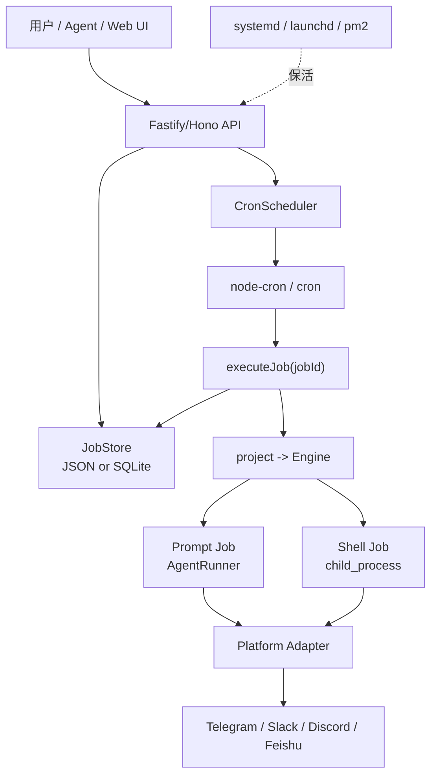

# CC-Connect 定时任务架构为什么用 Go，以及 JavaScript 可行性分析

## 结论

CC-Connect 的定时任务方案本身不要求必须使用 Go。

如果是继续改 CC-Connect 这个项目本体，Go 基本是必须的，因为核心架构已经全部建立在 Go 的结构体、接口、goroutine、context、文件系统和进程管理能力之上。

如果是基于 CC-Connect 的方案重新实现另一套系统，可以使用 JavaScript/TypeScript。需要保留的是架构能力，不是 Go 语言本身。

## 为什么 CC-Connect 本体必须用 Go

CC-Connect 的核心模块都已经是 Go 代码：

- `core.Engine`
- `core.CronScheduler`
- `core.CronStore`
- `core.Platform`
- `core.Agent`
- `core.APIServer`
- `core.ManagementServer`
- `daemon/systemd`
- `daemon/launchd`

这些模块之间通过 Go interface、struct、mutex、context 和 goroutine 协作。比如定时任务触发后，`CronScheduler` 会按 `project` 找到对应 `Engine`，再调用 `Engine.ExecuteCronJob(job)`，把任务变成虚拟消息注入 Agent 会话。

这不是一个可以直接把某个文件换成 JavaScript 的结构。JavaScript 代码不能直接实现 Go interface，也不能直接被 Go 的 `Engine` 当成 `Platform`、`Agent` 或 `CronScheduler` 调用。

如果强行混用，只能通过进程边界通信：

- HTTP API
- Unix socket
- WebSocket
- CLI 子进程
- Bridge adapter
- JSON-RPC

也就是说，JavaScript 可以作为外部模块接入，但不能无缝替换 Go 内部模块。

## Go 在 CC-Connect 里的实际价值

### 1. 单文件二进制发布

CC-Connect 是一个 CLI + daemon + 本地 API + 多平台机器人桥接工具。Go 可以打包成单个二进制文件。

用户安装后通常只需要：

```bash
cc-connect
```

不需要 Node.js runtime，不需要 `npm install`，也不需要维护庞大的依赖目录。这对一个要跑在服务器、个人电脑、NAS 或后台服务里的工具很重要。

### 2. 常驻进程稳定

CC-Connect 需要长期运行：

- 监听 Telegram、Feishu、Discord、Slack 等平台消息
- 维护 Agent 会话
- 维护定时任务
- 管理本地 Unix socket API
- 启动和停止外部 Agent 子进程
- 处理 shell 命令
- 写入本地状态文件

Go 的 goroutine、`context.Context`、`sync.Mutex` 非常适合这种长期运行的后台服务。

定时任务触发时，代码里会启动 goroutine 执行任务，再用 timeout 等待结果。这种并发写法在 Go 里很自然。

### 3. 系统集成能力强

CC-Connect 不只是 Web 服务，还要做很多系统层事情：

- systemd service
- launchd service
- Unix socket
- 文件权限
- 原子写文件
- 子进程启动
- shell command 执行
- 日志文件
- daemon 安装、启动、停止、重启

这些在 Go 标准库里都比较直接。项目里的 `daemon/systemd.go`、`daemon/launchd.go`、`core/api.go`、`core/atomicwrite.go` 都是典型系统工具代码。

### 4. 并发模型清晰

定时任务系统里有几个并发点：

- 多个 cron job 可能同时触发
- 一个任务触发后要异步调用 Agent
- 一个 session 可能正在被用户消息占用
- 任务执行要有 timeout
- 任务完成后要写回 `last_run`、`last_error`
- 平台消息发送也可能失败

Go 的写法是：

```go
go func() {
    done <- engine.ExecuteCronJob(job)
}()

select {
case err = <-done:
case <-time.After(timeout):
    err = fmt.Errorf("job timed out")
}
```

这种模型非常适合 CC-Connect 当前的调度器设计。

### 5. 依赖环境更可控

如果用 Node.js，需要用户机器上有：

- Node runtime
- npm/pnpm/yarn
- 正确版本的依赖
- 原生模块编译环境
- 进程管理工具

而 Go 编译后的二进制更像系统工具。对 CC-Connect 这种面向最终用户的 CLI/daemon 产品，Go 的部署体验更稳。

## JavaScript 可以实现同样架构吗

可以。

CC-Connect 的定时任务方案本质是这套架构：

```text
任务模型
  -> 持久化存储
  -> 进程内 cron 调度器
  -> 项目/会话路由
  -> Agent 或 shell 执行
  -> 平台主动消息回传
  -> 管理 API / CLI / Web UI
```

这些能力 JavaScript/TypeScript 都能实现。

对应关系可以是：

| CC-Connect Go 模块 | JavaScript/TypeScript 替代 |
|---|---|
| `core.CronJob` | TypeScript interface/type |
| `core.CronStore` | JSON 文件、SQLite、Postgres |
| `core.CronScheduler` | `node-cron`、`cron`、`bree`、`agenda` |
| `core.Engine` | Node service / orchestrator |
| `core.Platform` | Telegram/Slack/Discord SDK adapter |
| `core.Agent` | `child_process.spawn()` 包装 |
| `core.APIServer` | Fastify / Hono / Express |
| `core.ManagementServer` | Fastify / Hono / Express REST API |
| `daemon/systemd/launchd` | systemd/launchd 配置、PM2、node-windows |
| `context.WithTimeout` | `AbortController` / timeout promise |
| `sync.Mutex` | async mutex / queue / per-session lock |

## 用 JavaScript 复刻时的推荐技术方案

推荐使用 TypeScript，而不是裸 JavaScript。

一套比较接近 CC-Connect 的实现可以是：

```text
Runtime: Node.js + TypeScript
Cron: cron 或 node-cron
API: Fastify 或 Hono
Store: SQLite 或 JSON + atomic write
Agent Runner: child_process.spawn
Shell Runner: child_process.spawn + AbortController
Daemon: systemd / launchd / pm2
Web UI: React
Logs: pino
```

如果任务量不大，可以用 JSON 文件存储。

如果任务会很多，或者需要更强查询、并发写入和审计，建议直接用 SQLite。

## JavaScript 版本必须补齐的能力

不要只写一个 `setInterval`。如果要复刻 CC-Connect 的效果，至少要有这些能力：

### 1. 任务持久化

进程重启后必须能恢复任务。

```text
dataDir/crons/jobs.json
```

或者：

```text
SQLite: scheduled_jobs table
```

### 2. 任务注册和反注册

每个任务要记录 cron 库返回的 handler/job instance。

需要支持：

- 新增任务后立即注册
- 删除任务后停止注册项
- 禁用任务后停止注册项
- 修改 cron 表达式后重新注册
- 重启后只恢复 enabled=true 的任务

### 3. 触发时重新读取任务

不要在 callback 里闭包保存完整任务对象。

推荐只保存 job ID：

```ts
cron.schedule(job.cronExpr, () => executeJob(job.id));
```

执行时再从 store 读取最新任务：

```ts
const job = await store.get(jobId);
```

这样修改 prompt、session、project 后，下次触发能使用最新值。

### 4. 会话锁

如果同一个用户会话正在处理消息，定时任务又触发，必须决定策略：

- 直接失败并记录 `last_error`
- 排队
- 新建旁路会话
- 强制打断

CC-Connect 的 reuse 模式是 session 忙就返回错误；`new_per_run` 模式会创建旁路会话。

### 5. 超时处理

Shell 任务可以用 `AbortController` 真正取消子进程。

Prompt/Agent 任务如果只是 timeout promise，可能只是“不再等待”，底层 Agent 仍在跑。需要明确是否要中断 Agent 子进程。

### 6. 主动消息能力

定时任务触发时没有新的用户入站消息，所以平台 adapter 必须能从 `session_key` 重建发送目标。

例如：

```text
telegram:<chatId>:<threadId>:<userId>
slack:<channelId>:<userId>
discord:<channelId>:<userId>
```

没有这个能力，任务即使执行了，也不知道发回哪里。

### 7. silent 和 mute 要分开

建议保留这两个概念：

- `silent`：不发“任务开始执行”通知，但发最终结果
- `mute`：开始通知和最终结果都不发，只记录运行状态

### 8. last_run / last_error

每次执行后必须写回：

- 最近运行时间
- 最近错误
- 成功时清空错误

否则用户无法判断任务是否真的运行过。

## JavaScript 版本的最小架构示意



## TypeScript 伪代码

```ts
interface CronJob {
  id: string;
  project: string;
  sessionKey: string;
  cronExpr: string;
  prompt?: string;
  exec?: string;
  enabled: boolean;
  silent?: boolean;
  mute?: boolean;
  sessionMode?: 'reuse' | 'new_per_run';
  timeoutMins?: number | null;
  createdAt: string;
  lastRun?: string;
  lastError?: string;
}

class CronScheduler {
  private entries = new Map<string, { stop(): void }>();

  constructor(
    private store: CronStore,
    private engines: Map<string, Engine>,
  ) {}

  async start() {
    const jobs = await this.store.list();
    for (const job of jobs) {
      if (job.enabled) this.schedule(job);
    }
  }

  async addJob(job: CronJob) {
    validateCronJob(job);
    await this.store.add(job);
    if (job.enabled) this.schedule(job);
  }

  private schedule(job: CronJob) {
    this.entries.get(job.id)?.stop();

    const entry = cron.schedule(job.cronExpr, () => {
      void this.executeJob(job.id);
    });

    this.entries.set(job.id, entry);
  }

  private async executeJob(jobId: string) {
    const job = await this.store.get(jobId);
    if (!job || !job.enabled) return;

    const engine = this.engines.get(job.project);
    if (!engine) {
      await this.store.markRun(jobId, new Error(`project not found: ${job.project}`));
      return;
    }

    let error: Error | null = null;
    try {
      await withTimeout(
        engine.executeCronJob(job),
        job.timeoutMins == null ? 30 * 60_000 : job.timeoutMins * 60_000,
      );
    } catch (e) {
      error = e instanceof Error ? e : new Error(String(e));
    }

    await this.store.markRun(jobId, error);
  }
}
```

## 什么时候应该选 Go

适合选 Go 的情况：

- 想做单文件二进制分发
- 主要是后台 daemon / CLI 工具
- 强系统集成：进程、权限、socket、service、文件系统
- 希望部署时不依赖 Node runtime
- 并发任务多，长期运行稳定性要求高

CC-Connect 就属于这一类。

## 什么时候可以选 JavaScript/TypeScript

适合选 JS/TS 的情况：

- 产品本身就是 Web/Electron/Node 技术栈
- 团队更熟悉 TypeScript
- 平台 SDK 在 Node 生态更成熟
- 需要快速迭代管理后台
- 可接受安装 Node runtime 或使用 pkg/nexe/bun 打包
- 定时任务规模中小，进程模型可控

如果新系统的主形态是 Web 管理后台 + Node 服务，TypeScript 是完全合理的。

## 最终判断

CC-Connect 当前项目本体：继续用 Go。

基于 CC-Connect 定时任务思想另起一套系统：可以用 JavaScript/TypeScript。

真正不能丢的是这些架构原则：

1. 任务必须持久化。
2. 调度器必须可启动恢复。
3. job ID 与 cron entry 必须有映射。
4. 任务触发时必须重新读取最新任务。
5. Prompt 任务要复用统一消息执行链路。
6. Shell 任务要有超时和输出限制。
7. 平台必须支持主动消息回传。
8. 运行结果必须写回 `last_run` 和 `last_error`。
9. daemon 只负责保活进程，不负责逐条任务调度。

只要这些设计保留，语言可以换。
