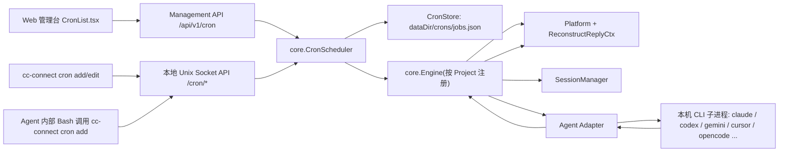
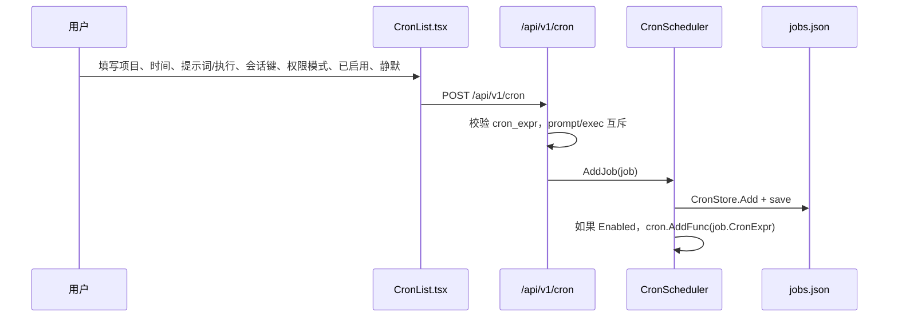
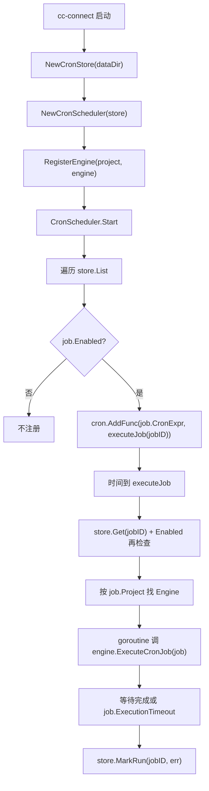
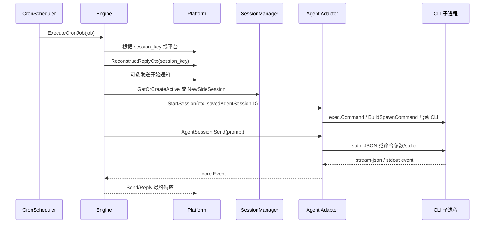

# CC Connect 定时任务拉起 Agent / 执行命令方案说明书

本文基于 `/Users/liyang/Documents/code/demo/cc-connect-main` 源码重新阅读整理，覆盖定时任务里“提示词”和“执行命令”两类任务从配置、持久化、调度、会话定位、Agent 子进程启动到结果回传的完整方案。

## 1. 结论

CC Connect 的定时任务不是依赖一个已经打开的 Claude Code、Codex 或其他 Agent 窗口。它依赖正在后台运行的 `cc-connect` 主进程。到触发时间后，后台调度器会把任务构造成一条“合成用户消息”，交给项目对应的 `core.Engine`。Engine 再按普通聊天消息的路径启动或复用 Agent 适配器，适配器用 `os/exec` 拉起本机 CLI 子进程，并通过 stdin/stdout 或一次性命令参数把 prompt 发给 Agent。

如果任务类型是“提示词”，走 Agent 会话：`CronScheduler.executeJob -> Engine.ExecuteCronJob -> processInteractiveMessageWith -> Agent.StartSession -> AgentSession.Send`。

如果任务类型是“执行”，不走 Agent，对 `job.Exec` 直接执行 shell：`exec.CommandContext(ctx, "sh", "-c", job.Exec)`，然后把 stdout/stderr 合并后的结果发回原会话。

## 2. 产品设计

### 2.1 任务类型

Web 管理台在 `web/src/pages/Cron/CronList.tsx` 定义本地表单类型：

- `JobForm._type: 'prompt' | 'exec'`，见 `CronList.tsx:160-171`。
- 点击“提示词 / 执行”切换时只保留一边的字段，保存时 `activePrompt` 和 `activeExec` 互斥，见 `CronList.tsx:253-278`。
- 后端也强制互斥：`core/api.go:242-248`、`core/management.go:1492-1498`。

对应后端数据结构是 `core.CronJob`：

- `Prompt string`：发送给 Agent 的提示词，见 `core/cron.go:27`。
- `Exec string`：直接执行的 shell command，注释明确“mutually exclusive with Prompt”，见 `core/cron.go:28`。
- `IsShellJob()` 判断 `Exec != ""`，见 `core/cron.go:42-45`。

### 2.2 会话键

“会话键”是平台消息上下文的稳定路由键，用来回答两个问题：

1. 定时任务结果应该主动发回哪个 IM 聊天 / 群 / 线程；
2. 这次任务应该复用哪一个 CC Connect 内部会话和 Agent 侧会话。

统一字段在 `core.Message.SessionKey`，注释示例是 `feishu:{chatID}:{userID}`，见 `core/message.go:139-156`。

不同平台自己生成会话键：

- Telegram：`telegram:{chatID}`、`telegram:{chatID}:{userID}`、带 topic 时再加 `threadID`，见 `platform/telegram/telegram.go:539-550`。
- Slack：共享频道时 `slack:{channel}`，否则 `slack:{channel}:{user}`，见 `platform/slack/slack.go:137-142`、`189-194`。
- Feishu/Lark：共享频道、按用户隔离、线程隔离分别生成不同 key，见 `platform/feishu/feishu.go:2331-2345`。

Web 表单的会话键下拉来自管理 API `listSessions(project)`，前端只收集已有 session 的 `session_key`，见 `web/src/pages/Cron/CronList.tsx:198-209`、`web/src/api/sessions.ts:30-31`。管理端从 `SessionManager.SessionKeyMap()` 反查 session id 到 session key，见 `core/management.go:916-970`、`core/session.go:465-480`。

### 2.3 已启用、静默、Mute

`已启用` 对应 `CronJob.Enabled`，见 `core/cron.go:31`。启动调度器时只注册 enabled 任务，见 `core/cron.go:448-456`；触发时再次检查，见 `core/cron.go:628-631`。禁用任务会从 robfig/cron 中移除，见 `core/cron.go:504-514`。

`静默` 对应 `CronJob.Silent *bool`，见 `core/cron.go:32`。它只抑制任务开始时那条 `⏰ 描述` 通知，不抑制最终结果。逻辑在 `Engine.ExecuteCronJob`：非 mute 且非 silent 才发送开始通知，见 `core/engine.go:1020-1036`。全局默认值在 `[cron].silent`，见 `config/config.go:114-118`，启动时写入 scheduler，见 `cmd/cc-connect/main.go:712-719`。

`Mute` 是更强的静默，Web 表单目前没有暴露，但数据模型有 `CronJob.Mute`，见 `core/cron.go:33`。Mute 时 Engine 用 `mutePlatform` 包一层平台，`Reply/Send` 直接丢弃消息，见 `core/cron.go:672-679`、`core/engine.go:1014-1018`，因此开始通知和结果都不会发出。它可通过 `/cron mute`、`/cron unmute` 或 CLI edit 字段修改，见 `core/engine.go:9626-9640`、`cmd/cc-connect/cron.go:452-469`。

### 2.4 权限模式

`权限模式` 是 Agent 工具调用审批策略。数据字段是 `CronJob.Mode`，见 `core/cron.go:35`。创建和更新时只允许 `default`、`bypassPermissions`、`acceptEdits`、`plan`、`auto`、`dontAsk`，见 `core/cron.go:88-93`、`536-544`。Web 端写死的选项也是这些，见 `web/src/pages/Cron/CronList.tsx:13`。

触发 prompt 任务时，`job.Mode` 被放进 `Message.ModeOverride`，见 `core/engine.go:1043-1051`。真正应用发生在 `processInteractiveMessageWith`：如果运行中的 `AgentSession` 实现了 `LiveModeSwitcher`，就调用 `SetLiveMode(msg.ModeOverride)`，并在本轮结束后恢复项目默认模式，见 `core/engine.go:2128-2144`。接口定义在 `core/interfaces.go:448-452`。

Claude Code 支持这些模式：

- 模式含义在 `agent/claudecode/claudecode.go:30-35`。
- 别名归一化在 `agent/claudecode/claudecode.go:225-241`。
- 显示说明在 `agent/claudecode/claudecode.go:673-683`。
- 运行时切换在 `agent/claudecode/session.go:663-677`。
- `bypassPermissions` 会自动 allow，`acceptEdits` 会自动 allow 编辑工具，`dontAsk` 会自动 deny，见 `agent/claudecode/session.go:468-490`。

注意：Codex 自己的模式是 `suggest`、`auto-edit`、`full-auto`、`yolo`，见 `agent/codex/codex.go:23-30`、`623-629`。但 Cron `Mode` 校验和 Web 选项是 Claude 风格；而 `agent/codex/session.go` 没有实现 `LiveModeSwitcher`。因此“Cron 单任务权限模式覆盖”在当前源码里主要对 Claude Code / ACP 这类支持 LiveMode 的 Agent 有效；Codex 更依赖项目 agent 默认 `mode`，见 `agent/codex/codex.go:315-351`。

## 3. 架构设计



关键抽象：

- `core.Platform` 负责收消息和发消息，见 `core/interfaces.go:8-15`。
- `ReplyContextReconstructor` 允许定时任务在没有新入站消息时重建回复上下文，见 `core/interfaces.go:20-25`。
- `core.Agent` 抽象 Agent 类型，要求 `StartSession(ctx, sessionID)`，见 `core/interfaces.go:231-240`。
- `core.AgentSession` 抽象运行中的 Agent 会话，要求 `Send(prompt, images, files)`、`Events()`、`CurrentSessionID()`、`Close()`，见 `core/interfaces.go:242-255`。

## 4. 配置与创建流程

### 4.1 Web 管理台创建



前端入口：

- `listCronJobs/createCronJob/updateCronJob/deleteCronJob` 在 `web/src/api/cron.ts:23-27`。
- 保存逻辑在 `CronList.tsx:253-286`。
- `enabled`、`silent` toggle 在 `CronList.tsx:508-511`。

管理 API：

- `GET/POST /api/v1/cron` 在 `core/management.go:1465-1540`。
- `PATCH/DELETE /api/v1/cron/{id}` 在 `core/management.go:1543-1584`。
- POST 时构造 `CronJob` 在 `core/management.go:1516-1531`。

### 4.2 CLI / Agent 自己创建

Agent 系统提示告诉 Agent 可以用 Bash 工具执行：

```bash
cc-connect cron add --cron "<min> <hour> <day> <month> <weekday>" --prompt "<task description>" --desc "<short label>"
```

这段提示来自 `core.AgentSystemPrompt()`，见 `core/interfaces.go:77-97`。Engine 在启动 Agent 会话前注入：

- `CC_PROJECT=<project>`；
- `CC_SESSION_KEY=<session key>`；
- 把当前 `cc-connect` 可执行文件目录加到 `PATH`。

注入代码在 `core/engine.go:2370-2385`。所以 Agent 在 Claude/Codex 内部调用 `cc-connect cron add` 时，CLI 可以从环境变量自动知道项目和会话键。CLI 解析在 `cmd/cc-connect/cron.go:42-155`，其中 `CC_PROJECT`、`CC_SESSION_KEY` fallback 在 `cmd/cc-connect/cron.go:107-113`。CLI 通过本地 Unix socket `/run/api.sock` 调 `POST /cron/add`，见 `cmd/cc-connect/cron.go:135-158`、`core/api.go:38-75`。

本地 Unix API 的 Cron 创建逻辑在 `core/api.go:223-309`。如果 `session_key` 没传，且目标项目只有一个 active session，会自动选择它，见 `core/api.go:267-284`。

## 5. 调度和触发流程



启动 wiring：

- `cmd/cc-connect/main.go:706-724` 创建 `CronStore`、`CronScheduler`，注册每个项目 Engine，并把 Scheduler 写回 Engine。
- `cmd/cc-connect/main.go:749-753` 启动调度器。

调度器：

- `CronStore` 持久化到 `dataDir/crons/jobs.json`，见 `core/cron.go:108-135`。
- `CronScheduler.Start()` 注册所有 enabled job，见 `core/cron.go:448-459`。
- `scheduleJob()` 用 `github.com/robfig/cron/v3` 的 `AddFunc`，见 `core/cron.go:608-626`。
- `executeJob()` 找项目 Engine，异步执行并按 timeout 等待，见 `core/cron.go:628-670`。
- 默认超时是 30 分钟，`timeout_mins = 0` 表示无限等待，见 `core/cron.go:47-60`。

## 6. Prompt 任务如何拉起 Agent



`Engine.ExecuteCronJob()` 的关键步骤：

1. 从 `job.SessionKey` 取平台名前缀，比如 `telegram`、`slack`，见 `core/engine.go:951-963`。
2. 多工作区场景下允许 `workspace:path:platform:...` 前缀，找不到平台时会在 key 中搜索 `:<platform>:` 并剥离，见 `core/engine.go:964-977`。
3. 要求平台实现 `ReplyContextReconstructor`，否则无法主动发消息，见 `core/engine.go:982-985`。
4. 非 mute 情况下可调用平台 `CronReplyTargetResolver` 创建/选择实际回复目标，见 `core/engine.go:987-1005`。
5. 通过 `ReconstructReplyCtx(runSessionKey)` 重建回复上下文，见 `core/engine.go:1007-1012`。
6. 非 `silent` 且非 `mute` 时发送开始通知，见 `core/engine.go:1020-1036`。
7. 如果是 prompt job，构造 `core.Message`，`Content=job.Prompt`，`UserID/UserName=cron`，`ModeOverride=job.Mode`，见 `core/engine.go:1043-1051`。
8. 多工作区或 `job.WorkDir` 可切换到工作区专属 Agent / SessionManager，见 `core/engine.go:1053-1084`。
9. 根据 `session_mode` 决定复用 active session 还是每次创建 side session，见 `core/engine.go:1086-1118`。

`processInteractiveMessageWith()` 的关键步骤：

- `session.AddHistory("user", msg.Content)` 保存用户侧历史，见 `core/engine.go:2092-2096`。
- `getOrCreateInteractiveStateWith()` 创建/复用运行中的 AgentSession，见 `core/engine.go:2102`、`2324-2481`。
- 给 Agent 子进程注入 `CC_PROJECT`、`CC_SESSION_KEY`、`PATH`，见 `core/engine.go:2370-2385`。
- 调用 `agent.StartSession(e.ctx, startSessionID)`。如果 resume 失败，会清空重新启动 fresh session，见 `core/engine.go:2408-2430`。
- 将本轮 prompt 通过 goroutine 调 `state.agentSession.Send(...)`，见 `core/engine.go:2166-2182`。
- `processInteractiveEvents()` 并行读 Agent event，最终在 `EventResult` 保存 Agent session id、保存 assistant 历史、把最终文本发给平台，见 `core/engine.go:2579-2665`、`2934-3064`。

## 7. Claude Code 适配器实现

Claude Code 是最完整的长驻 stdin/stdout 会话实现。

`Agent.StartSession()`：

- Agent 注册名是 `claudecode`，见 `agent/claudecode/claudecode.go:23-25`。
- 默认 CLI binary 是 `claude`，`cli_path` 可覆盖，见 `agent/claudecode/claudecode.go:106-123`。
- 非 run_as_user 时会 `exec.LookPath(cliBin)` 检查本机 CLI，见 `agent/claudecode/claudecode.go:180-187`。
- `StartSession` 收集 model、effort、provider env、platformPrompt，然后调用 `newClaudeSession(...)`，见 `agent/claudecode/claudecode.go:381-414`。

`newClaudeSession()`：

- 构造 CLI 参数 `--output-format stream-json --input-format stream-json --permission-prompt-tool stdio`，见 `agent/claudecode/session.go:54-64`。
- 非默认权限模式追加 `--permission-mode <mode>`，见 `agent/claudecode/session.go:69-71`。
- 如果有已保存 Agent session id，追加 `--resume <sessionID>`，见 `agent/claudecode/session.go:72-79`。
- 注入 `AgentSystemPrompt()` 到 `--append-system-prompt`，让 Agent 知道 `cc-connect cron add` 等工具，见 `agent/claudecode/session.go:87-92`。
- 追加 `--model`、`--effort`、`--max-context-tokens` 等，见 `agent/claudecode/session.go:94-105`。
- 用 `core.BuildSpawnCommand(...)` 创建命令，设置 `cmd.Dir = workDir`，过滤环境并合并 `CC_PROJECT/CC_SESSION_KEY`，见 `agent/claudecode/session.go:140-153`。
- 建立 stdin/stdout pipe，`cmd.Start()` 后启动 `readLoop`，见 `agent/claudecode/session.go:170-206`。

`claudeSession.Send()`：

- 没有附件时，向 Claude stdin 写一行 JSON：

```json
{"type":"user","message":{"role":"user","content":"<prompt>"}}
```

代码见 `agent/claudecode/session.go:517-527`。

- 最终写入由 `writeJSON()` 完成，`json.Marshal` 后追加 `\n` 写 stdin，见 `agent/claudecode/session.go:640-652`。

`readLoop` 解析 Claude 输出：

- 每行 stdout 按 JSON 解码，按 `type` 分发，见 `agent/claudecode/session.go:301-330`。
- `system` 事件保存 `session_id`，见 `agent/claudecode/session.go:332-341`。
- `assistant` 文本 / thinking / tool_use 转成 `core.Event`，见 `agent/claudecode/session.go:344-392`。
- `result` 事件转成 `EventResult`，见 `agent/claudecode/session.go:419-450`。
- `control_request` 是权限请求；自动通过 / 自动拒绝 / 抛给用户审批在 `agent/claudecode/session.go:453-510`。

## 8. Codex 适配器实现

Codex 当前有两种 backend：默认 `exec` 和 `app_server`。

`Agent.StartSession()`：

- Agent 注册名是 `codex`，见 `agent/codex/codex.go:19-21`。
- 初始化时要求本机 PATH 有 `codex` CLI，见 `agent/codex/codex.go:62-64`。
- `StartSession` 收集 mode、model、reasoning effort、provider env、CODEX_HOME 等，见 `agent/codex/codex.go:315-333`。
- 如果配置了 provider，会写 Codex provider config / auth，见 `agent/codex/codex.go:335-341`。
- `backend == "app_server"` 时走 `newAppServerSession`，否则走 `newCodexSession`，见 `agent/codex/codex.go:344-351`。

默认 exec backend：

- `newCodexSession()` 只是创建会话对象；如果有 resume id，存入 `threadID`，见 `agent/codex/session.go:64-86`。
- `Send()` 每轮都会拉起一个 `codex` 子进程，见 `agent/codex/session.go:89-136`。
- 首轮参数是 `codex exec --skip-git-repo-check ... --json --cd <workDir> -`，resume 时是 `codex exec resume --skip-git-repo-check ... <threadID> --json -`，见 `agent/codex/session.go:166-214`。
- prompt 通过 stdin 传入：`cmd.Stdin = strings.NewReader(prompt)`，见 `agent/codex/session.go:111-118`。
- stdout 按 JSON line 读，见 `agent/codex/session.go:229-275`；`thread.started` 保存 thread id，`turn.completed` 发 `EventResult`，见 `agent/codex/session.go:302-339`。

app_server backend：

- `newAppServerSession()` 会先 `connect()`，再 `initialize()`，再 `ensureThread(resumeID)`，见 `agent/codex/appserver_session.go:158-193`。
- `connect()` 启动 `codex app-server --listen <url>`，实际仍是本机子进程，stdio 作为传输，见 `agent/codex/appserver_session.go:196-238`。

## 9. 其他 Agent 的共同模式

其他 Agent 也都遵守同一个 `core.AgentSession.Send()` 抽象，但实现方式不同：

- Gemini：`gemini --output-format stream-json -p <prompt>`，resume 时追加 `--resume`，见 `agent/gemini/session.go:66-149`。
- Cursor：`agent --print --output-format stream-json --trust ... --workspace <dir> -- <prompt>`，见 `agent/cursor/session.go:62-108`。
- OpenCode：`opencode run --format json [--session id] --model ... --dir ... <prompt>`，见 `agent/opencode/session.go:60-115`。
- iFlow：每轮通过 PTY 启动 `iflow -i <prompt>`，可加 `--yolo/--plan/--autoEdit` 和 `-r <session>`，见 `agent/iflow/session.go:119-205`。

因此“不开 Agent 窗口”成立的前提是：`cc-connect` 自己在后台运行，并且目标 CLI 已安装、在 PATH 或配置路径中可用。它不是向一个 GUI 窗口输入文字，而是把 CLI 当作子进程和 JSON/stdio 协议端点。

## 10. “执行 / NPM 命令”如何执行

执行任务不进入 Agent，不会调用 Claude/Codex。流程在 `Engine.ExecuteCronJob()` 中提前分叉：

- `job.IsShellJob()` 为 true 时直接 `return e.executeCronShell(...)`，见 `core/engine.go:1039-1041`。
- `executeCronShell()` 先确定工作目录：优先 `job.WorkDir`，否则如果 Agent 有 `GetWorkDir()` 就用 Agent 工作目录，再 fallback 当前进程工作目录，见 `core/engine.go:1141-1150`。
- 创建 timeout context，见 `core/engine.go:1152-1160`。
- 执行方式是：

```go
cmd := exec.CommandContext(ctx, "sh", "-c", job.Exec)
cmd.Dir = workDir
output, err := cmd.CombinedOutput()
```

代码见 `core/engine.go:1162-1164`。

所以用户在执行任务里填 `npm run report`，本质就是在选定工作目录下执行：

```bash
sh -c "npm run report"
```

成功时发送 `⏰ ✅ <command>\n\n<output>`，失败时发送 `⏰ ❌ <command>\n\n<output>\n\nerror: ...`，超时时发送 timeout，见 `core/engine.go:1166-1185`。

需要注意：这里没有为 npm 做特殊处理，也没有加载交互式 shell profile。`npm` 必须在 `cc-connect` 进程的环境 PATH 中可见，或者命令里写绝对路径 / 显式加载环境。

## 11. 会话模式 session_mode

`CronJob.SessionMode` 控制 prompt 任务使用哪个 CC Connect 内部 session：

- 空或 `reuse`：复用会话键对应的 active session；
- `new_per_run` / `new-per-run`：每次触发创建一个 side session，不改用户当前 active session。

归一化在 `core/cron.go:68-81`，校验在 `core/cron.go:83-87`。

执行时：

- Scheduler 先看 job 自己的 `SessionMode`，没有则用全局 `[cron].session_mode`，见 `core/cron.go:439-446`。
- `new_per_run` 时调用 `sessions.NewSideSession(runSessionKey, "cron-"+job.ID)`，interactive key 变成 `<runSessionKey>#cron:<session.ID>`，结束后 `cleanupInteractiveState(iKey)`，见 `core/engine.go:1093-1105`。
- reuse 时调用 `sessions.GetOrCreateActive(sessionKey)`，见 `core/engine.go:1108-1118`。

## 12. 实现另一套系统的代码方案

可以按下面的模块切分复制这个方案：

1. `CronJob` 模型：字段至少包含 `id/project/session_key/cron_expr/prompt/exec/work_dir/enabled/silent/mute/session_mode/mode/timeout/last_run/last_error`。
2. `CronStore`：JSON 或 DB 持久化，Add/Update/Enable/Disable/MarkRun 原子化；参考 `core/cron.go:101-288`。
3. `CronScheduler`：用 robfig/cron 或系统 timer，启动时注册 enabled job，触发时按 project 查 Engine，参考 `core/cron.go:397-670`。
4. `PlatformRegistry`：每个平台必须能从 session_key 重建主动回复上下文，等价于 `ReplyContextReconstructor`。
5. `SessionManager`：维护 `session_key -> internal session -> agent_session_id`，并支持 active session 与 side session，参考 `core/session.go:250-289`。
6. `Engine.ExecuteCronJob`：把 prompt job 伪造成普通消息，把 exec job 走 shell 分支；参考 `core/engine.go:940-1118`、`1141-1185`。
7. `Agent` 适配器接口：`StartSession(ctx, sessionID)` 和 `AgentSession.Send(prompt)`；参考 `core/interfaces.go:231-255`。
8. `Agent 子进程协议`：Claude 适合长驻 stdin/stdout stream-json；Codex/Gemini/OpenCode/Cursor 可按每轮命令执行并从 stdout 读 JSON。
9. `权限处理`：抽象 project 默认 mode 和 per-message mode override；只对支持 live switch 的 session 生效，不能假设所有 CLI 都能运行时切换。
10. `结果回传`：Agent stdout event -> 统一 `EventText/EventToolUse/EventPermissionRequest/EventResult` -> 平台 `Send/Reply`。

最小伪代码：

```go
func executeJob(job CronJob) error {
  engine := engines[job.Project]
  if job.Exec != "" {
    return engine.runShell(job)
  }
  p := platforms[prefix(job.SessionKey)]
  replyCtx := p.ReconstructReplyCtx(job.SessionKey)
  session := sessions.GetOrCreateActive(job.SessionKey)
  agentSession := agent.StartSession(ctx, session.AgentSessionID)
  agentSession.Send(job.Prompt, nil, nil)
  for ev := range agentSession.Events() {
    if ev.Type == EventResult {
      session.AgentSessionID = agentSession.CurrentSessionID()
      p.Send(replyCtx, ev.Content)
      return nil
    }
  }
  return nil
}
```

## 13. 注意点

1. 定时任务必须依赖 `cc-connect` 后台进程存活；Agent GUI/终端窗口不需要打开，但 CLI binary 必须可执行。
2. 会话键必须来自真实平台会话；随便填一个 key 会导致 `ReconstructReplyCtx` 失败或消息发错位置。
3. 没有实现 `ReplyContextReconstructor` 的平台不能支持 cron 主动消息，`Engine.ExecuteCronJob` 会报错，见 `core/engine.go:982-985`。
4. `silent` 只隐藏开始通知，不隐藏结果；`mute` 才隐藏全部消息。
5. `exec` 任务是直接 shell 执行，风险高；聊天命令 `/cron addexec` 要求 admin，见 `core/engine.go:9496-9500`，但 Web/API 创建 exec 任务没有同样的用户级 admin 判断，部署时应靠管理端鉴权。
6. `exec` 使用 `sh -c`，Windows 或没有 `sh` 的环境要改跨平台 shell 选择。
7. `timeout_mins` 同时影响调度器等待和 shell context；prompt 任务超时后 Engine 中的 Agent turn 未必被立刻取消，当前实现只是调度器记录 timeout。
8. 权限模式覆盖不是所有 Agent 都生效；Claude Code 支持较完整，Codex 的 Cron per-job mode 当前基本不生效。
9. `new_per_run` 避免污染用户当前 active session，但会产生更多 Agent 会话和历史文件。
10. Agent 内部调用 `cc-connect cron add` 依赖 Engine 注入 `CC_PROJECT/CC_SESSION_KEY/PATH`，如果自行实现要保留这一步。
11. 多工作区模式会把 workspace 前缀混入 interactive key，`ExecuteCronJob` 有专门剥离逻辑，见 `core/engine.go:964-977`、`1099-1104`。
12. Shell 任务输出只截断到 3000 字符发送，见 `core/engine.go:1174-1184`。

