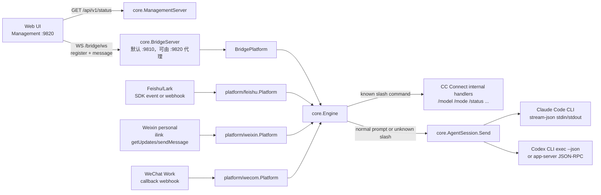
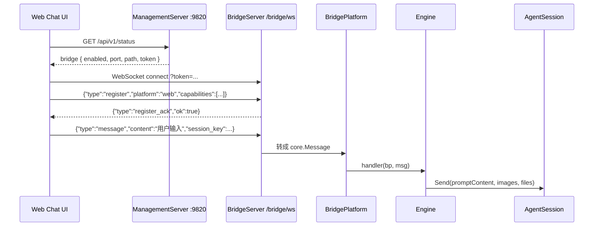
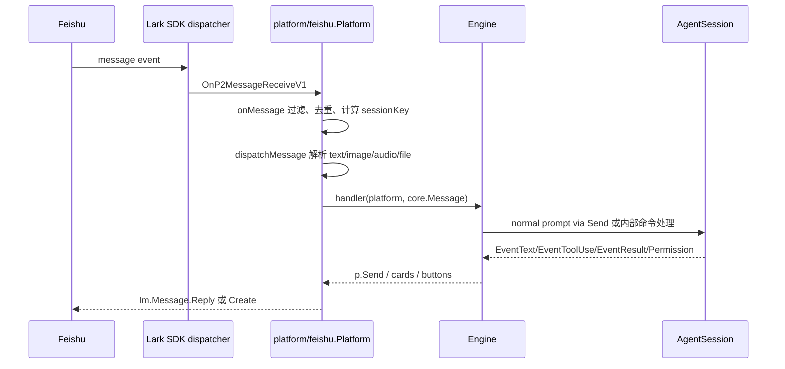
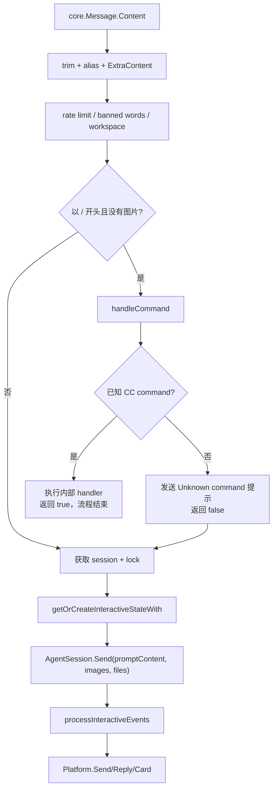
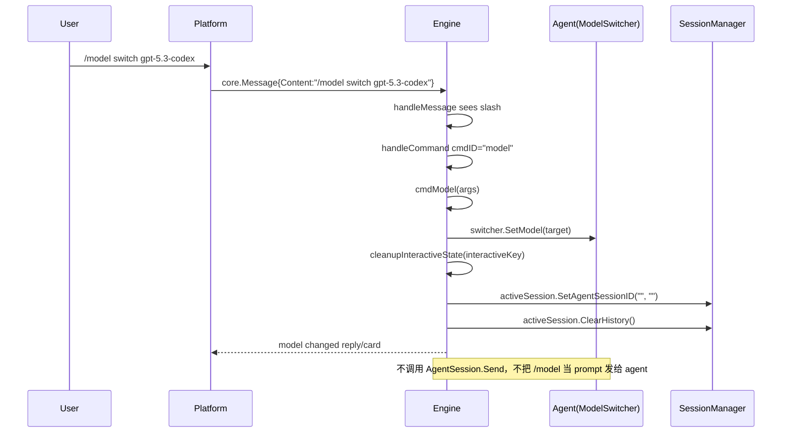
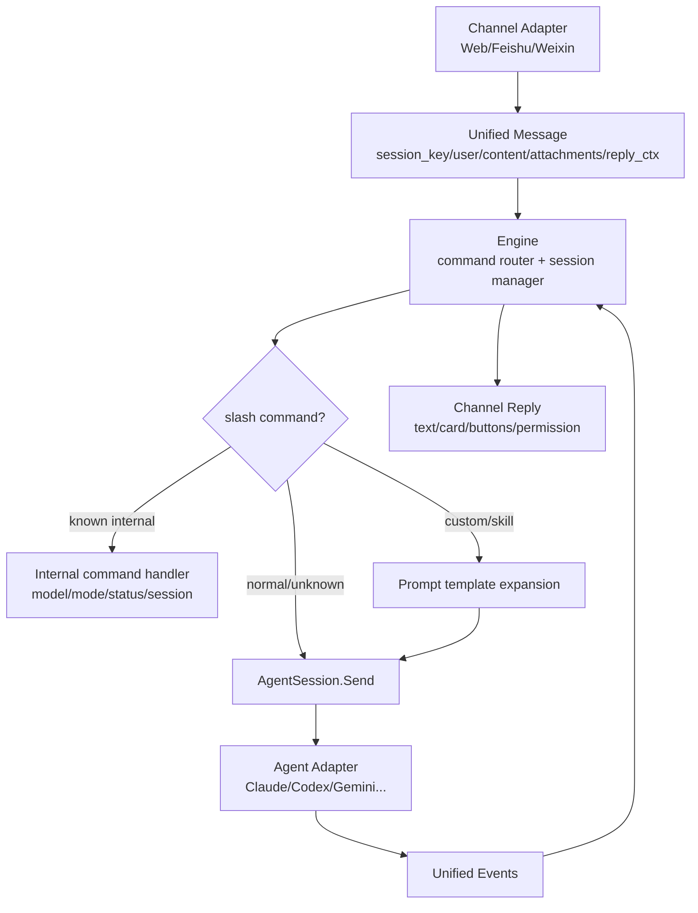

# CC Connect 消息与命令转发方案说明书

本文基于本地源码 `/Users/liyang/Documents/code/demo/cc-connect-main` 重新阅读整理。行号为当前源码快照中的 `nl -ba` 行号，后续改动可能导致行号漂移。

## 结论

CC Connect 的核心方案不是让 Web、飞书、微信直接调用 Claude Code 或 Codex 的业务 SDK。它把所有渠道统一抽象成 `core.Platform`，把所有用户输入统一成 `core.Message`，交给 `core.Engine` 做路由。

- 普通文本：按普通文本进入 `core.Message.Content`，最终通过 `AgentSession.Send(prompt, images, files)` 发给 Claude Code/Codex。
- `/model`：是 CC Connect 内置命令。它在 `Engine.handleCommand` 中被拦截，调用 `cmdModel` 修改 agent 的 `ModelSwitcher` 状态、清空当前 agent session 和历史；它不会作为文本发给 Claude Code/Codex。
- `/plan-status`：当前源码中没有 `plan-status` 或 `/plan-status` 的任何实现。它会被识别为“未知 CC Connect 命令”，先给用户发一条未知命令提示，然后继续作为普通文本发给 agent。如果底层 agent 自己理解 `/plan-status`，那是 agent 收到文本后的行为，不是 CC Connect 内部 SDK 指令。
- 飞书/微信相关 SDK 只负责收发渠道消息。真正发给 Claude Code/Codex 的动作发生在 agent 适配器：Claude Code 通过 `claude --input-format stream-json` 的 stdin/stdout JSON 流；Codex 通过 `codex exec --json` CLI stdin，或可选 `app_server` JSON-RPC。

## 产品设计

CC Connect 面向同一个产品目标：用户可以从任意聊天入口远程驱动本地 coding agent。

入口分为三类：

1. Web 管理台和聊天页：默认管理端口是 `9820`，页面由 `core.ManagementServer` 服务，聊天通过 Bridge WebSocket 接入。
2. 飞书/Lark：通过飞书官方 SDK 的事件分发器接收消息、发送回复、处理卡片按钮。
3. 微信/企业微信：个人微信使用 ilink bot HTTP API 的 long-poll；企业微信使用回调 Webhook 或 websocket 模式。

产品上，所有入口共享同一套命令语义：

- 输入框里发普通话术，就是给 agent 的 prompt。
- 输入框里发 CC Connect 已注册的 slash command，就是控制 CC Connect 本身。
- 卡片按钮不是魔法 SDK 指令。它的 `value` 仍然是协议字符串，例如 `cmd:/model switch 1`、`act:/model switch 1`、`perm:allow`，再由平台适配器转回普通 message 或卡片导航动作。
- 对不支持卡片的平台，`Engine` 会退化成纯文本加按钮或纯文本回复。

这让 CC Connect 可以把“交互界面”与“agent 执行方式”解耦：新增一个平台时，只需要实现 `Platform`；新增一个 agent 时，只需要实现 `Agent`/`AgentSession`。

## 总体架构



核心接口在 `core/interfaces.go`：

| 接口/结构 | 代码位置 | 作用 |
|---|---:|---|
| `Platform` | `core/interfaces.go:8-15` | 渠道适配器，提供 `Start(handler)`、`Reply`、`Send`、`Stop`。 |
| `MessageHandler` | `core/interfaces.go:228-229` | 平台收到消息后调用的统一入口，签名是 `func(p Platform, msg *Message)`。 |
| `Agent` | `core/interfaces.go:231-240` | agent 适配器，负责 `StartSession`、`ListSessions`、`Stop`。 |
| `AgentSession` | `core/interfaces.go:242-256` | 一个可持续对话的 agent 会话，`Send` 是最终给 agent 发 prompt 的入口。 |
| `ModelSwitcher` | `core/interfaces.go:307-315` | 支持运行时切模型的 agent 能力；注释明确模型变更在下一次 session 生效。 |
| `Message` | `core/message.go:139-157` | 所有平台入站消息的统一格式，关键字段是 `SessionKey`、`Platform`、`UserID`、`Content`、`Images`、`Files`、`ReplyCtx`。 |

入口装配在 `cmd/cc-connect/main.go`：

- `/web` 命令相关回调：`SetWebSetupFunc`、`SetWebStatusFunc`，见 `cmd/cc-connect/main.go:681-699`。
- Bridge 启动：读取 `[bridge]` 配置，默认端口 `9810`、路径 `/bridge/ws`，为每个 project 创建 `BridgePlatform` 并 `e.AddPlatform(bp)`，见 `cmd/cc-connect/main.go:757-775`。
- Management 启动：默认端口 `9820`，注册每个 engine，绑定 bridge server，见 `cmd/cc-connect/main.go:795-812`。
- Engine 启动：`Engine.Start` 遍历平台并调用 `p.Start(e.handleMessage)`，见 `core/engine.go:1253-1295`。

## Web 管理台如何发消息

Web 聊天不是调用 `/api/v1/projects/{name}/send` 作为主路径，而是走 Bridge WebSocket。



关键代码：

- `ManagementServer` 创建和端口：`core/management.go:72-80`。
- `ManagementServer.Start` 监听 `:%d`：`core/management.go:194-207`。
- `/api/v1/status` 注册：`core/management.go:210-251`。
- `handleStatus` 把 bridge 的 `port`、`path`、`token` 放到响应里：`core/management.go:391-432`。
- `withStaticFallback` 在 `9820` 上把 `m.bridgeServer.path` 的 WebSocket 请求转发给 `m.bridgeServer.handleWS`：`core/management.go:260-272`。
- Web API 客户端固定 base 为 `/api/v1`，鉴权头是 `Authorization: Bearer <token>`：`web/src/api/client.ts:1-47`。
- Web 端 `fetchBridgeConfig` 调 `/status` 获取 bridge 配置：`web/src/hooks/useBridgeSocket.ts:150-163`。
- WebSocket 地址使用当前页面 host 和 bridge path：`web/src/hooks/useBridgeSocket.ts:75-82`。这解释了为什么用户访问 `9820`，但聊天 WebSocket 仍可通过同域 `/bridge/ws` 工作。
- WebSocket open 后先发 `register`，`platform` 默认是 `web`，capabilities 包括 `text/card/buttons/typing/update_message/preview/reconstruct_reply`：`web/src/hooks/useBridgeSocket.ts:93-100`。
- 发送文本时，Web 端发出的 JSON 是：

```json
{
  "type": "message",
  "msg_id": "web-...",
  "session_key": "bridge:web-admin:<project>",
  "user_id": "web-admin",
  "user_name": "Web Admin",
  "content": "用户输入",
  "reply_ctx": "bridge:web-admin:<project>",
  "project": "<project>"
}
```

对应代码是 `web/src/hooks/useBridgeSocket.ts:48-59`。

Web 聊天页的会话 key 默认是 `bridge:web-admin:${projectName}`，见 `web/src/pages/Chat/ChatView.tsx:320-325`。真正点击发送时，`handleSend` 只是把输入内容原样传给 `bridgeSend(content)`，见 `web/src/pages/Chat/ChatView.tsx:506-522`。

Web slash command 面板只是 UI 辅助：

- `slashCommands` 列出 `/new`、`/model`、`/status` 等命令：`web/src/pages/Chat/CommandPalette.tsx:19-49`。
- 用户从面板选择命令时，仍然调用 `bridgeSend(cmd.cmd)`，见 `web/src/pages/Chat/ChatView.tsx:539-549`。
- 所以 Web 端没有特殊 SDK 调用 `/model`。它发送的是文本 `/model`，由后端 `Engine` 决定这是内部命令。

Bridge 协议在 `core/bridge.go`：

- `bridgeRegister`、`bridgeMessage`、`bridgeCardAction` 的 wire struct 在 `core/bridge.go:99-127`。
- `NewBridgeServer` 默认端口和 path 在 `core/bridge.go:158-176`。
- `BridgeServer.RegisterEngine` 会先 `bp.Start(engine.handleMessage)`，并设置 `bp.SetCardNavigationHandler(engine.handleCardNav)`：`core/bridge.go:183-192`。
- `handleWS` 校验 token 并升级 WebSocket：`core/bridge.go:614-628`；token 可来自 `Authorization`、`X-Bridge-Token` 或 query `token`，见 `core/bridge.go:1130-1146`。
- `handleConnection` 要求第一条消息必须是 `register`，并记录 adapter：`core/bridge.go:630-743`。
- 后续 `type:"message"` 进入 `bridgeAdapter.handleMessage`：`core/bridge.go:728-732`。
- `handleMessage` 把 JSON 转成 `core.Message`，字段包括 `SessionKey`、`Platform`、`MessageID`、`UserID`、`UserName`、`Content`、`ReplyCtx`，然后调用 `ref.platform.handler(ref.platform, msg)`：`core/bridge.go:750-817`。
- agent 回复通过 `BridgePlatform.Reply/Send` 写回 adapter：`core/bridge.go:308-324`；卡片、按钮、typing、preview 对应 `SendCard`、`SendWithButtons`、`StartTyping` 等，见 `core/bridge.go:447-586`。

Management REST 里也有一个发送接口：

- `/api/v1/projects/{name}/send` 在 `handleProjectRoutes` 中分发，见 `core/management.go:603-610`。
- `handleProjectSend` 读取 `{session_key,message}` 并调用 `e.SendToSession`，见 `core/management.go:1100-1122`。
- `web/src/api/sessions.ts:39-40` 定义了这个 REST client，但当前 `ChatView` 的主发送路径是 Bridge WebSocket，不是 REST。

## 飞书如何发消息

飞书平台使用飞书/Lark SDK 做渠道事件收发，不直接碰 Claude/Codex。



关键代码：

- 平台注册：`core.RegisterPlatform("feishu", ...)` 和 `"lark"`，见 `platform/feishu/feishu.go:99-105`。
- `Start` 保存 `handler`，注册飞书事件分发：消息事件 `OnP2MessageReceiveV1`、卡片事件 `OnP2CardActionTrigger`、菜单事件 `OnP2BotMenuV6`，见 `platform/feishu/feishu.go:290-338`。
- `onMessage` 提取 `messageID`、`chatID`、`userID`，做去重、旧消息过滤、群聊 mention 过滤、allow list，然后计算 `sessionKey` 并异步调用 `dispatchMessage`，见 `platform/feishu/feishu.go:671-772`。
- `makeSessionKey` 定义飞书会话隔离规则：thread isolation 时是 `feishu:<chatID>:root:<rootID>`；共享频道时是 `feishu:<chatID>`；默认是 `feishu:<chatID>:<userID>`，见 `platform/feishu/feishu.go:2331-2345`。
- `dispatchMessage` 按消息类型解析。文本消息解析 JSON 中的 `text`，去掉 bot mention，然后构造 `core.Message{Content:text,...}` 并调用 `p.handler`，见 `platform/feishu/feishu.go:778-817`。图片、语音、post、文件、合并转发同样转成 `core.Message` 的附件字段，见 `platform/feishu/feishu.go:818-930`。
- 回复走飞书 API：`Reply`/`Send` 在 `platform/feishu/feishu.go:1728-1759`，底层 `replyMessage` 用 `client.Im.Message.Reply`，`createMessage` 用 `client.Im.Message.Create`，见 `platform/feishu/feishu.go:2391-2430`。

飞书卡片按钮的三类 action：

- `nav:` / `act:`：同步卡片更新。`onCardAction` 调 `p.cardNavHandler(actionVal, sessionKey)`，这个 handler 是 Engine 注入的 `handleCardNav`，见 `platform/feishu/feishu.go:420-501` 和 `core/engine.go:1406-1421`。
- `cmd:`：把按钮值去掉 `cmd:` 前缀后重新包装成 `core.Message{Content: cmdText}`，异步交给 `Engine.handleMessage`，见 `platform/feishu/feishu.go:577-593`。
- `perm:` / `askq:`：把权限确认或结构化问题回答转换成普通文本 message，让 Engine 的 pending permission 逻辑处理，见 `platform/feishu/feishu.go:503-575`。

所以飞书里点 `/model` 卡片时，可能有两条路径：

- 文本或普通按钮 `cmd:/model switch 1`：转成 message，进入 `Engine.handleCommand -> cmdModel`。
- 新卡片选择器 `act:/model switch 1`：走 `Engine.handleCardNav -> handleModelCardAction`，直接执行 model switch 并返回更新后的卡片，见 `core/engine.go:7617-7645`、`core/engine.go:7716-7745`、`core/engine.go:8520-8569`。

## 微信和企业微信如何发消息

个人微信平台是 ilink bot HTTP API 适配器，不是微信官方开放平台 SDK。

关键代码：

- 平台注册：`core.RegisterPlatform("weixin", New)`，见 `platform/weixin/weixin.go:22-24`。
- `Platform` 注释说明它使用 “ilink bot HTTP API”，同一后端是 long-poll `getUpdates` + `sendMessage`，见 `platform/weixin/weixin.go:47-49`。
- API 默认 base URL 是 `https://ilinkai.weixin.qq.com`，见 `platform/weixin/client.go:19-30`。
- `Start` 保存 handler 并启动 `pollLoop`，见 `platform/weixin/weixin.go:302-313`。
- `pollLoop` 循环调用 `p.api.getUpdates(ctx, buf, timeoutMs)`，见 `platform/weixin/weixin.go:326-388`；HTTP 路径是 `ilink/bot/getupdates`，见 `platform/weixin/client.go:128-160`。
- `dispatchInbound` 过滤 bot 消息、非用户消息、旧消息、重复消息、allow list，然后从 `ItemList` 提取文本/图片/文件/语音，构造 `core.Message` 并调用 handler，见 `platform/weixin/weixin.go:390-467`。
- 微信 session key 是 `weixin:dm:<fromUserID>`，见 `platform/weixin/weixin.go:26-28` 和 `platform/weixin/weixin.go:455-466`。
- 回复通过 `Reply`/`Send -> sendChunks -> sendChunkWithRetry -> p.api.sendText`，见 `platform/weixin/weixin.go:498-504`、`platform/weixin/weixin.go:601-667`。底层 `sendText` 组装 `sendMessageReq`，HTTP 路径是 `ilink/bot/sendmessage`，见 `platform/weixin/client.go:253-278` 和 `platform/weixin/client.go:162-171`。
- 微信主动消息依赖 `context_token`，`ReconstructReplyCtx` 如果没有缓存 token 会报错“用户必须先给 bot 发消息”，见 `platform/weixin/weixin.go:686-697`。

企业微信平台使用回调 Webhook：

- 注册 `wecom`：`platform/wecom/wecom.go:30-32`。
- 默认 `New` 使用 webhook，`mode == "websocket"` 才走 websocket，见 `platform/wecom/wecom.go:118-135`。
- `Start` 启动 HTTP callback server，见 `platform/wecom/wecom.go:215-234`。
- `handleMessage` 验签、解密 XML、去重、过滤旧消息/allow list，然后根据 `MsgType` 构造 `core.Message` 并 `go p.handler(...)`，见 `platform/wecom/wecom.go:284-450`。
- 回复通过企业微信 access token 调 `sendText` 或 `sendMarkdown`，见 `platform/wecom/wecom.go:452-490`。

## Engine 如何决定命令还是 prompt

`Engine` 是唯一的消息中枢。所有平台最终都会把消息交给这里。



关键代码：

- `Engine.Start` 把 `e.handleMessage` 注入每个平台：`core/engine.go:1253-1263`。
- `handleMessage` 开始处记录消息并处理语音、空消息、alias、ExtraContent：`core/engine.go:1465-1529`。
- 限流和敏感词过滤在 `core/engine.go:1531-1546`。
- slash command 判断在 `core/engine.go:1595-1600`：只有“没有图片且 content 以 `/` 开头”时才进 `handleCommand`；如果 `handleCommand` 返回 `true`，不再发给 agent；如果返回 `false`，注释写明“Unrecognized slash command — fall through to agent as normal message”。
- `handleCommand` 用 `strings.Fields(raw)` 拆命令，用 `matchPrefix` 匹配内置命令，见 `core/engine.go:3460-3466`。
- 内置命令列表 `builtinCommands` 在 `core/engine.go:3340-3386`。这里有 `/model`，但没有 `/plan-status`。
- 未识别命令走 default：先查 custom command，再查 skill；都没有时发送 `MsgUnknownCommand`，然后 `return false`，见 `core/engine.go:3586-3618`。
- 进入 agent 前，会话锁、busy queue、`/btw` 插队逻辑在 `core/engine.go:1602-1676`。
- 真正发送给 agent 的地方是 `processInteractiveMessageWith`：它先 `session.AddHistory("user", msg.Content)`，然后构造 state，最后 `state.agentSession.Send(promptContent, msg.Images, msg.Files)`，见 `core/engine.go:2076-2182`。
- `promptContent` 由 `buildSenderPrompt` 生成；默认就是原始 content，只有配置启用 `injectSender` 时才前置 `[cc-connect sender_id=...]`，见 `core/engine.go:2166-2179` 和 `core/engine.go:11374-11388`。
- agent 输出事件由 `processInteractiveEvents` 统一转换成平台回复。文本事件累积在 `textParts`，最终 `EventResult` 里用 `sendWorkspaceWithError(p, replyCtx, chunk)` 发回平台，见 `core/engine.go:2579-3075`，尤其 `EventText` 在 `core/engine.go:2839-2855`、最终回复在 `core/engine.go:2934-3064`。

## `/model` 的完整处理链路

文本输入 `/model` 或 `/model switch xxx` 的链路：



代码细节：

- `handleCommand` 的 `case "model": e.cmdModel(p, msg, args)` 在 `core/engine.go:3519-3520`。
- `cmdModel` 先通过 `commandContext` 找到当前 workspace/agent/session context，再断言 `agent.(ModelSwitcher)`，见 `core/engine.go:5902-5913`。
- 无参数 `/model`：如果平台不支持卡片，拉模型列表并生成 `cmd:/model switch N` 按钮；如果支持卡片，调用 `renderModelCard`，见 `core/engine.go:5915-5972`。
- 有参数 `/model switch xxx`：`parseModelSwitchArgs` 支持 `/model xxx` 或 `/model switch xxx`，见 `core/engine.go:5975-5979` 和 `core/engine.go:6043-6057`。
- 如果 target 是数字或 alias，会用 `AvailableModels` 解析成实际模型名，见 `core/engine.go:5981-5987` 和 `core/engine.go:6016-6041`。
- `switchModelOnAgent` 是实际改模型的位置：无 provider 时调用 `switcher.SetModel(target)`；有 provider 时更新 provider model、保存配置、再 `SetModel`，见 `core/engine.go:6065-6114`。
- 成功后清掉当前 interactive state，清空 active session 的 agent session id 和历史，并保存：`core/engine.go:5994-6001`。
- 持久化回调由 main 注入：`engine.SetModelSaveFunc(func(model string) error { return config.SaveAgentModel(projName, model) })`，见 `cmd/cc-connect/main.go:670-672`；provider model 保存回调是 `SetProviderModelSaveFunc`，定义在 `core/engine.go:616-618`。

卡片路径：

- model 卡片的 select option value 是 `act:/model switch N`，见 `core/engine.go:8520-8569`，特别是 `val := fmt.Sprintf("act:/model switch %d", i+1)`。
- 飞书 `onCardAction` 收到 `act:/model...` 后调用 `cardNavHandler`，见 `platform/feishu/feishu.go:464-501`。
- Bridge `handleCardAction` 对 `nav:`/`act:` 同样调用 `ref.platform.navHandler`，见 `core/bridge.go:863-884`。
- Engine 的 `handleCardNav` 对 `prefix == "act" && cmd == "/model"` 走 `handleModelCardAction`，见 `core/engine.go:7617-7634`。
- `handleModelCardAction` 解析 target、调用 `switchModelOnAgent`、清 state、清 session、返回结果卡片，见 `core/engine.go:7716-7745`。

模型真正如何作用到 agent：

- Claude Code：`Agent.SetModel` 写入 `a.model`，`StartSession` 取出 model 后传给 `newClaudeSession`，后者把它作为 `--model <model>` 放进 Claude CLI 参数，见 `agent/claudecode/claudecode.go:261-272`、`agent/claudecode/claudecode.go:381-414`、`agent/claudecode/session.go:101-105`。
- Codex：`Agent.SetModel` 写入 `a.model`，`StartSession` 取出 model；exec backend 在 `buildExecArgs` 里加 `--model <model>`，app-server backend 在 `turn/start` 参数里加 `model`，见 `agent/codex/codex.go:132-143`、`agent/codex/codex.go:315-351`、`agent/codex/session.go:186-188`、`agent/codex/appserver_session.go:424-430`。
- 因为 `ModelSwitcher` 注释写明“Model changes take effect on the next session”，CC Connect 在 `/model` 后清掉当前 agent session，确保下一次消息启动新 session 时使用新模型，见 `core/interfaces.go:307-309` 和 `core/engine.go:5994-5999`。

## `/plan-status` 会发生什么

当前源码中搜索不到 `plan-status` 或 `/plan-status`。根据 `handleMessage` 和 `handleCommand`：

1. 用户发送 `/plan-status`。
2. `handleMessage` 发现以 `/` 开头且没有图片，调用 `handleCommand`，见 `core/engine.go:1595-1600`。
3. `handleCommand` 解析 `cmd = "plan-status"`，但 `builtinCommands` 中没有该项，见 `core/engine.go:3340-3386`。
4. custom command 和 skill registry 如果也没有配置该命令，就发送未知命令提示并 `return false`，见 `core/engine.go:3586-3618`。
5. `handleMessage` 继续后续流程，把 `/plan-status` 当普通 content 进入 `AgentSession.Send`，见 `core/engine.go:1602-1676` 和 `core/engine.go:2166-2180`。

因此，`/plan-status` 在 CC Connect 层面不是 SDK 调用，也不是特殊控制包。它是一个普通 prompt 字符串。是否有进一步效果，取决于 Claude Code/Codex CLI 自己是否把 stdin 里的这段文本当作某种 slash command。

## 自定义命令和技能

除了内置命令，CC Connect 还有两种“slash command 但最终会变成 prompt”的机制。

自定义命令：

- `CustomCommand` 定义了 `Name`、`Description`、`Prompt`、`Exec`、`WorkDir`、`Source`，见 `core/command.go:13-21`。
- `CommandRegistry.Resolve` 会先查 config/runtime 命令，再扫描 agent command 目录里的 `*.md` 文件，见 `core/command.go:78-135`。
- prompt 模板使用 `ExpandPrompt` 展开 `{{1}}`、`{{args}}` 等占位符，见 `core/command.go:186-220`。
- `executeCustomCommand` 如果是 `Exec` 就直接在 CC Connect 侧执行 shell；否则把 `msg.Content = prompt`，再调用 `processInteractiveMessage` 发给 agent，见 `core/engine.go:9862-9890`。

技能：

- `executeSkill` 通过 `BuildSkillInvocationPrompt(skill, args)` 构造 prompt，设置 `msg.Content = prompt`，再调用 `processInteractiveMessage`，见 `core/engine.go:10138-10155`。

所以 slash command 有三种结果：

| 类型 | 例子 | 是否发给 agent |
|---|---|---|
| 内置控制命令 | `/model`、`/mode`、`/status` | 通常不发。由 Engine 内部处理。 |
| 自定义 prompt 命令/skill | `/my-command`、某个 skill 名 | 会先展开成 prompt，再发给 agent。 |
| 未知命令 | `/plan-status` | 先提示未知，再按原文本发给 agent。 |

## Agent 层如何真正发送给 Claude Code/Codex

Engine 创建或复用 agent session 的代码：

- `getOrCreateInteractiveStateWith` 会注入 `CC_PROJECT`、`CC_SESSION_KEY`、PATH，并把平台格式化提示注入 agent，见 `core/engine.go:2365-2396`。
- 然后调用 `agent.StartSession(e.ctx, startSessionID)`，失败时如果是 resume 失败会 fallback 到新 session，见 `core/engine.go:2408-2444`。
- 成功后把 `agentSession` 存入 `interactiveState`，见 `core/engine.go:2459-2481`。

### Claude Code

Claude Code agent 不是 SDK 调用，而是启动 CLI 进程：

- 注册名 `claudecode`：`agent/claudecode/claudecode.go:23-25`。
- `Agent` 字段包括 `model`、`mode`、`providers`、`sessionEnv`、`platformPrompt`，见 `agent/claudecode/claudecode.go:36-62`。
- `StartSession` 收集 model、provider env、platform prompt 后调用 `newClaudeSession`，见 `agent/claudecode/claudecode.go:381-414`。
- `newClaudeSession` 启动参数包含：
  - `--output-format stream-json`
  - `--input-format stream-json`
  - `--permission-prompt-tool stdio`
  - `--permission-mode <mode>`，如果非 default
  - `--resume <sessionID>`，如果需要恢复
  - `--append-system-prompt <AgentSystemPrompt + platform prompt>`
  - `--effort <effort>`
  - `--max-context-tokens <n>`
  - `--model <model>`

这些参数在 `agent/claudecode/session.go:54-140`。

普通文本发送给 Claude Code 的 JSON 是：

```json
{
  "type": "user",
  "message": {
    "role": "user",
    "content": "promptContent"
  }
}
```

对应代码是 `agent/claudecode/session.go:517-527`。有图片/文件时，图片以 base64 multimodal content array 发送，文件保存到本地后把路径附加到文本里，见 `agent/claudecode/session.go:529-585`。

Claude Code 的权限请求不是用户文本命令，而是 Claude stdio 协议的 `control_response`，见 `agent/claudecode/session.go:600-638`。

### Codex

Codex 有两个 backend。

exec backend：

- 注册名 `codex`：`agent/codex/codex.go:19-21`。
- `Agent` 字段包括 `model`、`reasoningEffort`、`mode`、`backend`、`appServerURL`、`codexHome`、`providers`、`sessionEnv`，见 `agent/codex/codex.go:30-42`。
- `StartSession` 收集 model、mode、provider 和 env；默认返回 `newCodexSession`，见 `agent/codex/codex.go:315-351`。
- `codexSession.Send` 每一轮启动一个 `codex` 子进程，`cmd.Stdin = strings.NewReader(prompt)`，见 `agent/codex/session.go:89-136`。
- `buildExecArgs` 构造：
  - 新会话：`codex exec --skip-git-repo-check ... --json --cd <workDir> -`
  - 恢复会话：`codex exec resume --skip-git-repo-check ... <threadID> --json -`
  - 可加 `--full-auto`、`--dangerously-bypass-approvals-and-sandbox`、`--model`、`-c model_provider=...`、`-c openai_base_url=...`、`-c model_reasoning_effort=...`

对应代码是 `agent/codex/session.go:166-214`。

app-server backend：

- `StartSession` 在 `backend == "app_server"` 时调用 `newAppServerSession`，见 `agent/codex/codex.go:344-346`。
- `newAppServerSession` 建立连接并初始化 thread，见 `agent/codex/appserver_session.go:158-185`。
- `Send` 构造 JSON-RPC `turn/start` 参数：

```json
{
  "threadId": "...",
  "input": [
    { "type": "text", "text": "promptContent", "text_elements": [] }
  ],
  "model": "...",
  "effort": "...",
  "approvalPolicy": "..."
}
```

对应代码是 `agent/codex/appserver_session.go:391-451`。

Codex CLI 的权限处理在这里是 no-op，注释写明由 CLI flags 处理，见 `agent/codex/session.go:717-720`。

## 输出如何回到用户界面

agent 适配器把底层 stdout/RPC 事件解析成 `core.Event`，Engine 再按平台能力发回。

- `processInteractiveEvents` 读取 `state.agentSession.Events()`，见 `core/engine.go:2631-2645`。
- `EventThinking`、`EventToolUse`、`EventToolResult` 根据显示配置发进度消息或卡片，见 `core/engine.go:2707-2838`。
- `EventText` 累积 assistant 文本，见 `core/engine.go:2839-2855`。
- `EventPermissionRequest` 生成权限确认卡片/按钮，并等待用户通过平台返回 `allow/deny/allow all`，见 `core/engine.go:2856-2933`。
- `EventResult` 生成最终回复，拆分长消息后走 `Platform.Send`，见 `core/engine.go:2934-3064`。
- `replyWithButtons` 优先使用 `InlineButtonSender`，不支持时退回纯文本，见 `core/engine.go:7550-7564`。
- `replyWithCard` 优先使用 `CardSender`，不支持时 `card.RenderText()`，见 `core/engine.go:7565-7589`。

## 复刻另一套系统的代码方案

要复刻 CC Connect 这部分能力，建议保留这 6 层：



最小接口：

```go
type Platform interface {
    Name() string
    Start(handler func(Platform, *Message)) error
    Reply(ctx context.Context, replyCtx any, content string) error
    Send(ctx context.Context, replyCtx any, content string) error
    Stop() error
}

type Message struct {
    SessionKey string
    Platform   string
    MessageID  string
    UserID     string
    UserName   string
    Content    string
    Images     []ImageAttachment
    Files      []FileAttachment
    ReplyCtx   any
}

type Agent interface {
    Name() string
    StartSession(ctx context.Context, sessionID string) (AgentSession, error)
    Stop() error
}

type AgentSession interface {
    Send(prompt string, images []ImageAttachment, files []FileAttachment) error
    Events() <-chan Event
    CurrentSessionID() string
    Alive() bool
    Close() error
}
```

命令路由伪代码：

```go
func handleMessage(p Platform, msg *Message) {
    content := strings.TrimSpace(msg.Content)

    if strings.HasPrefix(content, "/") && len(msg.Images) == 0 {
        handled := handleCommand(p, msg, content)
        if handled {
            return
        }
        // 未知 slash command 继续按普通 prompt 发给 agent。
    }

    session := sessions.GetOrCreateActive(msg.SessionKey)
    state := getOrCreateAgentSession(session)
    prompt := buildSenderPrompt(content, msg.UserID, msg.Platform, msg.SessionKey)

    go state.AgentSession.Send(prompt, msg.Images, msg.Files)
    processEventsAndReply(p, msg.ReplyCtx, state.AgentSession.Events())
}
```

内部命令处理建议：

- `/model`、`/mode`、`/reasoning` 这类会改变 agent 启动参数的命令，不要转发给 agent。
- 改完后关闭当前 agent process，清掉 agent session id，使下一轮启动进程时带新参数。
- 如果提供卡片 UI，按钮 value 使用清晰协议：
  - `cmd:/xxx`：转成一条普通 command message。
  - `nav:/xxx`：只重新渲染卡片，不产生副作用。
  - `act:/xxx`：执行副作用后重新渲染卡片。
  - `perm:allow|deny|allow_all`：转成权限响应。

Web 方案建议：

- 管理 REST 和 Web UI 可放在 `9820`。
- Bridge WebSocket 可以独立端口，也可以由管理端同域代理路径 `/bridge/ws`。
- Web UI 首先 `GET /api/v1/status` 获取 bridge path/token。
- WebSocket 第一帧必须 `register`，后续消息统一为 `{type:"message", session_key, user_id, content, reply_ctx, project}`。

飞书/微信方案建议：

- 平台适配器只做渠道协议转换，不直接调用 agent。
- 入站要做旧消息过滤、去重、allow list、mention 过滤。
- `reply_ctx` 必须保存足够信息：飞书要 chatID/messageID/thread/root；个人微信要 peerUserID/contextToken；Web bridge 要 platform/session_key/reply_ctx。
- 支持主动消息时，平台要实现“由 session_key 重建 reply_ctx”的能力；否则只能回复已有消息。

Agent 方案建议：

- Claude Code 这类可持续进程：启动一次，stdin 写 JSON user message，stdout 读 stream events。
- Codex exec 这类单 turn CLI：每轮启动一个进程，prompt 走 stdin，用 thread id resume。
- 如果 agent 有 app server/RPC，仍然在 agent adapter 内封装，不要让平台层知道。
- 所有 agent 输出都转成统一 `EventText`、`EventToolUse`、`EventPermissionRequest`、`EventResult`，Engine 再负责平台渲染。

## 注意点

1. 不要让平台适配器绕过 Engine 直接调 agent。否则 `/model`、权限确认、session lock、busy queue、history 都会失效。
2. unknown slash command 的策略要明确。CC Connect 当前策略是“提示未知，但继续发给 agent”。如果新系统不想让 `/plan-status` 这类文本进入 agent，需要改成 unknown 后直接 return true。
3. 模型切换不能只改内存变量。要考虑 provider 配置、持久化、当前 agent process 回收、session history 清空。
4. Web token 有两层：Management token 保护 `/api/v1`，Bridge token 保护 `/bridge/ws`。`handleStatus` 会把 bridge token 返回给已通过 management 鉴权的 Web UI。
5. `session_key` 是系统稳定性的核心。它决定用户隔离、线程隔离、主动消息恢复和 agent session 复用。
6. 卡片 action 最好使用协议前缀，而不是把平台事件写死到 Engine。CC Connect 的 `cmd:/nav:/act:/perm:/askq:` 就是这层协议。
7. 权限请求不要当普通消息随便发给 agent。Claude Code 需要 `control_response` JSON；Codex exec 当前靠 CLI flags。
8. 附件不要只把二进制塞进 prompt。CC Connect 的做法是图片可 base64，多数文件保存到本地，并把文件路径追加进 prompt。
9. 平台回调通常有超时要求。飞书和企业微信代码都尽量在平台回调中快速返回，把重活放到 goroutine。
10. 输出渲染要能力探测：支持 card/button/preview 就用富交互，不支持就降级成文本。

## 代码索引

| 主题 | 文件/行号 | 关键函数/变量 |
|---|---:|---|
| 平台接口 | `core/interfaces.go:8-15` | `Platform` |
| agent 接口 | `core/interfaces.go:231-256` | `Agent`、`AgentSession.Send` |
| 统一消息 | `core/message.go:139-157` | `Message.Content`、`SessionKey`、`ReplyCtx` |
| Engine 创建 | `core/engine.go:373-409` | `NewEngine`、`commands`、`skills`、`interactiveStates` |
| 平台启动 | `core/engine.go:1253-1295` | `p.Start(e.handleMessage)` |
| 平台能力注入 | `core/engine.go:1406-1421` | `CommandRegistrar`、`CardNavigable` |
| slash 检测 | `core/engine.go:1595-1600` | `handleCommand` 返回 true/false |
| 内置命令表 | `core/engine.go:3340-3386` | `builtinCommands` |
| 命令分发 | `core/engine.go:3460-3620` | `cmdID`、`args`、`cmdModel`、unknown fallback |
| `/model` 文本命令 | `core/engine.go:5902-6002` | `cmdModel`、`switcher`、`target`、`interactiveKey` |
| 模型保存与切换 | `core/engine.go:6065-6114` | `switchModelOnAgent`、`modelSaveFunc`、`providerModelSaveFunc` |
| 卡片导航 | `core/engine.go:7617-7645` | `handleCardNav` |
| model 卡片 action | `core/engine.go:7716-7745` | `handleModelCardAction` |
| model 卡片渲染 | `core/engine.go:8520-8569` | `renderModelCard`、`act:/model switch N` |
| prompt 发送 | `core/engine.go:2166-2180` | `promptContent`、`state.agentSession.Send` |
| sender 注入 | `core/engine.go:11374-11388` | `buildSenderPrompt` |
| 事件回传 | `core/engine.go:2579-3075` | `processInteractiveEvents` |
| Web 管理端 | `core/management.go:194-251` | `Start`、`buildHandler` |
| Web bridge 配置 | `core/management.go:391-432` | `handleStatus` |
| `9820` 代理 bridge WS | `core/management.go:260-272` | `withStaticFallback` |
| Bridge wire struct | `core/bridge.go:99-127` | `bridgeRegister`、`bridgeMessage`、`bridgeCardAction` |
| Bridge WS 连接 | `core/bridge.go:614-743` | `handleWS`、`handleConnection` |
| Bridge 入站消息 | `core/bridge.go:750-817` | `bridgeAdapter.handleMessage` |
| Bridge 卡片 action | `core/bridge.go:819-900` | `handleCardAction`、`dispatchAsMessage` |
| Web bridge hook | `web/src/hooks/useBridgeSocket.ts:35-163` | `sendMessage`、`sendCardAction`、`fetchBridgeConfig` |
| Web chat 发送 | `web/src/pages/Chat/ChatView.tsx:506-522` | `handleSend`、`bridgeSend(content)` |
| Web 命令面板 | `web/src/pages/Chat/CommandPalette.tsx:19-49` | `slashCommands` |
| 飞书启动 | `platform/feishu/feishu.go:290-338` | `Start`、SDK dispatcher |
| 飞书入站 | `platform/feishu/feishu.go:671-930` | `onMessage`、`dispatchMessage` |
| 飞书卡片 | `platform/feishu/feishu.go:420-595` | `onCardAction`、`nav:`、`act:`、`cmd:`、`perm:` |
| 飞书 session key | `platform/feishu/feishu.go:2331-2345` | `makeSessionKey` |
| 飞书回复 | `platform/feishu/feishu.go:1728-1759` | `Reply`、`Send` |
| 个人微信入站 | `platform/weixin/weixin.go:302-467` | `Start`、`pollLoop`、`dispatchInbound` |
| 个人微信 API | `platform/weixin/client.go:128-160` | `getUpdates` |
| 个人微信回复 | `platform/weixin/weixin.go:601-667` | `sendChunks`、`sendChunkWithRetry` |
| 企业微信入站 | `platform/wecom/wecom.go:284-450` | `handleMessage` |
| 企业微信回复 | `platform/wecom/wecom.go:452-490` | `Reply`、`Send` |
| Claude 启动 | `agent/claudecode/session.go:54-207` | `newClaudeSession`、CLI args |
| Claude 发送 | `agent/claudecode/session.go:517-585` | `claudeSession.Send` |
| Claude 权限响应 | `agent/claudecode/session.go:600-638` | `RespondPermission` |
| Codex 启动 | `agent/codex/codex.go:315-351` | `StartSession` |
| Codex exec 发送 | `agent/codex/session.go:89-136` | `codexSession.Send` |
| Codex exec 参数 | `agent/codex/session.go:166-214` | `buildExecArgs` |
| Codex app-server 发送 | `agent/codex/appserver_session.go:391-451` | `turn/start` |
