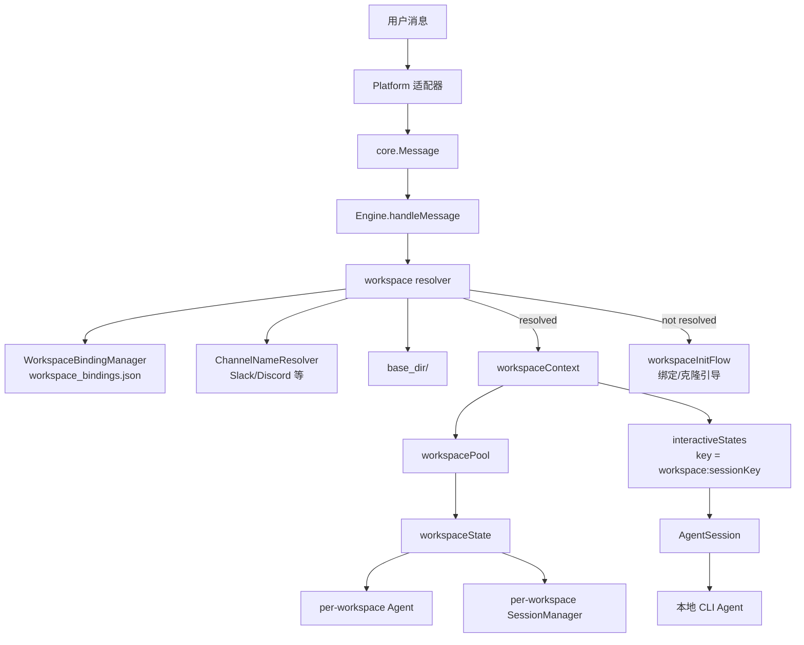
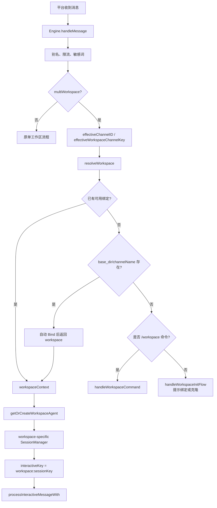
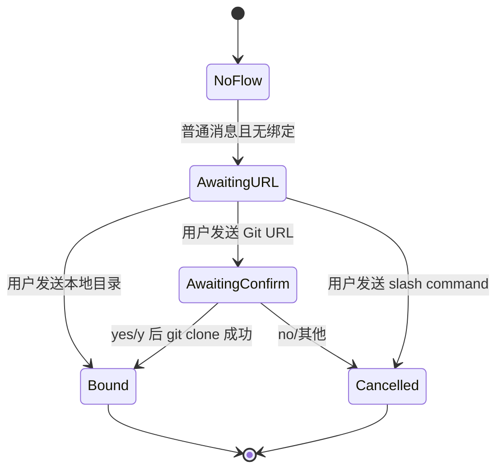

# CC Connect 多工作区隔离与频道绑定方案说明书

源码阅读范围：`/Users/liyang/Documents/code/demo/cc-connect-main`

本文不重复已经写过的本地 CLI 连接、飞书远程控制、定时任务触发、消息与命令转发。除这些之外，CC Connect 还值得继续仔细分析的特性包括：

1. 多工作区模式：一个机器人按频道绑定多个本地仓库，并为每个工作区维护独立 Agent 与会话状态。
2. Web 管理后台与 Management API：内置 Web UI、REST 管理接口、配置编辑、会话和 Provider 管理。
3. Bridge 外部适配器协议：用 WebSocket/REST 让非 Go 平台适配器动态接入。
4. Provider 与模型热切换：全局 Provider、项目 Provider、Provider refs、运行时切换与模型列表刷新。
5. run_as_user 系统用户隔离：用目标系统用户运行 Agent，降低本地文件权限风险。
6. 生命周期 Hooks：消息、会话、cron、错误等事件触发 shell 或 HTTP webhook。
7. STT/TTS 多模态能力：语音转文本、文本转语音、图片和文件回传。
8. 守护进程与自更新：systemd/launchd/logrotate、实例锁、restart/update。

本文选择第 1 个：多工作区模式。它是最适合复刻到另一套系统的未覆盖能力，因为它解决的是“一个机器人服务多个仓库/频道”的产品问题，并且牵涉配置、路由、状态持久化、Agent 生命周期、会话隔离和安全边界。

## 1. 结论

CC Connect 的多工作区方案不是再启动多个项目，也不是给每个仓库配置一个机器人，而是在单个 `[[projects]]` 内启用 `mode = "multi-workspace"`，用频道或话题作为路由键，把不同频道映射到不同本地目录。

核心链路是：

1. 配置层声明 `mode = "multi-workspace"` 和 `base_dir`，且禁止再写 Agent 的固定 `work_dir`。
2. 启动时 `cmd/cc-connect/main.go` 给 Engine 调用 `SetMultiWorkspace(baseDir, workspace_bindings.json)`。
3. 运行时 Engine 从消息里提取频道键：优先用 `Message.ChannelKey`，否则从 `SessionKey` 解析平台名和频道 ID。
4. Engine 先查绑定文件，再按频道名尝试 `base_dir/<channel-name>` 约定匹配；仍找不到则进入聊天式初始化。
5. 一旦解析出 workspace，Engine 用 `workspaceContext()` 懒创建该目录专属的 Agent 和 SessionManager。
6. `interactiveStates` 的 key 从 `sessionKey` 升级为 `workspace:sessionKey`，从而同一个用户在不同频道有完全不同的 Agent 进程和上下文。

复刻时可以把它理解为“Engine 内部的 workspace-aware session router”。

## 2. 产品设计

### 2.1 目标用户体验

目标用户是把 Slack、Discord、Telegram 群组或类似协作平台当作开发入口的团队。团队希望：

- 一个机器人账号即可服务多个仓库。
- `#frontend`、`#backend`、`#infra` 这类频道天然对应本地的多个工作目录。
- 用户在某个频道发消息时，Agent 只在该频道绑定的仓库里工作。
- 不同频道的会话、上下文、权限模式、当前工作目录互不污染。

源码依据：

- 使用指南明确写到“一个 bot 服务多个工作区，每个频道一个独立工作目录”：`docs/usage.zh-CN.md:734-763`。
- 早期设计目标写到“single cc-connect bot serve multiple workspaces, channel determining working directory”：`docs/plans/2026-03-12-multi-workspace-design.md:3-6`。

### 2.2 核心产品对象

| 对象 | 含义 | 代码位置 |
| --- | --- | --- |
| Project | 一个 CC Connect 项目，仍然只有一组 Agent 类型和平台配置 | `config/config.go:292-337` 的 `ProjectConfig` |
| Workspace | 某个本地仓库目录，例如 `/Users/me/workspace/backend` | `core/workspace_state.go:26-34` 的 `workspaceState.workspace` |
| Channel key | 平台 + 频道/话题 ID，例如 `slack:C123` 或 `telegram:chat:thread` | `core/engine.go:11423-11452` |
| Binding | 一个频道到一个 workspace 的持久映射 | `core/workspace_binding.go:44-49` 的 `WorkspaceBinding` |
| Workspace agent | 为某个 workspace 懒创建的 Agent 实例 | `core/engine.go:2197-2277` 的 `getOrCreateWorkspaceAgent()` |
| Workspace session manager | 某个 workspace 独立的会话存储 | `core/engine.go:2269-2273` |

### 2.3 用户路径

#### 路径 A：频道名自动匹配

如果平台能把频道 ID 解析成频道名，且本地存在 `base_dir/<channel-name>`，用户无需手动绑定。

例子：

```text
Slack channel: #backend
base_dir: ~/workspace
local dir: ~/workspace/backend
```

首次消息到达时，`resolveWorkspace()` 会：

1. 查绑定。
2. 调用平台的 `ChannelNameResolver.ResolveChannelName(channelID)`。
3. 检查 `filepath.Join(e.baseDir, channelName)` 是否是目录。
4. 自动写入绑定。

代码位置：

- `core/interfaces.go:476-480` 定义 `ChannelNameResolver`。
- `platform/slack/slack.go:526-540` 实现 Slack 频道名解析。
- `platform/discord/discord.go:1133-1140` 实现 Discord 频道名解析。
- `core/engine.go:11553-11580` 执行频道名约定匹配和自动绑定。

#### 路径 B：显式绑定已有目录

用户在频道里执行：

```text
/workspace bind backend
```

Engine 会绑定 `base_dir/backend`。

代码位置：

- 命令分发入口：`core/engine.go:3575-3581`。
- `bindWorkspace()`：`core/engine.go:3677-3688`。
- 子命令 `bind`：`core/engine.go:3765-3770`。

#### 路径 C：显式路由绝对路径

用户执行：

```text
/workspace route /Users/me/custom/backend
```

这适合目录不在 `base_dir` 下的情况。当前实现要求 `route` 使用绝对路径。

代码位置：

- `routeWorkspace()`：`core/engine.go:3647-3675`。
- 子命令 `route`：`core/engine.go:3772-3777`。

#### 路径 D：克隆仓库并绑定

用户执行：

```text
/workspace init https://github.com/acme/backend.git
```

Engine 会从 URL 提取仓库名，克隆到 `base_dir/<repo-name>`，克隆成功后绑定当前频道。

代码位置：

- `initWorkspace()`：`core/engine.go:3690-3731`。
- `extractRepoName()`：`core/engine.go:11746-11761`。
- `gitClone()`：`core/engine.go:11764-11770`。

#### 路径 E：普通消息触发聊天式初始化

如果用户没有执行 `/workspace init`，而是直接在未绑定频道里发普通消息，Engine 不会把消息转给 Agent，而是先提示用户发送 git URL 或本地目录路径。

代码位置：

- 未解析到 workspace 时进入初始化流：`core/engine.go:1561-1577`。
- 初始化状态机：`core/engine.go:11583-11691`。
- 初始化状态结构：`core/engine.go:254-260` 的 `workspaceInitFlow`。

#### 路径 F：shared 绑定

`/workspace shared ...` 提供共享层绑定。查找时先看当前项目的 `project:<name>`，再看 `shared`。这允许不同项目复用同一频道绑定，但项目级绑定优先。

代码位置：

- 共享层常量：`core/workspace_binding.go:12` 的 `sharedWorkspaceBindingsKey`。
- 查找优先级：`core/workspace_binding.go:140-153` 的 `LookupEffective()`。
- shared 子命令：`core/engine.go:3786-3835`。

## 3. 架构设计

### 3.1 总体架构图



### 3.2 配置层

`ProjectConfig` 增加了两个字段：

```go
Mode    string `toml:"mode,omitempty"`     // "" or "multi-workspace"
BaseDir string `toml:"base_dir,omitempty"` // parent dir for workspaces
```

代码位置：`config/config.go:292-297`。

验证规则在 `Config.validate()` 中：

- `mode == "multi-workspace"` 时必须有 `base_dir`。
- 多工作区模式不能在 `projects.agent.options` 中配置 `work_dir`，因为 `work_dir` 要在运行时按频道解析。

代码位置：`config/config.go:632-639`。

配置示例在 `config.example.toml:550-567`：

```toml
[[projects]]
name = "claude-multi"
mode = "multi-workspace"
base_dir = "~/workspace"

[projects.agent]
type = "claudecode"
```

### 3.3 启动装配

启动时，主程序遍历每个项目创建 Agent、Platform、Engine。

多工作区相关装配发生在：

- 创建 Agent：`cmd/cc-connect/main.go:199` 调用 `core.CreateAgent(proj.Agent.Type, buildAgentOptions(cfg.DataDir, proj))`。
- 创建 Engine：`cmd/cc-connect/main.go:246` 调用 `core.NewEngine(...)`。
- 设置基础工作目录和项目状态：`cmd/cc-connect/main.go:259-260`。
- 发现 `proj.Mode == "multi-workspace"` 后展开 `~/`、创建 `base_dir`、调用 `engine.SetMultiWorkspace()`：`cmd/cc-connect/main.go:262-276`。
- 绑定文件固定为 `filepath.Join(cfg.DataDir, "workspace_bindings.json")`：`cmd/cc-connect/main.go:273`。

`SetMultiWorkspace()` 会设置 Engine 内部状态：

- `e.multiWorkspace = true`
- `e.baseDir = baseDir`
- `e.workspaceBindings = NewWorkspaceBindingManager(bindingStorePath)`
- `e.workspacePool = newWorkspacePool(15 * time.Minute)`
- `e.initFlows = make(map[string]*workspaceInitFlow)`
- 启动 `runIdleReaper()`

代码位置：`core/engine.go:411-419`。

### 3.4 持久化模型

绑定存储在 `workspace_bindings.json`，结构是两层 map：

```json
{
  "project:claude": {
    "slack:C123": {
      "channel_name": "backend",
      "workspace": "/Users/me/workspace/backend",
      "bound_at": "2026-03-12T10:00:00Z"
    }
  },
  "shared": {
    "slack:C999": {
      "channel_name": "infra",
      "workspace": "/Users/me/workspace/infra",
      "bound_at": "2026-03-12T10:00:00Z"
    }
  }
}
```

代码位置：

- `WorkspaceBinding` 字段：`core/workspace_binding.go:44-49`。
- `WorkspaceBindingManager.bindings`：`core/workspace_binding.go:51-59`。
- 绑定写入：`core/workspace_binding.go:103-116`。
- 解绑：`core/workspace_binding.go:118-131`。
- 项目级列表：`core/workspace_binding.go:155-166`。
- 原子写文件：`core/workspace_binding.go:168-185`，底层调用 `AtomicWriteFile()`。
- 读取和外部修改刷新：`core/workspace_binding.go:187-229`。

时间字段使用 `FlexTime` 宽松解析，兼容 RFC3339、无时区格式和空字符串：`core/workspace_binding.go:14-42`。

### 3.5 运行时状态模型

运行时每个 workspace 有一个 `workspaceState`：

```go
type workspaceState struct {
    mu           sync.Mutex
    workspace    string
    sessions     *SessionManager
    agent        Agent
    lastActivity time.Time
    activeTurns  int
}
```

代码位置：`core/workspace_state.go:26-34`。

`workspacePool` 负责按 workspace path 管理这些状态：

- `states map[string]*workspaceState`：`core/workspace_state.go:77-82`。
- `GetOrCreate()` 会先 normalize path，再复用或创建状态：`core/workspace_state.go:110-136`。
- `ReapIdle()` 会跳过 active turn，删除超过 idle timeout 的 workspace：`core/workspace_state.go:138-154`。

Engine 里还会把当前 workspace 写到 `interactiveState.workspaceDir`，用于空闲回收和本地引用渲染。

代码位置：

- `interactiveState.workspaceDir`：`core/engine.go:278-284`。
- `processInteractiveMessageWith()` 写入 `state.workspaceDir`：`core/engine.go:2104-2109`。
- 当前 turn 开始和结束时更新 active counter：`core/engine.go:2122-2126`。

## 4. 核心流程

### 4.1 消息路由流程图



对应代码主干：

- 多工作区解析入口：`core/engine.go:1548-1593`。
- 命令优先处理：`core/engine.go:1595-1600`。
- 选择 workspace 专属 agent/session/interactiveKey：`core/engine.go:1612-1620`。
- Session 加锁、忙碌排队、启动处理 goroutine：`core/engine.go:1622-1675`。

### 4.2 频道键生成

CC Connect 使用“平台名 + 频道 ID”作为绑定键，避免不同平台 ID 碰撞。

关键函数：

- `extractChannelID(sessionKey)`：`core/engine.go:11390-11397`。
- `extractPlatformName(sessionKey)`：`core/engine.go:11416-11421`。
- `workspaceChannelKey(platformName, channelID)`：`core/engine.go:11423-11431`。
- `extractWorkspaceChannelKey(sessionKey)`：`core/engine.go:11433-11435`。
- `effectiveChannelID(msg)`：`core/engine.go:11437-11445`。
- `effectiveWorkspaceChannelKey(msg)`：`core/engine.go:11447-11452`。

`Message.ChannelKey` 是平台可选提供的频道标识，适合 Telegram forum topic 这种“同一个 chat 下多个话题”的场景。字段定义在 `core/message.go:139-157`，Telegram 在 `platform/telegram/telegram.go:334-380` 里生成 `channelKey` 并放入消息。

### 4.3 workspace 解析算法

`resolveWorkspace(p Platform, channelID string)` 是核心函数，位置在 `core/engine.go:11539-11580`。

它的实际优先级：

1. 使用 `workspaceChannelKey(p.Name(), channelID)` 得到频道键。
2. 调用 `lookupEffectiveWorkspaceBinding(channelKey)` 查绑定。
3. 如果绑定存在且目录可用，返回绑定目录。
4. 如果绑定存在但目录缺失，项目级绑定会被自动删除，共享绑定会保留但本次不可用。
5. 如果没有绑定，尝试通过 `ChannelNameResolver` 获取频道名。
6. 如果拿到频道名且 `base_dir/<channel-name>` 是目录，则自动绑定并返回。
7. 否则返回空 workspace，由初始化流或 `/workspace` 命令处理。

绑定查找和缺失目录处理在 `lookupEffectiveWorkspaceBinding()`：

- 项目 key 是 `"project:" + e.name`：`core/engine.go:11521`。
- 实际查找调用 `WorkspaceBindingManager.LookupEffective()`：`core/engine.go:11522`。
- `os.Stat(b.Workspace)` 校验目录存在：`core/engine.go:11527`。
- 非 shared 绑定缺目录时自动 Unbind：`core/engine.go:11530-11532`。

### 4.4 初始化流

初始化流是一个简单状态机：



状态结构是：

```go
type workspaceInitFlow struct {
    state       string // "awaiting_url", "awaiting_confirm"
    repoURL     string
    cloneTo     string
    channelName string
}
```

代码位置：`core/engine.go:254-260`。

处理函数是 `handleWorkspaceInitFlow()`，代码位置 `core/engine.go:11583-11691`。关键细节：

- 如果没有已有 flow，普通消息会创建 `awaiting_url` 状态并回复提示：`core/engine.go:11594-11605`。
- slash command 优先级更高，会删除 stale flow 并让命令继续执行：`core/engine.go:11608-11615`。
- 本地目录路径会直接绑定：`core/engine.go:11618-11639`。
- Git URL 会先进入确认状态：`core/engine.go:11642-11657`。
- 用户确认后执行 `gitClone()`，成功后绑定：`core/engine.go:11659-11688`。

本地目录路径解析函数 `resolveLocalDirPath()` 会：

- 展开 `~/`。
- 相对路径按 `baseDir` 拼接。
- 对相对路径检查不能逃逸 `baseDir`。

代码位置：`core/engine.go:11701-11730`。

### 4.5 `/workspace` 命令流程

`/workspace` 只在多工作区模式下启用。命令分发在 `core/engine.go:3575-3581`。

命令处理函数是 `handleWorkspaceCommand()`，位置 `core/engine.go:3622-3855`。它支持：

| 命令 | 作用 | 代码位置 |
| --- | --- | --- |
| `/workspace` | 查看当前有效绑定 | `core/engine.go:3756-3763` |
| `/workspace bind <name>` | 绑定 `base_dir/<name>` | `core/engine.go:3765-3770` |
| `/workspace route <absolute-path>` | 绑定绝对路径 | `core/engine.go:3772-3777` |
| `/workspace init <url-or-path>` | 克隆 Git URL 或绑定目录 | `core/engine.go:3779-3784` |
| `/workspace unbind` | 删除项目级绑定 | `core/engine.go:3837-3847` |
| `/workspace list` | 列项目级绑定 | `core/engine.go:3849-3850` |
| `/workspace shared ...` | 操作 shared 层绑定 | `core/engine.go:3786-3835` |

命令复用的内部函数：

- `routeWorkspace()`：`core/engine.go:3647-3675`。
- `bindWorkspace()`：`core/engine.go:3677-3688`。
- `initWorkspace()`：`core/engine.go:3690-3731`。
- `listBindings()`：`core/engine.go:3733-3749`。

### 4.6 per-workspace Agent 创建

当解析出 workspace 后，Engine 调用：

```go
agent, sessions, interactiveKey, effectiveDir, err := e.workspaceContext(workspace, msg.SessionKey)
```

代码位置：`core/engine.go:2296-2304`。

`workspaceContext()` 做三件事：

1. 生成 `interactiveKey := workspace + ":" + sessionKey`。
2. 调用 `resolveChannelWorkDir()` 应用 `/dir` 的 workspace 级覆盖。
3. 调用 `getOrCreateWorkspaceAgent(effectiveDir)`。

`getOrCreateWorkspaceAgent()` 是最关键的复刻对象，位置 `core/engine.go:2197-2277`。

执行逻辑：

1. `e.workspacePool.GetOrCreate(workspace)` 拿到 workspace 状态。
2. 如果已有 `ws.agent`，直接复用。
3. 从父 Agent 快照构造 opts：
   - 如果父 Agent 实现 `WorkspaceAgentOptionSnapshotter`，复制 `WorkspaceAgentOptions()`。
   - 强制设置 `opts["work_dir"] = workspace`。
   - 如果 opts 没有 model，则尝试从父 Agent `GetModel()` 复制。
   - 如果 opts 没有 mode，则尝试从父 Agent `GetMode()` 复制。
   - 如果 opts 没有 run_as_user/run_as_env，则尝试从父 Agent `GetRunAsUser()` / `GetRunAsEnv()` 复制。
4. 调用 `CreateAgent(e.agent.Name(), opts)` 创建同类型 Agent。
5. 如果父子 Agent 都实现 `ProviderSwitcher`，复制 providers 和 active provider。
6. 创建 per-workspace session 文件。
7. 写回 `ws.agent` 和 `ws.sessions`。

Agent 工厂注册与创建：

- `core.RegisterAgent()`：`core/registry.go:20-22`。
- `core.CreateAgent()`：`core/registry.go:52-62`。
- Claude Code 插件导入：`cmd/cc-connect/plugin_agent_claudecode.go:1-5`。
- Codex 插件导入：`cmd/cc-connect/plugin_agent_codex.go:1-5`。

Codex 实现了 `WorkspaceAgentOptionSnapshotter`，会复制 mode、backend、model、reasoning_effort、app_server_url、codex_home：`agent/codex/codex.go:396-416`。

Claude Code 没有实现 `WorkspaceAgentOptionSnapshotter`，但 Engine 会通过通用接口复制 model/mode/run_as。Claude Code 的 run_as 读取在 `agent/claudecode/claudecode.go:166-204`，访问器在 `agent/claudecode/claudecode.go:640-670`。

### 4.7 per-workspace 会话隔离

SessionManager 原本负责某个用户的多命名会话：

- `Session` 字段：`core/session.go:17-30`。
- `SessionManager` 字段：`core/session.go:206-223`。
- `NewSessionManager()`：`core/session.go:225-238`。
- `StorePath()`：`core/session.go:240-243`。

单工作区项目的 session 文件由 `sessionStorePath(dataDir, name, workDir)` 生成，位置 `cmd/cc-connect/main.go:1068-1098`。

多工作区内，`getOrCreateWorkspaceAgent()` 另建 session 文件：

```go
h := sha256.Sum256([]byte(workspace))
sessionFile := filepath.Join(filepath.Dir(e.sessions.StorePath()),
    fmt.Sprintf("%s_ws_%s.json", e.name, hex.EncodeToString(h[:4])))
sessions := NewSessionManager(sessionFile)
```

代码位置：`core/engine.go:2269-2273`。

这保证每个 workspace 有独立：

- active session 映射。
- named session 列表。
- agent 原生 session id。
- 用户元数据。
- 历史记录。

### 4.8 interactiveKey 隔离

普通模式下 `interactiveStates` 以 `sessionKey` 为 key。多工作区模式下改成：

```text
<workspace-path>:<sessionKey>
```

相关代码：

- `interactiveStates` 字段：`core/engine.go:239-242`。
- 路由时设置 `interactiveKey = resolvedWorkspace + ":" + msg.SessionKey`：`core/engine.go:1615-1620`。
- `processInteractiveMessageWith()` 使用该 key 获取/创建 interactive state：`core/engine.go:2076-2103`。
- API 或 side-channel 发送时，如果直接找不到 `sessionKey`，会用 `interactiveKeyForSessionKey()` 找 workspace 前缀 key：`core/engine.go:7090-7100`。
- `interactiveKeyForSessionKey()`：`core/engine.go:11498-11512`。

注意：传给 Agent 环境变量的 `CC_SESSION_KEY` 仍然是原始 `sessionKey`，不是带 workspace 前缀的 internal key。实现位置在 `getOrCreateInteractiveStateWith()`：

- `ccSessionKey` 参数说明：`core/engine.go:2322-2324`。
- `CC_PROJECT` / `CC_SESSION_KEY` 注入：`core/engine.go:2370-2385`。
- `processInteractiveMessageWith(..., ccSessionKey=msg.SessionKey)` 调用：`core/engine.go:1675`。

这很重要：内部隔离 key 不能泄漏给 CLI side-channel，否则 `cc-connect send`、`cron add` 等外部命令会难以匹配平台会话。

### 4.9 `/dir` 在多工作区里的行为

多工作区模式下，`/dir` 不直接修改父 Agent 的 `work_dir`，而是写入当前 workspace/session 的目录覆盖。

相关代码：

- 项目状态结构中有全局 `WorkDirOverride` 和 workspace 级 `WorkspaceDirOverrides`：`core/projectstate.go:11-14`。
- 设置 workspace 覆盖：`core/projectstate.go:52-59`。
- 清除 workspace 覆盖：`core/projectstate.go:61-71`。
- `resolveChannelWorkDir()` 读取覆盖，目录失效会自动清理：`core/engine.go:2280-2294`。
- `/dir reset` 在多工作区模式下清除当前 interactiveKey 的 workspace 覆盖：`core/engine.go:4597-4613`。
- `/dir <path>` 在多工作区模式下写 `SetWorkspaceDirOverride(interactiveKey, newDir)`：`core/engine.go:4667-4687`。

### 4.10 空闲回收

`SetMultiWorkspace()` 启动 `runIdleReaper()`，每分钟检查一次。

代码位置：

- 启动：`core/engine.go:418`。
- ticker：`core/engine.go:421-431`。
- 执行回收：`core/engine.go:434-468`。
- `workspacePool.ReapIdle()`：`core/workspace_state.go:138-154`。

回收逻辑：

1. `workspacePool` 删除 idle workspace state。
2. Engine 找到 `interactiveState.workspaceDir` 属于被回收 workspace 的 state。
3. 调用 `cleanupInteractiveState()` 关闭 AgentSession。
4. 会话文件保留，下次消息会透明重建 workspace Agent 并 resume。

`activeTurns` 能防止正在执行的工作区被回收：

- `BeginTurn()` / `EndTurn()`：`core/workspace_state.go:49-63`。
- `ReapIdle()` 跳过 `HasActiveTurn()`：`core/workspace_state.go:144-147`。

## 5. 复刻另一套系统的代码方案

### 5.1 数据结构

最小可复刻结构：

```ts
type ProjectConfig = {
  name: string
  mode?: 'multi-workspace'
  baseDir?: string
  agent: {
    type: string
    options?: Record<string, unknown>
  }
  platforms: PlatformConfig[]
}

type WorkspaceBinding = {
  channelName: string
  workspace: string
  boundAt: string
}

type WorkspaceBindings = Record<string, Record<string, WorkspaceBinding>>
// key examples:
// "project:claude" -> { "slack:C123": binding }
// "shared" -> { "slack:C123": binding }

type WorkspaceState = {
  workspace: string
  agent?: Agent
  sessions?: SessionManager
  lastActivity: number
  activeTurns: number
}
```

必须保持的规则：

- `ProjectConfig.mode === "multi-workspace"` 时必须有 `baseDir`。
- 同时禁止项目 Agent 写固定 `workDir`。
- binding key 必须包含 platform name，避免 Slack 的 `C123` 和 Discord 的 `C123` 冲突。
- `project:<name>` 优先于 `shared`。

### 5.2 绑定管理器伪代码

```ts
class WorkspaceBindingManager {
  private bindings: WorkspaceBindings = {}

  bind(scope: string, channelKey: string, channelName: string, workspace: string) {
    this.reloadIfChanged()
    this.bindings[scope] ??= {}
    this.bindings[scope][channelKey] = {
      channelName,
      workspace: normalizeWorkspacePath(workspace),
      boundAt: new Date().toISOString(),
    }
    this.atomicSave()
  }

  lookupEffective(projectName: string, channelKey: string) {
    this.reloadIfChanged()
    const projectKey = `project:${projectName}`
    return (
      this.bindings[projectKey]?.[channelKey] ??
      this.bindings.shared?.[channelKey] ??
      null
    )
  }
}
```

参考实现：

- `core/workspace_binding.go:61-70` 初始化和加载。
- `core/workspace_binding.go:103-116` 绑定。
- `core/workspace_binding.go:140-153` 有效绑定查找。
- `core/workspace_binding.go:193-229` 按文件 mtime/size 刷新外部修改。

### 5.3 workspace 解析伪代码

```ts
async function resolveWorkspace(project, platform, channelId) {
  const channelKey = `${platform.name}:${channelId}`
  const found = bindings.lookupEffective(project.name, channelKey)

  if (found) {
    if (await isDirectory(found.workspace)) {
      return { workspace: normalizeWorkspacePath(found.workspace), channelName: found.channelName }
    }
    if (found.scope !== 'shared') {
      bindings.unbind(`project:${project.name}`, channelKey)
    }
    return { workspace: '', channelName: found.channelName }
  }

  const channelName = await platform.resolveChannelName?.(channelId)
  if (!channelName) return { workspace: '', channelName: '' }

  const candidate = path.join(project.baseDir, channelName)
  if (await isDirectory(candidate)) {
    bindings.bind(`project:${project.name}`, channelKey, channelName, candidate)
    return { workspace: normalizeWorkspacePath(candidate), channelName }
  }

  return { workspace: '', channelName }
}
```

参考实现：`core/engine.go:11539-11580`。

### 5.4 消息处理伪代码

```ts
async function handleMessage(platform, msg) {
  const content = normalizeContent(msg)
  if (rateLimited(msg) || blocked(content)) return

  let agent = projectAgent
  let sessions = projectSessions
  let interactiveKey = msg.sessionKey
  let workspaceDir = ''

  if (project.mode === 'multi-workspace') {
    const channelId = msg.channelKey || parseChannelId(msg.sessionKey)
    const { workspace, channelName } = await resolveWorkspace(project, platform, channelId)

    if (!workspace) {
      if (!content.startsWith('/workspace')) {
        const consumed = await handleWorkspaceInitFlow(platform, msg, channelName)
        if (consumed) return
      }
      if (!content.startsWith('/')) return
    } else {
      const ctx = await workspaceContext(workspace, msg.sessionKey)
      agent = ctx.agent
      sessions = ctx.sessions
      interactiveKey = ctx.interactiveKey
      workspaceDir = ctx.effectiveDir
    }
  }

  if (content.startsWith('/') && await handleCommand(platform, msg, content)) return

  const session = sessions.getOrCreateActive(msg.sessionKey)
  if (!session.tryLock()) {
    queueMessage(interactiveKey, msg)
    return
  }

  ensureInteractiveStateForQueueing(interactiveKey, platform, msg.replyCtx)
  processInteractiveMessageWith(platform, msg, session, agent, sessions, interactiveKey, workspaceDir, msg.sessionKey)
}
```

参考实现：

- `core/engine.go:1548-1593` 多工作区解析。
- `core/engine.go:1612-1620` 选择 workspace agent/session/key。
- `core/engine.go:1622-1675` session lock、queue、goroutine。
- `core/engine.go:2072-2182` `processInteractiveMessageWith()`。

### 5.5 per-workspace Agent 创建伪代码

```ts
async function getOrCreateWorkspaceAgent(workspace: string) {
  const ws = workspacePool.getOrCreate(workspace)
  if (ws.agent) return { agent: ws.agent, sessions: ws.sessions }

  const opts = parentAgent.workspaceAgentOptions?.() ?? {}
  opts.workDir = workspace

  opts.model ??= parentAgent.getModel?.()
  opts.mode ??= parentAgent.getMode?.()
  opts.runAsUser ??= parentAgent.getRunAsUser?.()
  opts.runAsEnv ??= parentAgent.getRunAsEnv?.()

  const agent = createAgent(parentAgent.name, opts)

  if (parentAgent.listProviders && agent.setProviders) {
    agent.setProviders(parentAgent.listProviders())
    const active = parentAgent.getActiveProvider?.()
    if (active) agent.setActiveProvider(active.name)
  }

  const sessions = new SessionManager(workspaceSessionPath(project.name, workspace))
  ws.agent = agent
  ws.sessions = sessions
  return { agent, sessions }
}
```

参考实现：`core/engine.go:2197-2277`。

### 5.6 会话文件命名

复刻时建议不要把不同 workspace 的 session 写到同一个文件里。CC Connect 使用：

```text
<session-dir>/<project>_ws_<sha256(workspace)[0:4 bytes hex]>.json
```

参考实现：`core/engine.go:2269-2273`。

如果要降低 hash 碰撞概率，可以使用 8 或 16 字节前缀；CC Connect 当前用前 4 字节，实践上够短但不是强唯一。

### 5.7 命令上下文

所有会影响会话的命令都应该先通过 workspace 上下文解析，而不是直接访问项目级 Agent。

CC Connect 的抽象是 `commandContext()`：

- 非多工作区：返回项目级 `e.agent`、`e.sessions`、`msg.SessionKey`。
- 多工作区：根据当前频道解析 workspace，返回 workspace agent、workspace sessions、workspace interactiveKey。

代码位置：`core/engine.go:11455-11478`。

`/new` 使用这个上下文后清理当前 workspace 的旧 interactive state：`core/engine.go:3857-3865`。

`/dir` 也先调用 `commandContext()`：`core/engine.go:4692-4698`。

复刻时的规则是：只要命令会读写 Agent 状态、session 状态或工作目录，就必须是 workspace-aware。

## 6. 需要注意的点

1. 多工作区不是多项目。多项目是 `cfg.Projects` 创建多个 Engine；多工作区是单个 Engine 内部按频道复用同一个项目配置。相关启动循环在 `cmd/cc-connect/main.go:183-186`，多工作区装配在 `cmd/cc-connect/main.go:262-276`。

2. `work_dir` 与 `base_dir` 互斥。配置验证直接拒绝多工作区项目里的 `agent.options.work_dir`，否则运行时到底用哪个目录会不确定。代码在 `config/config.go:632-639`。

3. 自动绑定依赖平台能解析频道名。当前源码中 Slack 和 Discord 实现了 `ChannelNameResolver`，Telegram 主要靠 `ChannelKey` 区分群组话题，但没有频道名约定匹配。其他平台仍可通过 `/workspace bind`、`/workspace route`、`/workspace init` 显式绑定。

4. `Message.ChannelKey` 很重要。对 Telegram forum topic 这类平台，如果只用 chat ID，会把多个话题错误地路由到同一 workspace。字段在 `core/message.go:153`，Telegram 写入在 `platform/telegram/telegram.go:334-380`。

5. shared 绑定不会跨平台。因为 key 是 `platform:channelID`，`slack:C1` 和 `discord:C1` 不同。测试覆盖在 `core/multi_workspace_test.go:181-210`。

6. 项目级缺失目录会自动解绑，shared 缺失目录不会自动解绑。实现见 `core/engine.go:11527-11533`，测试覆盖在 `core/multi_workspace_test.go:213-266`。复刻时需要决定 shared 缺失目录是否保留。

7. 初始化流必须让 slash command 优先。否则用户在未绑定频道执行 `/workspace bind` 可能被当成初始化输入。CC Connect 的防护在 `core/engine.go:11608-11615`，测试在 `core/multi_workspace_test.go:428-459`。

8. idle reaper 不能回收正在执行的 workspace。CC Connect 用 `activeTurns` 保护，`BeginTurn()` 和 `EndTurn()` 在 `core/engine.go:2122-2126` 调用，`ReapIdle()` 在 `core/workspace_state.go:144-147` 跳过忙碌工作区。

9. `CC_SESSION_KEY` 不应使用内部 `workspace:sessionKey`。内部 key 只用于 Engine 的 `interactiveStates`。外部 CLI、cron、send 命令仍需要平台会话 key。注入代码在 `core/engine.go:2370-2385`。

10. per-workspace Agent 必须继承安全配置。CC Connect 曾经专门防过 `run_as_user` 丢失问题：`getOrCreateWorkspaceAgent()` 在 `core/engine.go:2233-2252` 复制 `run_as_user` 和 `run_as_env`，测试在 `core/multi_workspace_test.go:461-569`。

11. 不是所有 Agent 选项都会自动继承。只有实现 `WorkspaceAgentOptionSnapshotter` 的 Agent 可以完整输出 workspace 复用选项。Codex 已实现，位置 `agent/codex/codex.go:396-416`。如果你的系统支持多种 Agent，建议所有 Agent 都提供类似接口。

12. Provider 要复制到 workspace Agent。否则父项目切到某个 API Provider 后，workspace agent 仍可能使用默认 Provider。CC Connect 在 `core/engine.go:2259-2267` 复制 providers 和 active provider。

13. `/dir` 在多工作区中是 workspace/session 覆盖，不是改绑定。`/workspace bind/route/init` 改频道到 workspace 的绑定；`/dir` 改当前会话的实际工作目录覆盖。相关状态在 `core/projectstate.go:11-14` 和 `core/engine.go:2280-2294`。

14. `route` 允许绝对路径，不限制在 `base_dir` 下。`init` 的相对路径会防止逃逸 `baseDir`，但绝对路径由用户负责。实现见 `core/engine.go:11720-11727`。如果要做企业安全版，建议对绝对路径也做 allowlist。

15. `gitClone()` 当前没有 context timeout，也没有专门的认证引导。它只是 `exec.Command("git", "clone", repoURL, dest)`。代码在 `core/engine.go:11764-11770`。复刻时建议加超时、stderr 截断、目标目录冲突处理和凭据提示。

16. `base_dir` 创建失败时当前项目会被跳过。`cmd/cc-connect/main.go:269-272` 遇到 `MkdirAll` 错误后 `continue`，直到 `cmd/cc-connect/main.go:702-703` 才 append engine。复刻时可以改成启动失败，避免用户以为项目正常运行。

17. commands/skills 目录目前在 `NewEngine()` 基于父 Agent 初始化。代码在 `core/engine.go:401-406`。多工作区懒创建 workspace agent 时没有重新绑定每个 workspace 的 command/skill dirs。若复刻系统要求“每仓库私有命令/技能”，需要把命令和技能扫描也做成 workspace-aware。

18. 本地引用渲染需要使用 workspaceDir。CC Connect 在 `sendWithErrorForWorkspace()` 里调用 `TransformLocalReferences(..., workspaceDir)`，位置 `core/engine.go:7401-7418`；卡片渲染也处理 workspace，位置 `core/engine.go:7425-7460`。

19. 多工作区和定时任务有交集。cron 执行时优先用 job.WorkDir，其次按 sessionKey 解析绑定，再回退全局 Agent。相关代码在 `core/engine.go:1053-1079` 和 `core/engine.go:1086-1118`。这部分已由定时任务文档覆盖，复刻多工作区时只需保留这个兼容点。

20. 绑定文件需要支持外部修改刷新。CC Connect 的 `WorkspaceBindingManager` 每次操作前会 `refreshLocked()`，基于 mtime/size 检测文件变化，位置 `core/workspace_binding.go:193-229`。如果 Web UI、CLI、后台服务都会改绑定文件，这一点必须保留。

## 7. 代码编号总表

| 编号 | 作用 | 文件与位置 | 函数/变量 |
| --- | --- | --- | --- |
| MW-001 | 多工作区配置字段 | `config/config.go:292-297` | `ProjectConfig.Mode`, `ProjectConfig.BaseDir` |
| MW-002 | 配置验证 | `config/config.go:632-639` | `Config.validate()` |
| MW-003 | 配置示例 | `config.example.toml:550-567` | multi-workspace example |
| MW-004 | 启动创建 Agent | `cmd/cc-connect/main.go:199` | `core.CreateAgent()` |
| MW-005 | 启动创建 Engine | `cmd/cc-connect/main.go:246` | `core.NewEngine()` |
| MW-006 | 启动启用多工作区 | `cmd/cc-connect/main.go:262-276` | `engine.SetMultiWorkspace()` |
| MW-007 | Engine 多工作区字段 | `core/engine.go:225-231` | `multiWorkspace`, `baseDir`, `workspaceBindings`, `workspacePool`, `initFlows` |
| MW-008 | 初始化多工作区运行时 | `core/engine.go:411-419` | `SetMultiWorkspace()` |
| MW-009 | 空闲回收循环 | `core/engine.go:421-468` | `runIdleReaper()`, `reapIdleWorkspaces()` |
| MW-010 | 绑定数据结构 | `core/workspace_binding.go:44-59` | `WorkspaceBinding`, `WorkspaceBindingManager` |
| MW-011 | 绑定写入 | `core/workspace_binding.go:103-116` | `WorkspaceBindingManager.Bind()` |
| MW-012 | 绑定查找优先级 | `core/workspace_binding.go:140-153` | `LookupEffective()` |
| MW-013 | 绑定文件刷新 | `core/workspace_binding.go:193-229` | `refreshLocked()` |
| MW-014 | workspace 状态 | `core/workspace_state.go:26-34` | `workspaceState` |
| MW-015 | workspace pool | `core/workspace_state.go:77-88` | `workspacePool` |
| MW-016 | workspace path normalize | `core/workspace_state.go:10-24` | `normalizeWorkspacePath()` |
| MW-017 | pool 创建/复用 | `core/workspace_state.go:110-136` | `workspacePool.GetOrCreate()` |
| MW-018 | pool 空闲删除 | `core/workspace_state.go:138-154` | `workspacePool.ReapIdle()` |
| MW-019 | 消息频道字段 | `core/message.go:139-157` | `Message.ChannelKey` |
| MW-020 | 频道键生成 | `core/engine.go:11390-11452` | `extractChannelID()`, `workspaceChannelKey()`, `effectiveWorkspaceChannelKey()` |
| MW-021 | 命令上下文 | `core/engine.go:11455-11478` | `commandContext()` |
| MW-022 | sessionKey 上下文查找 | `core/engine.go:11480-11496` | `sessionContextForKey()` |
| MW-023 | interactiveKey 生成 | `core/engine.go:11498-11512` | `interactiveKeyForSessionKey()` |
| MW-024 | 有效绑定校验 | `core/engine.go:11514-11537` | `lookupEffectiveWorkspaceBinding()` |
| MW-025 | workspace 解析 | `core/engine.go:11539-11580` | `resolveWorkspace()` |
| MW-026 | init flow 状态 | `core/engine.go:254-260` | `workspaceInitFlow` |
| MW-027 | init flow 处理 | `core/engine.go:11583-11691` | `handleWorkspaceInitFlow()` |
| MW-028 | 本地目录解析 | `core/engine.go:11701-11730` | `resolveLocalDirPath()` |
| MW-029 | Git URL 判断 | `core/engine.go:11694-11699` | `looksLikeGitURL()` |
| MW-030 | repo 名提取 | `core/engine.go:11746-11761` | `extractRepoName()` |
| MW-031 | git clone | `core/engine.go:11764-11770` | `gitClone()` |
| MW-032 | `/workspace` 分发 | `core/engine.go:3575-3581` | `handleCommand()` case |
| MW-033 | `/workspace` 命令 | `core/engine.go:3622-3855` | `handleWorkspaceCommand()` |
| MW-034 | 消息主流程解析 workspace | `core/engine.go:1548-1593` | `handleMessage()` multi-workspace block |
| MW-035 | 选择 workspace agent/session | `core/engine.go:1612-1620` | `agent`, `sessions`, `interactiveKey` |
| MW-036 | 启动处理 goroutine | `core/engine.go:1622-1675` | session lock and queue |
| MW-037 | workspace interactive loop | `core/engine.go:2072-2182` | `processInteractiveMessageWith()` |
| MW-038 | workspace Agent 创建 | `core/engine.go:2197-2277` | `getOrCreateWorkspaceAgent()` |
| MW-039 | workspace `/dir` 覆盖解析 | `core/engine.go:2280-2294` | `resolveChannelWorkDir()` |
| MW-040 | workspace 上下文聚合 | `core/engine.go:2296-2304` | `workspaceContext()` |
| MW-041 | session env 注入 | `core/engine.go:2370-2385` | `CC_PROJECT`, `CC_SESSION_KEY` |
| MW-042 | workspace 级 `/dir` 持久化 | `core/projectstate.go:11-14`, `core/projectstate.go:52-71` | `WorkspaceDirOverrides` |
| MW-043 | `/dir` 多工作区处理 | `core/engine.go:4574-4689` | `dirApply()` |
| MW-044 | outgoing reference render | `core/engine.go:7401-7418` | `sendWithErrorForWorkspace()` |
| MW-045 | card reference render | `core/engine.go:7425-7460` | `renderCardForPlatformWorkspace()` |
| MW-046 | Agent 选项快照接口 | `core/interfaces.go:439-446` | `WorkspaceAgentOptionSnapshotter` |
| MW-047 | 频道名解析接口 | `core/interfaces.go:476-480` | `ChannelNameResolver` |
| MW-048 | Slack 频道名解析 | `platform/slack/slack.go:526-540` | `ResolveChannelName()` |
| MW-049 | Discord 频道名解析 | `platform/discord/discord.go:1133-1140` | `ResolveChannelName()` |
| MW-050 | Telegram 话题 channelKey | `platform/telegram/telegram.go:334-380` | `buildChannelKey()`, `Message.ChannelKey` |
| MW-051 | Codex workspace opts | `agent/codex/codex.go:396-416` | `WorkspaceAgentOptions()` |
| MW-052 | Claude run_as 读取 | `agent/claudecode/claudecode.go:166-204` | `spawnOpts` |
| MW-053 | Claude run_as 访问器 | `agent/claudecode/claudecode.go:640-670` | `GetRunAsUser()`, `GetRunAsEnv()` |
| MW-054 | 绑定测试 | `core/workspace_binding_test.go:8-151` | save/load/shared/legacy fallback |
| MW-055 | 解析测试 | `core/multi_workspace_test.go:68-347` | convention/existing/shared/missing |
| MW-056 | init flow 测试 | `core/multi_workspace_test.go:428-459` | slash command cleanup |
| MW-057 | run_as 传播测试 | `core/multi_workspace_test.go:461-616` | propagation regression |

## 8. 最小落地清单

如果要基于该方案实现另一套系统，最小版本需要完成：

1. 配置：项目支持 `mode`、`baseDir`，并验证 `workDir` 互斥。
2. 消息模型：消息里必须能拿到 `platform`、`sessionKey`、`channelId` 或 `channelKey`。
3. 绑定存储：实现项目级和 shared 级 `channelKey -> workspace` 持久化。
4. 解析器：实现“绑定优先、频道名约定匹配其次、初始化流兜底”。
5. workspace pool：按 workspace 懒创建 Agent 和 SessionManager。
6. interactive key：内部运行态 key 使用 `workspace:sessionKey`，外部 side-channel 保持原始 `sessionKey`。
7. 命令：至少支持 `workspace` 查看、`bind`、`route`、`init`、`unbind`、`list`。
8. 并发：Session 需要 busy lock，workspace 需要 active turn，避免重复并发写同一 Agent。
9. 回收：idle workspace 可关闭 AgentSession，但 session 文件要保留。
10. 安全：复制 Provider、mode、model、run_as 等父 Agent 关键配置到 workspace Agent。

做完这些，另一套系统就能达到 CC Connect 多工作区的核心效果：一个机器人入口，根据频道自动落到不同本地仓库，各自拥有独立 Agent 进程、会话状态和工作目录。
