# CC Connect 迁移补充功能特性与完整架构说明书

源码阅读对象：`/Users/liyang/Documents/code/demo/cc-connect-main`

本文补充既有 1.1 到 2.2 文档之外的高价值能力，同时把 CC Connect 这部分能力按“可迁移方案”重新组织。目标不是复述源码，而是让后续在 Synapse 中实现一套等价系统时，可以只靠本文知道要迁移什么、边界在哪里、代码依据在哪里。

## 0. 结论

CC Connect 最值得迁移的不是某个平台适配器本身，而是一套“本地 Agent 长驻服务”的产品架构：

1. **Engine 作为消息、会话、权限、Agent 事件流的中心编排层**：每个项目一个 `Engine`，所有平台输入、Web 输入、Bridge 输入、cron/heartbeat/webhook 输入最终都转成 `core.Message`，再进入同一个会话锁、队列、Agent 事件循环。
2. **Bridge WebSocket 协议**：把“平台适配器”抽成动态外部 adapter，任何前端、本地页面、第三方服务都可以用统一协议接入，不必把每个平台都编译进主程序。
3. **Web 管理面 + Management API**：把配置、项目、会话、Provider、Heartbeat、Cron、Bridge adapter 全部变成可管理状态，而不是只靠 TOML 和聊天命令。
4. **Provider/Model 生态**：全局 provider、项目 provider refs、预设导入、Codex 配置落盘、Claude provider proxy，共同解决“多 Agent CLI 共用模型配置”的问题。
5. **权限与可靠性护栏**：admin allowlist、role disabled commands、输入/输出限流、敏感 shell 权限、dedup、run_as_user 隔离、session busy 队列，这些比“能跑起来”更有迁移价值。
6. **长任务体验层**：stream preview、compact progress card、typing/done indicator、local reference render/show，让远程控制 Agent 不只是纯文本转发。
7. **持续运行能力**：heartbeat、observer、webhook、relay、daemon、instance lock、self-update，构成“无人值守本地服务”的外围能力。

迁移优先级建议：

| 优先级 | 应迁移内容 | 原因 |
| --- | --- | --- |
| P0 | Engine 会话模型、Bridge 协议、Management API、配置/Provider、权限/限流、session persistence/queue | 这是远程控制本地 Agent 的底座 |
| P1 | Skills/custom commands、stream preview/progress、heartbeat、references、webhook、relay、auto-compress | 提升可用性和扩展性 |
| P2 | STT/TTS、observer、daemon/updater、Web UI 具体样式 | 价值明确，但可延后或按 Synapse 形态重做 |

注意：CC Connect 的 Web 前端使用大量自定义 Tailwind 颜色和组件样式，例如 `web/src/pages/Projects/ProjectDetail.tsx:18-29`、`web/src/pages/Chat/ChatView.tsx:54-85`。迁移到 Synapse 时应迁移信息架构和 API，不应照搬视觉实现；Synapse 应继续使用 shadcn/ui、Radix 和主题 token。

## 1. 源码总架构

### 1.1 总体架构图

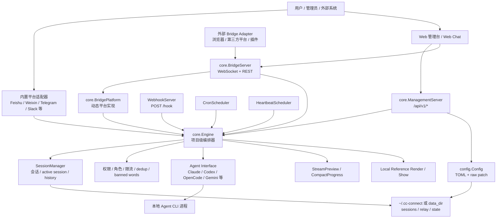

### 1.2 启动装配的核心代码编号

| 编号 | 文件位置 | 函数/变量 | 作用 | 迁移价值 |
| --- | --- | --- | --- | --- |
| BOOT-01 | `cmd/cc-connect/main.go:43-95` | `main()` subcommand switch | CLI 入口，包含 `web`、`daemon`、`cron`、`relay`、`send` 等子命令 | Synapse 可转成 Electron main service command/API |
| BOOT-02 | `cmd/cc-connect/main.go:163-181` | `config.Load`、`runRunAsUserStartupChecks` | 加载配置并在启动前执行用户隔离检查 | P0，配置和安全前置 |
| BOOT-03 | `cmd/cc-connect/main.go:183-221` | `config.CreateAgent`、`config.CreatePlatform` | 按项目创建 Agent 和平台实例 | P0，项目级运行时工厂 |
| BOOT-04 | `cmd/cc-connect/main.go:223-260` | `sessionStorePath`、`projectStatePath`、`core.NewEngine` | 为每个项目创建会话存储和 Engine | P0，会话持久化和项目隔离 |
| BOOT-05 | `cmd/cc-connect/main.go:338-456` | `SetDisabledCommands`、`SetUserRoles`、`SetBannedWords`、`SetRateLimitCfg`、`SetOutgoingRateLimitCfg` | 将权限、限流、展示、引用等策略注入 Engine | P0，治理层 |
| BOOT-06 | `cmd/cc-connect/main.go:493-620` | `SetSpeechConfig`、`SetTTSConfig` | 注入 STT/TTS | P2，可后置 |
| BOOT-07 | `cmd/cc-connect/main.go:706-755` | `CronScheduler`、`HeartbeatScheduler` | 启动定时和心跳调度 | P1 |
| BOOT-08 | `cmd/cc-connect/main.go:757-775` | `core.NewBridgeServer`、`bridge.NewPlatform`、`e.AddPlatform` | 将 Bridge 动态平台挂入每个 Engine | P0，Web/外部 adapter 接入关键 |
| BOOT-09 | `cmd/cc-connect/main.go:795-953` | `core.NewManagementServer` 及一组 setter | 启动 Web 管理 API，绑定配置保存回调 | P0 |
| BOOT-10 | `cmd/cc-connect/main.go:956-991` | `core.NewAPIServer`、`NewRelayManager`、`SetDirHistory` | 启动本地 Unix socket API、relay、dir history | P1 |
| BOOT-11 | `cmd/cc-connect/main.go:993-1065` | restart/self-update/graceful shutdown | 重启通知、自更新后恢复、优雅退出 | P2 |

## 2. Engine：迁移时必须保留的中心模型

既有文档已覆盖 Agent/Platform 基础连接，但从迁移角度看，`Engine` 的真正价值在于它把所有入口统一成一条处理管线。

### 2.1 Engine 核心抽象

| 编号 | 文件位置 | 函数/变量 | 作用 |
| --- | --- | --- | --- |
| ENG-01 | `core/interfaces.go:8-15` | `Platform` | 平台最小接口：`Name`、`Start`、`Reply`、`Send`、`Stop` |
| ENG-02 | `core/interfaces.go:20-25` | `ReplyContextReconstructor` | 从 `session_key` 重建主动发送上下文，cron/heartbeat/webhook/relay 都依赖 |
| ENG-03 | `core/interfaces.go:38-42` | `SessionEnvInjector` | 给 Agent 注入 `CC_PROJECT`、`CC_SESSION_KEY` 等环境变量 |
| ENG-04 | `core/interfaces.go:147-163` | `MessageUpdater`、`ProgressStyleProvider`、`ProgressCardPayloadSupport` | 流式预览和进度卡片所需的平台能力 |
| ENG-05 | `core/interfaces.go:396-402` | `ContextCompressor` | Agent 能否执行原生 `/compact`、`/compress` |
| ENG-06 | `core/engine.go:180-213` | `Engine` 字段：`hooks`、`commands`、`skills`、`relayManager`、`autoCompress*`、`rateLimiter`、`outgoingRateLimiter` | Engine 是所有横切能力的承载点 |

### 2.2 消息进入 Engine 的流程

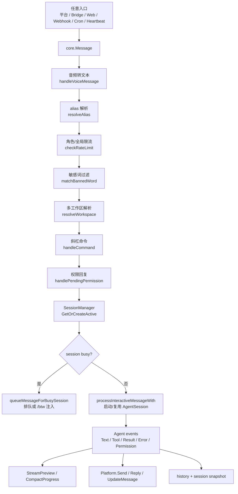

关键代码：

| 编号 | 文件位置 | 函数/变量 | 作用 |
| --- | --- | --- | --- |
| ENG-07 | `core/engine.go:1478-1676` | `handleMessage` | 主消息管线：音频、alias、限流、敏感词、多工作区、命令、会话锁、排队 |
| ENG-08 | `core/engine.go:1622-1657` | `session.TryLock`、`queueMessageForBusySession` | busy session 不直接丢消息，优先排队 |
| ENG-09 | `core/engine.go:1664-1675` | `ensureInteractiveStateForQueueing`、`processInteractiveMessageWith` | 启动异步 Agent turn |
| ENG-10 | `core/engine.go:1728-1778` | `queueMessageForBusySession` | 保存待处理消息元数据，避免 mid-turn stdin 破坏 CLI event loop |
| ENG-11 | `core/engine.go:3112-3189` | queued turn drain | 一个 turn 完成后继续处理队列，不释放 AgentSession |
| ENG-12 | `core/engine.go:3207-3226` | `EventError` 分支 | Agent 错误时保留活着的 session，只在进程死亡时丢队列 |

迁移建议：Synapse 不应把远程消息直接送进某个 CLI adapter。应保留一个项目级 `AgentRuntimeEngine`，让 Web、插件、远程平台、定时任务、自动化入口都走同一套消息管线。

## 3. Web 管理面与 Management API

这是既有文档没有充分展开、但迁移价值很高的一层。它把“本地 CLI 服务”变成可观察、可配置、可远程管理的系统。

### 3.1 Management API 架构图

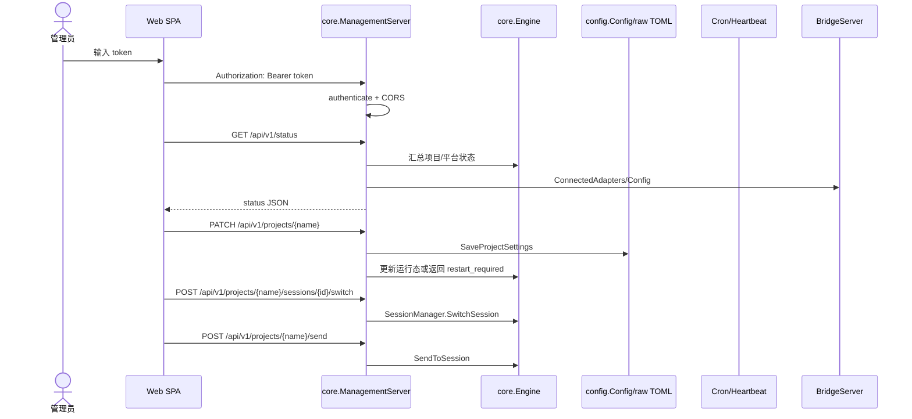

### 3.2 代码编号

| 编号 | 文件位置 | 函数/变量 | 作用 | 迁移建议 |
| --- | --- | --- | --- | --- |
| MGMT-01 | `core/management.go:35-70` | `ManagementServer` | 持有 token、CORS、engines、scheduler、bridge、配置回调 | P0，做 Synapse main-process 管理服务 |
| MGMT-02 | `core/management.go:210-251` | `buildHandler` | 注册全部 REST 路由：status、restart、config、projects、cron、setup、providers、skills、bridge | P0，API surface 可复用 |
| MGMT-03 | `core/management.go:263-301` | `withStaticFallback` | `/api/*` 走 API，Bridge WS path 走 Bridge，其余走 embedded SPA | Synapse 中可替换为 Electron renderer |
| MGMT-04 | `core/management.go:306-334` | `wrap`、`authenticate` | Bearer/query token 校验，`ConstantTimeCompare` | P0，迁移为 IPC/API token 或本地权限 |
| MGMT-05 | `core/management.go:391-432` | `handleStatus` | 返回版本、uptime、平台连接数、项目数、Bridge adapter/config | P0，系统仪表盘数据源 |
| MGMT-06 | `core/management.go:457-481` | `handleReload` | 逐个 Engine 调用 `configReloadFunc` | P1，热更新配置 |
| MGMT-07 | `core/management.go:483-535` | `handleConfig`、`handleGlobalSettings` | 读原始配置、读/改全局设置 | P0，配置可视化 |
| MGMT-08 | `core/management.go:540-627` | `handleProjects`、`handleProjectRoutes` | 项目列表和项目子路由分发 | P0 |
| MGMT-09 | `core/management.go:629-760` | `handleProjectDetail` | 项目详情和 PATCH 设置；处理 `restart_required` | P0 |
| MGMT-10 | `core/management.go:892-1098` | `handleProjectSessions`、`handleProjectSessionDetail`、`handleProjectSessionSwitch` | 会话列表、创建、历史、删除、切换 | P0 |
| MGMT-11 | `core/management.go:1100-1122` | `handleProjectSend` | Web/API 主动向某个 session 发送消息 | P0 |
| MGMT-12 | `core/management.go:1126-1362` | provider routes | 项目 provider CRUD、refs、models、切换 model | P0 |
| MGMT-13 | `core/management.go:1366-1461` | `handleProjectHeartbeat` | 心跳状态、暂停、恢复、立即执行、改间隔 | P1 |
| MGMT-14 | `core/management.go:1465-1584` | cron routes | Web 管理 cron jobs | 已在 1.4 覆盖，管理面仍值得迁移 |
| MGMT-15 | `core/management.go:1588-1628` | `handleBridgeAdapters`、`listBridgeAdapters` | 查看已连接 Bridge adapter | P0 |
| MGMT-16 | `core/management.go:1632-1850` | global provider routes、`handleCCSwitchProviders` | 全局 provider、presets、cc-switch 导入 | P0/P1 |
| MGMT-17 | `core/management.go:1897-1938` | `handleSkills`、`handleSkillPresets` | 技能列表和预设 | P1 |
| MGMT-18 | `cmd/cc-connect/web.go:15-76` | `runWeb` | 自动启用 web admin、生成 token、打印 URL | Synapse 可做首次启用向导 |
| MGMT-19 | `config/config.go:3127-3207` | `EnableWebAdmin` | 写入 management/bridge token、port、CORS | P0，首次配置引导 |
| MGMT-20 | `web/src/api/client.ts:1-76` | `ApiClient` | 前端统一 Bearer API client | Synapse 可迁移为 renderer API client/typed preload |
| MGMT-21 | `web/src/App.tsx:21-39` | routes | Dashboard、Projects、Providers、Skills、Chat、Cron、System | 信息架构可迁移，样式不要照搬 |

### 3.3 可迁移 API 分组

| API 分组 | 原 CC Connect 路由 | Synapse 中建议 |
| --- | --- | --- |
| 系统状态 | `/api/v1/status`、`/restart`、`/reload` | `AgentBridgeRuntime.status/restart/reload` |
| 项目管理 | `/projects`、`/projects/{name}`、`/add-platform` | Synapse project/service registry |
| 会话管理 | `/projects/{name}/sessions`、`/send`、`/switch` | renderer chat + session drawer |
| Provider | `/providers`、`/provider-refs`、`/models`、`/model` | 独立 ProviderConfigService |
| 自动化 | `/cron`、`/heartbeat` | SchedulerService + HeartbeatService |
| 插件化接入 | `/bridge/adapters` + Bridge WS | BridgeAdapterService |
| 技能生态 | `/skills`、`/skills/presets` | Skills module |

## 4. Bridge WebSocket：外部适配器协议

Bridge 是最应该迁移的设计之一。它把“平台能力”从编译期 Go adapter 变成运行时 WebSocket adapter。

### 4.1 Bridge 流程图

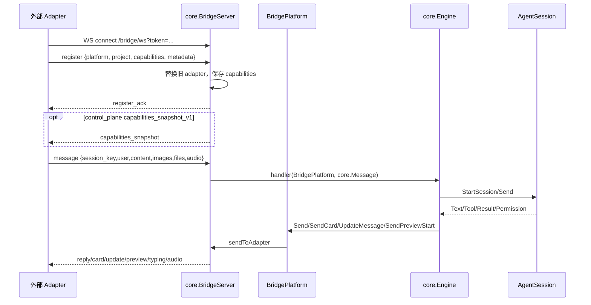

### 4.2 Bridge 协议代码编号

| 编号 | 文件位置 | 函数/变量 | 作用 | 迁移价值 |
| --- | --- | --- | --- | --- |
| BR-01 | `core/bridge.go:26-38` | `BridgeServer` | 维护 token/path/CORS、adapter map、engine map | P0 |
| BR-02 | `core/bridge.go:45-55` | `bridgeAdapter` | 保存 platform、capabilities、metadata、WS writer lock、preview ack | P0 |
| BR-03 | `core/bridge.go:57-79` | `bridgeReplyCtx` | Bridge reply context，保存 session_key 和 progress hints | P0 |
| BR-04 | `core/bridge.go:95-152` | `bridgeMsg`、`bridgeRegister`、`bridgeMessage`、`bridgeCardAction`、`bridgeImageData`、`bridgeFileData`、`bridgeAudioData` | Wire protocol 数据结构 | P0，可直接转 TypeScript schema |
| BR-05 | `core/bridge.go:158-176` | `NewBridgeServer` | 默认端口 9810、默认 path `/bridge/ws` | P0 |
| BR-06 | `core/bridge.go:195-212` | `Start` | 注册 WS path 和 `/bridge/sessions` REST | P0 |
| BR-07 | `core/bridge.go:276-297` | `BridgePlatform` interface assertions | Bridge 同时实现卡片、按钮、更新、预览、typing、音频、导航、reply ctx 重建 | P0 |
| BR-08 | `core/bridge.go:299-343` | `Name`、`Start`、`Stop`、`Reply`、`Send`、`ReconstructReplyCtx` | 让 Bridge adapter 看起来像普通 Platform | P0 |
| BR-09 | `core/bridge.go:447-604` | `SendCard`、`SendWithButtons`、`UpdateMessage`、`SendPreviewStart`、`DeletePreviewMessage`、`StartTyping`、`SendAudio` | 输出能力转 WS 消息 | P0/P1 |
| BR-10 | `core/bridge.go:630-744` | `handleConnection` | 强制首包 register、心跳读超时、capability map、adapter 替换、snapshot 下发 | P0 |
| BR-11 | `core/bridge.go:750-817` | `handleMessage` | WS 输入转 `core.Message`，含 base64 image/file/audio | P0 |
| BR-12 | `core/bridge.go:819-884` | `handleCardAction` | 将 `perm:*`、`askq:*`、`cmd:*`、`nav:/act:` 转成消息或卡片导航 | P1 |
| BR-13 | `core/bridge.go:926-1124` | `/bridge/sessions` REST | 外部 adapter 可创建/列出/切换/删除 session | P0 |
| BR-14 | `core/bridge.go:1130-1146` | `authenticate` | Bearer、`X-Bridge-Token`、query token | P0 |
| BR-15 | `core/bridge_capabilities.go:53-108` | `Engine.GetBridgePublishedCommands` | 对 adapter 发布内置命令、custom commands、skills，尊重 disabled commands | P1 |
| BR-16 | `core/bridge_capabilities.go:110-144` | `buildCapabilitiesSnapshot` | host/project/commands 能力快照 | P1 |
| BR-17 | `web/src/hooks/useBridgeSocket.ts:35-148` | `useBridgeSocket` | Web Chat 自己作为 Bridge adapter 注册，发消息、按钮、preview ack，25s ping，3s 重连 | P0，Synapse Web Chat 可复用思想 |

### 4.3 最小可迁移协议

Synapse 中建议先实现以下消息类型：

```ts
type BridgeInbound =
  | { type: "register"; payload: { platform: string; project?: string; capabilities?: string[]; metadata?: Record<string, unknown> } }
  | { type: "message"; payload: { session_key: string; user_id?: string; user_name?: string; chat_name?: string; content?: string; images?: BridgeImage[]; files?: BridgeFile[]; audio?: BridgeAudio } }
  | { type: "card_action"; payload: { session_key: string; value: string; user_id?: string; user_name?: string } }
  | { type: "preview_ack"; payload: { session_key: string; preview_id: string; message_id?: string } }
  | { type: "ping" };

type BridgeOutbound =
  | { type: "register_ack"; payload: { platform: string; project: string } }
  | { type: "reply"; payload: { session_key: string; content: string } }
  | { type: "card"; payload: { session_key: string; card: unknown } }
  | { type: "update_message"; payload: { session_key: string; message_id?: string; content: string } }
  | { type: "preview_start"; payload: { session_key: string; preview_id: string; content: string } }
  | { type: "typing"; payload: { session_key: string; active: boolean } }
  | { type: "audio"; payload: { session_key: string; data: string; format: string } }
  | { type: "error"; payload: { message: string } };
```

## 5. 配置即产品状态：TOML schema、env placeholder、raw patch

CC Connect 的配置层不只是读取 TOML。它支撑 Web 管理台、Provider 动态保存、项目设置 PATCH、全局设置、首次启用 Web、provider refs 合并。

### 5.1 配置关系图

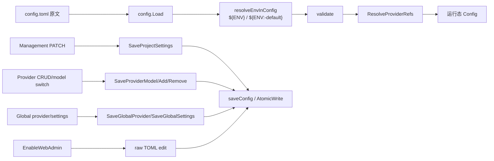

### 5.2 代码编号

| 编号 | 文件位置 | 函数/变量 | 作用 | 迁移价值 |
| --- | --- | --- | --- | --- |
| CFG-01 | `config/config.go:85-112` | `Config` | 全局 config schema：data_dir、providers、projects、commands、roles、cron、bridge、management 等 | P0 |
| CFG-02 | `config/config.go:128-153` | `BridgeConfig`、`ManagementConfig` | Bridge/Web 管理配置 | P0 |
| CFG-03 | `config/config.go:172-203` | `RateLimitConfig`、`OutgoingRateLimitConfig`、`UsersConfig`、`RoleConfig` | 输入/输出限流和角色 | P0 |
| CFG-04 | `config/config.go:259-275` | `HeartbeatConfig`、`AutoCompressConfig` | 心跳和自动压缩项目配置 | P1 |
| CFG-05 | `config/config.go:292-337` | `ProjectConfig` | 项目 schema：mode、base_dir、agent、platforms、heartbeat、run_as_user、observe、references 等 | P0 |
| CFG-06 | `config/config.go:339-374` | `AgentConfig`、`ProviderConfig`、`CodexProviderConfig` | Agent/provider schema | P0 |
| CFG-07 | `config/config.go:400-432` | `Load` | 读 TOML、env placeholder、默认值、provider refs、validate | P0 |
| CFG-08 | `config/config.go:434-559` | `resolveEnvInConfig`、`resolveEnvValue`、`resolveEnvPlaceholders` | 配置支持环境变量占位，避免明文密钥 | P0 |
| CFG-09 | `config/config.go:604-657` | `validate` | 全局配置合法性校验 | P0 |
| CFG-10 | `config/config.go:760-857` | `SaveActiveProvider`、`SaveProviderModel`、`SaveAgentModel` | 保存 active provider/model | P0 |
| CFG-11 | `config/config.go:859-941` | `AddProviderToConfig`、`RemoveProviderFromConfig` | 动态增删项目 provider | P0 |
| CFG-12 | `config/config.go:943-984` | `ResolveProviderRefs` | 将 global providers 合并到项目 provider，项目内联覆盖全局 | P0 |
| CFG-13 | `config/config.go:1012-1088` | global provider CRUD | 全局 provider 增删改 | P0 |
| CFG-14 | `config/config.go:1105-1135` | `saveConfig` | 临时文件 + rename 原子保存 | P0 |
| CFG-15 | `config/config.go:2328-2445` | `rawProjectSpan`、`buildRawProjectSpans` | 定位 raw TOML 中项目、平台、provider span，保留注释和结构做局部 patch | P1 |
| CFG-16 | `config/config.go:2637-2766` | `SaveProjectSettings` | Web PATCH 项目设置落盘 | P0 |
| CFG-17 | `config/config.go:2768-2820` | `GetProjectConfigDetails` | API 读取项目设置详情 | P0 |
| CFG-18 | `config/config.go:2822-2844` | `SaveProviderRefs` | 保存项目引用的全局 providers | P0 |
| CFG-19 | `config/config.go:2875-2919` | `AddPlatformToProject` | Web 添加平台配置 | P1 |
| CFG-20 | `config/config.go:3127-3207` | `EnableWebAdmin` | 首次启用管理面和 Bridge | P0 |

迁移建议：Synapse 不一定要保留 TOML，但必须保留“配置 schema + 局部更新 + 原子持久化 + secret env 引用 + 运行态 reload”的能力。若落到 Synapse Electron，应通过 main-process repository/service 更新，避免 renderer 直接写文件。

## 6. Provider/Model 生态

Provider 系统是 CC Connect 中非常值得迁移的一部分。它解决三个实际问题：

1. 多个 Agent CLI 的 provider 配置格式不同。
2. 同一个 provider 要被多个项目复用。
3. 用户希望在远程聊天或 Web 上切换模型，而不是手改配置文件。

### 6.1 Provider 生命周期

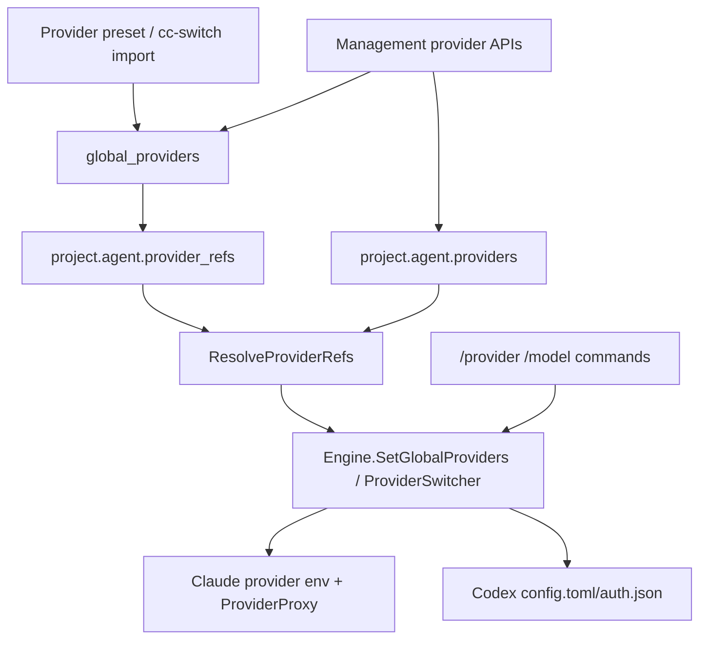

### 6.2 代码编号

| 编号 | 文件位置 | 函数/变量 | 作用 |
| --- | --- | --- | --- |
| PROV-01 | `core/provider_presets.go:21-50` | `ProviderPreset`、`PresetAgentConfig`、`PresetCodexConfig` | provider preset schema，支持不同 Agent 配置 |
| PROV-02 | `core/provider_presets.go:74-158` | `FetchProviderPresets` | primary/fallback URL、缓存、stale fallback | 可作为 Synapse provider marketplace |
| PROV-03 | `core/provider.go:3-35` | `GetProviderModels`、`GetProviderModel`、`SetProviderModel` | provider model helper | P0 |
| PROV-04 | `core/providerproxy.go:24-84` | `ProviderProxy`、`NewProviderProxy` | Claude 非官方 provider 的本地 reverse proxy，支持 SSE flush | P0/P1 |
| PROV-05 | `core/providerproxy.go:93-120` | `rewriteThinkingInRequest` | 重写 `thinking.type`，适配不兼容 provider | P1 |
| PROV-06 | `agent/codex/provider_config.go:12-39` | `ensureCodexProviderConfig` | 写 `$CODEX_HOME/config.toml` 的 `[model_providers.<name>]` | P0，Codex 集成关键 |
| PROV-07 | `agent/codex/provider_config.go:41-70` | `ensureCodexAuth` | 写 `$CODEX_HOME/auth.json`，apikey auth | P0 |
| PROV-08 | `agent/codex/codex.go:318-351` | `StartSession` provider env/config | 启动 Codex session 前写 provider 配置并注入 env | P0 |
| PROV-09 | `agent/codex/codex.go:545-621` | `SetProviders`、`SetActiveProvider`、`providerEnvLocked`、`activeProviderCodexConfig` | Codex ProviderSwitcher | P0 |
| PROV-10 | `agent/codex/session.go:178-208` | session args | Codex CLI args：`--model`、`model_provider`、`openai_base_url`、`model_reasoning_effort` | P0 |
| PROV-11 | `agent/claudecode/claudecode.go:852-895` | Claude ProviderSwitcher | Claude provider 列表和 active 切换 | P0 |
| PROV-12 | `agent/claudecode/claudecode.go:897-949` | `providerEnvLocked` | 根据 provider 设置 `ANTHROPIC_AUTH_TOKEN`、`ANTHROPIC_MODEL`、base_url/proxy/env | P0 |
| PROV-13 | `agent/claudecode/claudecode.go:990-1010` | `ensureProviderProxyLocked`、`stopProviderProxyLocked` | thinking proxy 生命周期 | P1 |
| PROV-14 | `core/management.go:1126-1362` | provider API handlers | Web 管理 provider、refs、models | P0 |
| PROV-15 | `core/management.go:1760-1850` | `handleProviderPresets`、`handleCCSwitchProviders` | provider preset 和 cc-switch 导入 | P1 |

迁移建议：Synapse 需要一个统一 ProviderConfigService，向不同 agent adapter 输出不同 runtime view：

| Agent | 输出形式 |
| --- | --- |
| Claude Code | env vars + 可选本地 proxy |
| Codex | `$CODEX_HOME/config.toml` + `auth.json` + CLI args |
| OpenCode/其他 | env vars 或 agent-specific config |

## 7. Skills、Custom Commands 与命令发布

既有 1.5 提到命令转发，但没有完整展开“命令生态”。迁移价值在于：Synapse 可把技能、快捷命令、内置命令统一成可发布给平台和 Web Chat 的 command palette。

### 7.1 代码编号

| 编号 | 文件位置 | 函数/变量 | 作用 |
| --- | --- | --- | --- |
| CMD-01 | `core/command.go:13-21` | `CustomCommand` | 自定义命令 schema：`Prompt` 或 `Exec`，互斥 |
| CMD-02 | `core/command.go:23-35` | `CommandRegistry` | config/runtime commands + agentDirs |
| CMD-03 | `core/command.go:36-76` | `Add`、`ClearSource`、`Remove`、`SetAgentDirs` | 命令注册、清理、扫描目录设置 |
| CMD-04 | `core/command.go:78-135` | `Resolve` | config command 优先，再扫描 agent command `.md`；hyphen/underscore 兼容 |
| CMD-05 | `core/command.go:137-184` | `ListAll` | 列出 config + agent command files |
| CMD-06 | `core/command.go:186-244` | `ExpandPrompt` | `{{1}}`、`{{2*}}`、`{{args}}`、默认值模板展开 |
| CMD-07 | `core/engine.go:3587-3613` | `handleCommand` default 分支 | custom command 和 skill 作为 slash command 执行 |
| CMD-08 | `core/engine.go:9862-9890` | `executeCustomCommand` | prompt 型 command 转成 Agent prompt；exec 型要求 admin |
| CMD-09 | `core/engine.go:9892-9970` | `executeShellCommand` | 执行 shell command，设置 `CC_PROJECT`、`CC_SESSION_KEY`，60s timeout |
| CMD-10 | `core/engine.go:9972-10131` | `/commands` add/list/delete | 运行时增删命令并持久化 |
| SKILL-01 | `core/skill.go:13-28` | `Skill`、`SkillRegistry` | skill schema 和注册器 |
| SKILL-02 | `core/skill.go:42-58` | `Resolve`、`normalizeCommandName` | `/skill-name` 解析 |
| SKILL-03 | `core/skill.go:60-86` | `ListAll` | 列出所有 skill，带缓存 |
| SKILL-04 | `core/skill.go:88-148` | `discoverSkillsInDir`、`shouldDescendIntoSkillPath` | 遍历 skill 目录，支持嵌套 `SKILL.md` |
| SKILL-05 | `core/skill.go:175-270` | `parseSkillMD`、`parseFrontmatter` | 解析 frontmatter name/description 和说明正文 |
| SKILL-06 | `core/skill.go:273-300` | `BuildSkillInvocationPrompt` | 将 skill 说明和用户参数包装成 Agent prompt |
| SKILL-07 | `core/engine.go:10138-10155` | `executeSkill` | skill 转成当前 session 的 Agent turn |
| SKILL-08 | `agent/codex/codex.go:421-436` | Codex skill dirs | 项目 `.agents/skills`、`.codex/skills`、用户 skills |
| SKILL-09 | `agent/claudecode/claudecode.go:738-744` | Claude skill dirs | 项目 `.claude/skills` 和 config home |
| SKILL-10 | `core/skill_presets.go:21-56` | `SkillPreset`、`SkillSource`、`SkillPricing` | skill preset marketplace schema |
| SKILL-11 | `core/skill_presets.go:58-141` | `FetchSkillPresets` | skill presets primary/fallback/cache |
| SKILL-12 | `core/bridge_capabilities.go:53-108` | `GetBridgePublishedCommands` | 将命令/技能发布给 Bridge adapter | P1 |

### 7.2 迁移方案

Synapse 中建议拆成三层：

| 层 | 职责 |
| --- | --- |
| CommandRegistry | 内置命令、用户自定义 prompt/exec 命令、Agent 原生命令文件 |
| SkillRegistry | 发现 `SKILL.md`，生成 Agent invocation prompt |
| CommandPublisher | 将命令投递到 Web command palette、Bridge capabilities、远程平台菜单 |

关键限制：exec 型 command 必须走 Synapse 的 `PermissionGuard.check()` 和 `AuditSink`，不能直接从 renderer 或聊天消息执行 shell。

## 8. 安全与治理：角色、限流、敏感词、用户隔离

CC Connect 在“远程控制本地机器”这件事上有多层护栏，这部分应优先迁移。

### 8.1 输入安全流程

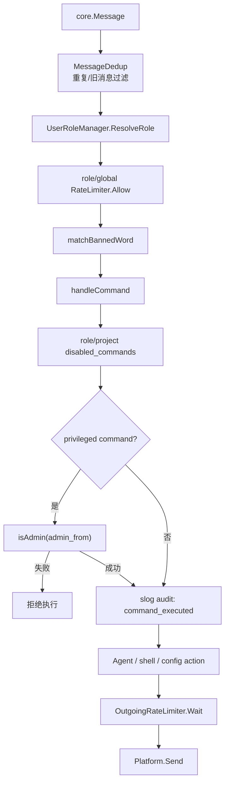

### 8.2 安全代码编号

| 编号 | 文件位置 | 函数/变量 | 作用 |
| --- | --- | --- | --- |
| SEC-01 | `core/dedup.go:15-50` | `MessageDedup`、`IsDuplicate`、`IsOldMessage` | 过滤重复消息和启动前旧消息 |
| SEC-02 | `core/user_roles.go:11-33` | `UserRole`、`RoleInput`、`UserRoleManager` | 用户角色模型 |
| SEC-03 | `core/user_roles.go:51-96` | `Configure` | 排序 role、解析 disabled commands、创建 role rate limiter |
| SEC-04 | `core/user_roles.go:98-132` | `ResolveRole` | explicit/default/wildcard 角色解析 |
| SEC-05 | `core/user_roles.go:134-153` | `AllowRate` | 按角色限流 |
| SEC-06 | `core/ratelimit.go:8-17`、`:24-82` | `RateLimiter`、`Allow` | 滑动窗口 per-key 限流 |
| SEC-07 | `core/outgoing_ratelimit.go:27-35`、`:98-116` | `OutgoingRateLimiter`、`Wait` | 平台输出限流，避免消息平台风控 |
| SEC-08 | `core/engine.go:751-759` | `SetUserRoles` | 注入 role manager |
| SEC-09 | `core/engine.go:761-806` | `SetAdminFrom`、`privilegedCommands`、`isAdmin` | 管理员命令 allowlist |
| SEC-10 | `core/engine.go:808-817` | `SetBannedWords` | 注入敏感词 |
| SEC-11 | `core/engine.go:833-867` | `checkRateLimit` | role rate limit 优先，全局 fallback |
| SEC-12 | `core/engine.go:1424-1438` | `matchBannedWord` | 敏感词匹配 |
| SEC-13 | `core/engine.go:3460-3498` | `handleCommand` 前置权限 | disabled、role、admin、audit |
| SEC-14 | `core/engine.go:7393-7399` | `waitOutgoing` | 发送前等待输出限流 |
| SEC-15 | `core/management.go:321-334` | management auth | 管理 API token |
| SEC-16 | `core/bridge.go:1130-1146` | bridge auth | Bridge token |
| SEC-17 | `core/webhook.go:155-179` | webhook auth | Bearer、`X-Webhook-Token`、query token |

### 8.3 run_as_user 用户隔离

这是 CC Connect 中很有价值但容易被忽略的安全设计：让 Agent CLI 以目标 OS 用户运行，同时防止目标用户反向提权。

| 编号 | 文件位置 | 函数/变量 | 作用 |
| --- | --- | --- | --- |
| RUNAS-01 | `core/runas.go:91-104` | `DefaultEnvAllowlist`、`SpawnOptions` | 定义隔离运行的 env allowlist 和 spawn opts |
| RUNAS-02 | `core/runas.go:129-148` | `BuildSpawnCommand` | 用 `sudo -n -iu <user> --preserve-env=...` 包裹原命令 |
| RUNAS-03 | `core/runas.go:150-174` | `FilterEnvForSpawn` | 只透传允许的环境变量 |
| RUNAS-04 | `core/runas.go:188-222` | `VerifyRunAsUserCheap` | 检查 supervisor 可免密 sudo 到 target，且 target 不能免密 sudo 回 supervisor |
| RUNAS-05 | `core/runas_check.go:68-140` | `PreflightRunAsUser` | 启动前检查 sudo、work_dir 权限、子目录风险 |
| RUNAS-06 | `core/runas_audit.go:157-180` | `RunIsolationProbe` | 运行嵌入式 probe 生成隔离审计 |
| RUNAS-07 | `cmd/cc-connect/runas_startup.go:18-158` | `runRunAsUserStartupChecks` | 多项目并发做 preflight/audit，失败则启动中止 |
| RUNAS-08 | `agent/claudecode/session.go:107-153` | per-spawn verification + `BuildSpawnCommand` | 每次启动 Claude session 前再校验并包裹命令 |
| RUNAS-09 | `agent/claudecode/claudecode.go:166-187` | run_as opts 注入 | Agent options 接收 `run_as_user`、env allowlist |

迁移建议：Synapse 如要提供“远程执行本地 Agent + shell”能力，必须把敏感操作放在 Electron main process，通过项目已有 `PermissionGuard.check()` 和 `AuditSink` 记录。run_as_user 可作为后续增强，但 `exec`、文件写入、Agent spawn 一开始就要有权限模型。

## 9. SessionManager：会话持久化、resume、队列和迁移

SessionManager 是 CC Connect 远程体验稳定的核心。它解决“一个聊天用户/频道有多个命名 session”“active session 指针”“Agent 原生 session id 恢复”“旧数据迁移”“busy session 排队”等问题。

### 9.1 代码编号

| 编号 | 文件位置 | 函数/变量 | 作用 |
| --- | --- | --- | --- |
| SESS-01 | `core/session.go:13-30` | `ContinueSession`、`Session` | 本地 session 数据结构，保存 `AgentSessionID`、`PastAgentSessionIDs`、history |
| SESS-02 | `core/session.go:32-57` | `TryLock`、`Unlock`、`UnlockWithoutUpdate` | 防止同一 session 并发 turn |
| SESS-03 | `core/session.go:69-97` | `recordPastAgentSessionID`、`SetAgentInfo` | 保留历史 agent session id，避免切换/清空后失去归属 |
| SESS-04 | `core/session.go:119-151` | `SetAgentSessionID`、`CompareAndSetAgentSessionID` | 只在合适时更新 agent session id |
| SESS-05 | `core/session.go:193-223` | `sessionSnapshot`、`SessionManager` | 持久化 schema：sessions、active、userSessions、names、meta、legacy flag |
| SESS-06 | `core/session.go:250-290` | `GetOrCreateActive`、`NewSession`、`NewSideSession` | active session 和一次性 side session |
| SESS-07 | `core/session.go:307-349` | `SwitchSession`、`SwitchToAgentSession` | 按本地 session 或 agent session 切换 |
| SESS-08 | `core/session.go:390-421` | `UpdateUserMeta`、`GetUserMeta` | 保存 session_key 对应用户名/群名 |
| SESS-09 | `core/session.go:434-463` | `KnownAgentSessionIDs` | 过滤只属于 CC Connect 的 Agent 原生 sessions |
| SESS-10 | `core/session.go:544-616` | `Save`、`saveLocked` | 深拷贝 snapshot，原子写入 |
| SESS-11 | `core/session.go:618-677` | `load` | 读取 snapshot，处理 `legacyData` 和 `ContinueSession` 迁移 |
| SESS-12 | `core/session.go:679-707` | `InvalidateForAgent` | 切 Agent 类型时清空不匹配的 agent session id |
| SESS-13 | `cmd/cc-connect/main.go:1071-1098` | `sessionStorePath` | 按 work_dir hash 保存 session，兼容 legacy path |

### 9.2 迁移原则

Synapse 应把 session 拆成两层：

| 层 | 字段 |
| --- | --- |
| Synapse 本地会话 | `id`、`projectId`、`channel/sessionKey`、`active`、`name`、`history`、`userMeta` |
| Agent 原生会话映射 | `agentType`、`agentSessionId`、`pastAgentSessionIds`、`resumePolicy` |

不要只保存 Agent 原生 session id；否则切 Agent、切 provider、`/new`、恢复失败时都会损坏远程会话体验。

## 10. Stream Preview 与 Compact Progress

长任务远程控制时，用户需要知道 Agent 是否仍在工作。CC Connect 通过两套机制改善体验：

1. `streamPreview`：把 assistant 文本增量更新到同一条消息。
2. `compactProgressWriter`：把 thinking/tool/tool result 压成紧凑进度卡片。

### 10.1 流程图

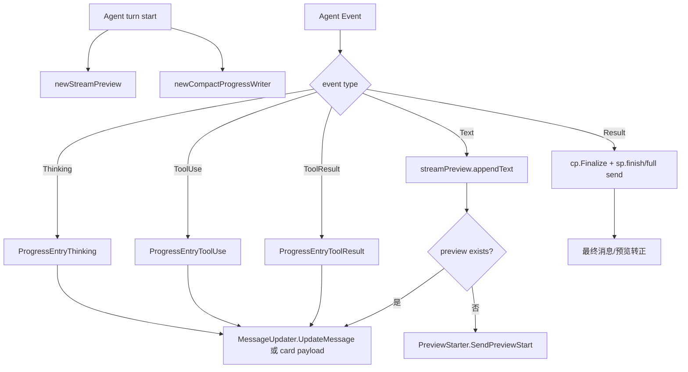

### 10.2 代码编号

| 编号 | 文件位置 | 函数/变量 | 作用 |
| --- | --- | --- | --- |
| STREAM-01 | `core/streaming.go:12-29` | `StreamPreviewCfg`、`DefaultStreamPreviewCfg` | 流式预览配置 |
| STREAM-02 | `core/streaming.go:31-52` | `streamPreview` | 预览状态：buffer、previewID、messageID、节流状态 |
| STREAM-03 | `core/streaming.go:54-74` | `PreviewStarter`、`PreviewCleaner`、`PreviewFinishPreference` | 平台预览能力接口 |
| STREAM-04 | `core/streaming.go:87-104` | `canPreview` | 平台能力检查，必须支持 `MessageUpdater` |
| STREAM-05 | `core/streaming.go:106-140` | `appendText` | 累积文本，按最小 delta/interval 节流 |
| STREAM-06 | `core/streaming.go:169-220` | `flushLocked` | 首次发 preview，后续 update message |
| STREAM-07 | `core/streaming.go:226-359` | `freeze`、`discard`、`finish` | 工具调用或最终结果时处理预览 |
| PROG-01 | `core/progress_compact.go:29-66` | `ProgressCardState`、`ProgressCardEntry`、`ProgressCardPayload` | 结构化进度卡片 payload |
| PROG-02 | `core/progress_compact.go:68-132` | `BuildProgressCardPayload`、`BuildProgressCardPayloadV2` | 生成进度卡片 payload |
| PROG-03 | `core/progress_compact.go:291-324` | `newCompactProgressWriter` | 按平台 progress style 决定是否启用 compact/card |
| PROG-04 | `core/progress_compact.go:355-481` | `Append`、`AppendEvent`、`AppendStructured` | 增量更新进度，保留最近 10 条 |
| PROG-05 | `core/progress_compact.go:483-510` | `Finalize` | 完成/失败状态 |
| PROG-06 | `core/engine.go:2610-2860` | event loop progress 分支 | thinking/tool/result/text 事件进入 preview/progress |
| PROG-07 | `core/engine.go:2934-3028` | EventResult finalization | 完成进度、保存 history、上下文 footer、最终发送 |

迁移建议：Synapse 的 Chat UI 可以比消息平台更强，建议直接使用结构化 event timeline，而不是只模拟消息 update。但 Bridge 仍应保留 `update_message` 和 `preview_start`，兼容外部 adapter。

## 11. Heartbeat：主会话周期性自检/唤醒

Heartbeat 不同于 cron：它不是创建独立计划任务，而是在指定 session 上周期性向 Agent 发一段“心跳 prompt”，用于持续检查状态、维护上下文、主动提醒。

### 11.1 流程图

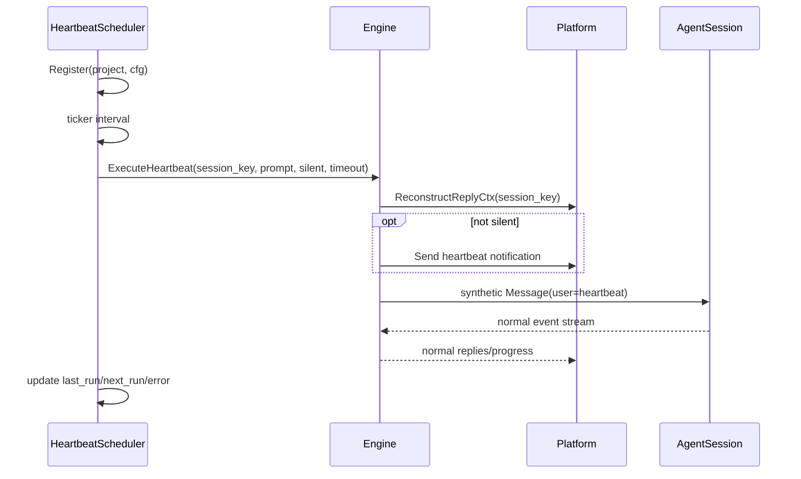

### 11.2 代码编号

| 编号 | 文件位置 | 函数/变量 | 作用 |
| --- | --- | --- | --- |
| HB-01 | `core/heartbeat.go:15-23` | `HeartbeatConfig` | runtime 心跳配置 |
| HB-02 | `core/heartbeat.go:25-38` | `HeartbeatStatus` | API 状态结构 |
| HB-03 | `core/heartbeat.go:46-72` | `HeartbeatScheduler`、entry | 每项目一个 entry，保存 interval、paused、stats |
| HB-04 | `core/heartbeat.go:74-117` | `NewHeartbeatScheduler`、`Register` | 注册项目心跳，恢复持久状态 |
| HB-05 | `core/heartbeat.go:169-252` | `Status`、`Pause`、`Resume`、`SetInterval` | Web/命令可管理心跳 |
| HB-06 | `core/heartbeat.go:319-387` | `run`、`execute` | ticker 触发、only_when_idle、读取 prompt、调用 Engine |
| HB-07 | `core/heartbeat.go:389-394` | `defaultHeartbeatPrompt`、`readHeartbeatMD` | prompt fallback |
| HB-08 | `core/engine.go:1188-1250` | `ExecuteHeartbeat` | 重建 reply ctx，构造 synthetic `Message`，锁 active session，进入正常消息管线 |
| HB-09 | `core/management.go:1366-1461` | `handleProjectHeartbeat` | Web API 管理心跳 |

迁移建议：Heartbeat 应放在 Synapse main process SchedulerService 中，但实际执行仍走同一个 Engine 消息管线，不能绕过会话锁和权限状态。

## 12. Observer：旁路观察 Claude Code JSONL

Observer 的价值是“无需拦截用户输入，也能把本机 Claude Code 原生日志转发到远程平台”。它目前主要面向 Slack。

| 编号 | 文件位置 | 函数/变量 | 作用 |
| --- | --- | --- | --- |
| OBS-01 | `core/observer.go:21-30` | `ObserverTarget`、`observation` | 可接收观察消息的平台接口和内部数据 |
| OBS-02 | `core/observer.go:32-83` | `parseObservationLine` | 解析 Claude JSONL，提取 user/assistant 文本，跳过 `sdk-cli`、tool/thinking |
| OBS-03 | `core/observer.go:85-111` | `Engine.startObserver` | 找到 observer target，解析 channel，启动 observer |
| OBS-04 | `core/observer.go:123-150` | `newSessionObserver`、`run` | 每 2 秒 poll |
| OBS-05 | `core/observer.go:152-168` | `initOffsets` | 初始从 EOF 开始，不回放历史 |
| OBS-06 | `core/observer.go:170-236` | `poll`、`tailFile` | 扫描 JSONL，读取新增行 |
| OBS-07 | `core/observer.go:238-250` | `forward` | 格式化并转发观察内容 |
| OBS-08 | `cmd/cc-connect/main.go:278-312` | observe wiring | CLI `--observe` 指定 observer channel |
| OBS-09 | `cmd/cc-connect/main.go:1150-1165` | `resolveClaudeProjectDir` | 定位 Claude project dir |

迁移建议：这不是 P0。Synapse 如果以后要做“旁路观察现有 CLI 会话”，可以迁移 JSONL tail 方案；但如果 Synapse 自己掌控 AgentSession，优先使用内部事件流。

## 13. Local References：代码引用渲染和 `/show`

这部分对开发者工具很有价值。Agent 回复中的本地路径、Markdown link、`#Lx`、`:line:col` 等会被规范化，让远程聊天也能读懂代码引用；用户还能 `/show` 某个文件片段。

### 13.1 代码编号

| 编号 | 文件位置 | 函数/变量 | 作用 |
| --- | --- | --- | --- |
| REF-01 | `core/reference_parse.go:12-42` | `referenceKind`、`referenceLocationFormat`、`localReference` | 引用结构 |
| REF-02 | `core/reference_parse.go:44-50` | regex vars | markdown link、line/column、colon range 识别 |
| REF-03 | `core/reference_parse.go:52-136` | `parseUserLocalReference`、`parseLocalReference` | 解析本地路径，忽略 URL，支持 file://、相对/绝对路径 |
| REF-04 | `core/reference_parse.go:138-182` | `inferReferenceKind`、`looksLikeLocalPath`、`isWebURL` | 引用类型判断 |
| REF-05 | `core/reference_render.go:12-18` | `ReferenceRenderCfg` | 是否启用、agent/platform allowlist、格式 |
| REF-06 | `core/reference_render.go:35-57` | `DefaultReferenceRenderCfg`、`normalizeReferenceRenderCfg` | 默认引用展示策略 |
| REF-07 | `core/reference_render.go:97-133` | `renderEnabled`、`TransformLocalReferences` | 判断并转换普通文本引用 |
| REF-08 | `core/reference_render.go:172-287` | `transformNonCodeText`、`replaceMarkdownLinks`、`replaceLocalReferenceCandidates` | 避免 code fence 和 URL，替换本地引用 |
| REF-09 | `core/reference_show.go:35-88` | `buildReferenceViewRequest`、`renderReferenceView` | `/show` 请求构建和路径校验 |
| REF-10 | `core/reference_show.go:90-163` | `renderReferenceFile`、`renderReferenceDir` | 渲染文件 range/context/head 或目录列表 |
| REF-11 | `core/engine.go:7401-7466` | `renderOutgoingContentForWorkspace`、`renderCardForPlatformWorkspace` | 所有 outgoing 文本和卡片都经过引用转换 |

迁移建议：Synapse 可以把引用转换升级成真正的“可点击打开文件/定位行”的 UI 功能。底层仍应保留 parser，渲染时按当前 workspace 做路径约束，避免泄露任意文件路径。

## 14. Webhook 与 Bot-to-Bot Relay

### 14.1 Webhook：外部系统触发 Agent 或 shell

Webhook 没有被既有文档充分分析，但它对 Synapse 的自动化入口很有参考价值。

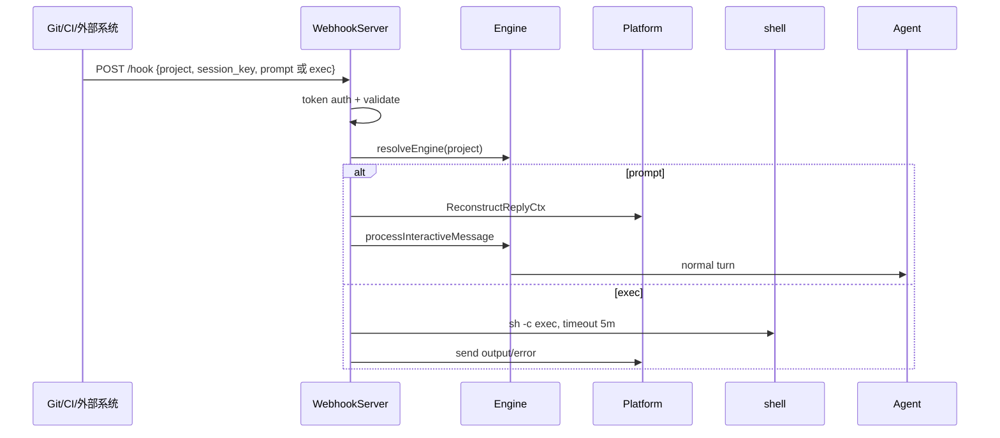

| 编号 | 文件位置 | 函数/变量 | 作用 |
| --- | --- | --- | --- |
| WEBHOOK-01 | `core/webhook.go:17-26` | `WebhookServer` | HTTP endpoint，持有 engines |
| WEBHOOK-02 | `core/webhook.go:28-38` | `WebhookRequest` | `event`、`project`、`session_key`、`prompt`、`exec`、`payload` |
| WEBHOOK-03 | `core/webhook.go:40-77` | `NewWebhookServer`、`Start` | 默认端口 9111、path `/hook` |
| WEBHOOK-04 | `core/webhook.go:87-153` | `handleHook` | POST only、auth、JSON 校验、prompt/exec 互斥、异步执行 |
| WEBHOOK-05 | `core/webhook.go:155-179` | `authenticate` | Bearer、header、query token |
| WEBHOOK-06 | `core/webhook.go:181-200` | `resolveEngine` | 单项目可省略 project，多项目必须指定 |
| WEBHOOK-07 | `core/webhook.go:202-255` | `executePrompt` | 重建 reply ctx，构造 webhook 用户消息，进入 Engine |
| WEBHOOK-08 | `core/webhook.go:260-334` | `executeShell` | `sh -c` 执行，默认 agent work_dir，5 分钟 timeout，回传输出 |

迁移建议：Webhook 中的 `exec` 必须在 Synapse 中套 PermissionGuard 和审计，不应直接照搬。

### 14.2 Relay：Agent 间协作通道

Relay 的核心价值是：让一个 Agent 能通过 `cc-connect relay send --to <project>` 同步询问另一个项目的 Agent，并把请求/响应透明地发回群聊。

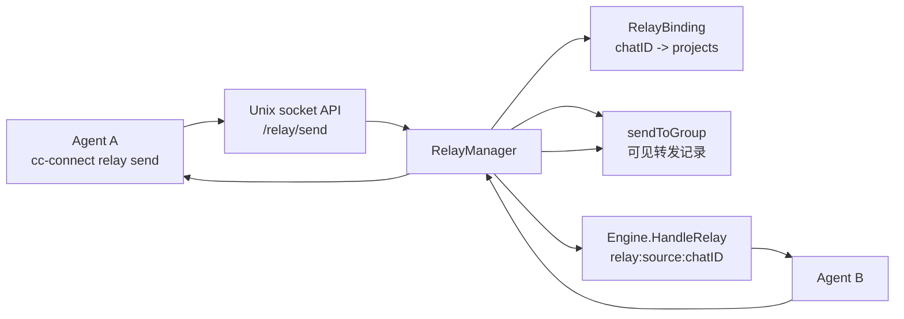

| 编号 | 文件位置 | 函数/变量 | 作用 |
| --- | --- | --- | --- |
| RELAY-01 | `core/relay.go:17-31` | `RelayBinding`、`RelayManager` | chatID 到多个项目的绑定，以及 engine registry |
| RELAY-02 | `core/relay.go:33-60` | `NewRelayManager`、`SetTimeout` | data_dir 持久化和响应超时 |
| RELAY-03 | `core/relay.go:62-135` | `Bind`、`AddToBind`、`RemoveFromBind`、`Unbind` | 群聊内绑定管理 |
| RELAY-04 | `core/relay.go:187-248` | `Send` | 校验 binding，群聊可见转发，调用目标 `HandleRelay`，回传响应 |
| RELAY-05 | `core/relay.go:250-270` | `sendToGroup` | 用平台 `ReplyContextReconstructor` 在群聊发可见记录 |
| RELAY-06 | `core/relay.go:304-345` | `saveLocked`、`load` | `relay_bindings.json` 持久化 |
| RELAY-07 | `cmd/cc-connect/relay.go:29-127` | `runRelaySend` | Agent 通过 CLI 调 Unix socket `/relay/send` |
| RELAY-08 | `cmd/cc-connect/main.go:956-982` | relay manager wiring | API server 注入 `RelayManager`，Engine 注入 `SetRelayManager` |
| RELAY-09 | `core/engine.go:10978-11115` | `HandleRelay` | 使用专用 `relay:<from>:<chatID>` session，同步等待目标 Agent 响应 |
| RELAY-10 | `core/engine.go:11117-11179` | `relayPartialResponseOrError`、`drainRelaySession` | 超时返回部分响应，并让 Agent 后台完成以保存 session |
| RELAY-11 | `core/engine.go:11181-11280` | `cmdBind` | `/bind` 管理群聊绑定 |
| RELAY-12 | `core/engine.go:11296-11356` | `setupMemoryFile` | 将 `AgentSystemPrompt` 写入 Agent memory，让 Agent 知道 relay/cron/send |

迁移建议：Relay 很适合 Synapse 做“多 Agent 协作”。实现时不必保留群聊绑定形式，但应保留：

1. 项目间可寻址。
2. Relay session 独立于用户主会话。
3. 超时不杀 Agent，后台 drain 并保存 session。
4. 请求/响应可审计、可在 UI 中看到。

## 15. Auto-Compress：长期会话上下文维护

Auto-compress 是 Agent 长会话里的重要可靠性能力：当估算 token 超过阈值，并且距离上次压缩超过最小间隔，就向 Agent 发原生压缩命令。

| 编号 | 文件位置 | 函数/变量 | 作用 |
| --- | --- | --- | --- |
| COMP-01 | `config/config.go:270-275` | `AutoCompressConfig` | `enabled`、`max_tokens`、`min_gap_mins` |
| COMP-02 | `core/interfaces.go:396-402` | `ContextCompressor` | Agent 声明压缩命令 |
| COMP-03 | `core/engine.go:522-530` | `SetAutoCompressConfig` | 注入 auto-compress 参数，默认 min gap 30 分钟 |
| COMP-04 | `core/engine.go:2968-2986` | trigger evaluation | 基于 history + 本轮回复估算 token，判断是否触发 |
| COMP-05 | `core/engine.go:3084-3108` | auto-compress trigger | 最终回复后、处理 queued messages 前执行压缩 |
| COMP-06 | `core/engine.go:6393-6419` | `cmdCompress` | 手动 `/compress` |
| COMP-07 | `core/engine.go:6422-6461` | `runCompress` | drain stale events，发送压缩命令 |
| COMP-08 | `core/engine.go:6464-6582` | `processCompressEvents` | 处理压缩事件，不写普通 history；权限请求自动 allow |
| COMP-09 | `agent/claudecode/claudecode.go:746-748` | Claude `CompressCommand` | `/compact` |
| COMP-10 | `agent/opencode/opencode.go:518-520` | OpenCode `CompressCommand` | `/compact` |
| COMP-11 | `agent/iflow/iflow.go:223-225` | iFlow `CompressCommand` | `/compress` |

迁移建议：Synapse 可以先只提供手动压缩，再做自动压缩。自动压缩必须在同一 session lock 内执行，且在压缩后继续 drain queued messages。

## 16. STT/TTS：语音入口和语音回复

语音不是核心底座，但 CC Connect 的实现已经形成可迁移接口。

### 16.1 STT

| 编号 | 文件位置 | 函数/变量 | 作用 |
| --- | --- | --- | --- |
| VOICE-01 | `core/message.go:121-150` | `AudioAttachment`、`Message.Audio` | 消息携带音频 |
| VOICE-02 | `core/speech.go:19-30` | `SpeechToText`、`SpeechCfg` | STT 抽象 |
| VOICE-03 | `core/speech.go:32-110` | `OpenAIWhisper` | OpenAI-compatible multipart transcription |
| VOICE-04 | `core/speech.go:112-180` | `QwenASR` | Qwen ASR 兼容 chat completions |
| VOICE-05 | `core/speech.go:299-467` | `ConvertAudioToMP3`、`ConvertAudioToOpus`、`ConvertAudioToAMR`、`NeedsConversion`、`HasFFmpeg` | ffmpeg 音频格式转换 |
| VOICE-06 | `core/speech.go:513-530` | `TranscribeAudio` | 转换后调用 STT |
| VOICE-07 | `core/engine.go:1478-1511` | voice branch in `handleMessage` | 有 STT 则转写；否则尝试平台自带识别文本 |
| VOICE-08 | `core/engine.go:1826-1865` | `handleVoiceMessage` | 转写完成后将音频消息改写成文本并重新进入 `handleMessage` |
| VOICE-09 | `cmd/cc-connect/main.go:493-541` | STT wiring | 根据配置创建 Groq/Qwen/Gemini/OpenAI STT |

### 16.2 TTS

| 编号 | 文件位置 | 函数/变量 | 作用 |
| --- | --- | --- | --- |
| TTS-01 | `core/tts.go:19-41` | `TextToSpeech`、`TTSSynthesisOpts`、`TTSCfg` | TTS 抽象和模式 |
| TTS-02 | `core/tts.go:43-58` | `GetTTSMode`、`SetTTSMode` | `voice_only` 或 `always` |
| TTS-03 | `core/tts.go:60-63` | `AudioSender` | 平台发送音频接口 |
| TTS-04 | `core/tts.go:69-174` | `QwenTTS` | Qwen TTS |
| TTS-05 | `core/tts.go:180-250` | `OpenAITTS` | OpenAI-compatible TTS |
| TTS-06 | `cmd/cc-connect/main.go:544-620` | TTS wiring | Qwen/MiniMax/espeak/pico/edge/OpenAI provider |
| TTS-07 | `core/engine.go:3070-3081` | EventResult TTS branch | 最终文本回复后异步发语音 |
| TTS-08 | `core/engine.go:6324-6350` | `/tts` command | 查看/切换 TTS 模式并持久化 |
| TTS-09 | `core/engine.go:10938-10972` | `sendTTSReply` | StripMarkdown、合成音频、通过 `AudioSender` 发送 |

迁移建议：Synapse 初期可只保留接口和 Bridge audio schema，不急于支持所有 provider。

## 17. Hooks：生命周期事件外发

Hooks 是较轻量但很有扩展价值的机制。它让外部命令或 HTTP endpoint 订阅 message/session/cron/permission/error。

| 编号 | 文件位置 | 函数/变量 | 作用 |
| --- | --- | --- | --- |
| HOOK-01 | `core/hooks.go:17-28` | `HookEventType` | `message.received`、`message.sent`、`session.started`、`session.ended`、`cron.triggered`、`permission.requested`、`error` |
| HOOK-02 | `core/hooks.go:30-46` | `HookHandlerType`、`HookConfig` | command/http hook 配置 |
| HOOK-03 | `core/hooks.go:62-74` | `HookEvent` | hook payload |
| HOOK-04 | `core/hooks.go:84-121` | `NewHookManager`、`validateHookConfig` | hook 初始化和校验 |
| HOOK-05 | `core/hooks.go:123-148` | `Emit` | 匹配 event，默认异步执行 |
| HOOK-06 | `core/hooks.go:168-191` | `executeCommand` | `sh -c` 执行 hook command，注入 env |
| HOOK-07 | `core/hooks.go:193-234` | `executeHTTP` | POST JSON 到 hook URL |
| HOOK-08 | `core/hooks.go:236-260` | `eventToEnv` | 将事件字段转环境变量 |
| HOOK-09 | `cmd/cc-connect/main.go:367-380` | hooks wiring | 从 config 注入 HookManager |
| HOOK-10 | `core/engine.go:944`、`:1473`、`:2471`、`:2992`、`:6385`、`:7232` | `e.hooks.Emit` 调用点 | cron、message received/sent、session started/ended、permission requested |

迁移建议：Synapse 可把 hooks 映射为内部 EventBus + 可配置 webhook；shell hook 要走权限和审计。

## 18. 运维化：daemon、instance lock、自更新

这些不是核心 Agent 能力，但体现了 CC Connect 作为本地长驻服务的产品完整度。

| 编号 | 文件位置 | 函数/变量 | 作用 |
| --- | --- | --- | --- |
| OPS-01 | `cmd/cc-connect/instance_lock.go:12-18` | `InstanceLock` | 基于文件锁防止同一 config 多实例 |
| OPS-02 | `cmd/cc-connect/instance_lock.go:20-70` | `AcquireInstanceLock` | 在 config 同目录创建 `.config.toml.lock`，`flock LOCK_EX|LOCK_NB`，写 PID |
| OPS-03 | `cmd/cc-connect/instance_lock.go:73-88` | `Release` | 清空 PID，释放 flock |
| OPS-04 | `cmd/cc-connect/instance_lock.go:111-145` | `KillExistingInstance` | `--force` 时按 lock PID kill |
| OPS-05 | `daemon/manager.go:16-23` | `daemon.Config` | daemon 安装配置：binary/workdir/log/PATH/proxy env |
| OPS-06 | `daemon/manager.go:32-45` | `Manager`、`NewManager` | 跨平台 daemon 管理接口 |
| OPS-07 | `daemon/manager.go:61-98` | `Meta`、`SaveMeta`、`LoadMeta` | `~/.cc-connect/daemon.json` 保存服务元数据 |
| OPS-08 | `daemon/manager.go:104-151` | `Resolve`、`captureDaemonEnv` | 捕获 PATH 和 proxy env，确保 daemon 环境能找到 agent |
| OPS-09 | `cmd/cc-connect/daemon.go:16-42` | `runDaemon` | install/uninstall/start/stop/restart/status/logs |
| OPS-10 | `cmd/cc-connect/daemon.go:46-106` | `daemonInstall` | 校验 config、安装服务、保存 meta |
| OPS-11 | `core/updater.go:37-71` | `CheckForUpdate` | GitHub/Gitee release 检查，semver 比较 |
| OPS-12 | `core/updater.go:125-170` | `SelfUpdate` | 下载对应平台归档，解压二进制 |
| OPS-13 | `core/updater.go:245-296` | `replaceBinary` | 临时文件、chmod、备份旧二进制、rename、失败恢复 |
| OPS-14 | `core/updater.go:300-366` | `semverCompare` | semver/prerelease 比较 |

迁移建议：Synapse 是 Electron 应用，自更新和 daemon 不能直接照搬。可迁移的设计是：单实例锁、运行环境诊断、重启后通知、日志定位、服务状态页。

## 19. 将 CC Connect 方案落到 Synapse 的建议架构

### 19.1 服务拆分

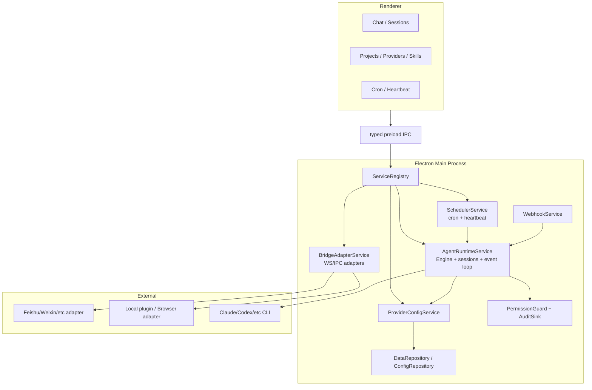

### 19.2 Synapse 模块映射

| CC Connect 能力 | Synapse 建议模块 | 备注 |
| --- | --- | --- |
| `core.Engine` | `desktop/electron/services/agent-runtime` 或 runtime service | 通过 `ServiceRegistry` 注入，不做全局 singleton |
| `core.Platform` / `BridgePlatform` | `BridgeAdapterService` + adapter registry | Electron main 持有连接，renderer 只通过 preload |
| `SessionManager` | `AgentSessionRepository` + runtime lock map | 持久化走 DataRepository |
| `ManagementServer` | 内部 typed IPC + 可选 localhost API | 不需要照搬 Web server，但 API surface 可保留 |
| `Config` / raw patch | `ConfigRepository` / Settings service | Synapse 可不用 TOML，但要保留 schema 和迁移 |
| Provider system | `ProviderConfigService` | 负责输出 agent-specific runtime config |
| Cron/Heartbeat | `SchedulerService` | 调度结果仍进入 AgentRuntime |
| Skills/Commands | `CommandRegistryService` / `SkillsModule` | 命令发布到 Chat UI 和外部 adapter |
| Security/run_as | `PermissionGuard` / `AuditSink` / OS isolation service | 敏感操作全部主进程化 |
| Stream/progress/reference | Renderer Chat timeline + Bridge update protocol | UI 可比 CC Connect 更结构化 |
| Webhook/Relay | `AutomationIngressService` / `AgentRelayService` | P1 |

### 19.3 最小实现顺序

1. **AgentRuntimeService MVP**：项目、session、Agent adapter、message -> event -> reply。
2. **BridgeAdapterService MVP**：实现 `register`、`message`、`reply`、`update_message`、`card_action`。
3. **ProviderConfigService**：先支持 Claude/Codex 两类 provider 输出。
4. **Session persistence + busy queue**：保存 `agentSessionId` 和 `pastAgentSessionIds`，实现 busy queue。
5. **Management/Renderer API**：项目列表、session 列表、send、provider CRUD、status。
6. **安全层**：admin/roles/disabled commands/rate limit/audit/permission。
7. **体验层**：progress、reference render、skills、heartbeat。
8. **自动化层**：webhook、relay、observer、TTS/STT、daemon/updater 类能力按需补。

## 20. 迁移时不建议照搬的内容

| 内容 | 原因 | 替代方案 |
| --- | --- | --- |
| Web 前端视觉样式 | CC Connect Web UI 有大量自定义颜色、暗色覆盖、内联式 Tailwind 视觉语言，不符合 Synapse UI 纪律 | 只迁移信息架构和 API；UI 用 Synapse shadcn baseline |
| 直接 HTTP Management Server 作为唯一管理入口 | Synapse 是 Electron，本地管理优先 typed IPC/preload | 可保留 localhost API 给插件/外部自动化 |
| Webhook/command shell 直接 `sh -c` | Synapse 有更严格的权限与审计约束 | 统一 PermissionGuard + AuditSink |
| TOML raw patch 方案完全照搬 | Synapse 可能已有 repository/schema | 迁移“局部更新、原子保存、secret env 引用”思想即可 |
| 自更新替换二进制 | Electron 更新链路不同 | 迁移状态页、日志、重启通知、单实例锁 |

## 21. 最终迁移清单

必须迁移：

- `Engine` 中心管线：`handleMessage`、session lock、queue、Agent event loop。
- `BridgeServer` + `BridgePlatform` 协议和能力模型。
- `ManagementServer` 的 API surface，至少 status/projects/sessions/send/providers/bridge。
- `SessionManager` 的本地 session 与 Agent 原生 session 映射。
- Provider refs/global providers/presets/Claude proxy/Codex config 写入。
- 安全治理：admin/roles/disabled/rate-limit/banned/dedup/outgoing limit/audit。

优先迁移：

- Skills/custom commands 统一命令生态。
- stream preview + compact progress。
- local reference render/show。
- heartbeat。
- webhook。
- auto-compress。
- relay。

可后置：

- observer。
- STT/TTS。
- daemon/self-update。
- cc-switch/provider preset UI 的完整体验。

一句话概括：CC Connect 的核心价值是“把本地 Agent CLI 包成一个可治理、可远程、可扩展、可持续运行的项目级 runtime”。迁移时应优先复制它的运行时边界、状态模型、协议和安全护栏，而不是复制某个具体平台 adapter 或 Web 页面样式。
