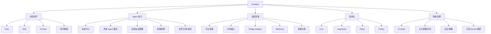
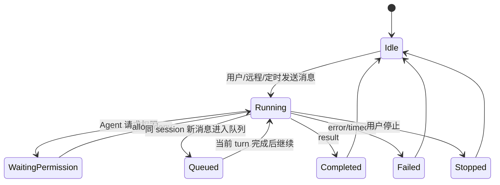
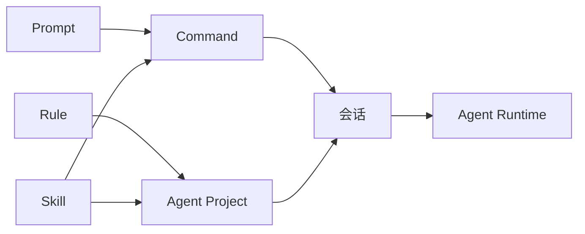
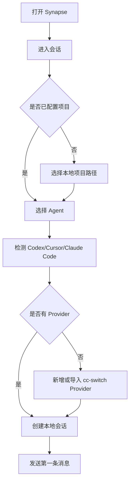
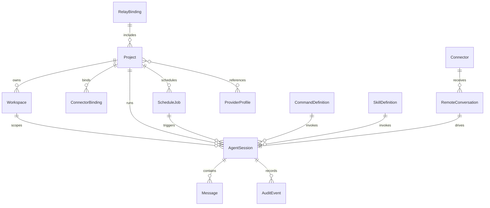

# CC Connect 全量融合产品设计说明

关联文档：

- `待办/融合cc-connet/ccc的方案和架构.md`
- `待办/融合cc-connet/可行性分析和注意点.md`

本文视角：同类 Agent/IDE/远程协作软件 10 年以上产品负责人视角。

本文目标：在不遗漏 CC Connect 任何核心能力的前提下，设计它全量融合到 Synapse 后的产品形态、信息架构、核心页面、关键流程、现有功能结合方式和阶段落地边界。

## 1. 产品总定位

融合后的 Synapse 不再只是“Rule / Skill / Prompt 的本地内容管理器”，而应升级为：

```text
面向本地和远程 Agent 的统一工作台
```

它同时解决三类任务：

1. 管理 Agent 能力资产：Rule、Skill、Prompt、命令、Provider、模型、编辑器配置。
2. 运行 Agent 会话：在 Synapse 内直接和 Codex、Cursor、Claude Code、Gemini、Kimi 等本地/远程 Agent 对话。
3. 连接远程入口：让用户从 Feishu、Telegram、Slack、Discord、微信等聊天平台发起远程任务，并在 Synapse 中查看、接管、审计和管理这些远程对话。

最终产品模式：

```text
Synapse = Agent 控制台 + 远程连接中枢 + 自动化调度器 + 规则/技能资产库
```

## 2. 硬性覆盖范围

用户明确要求 CC Connect 全部功能都要有，不能遗漏。产品设计必须覆盖：

- 本地 Agent 会话：Codex、Cursor、Claude Code、Gemini、Kimi、OpenCode、IFlow、Qoder、Pi、Devin、ACP。
- 本地直接聊天：在 Synapse 中直接和本地 Codex、Cursor、Claude Code 等对话。
- 远程聊天平台连接：Feishu/Lark、Telegram、Slack、Discord、DingTalk、WeCom、Weixin、QQ、QQBot、Line、Weibo。
- 远程扫码接入：Feishu、Weixin 等支持扫码/设备码的接入流程。
- 远程会话镜像：用户从外部聊天平台发起的对话，必须能在 Synapse 内查看。
- 远程会话接管：Synapse 内可查看状态、权限请求、工具进度，并在必要时介入。
- 编辑器配置识别：识别 Codex、Cursor、Claude Code 等配置、Rule、Skill、项目路径。
- CC Switch 方案识别/导入：识别 cc-switch providers，导入到 Synapse Provider 管理。
- Provider 管理：全局 provider、项目引用、模型列表、provider presets、agent-specific overrides。
- 命令系统：内置命令、自定义 prompt command、自定义 shell command、aliases。
- Skill 系统：扫描 `SKILL.md`、skill presets、按 Agent/项目安装和调用。
- 会话管理：新建、切换、命名、删除、历史、活跃会话、外部 session 过滤。
- 多项目：一个 app 管多个 Agent project。
- 多工作区：频道/远程入口绑定不同 workspace。
- 权限系统：allow/deny/approve all、AskUserQuestion、角色、禁用命令、admin_from、allow_from。
- 流式预览：远程平台和本地 UI 都能展示 Agent 流式输出。
- 富交互：卡片、按钮、选择器、进度卡片、平台 fallback。
- 附件：图片、文件、语音、位置；本地落盘给 Agent 使用；Agent 生成文件/图片后可发回远程平台。
- STT/TTS：OpenAI/Groq/Qwen/Gemini STT，Qwen/OpenAI/MiniMax/eSpeak/Pico/Edge TTS，ffmpeg 转码。
- Cron：定时任务、prompt/exec、silent/mute、new_per_run、权限模式、超时。
- Heartbeat：项目巡检、只在空闲时运行、读取 `HEARTBEAT.md`、pause/resume/trigger。
- Relay：群聊内多 bot / 多 Agent 协作。
- Hooks：生命周期事件触发 HTTP 或命令。
- Webhook：外部系统主动触发 Agent。
- Bridge：WebSocket 外部平台适配协议、capabilities、外部 adapter 管理。
- Management API：状态、项目、会话、providers、skills、cron、bridge adapter、setup、reload/restart。
- 本地 API / CLI send：外部本地命令可以向指定 session 发送消息/附件。
- 引用渲染：本地路径识别、`/show`、文件/目录预览、相对路径渲染。
- 工具类命令：`/search`、`/shell`、`/diff`、`/dir`、`/memory`。
- 诊断和维护：doctor、usage、context indicator、reply footer、auto compress、restart、reload、upgrade、日志。
- 安全隔离：run_as_user、角色限流、出站限流、敏感词、密钥脱敏。
- Terminal Observer：观察本地 Claude Code JSONL 会话并镜像到远程平台/会话中心。

## 3. 产品原则

### 3.1 统一入口，不割裂本地和远程

用户不应该理解“本地 Agent 会话”和“远程平台会话”是两套系统。产品上统一叫“会话”：

- 本地会话：从 Synapse 输入框发起。
- 远程会话：从聊天平台发起。
- 定时会话：由 cron/heartbeat 发起。
- Relay 会话：由其他 Agent 发起。

所有会话都进入同一个会话中心，区别只在来源、权限、工作区和连接器。

### 3.2 现有内容资产成为 Agent 能力

Synapse 已有：

- Rule
- Skill
- Prompt
- IDE 扫描
- 项目路径
- 本地仓库
- 变量

融合后这些不应变成旁支功能，而要成为 Agent 工作台的“能力供给层”：

- Rule：作为 Agent 项目默认规则。
- Skill：作为可调用能力。
- Prompt：作为快捷任务模板。
- 变量：用于安装、命令、Provider 和远程回复模板。
- IDE 扫描：用于识别本地 Agent 配置和导入现有能力。

### 3.3 远程连接是项目能力，不是平台孤岛

平台连接不应该只是“绑定一个机器人”。它必须绑定到：

- Agent project
- workspace
- provider
- 权限策略
- 会话策略
- 自动化策略

用户扫码接入后，下一步必须选择这个远程入口要驱动哪个项目、哪个 Agent、哪个工作区。

### 3.4 所有高风险能力都可见、可控、可审计

远程聊天让 Agent 操作本地文件是高风险能力。产品必须让用户知道：

- 谁发起了任务。
- 从哪个平台发起。
- 绑定了哪个 workspace。
- Agent 正在执行什么。
- 是否请求权限。
- 最终改了什么文件。
- 是否通过定时/relay/webhook 触发。

## 4. 总体信息架构

推荐在现有顶层导航中新增 4 个主模块，并保留原有内容模块：

```text
规则 | Skill | Prompt | 会话 | 项目 | 连接 | 自动化 | 数据库 | IDE | 设置
```

其中：

- 规则 / Skill / Prompt：保持现有内容资产管理，增强“安装到 Agent 项目/作为命令调用”。
- 会话：本地与远程 Agent 对话统一入口。
- 项目：CC Connect project + Synapse 本地项目 + workspace binding。
- 连接：聊天平台、Bridge、Webhook、扫码接入、外部 adapter。
- 自动化：Cron、Heartbeat、Relay、Hooks、主动发送。
- 数据库：保留现有本地数据服务。
- IDE：扩展为编辑器/Agent 配置扫描与导入。
- 设置：全局设置、Provider、安全、日志、更新、管理员。

### 信息架构图



## 5. 顶层导航设计

### 当前导航

当前 Synapse 顶层导航是：

```text
规则 | Skill | Prompt | 数据库 | IDE | 设置
```

### 融合后导航

建议变为：

```text
规则 | Skill | Prompt | 会话 | 项目 | 连接 | 自动化 | 数据库 | IDE | 设置
```

### 为什么这样组织

- “会话”是用户每天最常用入口，必须放顶层。
- “项目”承载 Agent、workspace、远程绑定，是运行时地基。
- “连接”承载远程平台和 Bridge，不和会话混在一起。
- “自动化”承载 cron/heartbeat/relay/hooks，避免藏在设置里。
- “IDE”保留现有扫描能力，并扩展到 Codex/Cursor/Claude Code 配置识别。
- Provider 可以放在“设置”中，也可以在“项目”中露出项目级引用；全局管理放设置，项目引用放项目详情。

## 6. 产品模块设计

## 6.1 会话

### 定位

统一管理所有 Agent 对话，不区分来源：

- 本地手动发起。
- 远程平台发起。
- 定时任务发起。
- Relay 发起。
- Webhook 发起。

### 页面结构

```text
┌────────────────────────────────────────────────────────────────────┐
│ 会话                         [新建] [筛选] [停止全部]              │
├───────────────┬──────────────────────────────────────┬─────────────┤
│ 来源/项目列表  │ 对话区                                │ 检查器       │
│               │                                      │             │
│ 全部          │ 远程用户 / 本地用户消息                 │ 会话信息      │
│ 本地          │ Agent 流式回复                         │ 项目/工作区   │
│ 远程          │ 工具进度                               │ Provider     │
│ 定时          │ 权限请求                               │ 权限策略      │
│ Relay         │ 附件/文件引用                           │ 运行状态      │
│ Webhook       │                                      │ 操作记录      │
│               │ 输入框 / 命令 / 附件                    │             │
└───────────────┴──────────────────────────────────────┴─────────────┘
```

### 左侧列表

列表维度：

- 来源：本地、Feishu、Telegram、Slack、Discord、Weixin、Webhook、Cron、Relay。
- 项目：按 Agent project 分组。
- 状态：运行中、等待权限、排队、失败、已完成。
- Agent：Codex、Cursor、Claude Code、Gemini 等。
- 工作区：本地 path 或远程绑定 workspace。

每个会话项显示：

- 会话名。
- 来源平台。
- 用户/群名。
- 项目名。
- Agent 类型。
- 状态。
- 最后更新时间。
- 是否有权限请求。
- 是否有未读远程消息。

### 中间对话区

必须支持：

- 文本消息。
- 流式输出。
- thinking 展示开关。
- tool use / tool result。
- 权限请求卡片。
- AskUserQuestion 选择。
- 图片、文件、音频、位置。
- 本地文件引用可点击。
- `/show` 渲染的文件片段。
- `/diff` 生成的 diff 预览。
- TTS 音频回放。
- 远程平台回执/发送失败。

### 右侧检查器

按 tabs 组织：

```text
信息 | Agent | 文件 | 权限 | 自动化 | 日志
```

信息：

- session key
- Agent session id
- 来源平台
- 用户 ID / 用户名
- 群/频道
- 项目
- workspace
- 创建时间 / 更新时间

Agent：

- Agent 类型
- 模型
- reasoning
- provider
- permission mode
- context usage
- reply footer 状态
- auto compress 状态

文件：

- 本次会话收到的附件
- Agent 生成的文件/图片
- 最近引用的本地路径
- diff 列表

权限：

- pending permission
- allow/deny 历史
- approve all 状态
- 本会话禁用命令

自动化：

- 关联 cron jobs
- heartbeat 状态
- relay 绑定
- webhook 来源

日志：

- 生命周期事件
- platform send/reply
- Agent start/stop
- 错误摘要

### 本地聊天模式

用户可以直接在 Synapse 中选择：

- Agent：Codex / Cursor / Claude Code / Gemini / Kimi / OpenCode / Qoder / IFlow / Pi / Devin / ACP。
- 项目：本地项目路径。
- Provider：OpenAI-compatible / Claude-compatible / 自定义。
- 模型：来自 provider model list 或 Agent 自身模型。
- 权限模式：default、plan、auto、bypassPermissions、acceptEdits、dontAsk。
- 工作目录。
- Skill / Prompt 快捷插入。

本地聊天入口：

```text
会话 -> 新建 -> 本地会话
```

表单：

```text
项目          [选择项目]
Agent         [Codex]
Provider      [默认 provider]
模型          [gpt-5.3-codex]
工作区        [/path/to/project]
权限模式      [默认]
会话名        [可选]
[创建]
```

### 远程会话镜像

外部用户在 Feishu/Telegram/Slack 等平台发送消息后：

1. 平台连接器收到消息。
2. Synapse 创建或恢复 session。
3. 会话出现在“会话 -> 远程”列表。
4. 对话区显示远程用户原文、附件和 Agent 回复。
5. 如果 Agent 请求权限，Synapse 和远程平台都可展示权限请求。
6. 本地用户可在 Synapse 中接管，直接回复、允许/拒绝、停止任务或切换会话。

远程会话在列表中必须显示来源平台和用户身份，避免把远程用户和本地操作者混淆。

### 远程接管模式

在远程会话中，Synapse 用户可以：

- 只观察。
- 临时停止 Agent。
- 允许/拒绝工具。
- 向会话追加本地备注。
- 直接以系统操作者身份发消息。
- 切换 Agent session。
- 重命名会话。
- 标记需要跟进。

接管消息需要明确来源：

```text
本地操作员：请先不要修改 package.json，先列出计划。
```

### 会话状态



## 6.2 项目

### 定位

项目是 Agent 运行和远程连接的核心容器，对应 CC Connect 的 `[[projects]]`，同时复用 Synapse 现有“本地项目”配置。

### 页面结构

```text
┌────────────────────────────────────────────────────────────────────┐
│ 项目                                  [新建项目] [导入配置]          │
├───────────────┬────────────────────────────────────────────────────┤
│ 项目列表       │ 项目详情                                           │
│               │                                                    │
│ app-web       │ 基本信息 | Agent | Provider | 工作区 | 连接 | 安全   │
│ cli-tools     │                                                    │
│ docs-site     │ 当前工作区、Agent、平台绑定、定时任务、最近会话       │
└───────────────┴────────────────────────────────────────────────────┘
```

### 项目详情 tabs

基本信息：

- 项目名
- 本地路径
- base dir
- 模式：单工作区 / 多工作区
- 默认语言
- 默认显示设置

Agent：

- Agent 类型
- Agent CLI 路径/检测状态
- 默认权限模式
- reasoning
- context indicator
- reply footer
- filter external sessions
- auto compress
- memory 文件
- command dirs
- skill dirs

Provider：

- active provider
- provider refs
- inline provider
- 模型列表
- Codex provider config
- thinking override

工作区：

- base workspace
- channel/workspace binding
- shared binding
- 最近活跃 workspace
- idle reaping 状态

连接：

- 已绑定平台
- 允许用户/群
- 远程 session key 策略
- thread isolation
- share session in channel

安全：

- admin_from
- allow_from
- users roles
- disabled commands
- rate limit
- outgoing rate limit
- banned words
- run_as_user
- run_as_env

### 多工作区设计

多工作区用于远程群/频道绑定不同目录：

```text
平台频道         工作区                       Agent 会话池
Feishu A群  ->  /projects/app-web       ->  独立 session manager
Slack B频道 ->  /projects/api-server    ->  独立 session manager
Telegram C群 -> /projects/mobile        ->  独立 session manager
```

用户在项目页可以维护：

- 频道绑定。
- 默认工作区。
- shared binding。
- 自动初始化流程。
- workspace 最近活跃时间。
- 正在运行的 turns。

### 工作区初始化流程

远程频道第一次使用时：

```text
远程用户发送消息
  -> 未绑定 workspace
  -> Synapse 在远程平台提示绑定
  -> 本地 Synapse 项目页出现待处理绑定
  -> 用户选择已有项目或 clone repo
  -> 绑定完成
  -> 远程消息继续执行
```

如果平台支持按钮/卡片，远程端给出简短选择；否则让用户在 Synapse 中处理。

## 6.3 连接

### 定位

连接模块管理所有远程入口：

- 原生聊天平台。
- Bridge 外部适配器。
- Webhook。
- 本地 CLI/API。
- 扫码接入。

### 页面结构

```text
┌────────────────────────────────────────────────────────────────────┐
│ 连接                            [添加连接] [Bridge] [Webhook]       │
├───────────────┬────────────────────────────────────────────────────┤
│ 连接类型       │ 连接详情                                           │
│               │                                                    │
│ 平台           │ Feishu Bot                                        │
│ Bridge         │ 状态、项目绑定、能力、最近消息、错误               │
│ Webhook        │                                                    │
│ 本地 API       │                                                    │
└───────────────┴────────────────────────────────────────────────────┘
```

### 平台连接列表

必须覆盖：

- Feishu / Lark
- Telegram
- Slack
- Discord
- DingTalk
- WeCom
- Weixin
- QQ
- QQBot
- Line
- Weibo

每个连接展示：

- 平台图标/名称。
- 连接状态：未配置、等待扫码、已连接、异常、限流、断开。
- 绑定项目数。
- 最近消息时间。
- 支持能力：text、image、file、audio、card、buttons、typing、preview、update_message、reconstruct_reply。
- token/credential 状态，不显示完整密钥。
- 错误摘要。

### 添加连接向导

```text
选择平台
  -> 认证方式
  -> 扫码/填写 token
  -> 选择绑定项目
  -> 设置允许用户/群
  -> 设置会话策略
  -> 测试连接
  -> 完成
```

#### Feishu / Lark 扫码流程

```text
连接 -> 添加 -> Feishu
  -> 选择扫码接入
  -> 显示二维码/设备码
  -> 用户扫码授权
  -> Synapse 轮询授权状态
  -> 获取 app_id/app_secret/base_url/owner_open_id
  -> 选择项目和 Agent
  -> 写入连接配置
  -> 连接测试
```

界面草图：

```text
┌──────────────────────── Feishu 接入 ────────────────────────┐
│ 1 平台  2 扫码  3 项目  4 权限  5 测试                       │
├──────────────────────────────────────────────────────────────┤
│                                                              │
│                    [二维码区域]                              │
│                                                              │
│ 状态：等待扫码                                               │
│ 过期时间：04:30                                              │
│                                                              │
│ [刷新二维码]                                      [下一步]    │
└──────────────────────────────────────────────────────────────┘
```

#### Weixin 扫码流程

```text
连接 -> 添加 -> Weixin
  -> 选择 API base URL
  -> 生成 qr_key / qr_url
  -> 用户扫码确认
  -> 获取 bot token / ilink bot id / user id
  -> 选择项目和工作区策略
  -> 保存并测试
```

### 平台能力矩阵

连接详情页应展示能力矩阵：

| 能力 | 当前连接 | 说明 |
|---|---|---|
| 文本 | 支持 | 收发普通消息 |
| 图片 | 支持/不支持 | 入站/出站分开展示 |
| 文件 | 支持/不支持 | 入站/出站分开展示 |
| 音频 | 支持/不支持 | 影响 STT/TTS |
| 卡片 | 支持/降级 | 无卡片时转文本 |
| 按钮 | 支持/降级 | 权限请求会受影响 |
| 流式预览 | 支持/关闭 | 依赖 update_message |
| 输入状态 | 支持/不支持 | typing/reaction |
| 主动发送 | 支持/不支持 | 依赖 reconstruct reply |

### Bridge 外部适配器

Bridge 是“用户自己写平台适配器”的入口。

Bridge 页面包括：

- Bridge server 开关。
- 监听地址和端口。
- token 管理。
- 已连接 adapters。
- adapter 能力。
- adapter 所属项目。
- 最近心跳。
- 最近错误。
- capabilities snapshot。

页面草图：

```text
┌──────────────────────── Bridge ──────────────────────────────┐
│ 状态：运行中       ws://127.0.0.1:9810/bridge/ws              │
│ Token：••••••••••••                         [复制] [重置]    │
├──────────────────────────────────────────────────────────────┤
│ Adapter        Project       Capabilities        Last seen     │
│ wechat-bot     app-web       text,image,card     10 秒前       │
│ matrix         docs-site     text,preview        2 分钟前      │
└──────────────────────────────────────────────────────────────┘
```

Bridge adapter 注册后，必须能在“会话”中产生远程会话，并能在“连接”中管理。

### Webhook

Webhook 用于外部系统主动触发 Agent。

设计：

- Webhook endpoint 列表。
- 每个 endpoint 绑定 project/session/workspace。
- token/scope。
- 最近调用记录。
- 请求样例。
- 失败重试策略。

Webhook 不应该被放在“设置”角落，因为它是实际远程入口。

### 本地 API / CLI send

CC Connect 的 `cc-connect send`、本地 Unix socket API 对应到 Synapse：

- 提供 `synapse connect send` 或本地 HTTP/IPC endpoint。
- 可向指定 session 发送 message、image、file。
- 可被本地脚本、Git hook、CI、本地 Agent 调用。

产品上放在：

```text
连接 -> 本地 API
```

展示：

- 本地 API 状态。
- endpoint/socket path。
- 当前 token。
- 命令示例。
- 最近调用。

## 6.4 自动化

### 定位

自动化模块承载主动触发和 Agent 协作：

- Cron
- Heartbeat
- Relay
- Hooks
- 主动发送记录

### 页面结构

```text
┌────────────────────────────────────────────────────────────────────┐
│ 自动化                            [新建任务] [运行记录]             │
├───────────────┬────────────────────────────────────────────────────┤
│ Cron           │ 任务列表 / 详情 / 运行记录                         │
│ Heartbeat      │                                                    │
│ Relay          │                                                    │
│ Hooks          │                                                    │
│ Outbox         │                                                    │
└───────────────┴────────────────────────────────────────────────────┘
```

### Cron

Cron 创建表单：

```text
项目              [选择项目]
目标会话          [选择 session / 输入 session key]
类型              [Prompt / Shell]
Cron 表达式        [0 6 * * *]
描述              [每日项目巡检]
会话模式          [复用当前会话 / 每次新会话]
权限模式          [默认 / plan / auto / dontAsk]
开始通知          [显示 / 静默]
结果消息          [发送 / 完全静音]
超时              [30 分钟]
工作目录          [默认 / 指定]
Prompt/命令       [文本区域]
```

列表字段：

- 状态
- 描述
- 项目
- 目标 session
- 表达式
- 人类可读时间
- session mode
- silent/mute
- last_run
- last_error
- 下次运行

支持操作：

- 启用/禁用
- 立即运行
- 编辑
- 删除
- 静音切换
- 查看历史

### Heartbeat

Heartbeat 是项目巡检，不和 Cron 混用。

页面字段：

- 项目
- enabled
- paused
- interval
- only_when_idle
- session key
- prompt 来源：配置 / `HEARTBEAT.md` / 默认
- silent
- timeout
- run count
- error count
- skipped busy
- last run
- last error

操作：

- pause
- resume
- run now
- set interval
- open prompt file

### Relay

Relay 设计为“多 Agent 协作绑定”：

```text
群/频道
  -> 绑定多个项目 Bot
  -> Bot A 可向 Bot B 发消息
  -> 群里可见转发和回复
```

页面：

- relay bindings 列表。
- platform/chatID。
- 已绑定项目 bot。
- bot display name。
- timeout。
- 最近 relay 消息。

操作：

- 添加 bot 到绑定。
- 移除 bot。
- 测试 relay。
- 查看 relay session。

### Hooks

Hooks 是生命周期事件集成。

事件：

- message.received
- message.sent
- session.started
- session.ended
- cron.triggered
- permission.requested
- error

Handler：

- HTTP
- Command

页面字段：

- event
- type
- URL/command
- timeout
- async
- enabled
- 最近状态

Command hook 默认高风险，需要显式开启。

### Outbox / 主动发送记录

所有主动发送都进入 outbox：

- cron result
- heartbeat result
- webhook reply
- local API send
- relay visible message
- restart notify
- TTS/audio send
- generated file send

Outbox 字段：

- 时间
- 来源
- 目标平台/session
- 内容摘要
- 附件
- 状态
- 错误
- 重试

## 6.5 Provider

### 放置方式

Provider 是跨项目全局资源，建议放在：

```text
设置 -> Provider
```

项目详情里只做引用和 active provider。

### Provider 页面

```text
┌────────────────────────────────────────────────────────────────────┐
│ Provider                         [新增] [导入 cc-switch] [预设]     │
├───────────────┬────────────────────────────────────────────────────┤
│ Provider 列表  │ Provider 详情                                      │
│ OpenAI         │ 基本信息 | Agent 覆盖 | 模型 | 高级 | 引用项目       │
│ Anthropic      │                                                    │
│ SiliconFlow    │                                                    │
└───────────────┴────────────────────────────────────────────────────┘
```

### 字段

基本信息：

- name
- api key
- base URL
- default model
- thinking override
- env

Agent 覆盖：

- agent_types
- endpoints by agent
- agent_models
- agent_model_lists
- Codex config：env_key、wire_api、http_headers

模型：

- model
- alias
- availability

引用项目：

- project name
- active provider 状态
- 当前模型

### Provider Presets

预设入口：

```text
设置 -> Provider -> 预设
```

展示：

- display name
- 支持 Agent
- base URL
- 默认模型
- 模型列表
- features
- tier
- website
- invite URL

操作：

- 从预设创建 provider。
- 覆盖模型列表。
- 填入 API key。
- 限定 agent types。

### CC Switch 导入

必须有显式入口：

```text
设置 -> Provider -> 导入 cc-switch
```

流程：

```text
扫描 cc-switch 配置
  -> 展示 providers
  -> 标记当前 provider
  -> 用户选择导入项
  -> 映射到 Synapse Provider
  -> 处理重名
  -> 保存
```

列表字段：

- name
- app_type
- base_url
- model
- is_current
- 是否已存在

导入后：

- 进入全局 provider。
- 可绑定到项目。
- 可设置为 Codex active provider。

## 6.6 IDE

### 当前 IDE 模块增强方向

当前 IDE 模块用于扫描 Rule/Skill。融合后扩展为：

```text
IDE = 编辑器配置中心 + Agent 安装状态 + 规则/技能/Provider 识别
```

### 页面结构

```text
┌────────────────────────────────────────────────────────────────────┐
│ IDE                                  [刷新] [导入配置]              │
├───────────────┬────────────────────────────────────────────────────┤
│ 编辑器列表     │ 配置概览                                           │
│ Claude Code   │ Rule | Skill | Provider | Sessions | CLI            │
│ Codex         │                                                    │
│ Cursor        │                                                    │
└───────────────┴────────────────────────────────────────────────────┘
```

### 需要识别

Claude Code：

- 全局 `CLAUDE.md`
- 项目 `.claude/rules`
- 全局/项目 skills
- session logs
- settings
- command dirs

Codex：

- `$CODEX_HOME/AGENTS.md`
- 项目 `AGENTS.md`
- `~/.agents/skills`
- 项目 `.agents/skills`
- Codex config/provider
- Codex sessions / rollout
- app-server backend 状态

Cursor：

- 项目 `.cursor/rules`
- 全局/项目 skills
- Cursor Agent CLI 状态
- project config

CC Switch：

- provider configs
- current provider
- app type
- model/base URL/API key 状态

### 操作

- 扫描。
- 查看配置。
- 导入 provider。
- 安装 Rule/Skill。
- 打开配置目录。
- 对比 Synapse 内容库和编辑器本地内容。
- 修复冲突。
- 创建 Synapse project。

### 远程对话在编辑器中查看

这里的“编辑器中查看用户远程对话”应产品化为：

```text
IDE/会话联动：在 Synapse 的会话中心查看远程对话，并可打开对应项目编辑器上下文。
```

功能包括：

- 远程会话绑定到本地项目。
- 会话详情显示对应编辑器配置。
- 一键打开项目目录。
- 一键打开相关 Rule/Skill/Prompt。
- 一键打开 Agent session history。
- 如果是 Claude Code 终端本地会话，可通过 Terminal Observer 镜像进会话中心。

## 6.7 规则 / Skill / Prompt

### 保持现有资产库

现有三个内容模块保留：

- 规则
- Skill
- Prompt

### 增强点

规则：

- 增加“用于 Agent 项目”的安装状态。
- 可绑定到项目默认规则集。
- 可作为远程会话的强制规则。

Skill：

- 支持 CC Connect `SKILL.md` frontmatter 解析。
- 支持 skill dirs 扫描。
- 支持 skill presets。
- 支持在会话中以命令调用。

Prompt：

- 作为本地会话快捷启动模板。
- 可用于自定义命令。
- 可用于 cron prompt。
- 可用于 heartbeat prompt。

### 内容与运行时关系



## 6.8 命令中心

命令中心建议作为项目详情或自动化下的二级页面，也可放在“会话”输入框命令面板中。

### 命令来源

- Built-in：CC Connect 内置命令。
- Custom prompt：用户自定义 prompt 模板。
- Custom exec：用户自定义 shell 命令。
- Skill：Skill invocation。
- Agent file：Agent command dirs 中的 `.md` 命令。

### 内置命令必须覆盖

会话：

- `/new`
- `/list`
- `/switch`
- `/name`
- `/current`
- `/history`
- `/delete`
- `/stop`

状态：

- `/status`
- `/usage`
- `/whoami`
- `/doctor`
- `/version`

Agent 控制：

- `/model`
- `/reasoning`
- `/mode`
- `/allow`
- `/provider`

显示和语言：

- `/lang`
- `/quiet`
- `/config`

记忆：

- `/memory`

自动化：

- `/cron`
- `/heartbeat`
- `/compress`

自定义：

- `/commands`
- `/skills`
- `/alias`

文件和工作目录：

- `/dir`
- `/show`
- `/search`
- `/shell`
- `/diff`

系统：

- `/web`
- `/upgrade`
- `/restart`

Relay/Workspace：

- `/bind`
- `/workspace`

语音：

- `/tts`

### 命令面板

会话输入框中输入 `/` 打开命令面板：

```text
┌──────────────── 命令 ────────────────┐
│ /model       切换模型                │
│ /provider    管理 Provider           │
│ /cron        管理定时任务            │
│ /show        查看文件片段            │
│ /diff        查看工作区差异          │
└──────────────────────────────────────┘
```

支持：

- 搜索。
- 参数表单。
- 权限提示。
- 平台可用性提示。
- disabled command 状态。

Shell command 默认不在远程用户面前直接暴露，除非管理员明确允许。

## 6.9 安全与权限

### 权限中心

放置：

```text
设置 -> 安全
项目 -> 安全
连接 -> 权限
```

### 全局安全

- Bridge token。
- Webhook token。
- 本地 API token。
- 密钥脱敏设置。
- 日志保留。
- 默认远程权限策略。
- shell command 默认开关。
- run_as_user 全局检查。

### 项目安全

- admin_from。
- allow_from。
- users roles。
- disabled commands。
- rate limit。
- outgoing rate limit。
- banned words。
- run_as_user。
- run_as_env。
- 权限模式默认值。

### 角色模型

角色列表：

- Owner
- Admin
- Member
- Guest
- Blocked

每个角色：

- user_ids。
- 可用命令。
- rate limit。
- 是否允许 shell。
- 是否允许创建 cron。
- 是否允许 provider 切换。
- 是否允许附件发送。

### 权限请求 UI

本地会话：

```text
Agent 请求执行 Bash
命令：pnpm desktop:typecheck

[允许] [拒绝] [本轮全部允许]
```

远程会话：

- 如果远程平台支持按钮，同步发送按钮。
- Synapse 本地检查器也出现 pending permission。
- 本地管理员可代替远程用户处理。

### 审计

所有高风险事件进入审计记录：

- shell command。
- 文件写入。
- provider 修改。
- cron 创建。
- webhook 调用。
- Bridge adapter 注册。
- run_as_user 失败。
- 权限 allow/deny。
- 远程接管。

## 6.10 文件、引用和差异

### 文件引用

Agent 输出路径时，Synapse 识别：

- 绝对路径。
- 相对路径。
- `file://`
- Markdown link。
- `:line`
- `:line:col`
- `:line-line`
- `#Lline`
- `#LlineCcol`

在会话中渲染为可点击引用：

```text
src/modules/settings/index.tsx:24
```

点击后：

- 打开文件预览。
- 可复制路径。
- 可在系统编辑器中打开。
- 可在 Synapse 的文件查看面板中看上下文。

### `/show`

产品化为“查看文件”动作：

- 文件头部。
- 行上下文。
- 行范围。
- 目录列表。
- 超长内容提示截断。

### `/search`

产品化为“工作区搜索”动作：

- 输入关键词。
- 选择工作区。
- 显示匹配文件/行。
- 可插入到会话。

### `/diff`

产品化为“变更预览”：

- 工作区 diff。
- 文件列表。
- 统计。
- 可导出 HTML。
- 可发回远程平台。

## 6.11 语音与附件

### 入站附件

支持：

- 图片。
- 文件。
- 音频。
- 位置。

设计：

- 附件先进入会话附件区。
- 文件保存到项目附件目录。
- Prompt 中引用本地路径。
- 用户可决定是否转发给 Agent。

### STT

支持 provider：

- OpenAI Whisper-compatible。
- Groq。
- Qwen ASR。
- Gemini STT。

语音消息流程：

```text
远程语音
  -> 平台连接器收到 audio
  -> 必要时 ffmpeg 转码
  -> STT
  -> 转写文本进入会话
  -> Agent 处理
```

### TTS

支持 provider：

- Qwen
- OpenAI
- MiniMax
- eSpeak
- Pico
- Edge

模式：

- voice_only：语音输入才语音回复。
- always：所有回复都尝试生成语音。

TTS 超长时按 `max_text_len` 跳过或提示。

## 6.12 系统和管理

### Dashboard

建议新增轻量总览，作为“会话”或“设置”的入口，不必变成营销页。

展示：

- 正在运行会话数。
- 等待权限数。
- 已连接平台数。
- Bridge adapters。
- cron enabled 数。
- heartbeat 异常数。
- provider 缺失数。
- 最近错误。

### Doctor

诊断范围：

- Agent CLI 是否可用。
- Codex/Cursor/Claude Code config 是否可读。
- Provider 是否缺 key。
- 平台连接是否有效。
- Bridge/Webhook token 是否配置。
- ffmpeg 是否可用。
- run_as_user 是否通过检查。
- 项目路径是否存在。
- 权限策略是否过宽。

### Reload / Restart / Upgrade

桌面产品中不应照搬 Go 服务重启体验，但要保留能力：

- Reload：重新读取连接器/Provider/项目配置。
- Restart：重启 Agent runtime 或连接器服务，不一定重启整个 app。
- Upgrade：使用 Electron updater；远程命令触发时需要管理员权限。

### Management API

在桌面里可设计为“本地管理 API”：

- 默认关闭。
- 用户开启后监听本地端口。
- token 保护。
- 提供状态、项目、会话、Provider、Cron、Bridge adapter 等 API。
- 给外部 TUI、脚本、移动端控制器使用。

## 7. 关键用户流程

## 7.1 首次开启 Agent 工作台



## 7.2 导入 CC Switch Provider

```text
设置 -> Provider -> 导入 cc-switch
  -> 扫描配置
  -> 选择 providers
  -> 处理重名
  -> 保存
  -> 绑定到项目
  -> 在会话中选择该 provider
```

## 7.3 创建本地 Codex 会话

```text
会话 -> 新建 -> 本地
  -> 项目：Synapse
  -> Agent：Codex
  -> Provider：导入的 cc-switch provider
  -> 模型：gpt-5.3-codex
  -> 权限模式：默认
  -> 创建
  -> 直接对话
```

## 7.4 远程扫码接入 Feishu

```text
连接 -> 添加连接 -> Feishu
  -> 扫码授权
  -> 选择绑定项目
  -> 配置 allow_from/admin_from
  -> 配置会话策略
  -> 测试消息
  -> 远程用户在 Feishu 发消息
  -> Synapse 会话中心出现远程会话
```

## 7.5 查看远程用户对话并接管

```text
Feishu 用户发起任务
  -> Synapse 会话列表出现运行中
  -> 本地用户打开会话
  -> 查看工具进度和文件改动
  -> Agent 请求权限
  -> 本地用户点击允许
  -> Agent 完成
  -> 结果发回 Feishu
```

## 7.6 创建定时任务

```text
自动化 -> Cron -> 新建
  -> 选择项目和 session
  -> 填 cron 表达式
  -> 填 prompt
  -> 设置 new_per_run / timeout
  -> 保存
  -> 到点执行
  -> 运行结果进入会话和 outbox
```

## 7.7 多 Agent Relay

```text
连接到同一群聊的多个项目 Bot
  -> 项目 A 绑定群
  -> 项目 B 绑定群
  -> Relay 页面显示绑定
  -> Agent A 使用 relay 询问 Agent B
  -> 群里可见转发
  -> 两边会话中心都有记录
```

## 8. 页面布局总览

### 8.1 会话页

```text
┌──────────────────────────────────────────────────────────────────────────────┐
│ 会话                                      [新建] [命令] [筛选] [停止]         │
├──────────────────┬───────────────────────────────────────┬───────────────────┤
│ 来源/项目/状态     │ 对话                                  │ 检查器             │
│                  │                                       │                   │
│ 全部             │ 用户：修复这个报错                       │ 信息 Agent 文件     │
│ 本地             │ Agent：我先检查...                       │ 权限 自动化 日志     │
│ 远程             │ Tool: rg ...                            │                   │
│ 定时             │ Permission: Bash                         │ Project: Synapse   │
│ Relay            │ [允许] [拒绝]                            │ Agent: Codex       │
│ Webhook          │                                       │ Provider: xxx      │
│                  │ ┌───────────────────────────────────┐ │ Status: running   │
│ Session list      │ │ 输入消息 / 输入 / 调用 Skill       │ │                   │
│                  │ └───────────────────────────────────┘ │                   │
└──────────────────┴───────────────────────────────────────┴───────────────────┘
```

### 8.2 项目页

```text
┌──────────────────────────────────────────────────────────────────────────────┐
│ 项目                                                        [新建] [导入]     │
├──────────────────┬───────────────────────────────────────────────────────────┤
│ app-web          │ app-web                                                   │
│ api-server       │ 基本信息 | Agent | Provider | 工作区 | 连接 | 安全         │
│ docs-site        │                                                           │
│                  │ Agent: Codex                                              │
│                  │ Workdir: /projects/app-web                                │
│                  │ Platforms: Feishu, Telegram                               │
│                  │ Active sessions: 4                                        │
└──────────────────┴───────────────────────────────────────────────────────────┘
```

### 8.3 连接页

```text
┌──────────────────────────────────────────────────────────────────────────────┐
│ 连接                                             [添加连接] [Bridge] [Webhook]│
├──────────────────┬───────────────────────────────────────────────────────────┤
│ 平台             │ Feishu Bot                                                │
│ Bridge           │ 状态 | 凭据 | 项目绑定 | 能力 | 最近消息 | 错误            │
│ Webhook          │                                                           │
│ 本地 API         │ 状态：已连接                                              │
│                  │ 绑定项目：app-web                                         │
│ Feishu           │ 能力：text, image, file, card, buttons, preview           │
│ Telegram         │                                                           │
│ Slack            │                                                           │
└──────────────────┴───────────────────────────────────────────────────────────┘
```

### 8.4 自动化页

```text
┌──────────────────────────────────────────────────────────────────────────────┐
│ 自动化                                                   [新建任务] [日志]     │
├──────────────────┬───────────────────────────────────────────────────────────┤
│ Cron             │ 任务列表                                                  │
│ Heartbeat        │                                                           │
│ Relay            │ 描述          项目       下次运行       状态     错误      │
│ Hooks            │ 每日总结      app-web    明天 09:00     启用     -         │
│ Outbox           │ 巡检          docs-site  每 30 分钟     暂停     -         │
└──────────────────┴───────────────────────────────────────────────────────────┘
```

### 8.5 Provider 页

```text
┌──────────────────────────────────────────────────────────────────────────────┐
│ Provider                                  [新增] [预设] [导入 cc-switch]      │
├──────────────────┬───────────────────────────────────────────────────────────┤
│ OpenAI           │ OpenAI                                                    │
│ Anthropic        │ 基本信息 | Agent 覆盖 | 模型 | 引用项目 | 高级             │
│ SiliconFlow      │                                                           │
│                  │ API Key: ••••••••                                         │
│                  │ Base URL: https://...                                     │
│                  │ Codex wire API: responses                                 │
└──────────────────┴───────────────────────────────────────────────────────────┘
```

## 9. 全功能映射表

| CC Connect 功能 | Synapse 产品位置 | 设计说明 |
|---|---|---|
| 多项目 `[[projects]]` | 项目 | 每个项目绑定 Agent、Provider、平台、工作区和权限 |
| 单/多工作区 | 项目 -> 工作区 | 支持 channel/workspace binding 和 shared binding |
| Claude Code Agent | 会话 / 项目 Agent | 本地会话和远程会话可选 Agent |
| Codex Agent | 会话 / 项目 Agent | 支持 exec、resume、provider config、context usage |
| Cursor Agent | 会话 / IDE | 支持本地 Cursor 对话和配置识别 |
| ACP Agent | 会话 / Agent 设置 | 作为通用 Agent 协议 |
| Devin | 会话 | 基于 ACP 作为 Agent 类型 |
| Gemini/Kimi/OpenCode/IFlow/Qoder/Pi | 会话 / 项目 Agent | 作为可选 Agent runtime |
| Provider refs | 设置 Provider / 项目 Provider | 全局 Provider + 项目引用 |
| Provider presets | 设置 Provider -> 预设 | 从预设创建 Provider |
| cc-switch 导入 | 设置 Provider -> 导入 cc-switch | 扫描、选择、导入 |
| 模型切换 `/model` | 会话命令 / 项目 Provider | 命令面板和项目详情都可切 |
| reasoning `/reasoning` | 会话命令 / Agent 设置 | Agent 能力可用时展示 |
| mode `/mode` | 会话命令 / 项目 Agent | 权限模式管理 |
| Feishu/Lark | 连接 -> 平台 | 支持扫码、卡片、按钮、预览 |
| Telegram | 连接 -> 平台 | 支持按钮、附件、位置、typing |
| Slack | 连接 -> 平台 | 支持 Socket Mode、thread、observer |
| Discord | 连接 -> 平台 | 支持 thread、embed/progress、preview |
| DingTalk | 连接 -> 平台 | stream client 接入 |
| WeCom | 连接 -> 平台 | 企业微信机器人/WS 接入 |
| Weixin | 连接 -> 平台 | 扫码、ilink、语音/附件 |
| QQ/QQBot/Line/Weibo | 连接 -> 平台 | 按能力矩阵逐项接入 |
| Bridge | 连接 -> Bridge | WebSocket adapter 管理 |
| Webhook | 连接 -> Webhook | 外部系统触发 Agent |
| 本地 send API | 连接 -> 本地 API | 本地脚本向 session 发消息/附件 |
| Management API | 设置 -> 管理 API | 默认关闭，可开启本地端口 |
| 会话列表 `/list` | 会话 | 原生命名会话列表 |
| 新建 `/new` | 会话 -> 新建 | 本地/远程/side session |
| 切换 `/switch` | 会话 | 会话操作 |
| 命名 `/name` | 会话 | 会话标题 |
| 当前 `/current` | 会话检查器 | 当前 Agent session |
| 历史 `/history` | 会话 | 历史 tab |
| 删除 `/delete` | 会话 | 删除本地记录和 Agent backend session |
| 停止 `/stop` | 会话 | 停止当前 turn |
| 状态 `/status` | Dashboard / 会话检查器 | 项目和会话状态 |
| Usage `/usage` | 会话检查器 / Dashboard | token/context 使用 |
| Whoami `/whoami` | 会话检查器 | 远程用户身份 |
| Doctor `/doctor` | 设置 -> 诊断 | 系统诊断 |
| Version `/version` | 设置 -> 关于 | 版本信息 |
| Config `/config` | 设置 / 项目 | 配置项 UI 化 |
| Reload | 设置 -> 管理 | 重新加载 runtime 配置 |
| Restart | 设置 -> 管理 | 重启 runtime/连接器 |
| Upgrade | 设置 -> 关于 | Electron updater |
| Memory `/memory` | 项目 Agent / 会话命令 | 查看/追加 Agent memory 文件 |
| Commands `/commands` | 命令中心 | 自定义 prompt/exec |
| Skills `/skills` | Skill / 命令中心 | 扫描和调用 |
| Alias `/alias` | 命令中心 | 命令别名 |
| Cron `/cron` | 自动化 -> Cron | 定时任务 |
| Heartbeat `/heartbeat` | 自动化 -> Heartbeat | 项目巡检 |
| Compress `/compress` | 会话 / 项目 Agent | 手动或自动压缩 |
| Bind `/bind` | 项目工作区 / 自动化 Relay | 远程频道绑定项目/Relay |
| Workspace `/workspace` | 项目 -> 工作区 | 多工作区操作 |
| Dir `/dir` | 会话文件面板 | 当前目录和切换 |
| Show `/show` | 会话文件面板 | 文件/目录预览 |
| Search `/search` | 会话命令 | 工作区搜索 |
| Shell `/shell` | 会话命令 | 高危命令，需权限 |
| Diff `/diff` | 会话文件面板 | 工作区差异 |
| TTS `/tts` | 会话设置 / 语音设置 | voice_only/always |
| STT | 连接语音 / 设置语音 | 远程语音转文字 |
| 图片/文件发送 | 会话附件 / Outbox | 入站落盘，出站发送 |
| 位置消息 | 会话消息 | 转成 ExtraContent 和地图链接/坐标 |
| 流式预览 | 会话 / 远程平台 | 本地和远程都支持降级 |
| 卡片/按钮 | 会话 / 连接能力 | 平台支持则富交互，否则文本降级 |
| 权限请求 | 会话权限面板 | 本地和远程同步处理 |
| AskUserQuestion | 会话权限面板 | 选项表单 |
| Roles/users | 项目安全 | 角色、禁用命令、限流 |
| allow_from/admin_from | 连接/项目安全 | 平台允许列表和管理员 |
| banned_words | 项目安全 | 远程消息阻断 |
| rate limit | 项目安全 | 入站限流 |
| outgoing rate limit | 项目安全 | 出站节流 |
| run_as_user | 项目安全 | 进程隔离 |
| Hooks | 自动化 -> Hooks | HTTP/command lifecycle |
| Relay | 自动化 -> Relay | 多 bot 协作 |
| Terminal Observer | IDE / 会话 | 观察本地 Claude Code JSONL |
| Auto compress | 项目 Agent | 上下文压缩 |
| Context indicator | 会话检查器 | context usage |
| Reply footer | 会话显示设置 | 回复底部信息 |
| Filter external sessions | 项目 Agent | 隐藏外部 CLI session |
| 日志 | 设置 -> 调试 / 会话日志 | 导出和排错 |

## 10. 数据对象设计

产品层核心对象：

```text
Project
Workspace
AgentProfile
AgentSession
Conversation
Message
Connector
ConnectorCapability
ProviderProfile
CommandDefinition
SkillDefinition
ScheduleJob
HeartbeatConfig
RelayBinding
HookRule
AuditEvent
OutboxMessage
```

关系：



## 11. 产品权限模型

### 用户类型

本地用户：

- Synapse 桌面操作者。
- 默认拥有本地管理权限。
- 可配置是否需要确认高危操作。

远程用户：

- 来自 Feishu/Telegram/Slack 等。
- 受 allow_from、role、disabled commands、rate limit 控制。

外部系统：

- 来自 webhook/local API/Bridge。
- 受 token 和 scope 控制。

Agent：

- 只能通过 runtime 能力执行。
- 高危操作通过 permission request 申请。

### 操作权限表

| 操作 | 本地用户 | 远程用户 | 外部系统 |
|---|---|---|---|
| 发送普通消息 | 允许 | allow_from 后允许 | token 后允许 |
| 上传附件 | 允许 | 按平台/role | token scope |
| 创建会话 | 允许 | 按策略 | token scope |
| 切换模型 | 允许 | 需 role | 不建议 |
| 创建 cron | 允许 | 需 admin | token scope |
| shell exec | 需确认 | 默认禁止 | 默认禁止 |
| provider 修改 | 允许 | 禁止 | 禁止 |
| restart/reload | 允许 | 需 admin | token scope |
| run_as_user 设置 | 允许 | 禁止 | 禁止 |

## 12. 产品文案风格

界面文案要克制。示例：

推荐：

- “等待权限”
- “连接异常”
- “未绑定项目”
- “选择工作区”
- “导入 Provider”
- “任务已暂停”

不推荐：

- “此功能可以帮助您连接远程平台”
- “欢迎来到智能 Agent 工作台”
- “让您的开发效率全面提升”
- “作为您的 AI 助手”

空状态示例：

```text
还没有会话
[新建会话]
```

错误示例：

```text
Provider 缺少 API Key
[编辑 Provider]
```

## 13. 渐进落地建议

虽然产品目标是全量覆盖，但实施应分阶段。

### M1：本地 Agent 工作台

交付：

- 会话页。
- 本地 Codex/Claude/Cursor 会话。
- Provider 管理。
- CC Switch 导入。
- 基础 session 管理。
- 权限请求。
- Skill/Prompt 插入。

验收：

- 用户能在 Synapse 中直接和 Codex/Cursor 对话。
- 能识别并导入 Codex/Cursor/cc-switch 配置。
- 能看到流式事件和权限请求。

### M2：项目与工作区

交付：

- 项目页。
- 多 workspace。
- session/workspace binding。
- memory、dir、show、search、diff。
- context indicator、reply footer、auto compress。

验收：

- 用户能把一个本地项目配置成 Agent project。
- 能在多个 workspace 中切换并保留独立会话。

### M3：远程连接

交付：

- 连接页。
- Feishu/Weixin 扫码。
- Telegram/Slack 或 Bridge 首个平台闭环。
- 远程会话镜像。
- 远程权限处理。

验收：

- 远程用户发消息后，Synapse 能看到会话。
- Synapse 能处理权限请求并把结果发回远程平台。

### M4：自动化

交付：

- Cron。
- Heartbeat。
- Hooks。
- Webhook。
- Outbox。

验收：

- 定时任务可触发 Agent。
- Heartbeat 可巡检项目。
- 外部系统可通过 webhook 触发会话。

### M5：全平台和高级协作

交付：

- 全平台连接。
- Relay。
- TTS/STT。
- run_as_user。
- Management API。
- Terminal Observer。
- Doctor/Upgrade/Restart 完整化。

验收：

- CC Connect 功能矩阵全部有对应入口。
- 平台能力不足时有明确降级。

## 14. 不同用户的主路径

### 本地开发者

```text
打开 Synapse
  -> IDE 扫描配置
  -> 导入 Provider
  -> 新建本地 Codex 会话
  -> 调用 Skill/Prompt
  -> 查看 diff
  -> 安装 Rule/Skill 到项目
```

### 远程协作用户

```text
管理员扫码接入 Feishu
  -> 绑定项目
  -> 远程用户在群里提需求
  -> Agent 执行
  -> 管理员在 Synapse 观察和授权
  -> 结果回到群里
```

### 自动化用户

```text
创建 Heartbeat
  -> 创建每日 Cron
  -> 配置 Webhook
  -> 查看 Outbox 和错误
  -> 按日志修复 Provider/权限
```

### 平台开发者

```text
开启 Bridge
  -> 写一个外部 Adapter
  -> register capabilities
  -> message/reply 闭环
  -> 增加 buttons/card/preview
```

## 15. 成功标准

产品成功不是“把菜单堆满”，而是下面这些闭环成立：

1. 用户能在 Synapse 中直接和本地 Codex/Cursor/Claude Code 对话。
2. 用户能导入和管理现有 Codex/Cursor/cc-switch 配置。
3. 用户能把远程平台连接到某个项目。
4. 远程用户发起任务后，本地 Synapse 能实时看到并接管。
5. Agent 权限请求不会丢失。
6. Cron/Heartbeat/Webhook 能复用同一套会话和权限模型。
7. Rule/Skill/Prompt 成为 Agent 运行时可用资产。
8. 全部高危操作有可见权限和审计。
9. 平台能力差异通过 capabilities 显示和降级处理。
10. CC Connect 功能在新产品中都有明确归属。

## 16. 最终产品形态总结

融合后的 Synapse 应该是一个“四层结构”的产品：

```text
第一层：内容资产
Rule / Skill / Prompt / Command

第二层：Agent 运行
本地会话 / 远程会话 / Agent Runtime / Provider / 权限

第三层：连接与自动化
平台连接 / Bridge / Webhook / Cron / Heartbeat / Relay / Hooks

第四层：治理
项目 / 工作区 / 安全 / 诊断 / 日志 / 更新 / API
```

从用户感知看，它是：

```text
一个可以管理 Agent 能力、直接运行 Agent、接入远程聊天平台、调度自动化任务，并能审计所有操作的桌面控制台。
```

这比 CC Connect 原本的“Go bot 桥接器 + Web 管理端”更适合 Synapse：CC Connect 的能力会进入一个本地桌面工作台，和现有 Rule/Skill/Prompt、IDE 扫描、项目管理自然融合。用户不需要在多个工具之间切换，就能完成从配置、对话、远程连接、权限处理到自动化执行的完整闭环。
