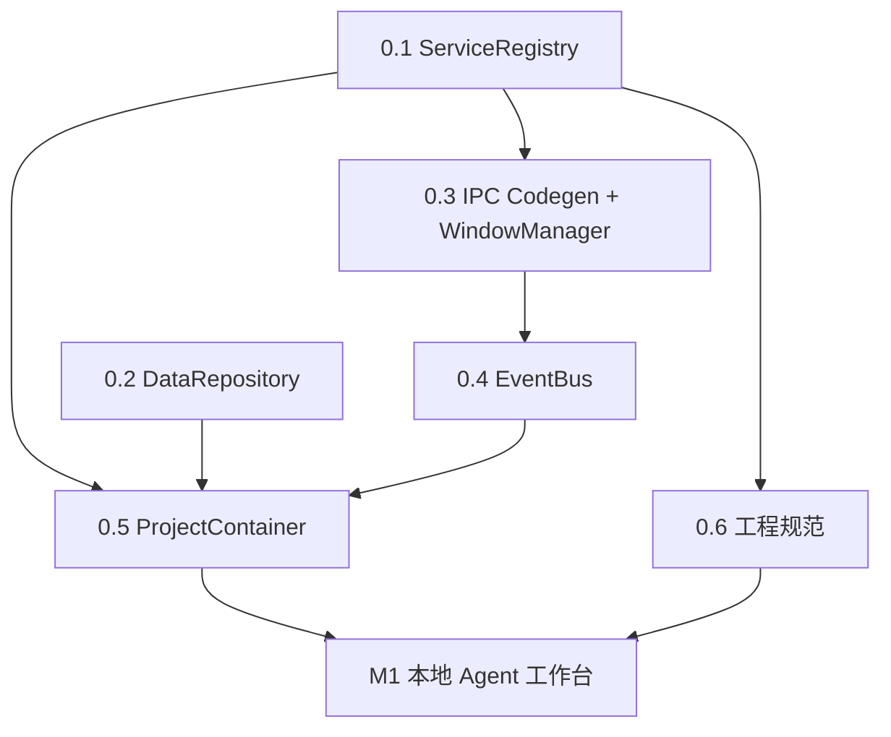

# 架构前置改造建议

> CC Connect 融合前的架构重构指南，后续代码迁移的唯一技术基准。Synapse 未上线、无历史包袱，允许一次大规模重构。

## 0. 速读

M1 之前必须完成 5 项结构改造 + 1 项工程规范：

| Phase | 名称 | 解决什么 | 工作量 |
|---|---|---|---|
| 0.1 | ServiceRegistry | 模块级单例 + 手写启停顺序 | 2-3 天 |
| 0.2 | DataRepository | 三套并存存储 + 无加密/迁移/备份统一 | 3-4 天 |
| 0.3 | IPC 模块化 + Codegen + WindowManager | Channel 五处双写 | 4-5 天 |
| 0.4 | EventBus | 点对点推送，20+ 事件类型撑爆 channel | 2 天 |
| 0.5 | ProjectContainer | 单例塞不下 project-scoped 状态 | 2-3 天 |
| 0.6 | 工程规范 | 大规模迁移无统一地基 | 2 天 |

总工作量 **15-18 工程日**。不做：Zustand 全局改造、设计系统迁移、NestJS/tRPC。

## 1. 自我审查

### 修正的遗漏

1. **preload sandbox** 不能运行时 `require`（`@/Users/liyang/Documents/code/github/Synapse/desktop/electron/preload.ts:5-8`），模块化只能用**构建时 codegen**。
2. **多窗口广播**：`contentWindowService` 已能开独立窗口，事件总线必须支持按 scope 过滤 + 多窗口路由。
3. **Synapse repository active vs CC project active**：两层独立，UI 上是两个独立切换器，不合并。
4. **测试、日志轮转、错误边界**：Agent 日志量大，必须轮转。合并进 Phase 0.6。
5. **safeStorage**：API key 加密用 Electron 原生 `safeStorage`（Keychain/DPAPI/keyring），不自造轮子。

### 关键取舍

- **不引入 DI 框架**（InversifyJS/tsyringe）：装饰器 + 反射和 Vite 工具链不和，自写 200 行 `ServiceRegistry` 足够。
- **不引入 tRPC**：现有 channel+typed bridge 良好，codegen 更贴合。
- **数据迁移只向前**：未上线阶段优先迁移可靠性。
- **日志不数据库化**：JSONL 按天轮转，避免与业务数据抢 SQLite lock。
- **不用 utility process**：`child_process.spawn` 跑 Agent CLI 足够，保留"未来引入"选项。
- **Phase 5+1**：WindowManager 合并进 0.3，日志/错误/测试合并为 0.6。

### 硬约束

所有后续 PR 必须遵守：

- 禁止 `export default new XxxService()` 形式全局单例 → 必须经 ServiceRegistry。
- 禁止裸 `ipcMain.handle` → 必须通过 IpcRegistry。
- 禁止裸 `webContents.send` → 必须通过 EventBus。
- 禁止裸 `fs.writeFile` 持久化业务数据 → 必须通过 DataRepository。
- 渲染层只允许 `window.synapse.*` 访问 Electron 能力。
- `runtime/*` 是基础设施，不依赖 `modules/*` 和业务代码。

## 2. 目标与非目标

### 目标

1. 主进程服务容器 + 生命周期。
2. IPC 模块化 + codegen。
3. 统一事件总线。
4. 统一数据仓库（加密/迁移/备份）。
5. 项目作用域容器。
6. 工程规范（日志/错误/测试/约束）。

### 非目标

- 不重写现有业务功能。
- 不引入新 UI 框架/状态管理/样式系统。
- 不迁移 CC Connect 业务代码（M1 以后）。
- 不做性能优化、国际化、主题系统。

## 3. Phase 依赖图与时间线



```text
Day 01-03   Phase 0.1
Day 04-07   Phase 0.2   (可与 0.3 并行)
Day 04-08   Phase 0.3
Day 09-10   Phase 0.4
Day 11-13   Phase 0.5
Day 14-15   Phase 0.6
Day 16-18   缓冲 + 回归
```

**里程碑**：5 Phase 完成后，`main.ts` 不超过 120 行，只负责 `whenReady` → 启动 ServiceRegistry → 创建主窗口 → `before-quit` 钩子。

## 4. Phase 0.1 ServiceRegistry 与生命周期

### 现状

`@/Users/liyang/Documents/code/github/Synapse/desktop/electron/main.ts:175-228` 手写启动顺序 + 散落 try/catch；`main.ts:255-259` 只清理 3 个服务，加到 20+ 个会频繁遗漏。

### 核心接口

```ts
// desktop/electron/runtime/service-registry/types.ts

export type ServiceCriticality = "fatal" | "degraded"

export interface ServiceContext {
  readonly logger: StructuredLogger
  readonly dataRepo: DataRepository
  readonly eventBus: EventBus
  readonly registry: ServiceRegistry
}

export interface ServiceDescriptor<Instance = unknown> {
  readonly id: string                      // "core.config" / "agent.runtime"
  readonly dependsOn?: readonly string[]
  readonly criticality: ServiceCriticality
  create(ctx: ServiceContext): Instance | Promise<Instance>
  start?(instance: Instance, ctx: ServiceContext): Promise<void> | void
  stop?(instance: Instance, ctx: ServiceContext, timeoutMs: number): Promise<void> | void
  reload?(instance: Instance, ctx: ServiceContext): Promise<void> | void
}

export interface ServiceRegistry {
  register<T>(d: ServiceDescriptor<T>): void
  startAll(): Promise<{ degraded: Array<{ id: string; error: Error }> }>
  stopAll(timeoutMs: number): Promise<void>
  get<T>(id: string): T
  reload(id: string): Promise<void>
  inspect(): ReadonlyArray<{
    id: string
    status: "pending" | "starting" | "running" | "stopped" | "failed"
    criticality: ServiceCriticality
    dependsOn: readonly string[]
    lastError?: Error
  }>
}
```

### 启停语义

- 启动：拓扑排序，dependsOn 先起。fatal 失败抛错中断，degraded 失败记录继续。
- 停止：启动反序。单 stop 超时 5000ms，总超时 15000ms（对齐 `main.ts:266-270`）。
- 热重载：只对声明 `reload` 的服务有效。
- 循环依赖：启动前检测，抛 `CircularDependencyError` 列出环。

### 文件结构

```text
desktop/electron/runtime/service-registry/
├── index.ts
├── types.ts
├── registry.ts
├── topo.ts
├── errors.ts
└── __tests__/
```

### 迁移步骤

**Step 1** 建框架 + 单测跑通。

**Step 2** 迁现有服务为 descriptor（保留现有单例内部实现，`create` 返回它们）：

| 现有 | id | criticality | dependsOn |
|---|---|---|---|
| `configStore.load()` | `core.config` | fatal | — |
| `initializeAppIcon()` | `core.app-icon` | degraded | — |
| `logStore` | `core.logging` | fatal | — |
| `initDataStore()` | `core.data-store` | degraded | `core.config` |
| `updateService.initialize()` | `core.update` | degraded | `core.config` |
| `repositoryStore.watchRepository(*)` | `repo.watch` | degraded | `core.config` |
| `repositoryMaintenanceService` | `repo.maintenance` | degraded | `repo.watch` |
| `createTray()` | `ui.tray` | degraded | `core.app-icon` |
| `pendingPushesService` | `repo.pending-pushes` | degraded | `core.data-store` |

**Step 3** 收敛 `main.ts`：

```ts
app.whenReady().then(async () => {
  const registry = buildServiceRegistry()
  await registry.startAll()
  createMainWindow(registry)
})
```

`before-quit` 换成 `await registry.stopAll(15000)`。

**Step 4** IPC handler 注册本 Phase 暂保留原样，但保证在 `core.*` 启动之后执行；Phase 0.3 完成后合并进各 service 的 `start`。

### 验证

- 单测：拓扑、fatal 中断、degraded 收集、timeout、循环检测。
- 集成：启动 inspect 全 running，关闭 15s 内全 stopped。
- 回归：现有功能不变。

## 5. Phase 0.2 统一数据仓库

### 现状

- `configStore` → `userData/config.json` 未加密/无版本号。
- `data-store` → SQLite 独立生态（MCP），不服务业务数据。
- `exportBackup/importBackup` 只覆盖部分。
- 零加密路径：API key / credentials / webhook secret 无处安放。

### Namespace 策略

| Namespace | 后端 | 加密 | 量级 | 用途 |
|---|---|---|---|---|
| `core.config` | Json | 否 | 小 | 应用配置 |
| `core.identity` | Json | 否 | 小 | 用户身份 |
| `secrets` | EncryptedJson | **是** | 小 | API key/token/secret |
| `providers` | Json | `secretRef` | 小 | Provider 定义 |
| `projects` | Json | 否 | 小 | CC Project/Workspace |
| `connectors` | Json | 部分 | 小 | Connector 定义 |
| `scheduler` | Json | 否 | 小 | Cron/Heartbeat |
| `hooks` | Json | 否 | 小 | Hook 规则 |
| `conversations` | Sqlite | 否 | **大** | 会话/消息/事件 |
| `audit` | JsonLines | 否 | **大** | 审计追加 |
| `outbox` | Sqlite | 否 | 中 | 出站队列 |
| `business-db` | 直通现有 data-store | 否 | 中 | 用户业务表 |

**原则**：敏感字段只落 `secrets`，其他 namespace 只存 `secretRef: string`。

### 核心接口

```ts
// desktop/electron/runtime/data-repo/types.ts

export interface DataRepository {
  namespace<T>(name: string): DataNamespace<T>
  exportAll(options?: { includeSecrets?: boolean }): Promise<BackupPayload>
  importAll(payload: BackupPayload, options?: { merge?: boolean }): Promise<void>
  inspect(): ReadonlyArray<{ namespace: string; backend: string; schemaVersion: number; rowCount?: number }>
}

export interface DataNamespace<T> {
  readonly name: string
  getSingleton(): Promise<T | null>
  setSingleton(value: T): Promise<void>
  list(filter?: Partial<T>): Promise<T[]>
  get(id: string): Promise<T | null>
  upsert(item: T & { id: string }): Promise<void>
  remove(id: string): Promise<void>
  onChange(listener: (change: DataChangeEvent<T>) => void): () => void
}

export interface BackupPayload {
  format: "synapse-backup-v1"
  exportedAt: string
  namespaces: Array<{
    name: string
    schemaVersion: number
    encrypted: boolean
    data: unknown | string        // string = 未解密的加密段
  }>
}

export interface Migration<From, To> {
  readonly from: number
  readonly to: number
  migrate(data: From): To | Promise<To>
}

export interface NamespaceSchema<T> {
  readonly name: string
  readonly backend: "json" | "encrypted-json" | "sqlite" | "jsonl"
  readonly currentVersion: number
  readonly migrations: readonly Migration<unknown, unknown>[]
  readonly validate: (data: unknown) => data is T
}
```

### 加密实现

```ts
// desktop/electron/runtime/data-repo/backends/encrypted-json.ts

import { safeStorage } from "electron"

export class EncryptedJsonBackend implements DataBackend {
  async read(filePath: string): Promise<unknown> {
    if (!safeStorage.isEncryptionAvailable()) {
      throw new EncryptionUnavailableError()
    }
    const cipher = await fs.readFile(filePath)
    return JSON.parse(safeStorage.decryptString(cipher))
  }
  async write(filePath: string, value: unknown): Promise<void> {
    const cipher = safeStorage.encryptString(JSON.stringify(value))
    await writeAtomic(filePath, cipher)
  }
}
```

- macOS: Keychain（entry 名 `Synapse Safe Storage`）
- Windows: DPAPI
- Linux: kwallet/Gnome Keyring；**无 keyring 时不降级成明文**，抛 `EncryptionUnavailableError`，UI 提示配置密钥环。

### 迁移执行

- namespace 首次 `get` 时读 version tag，落后则按顺序执行链。
- 先写临时文件 → validate 通过 → 原子替换。
- 失败保留原文件 + 写 `.migration-error` 诊断。
- 迁移函数必须幂等。
- 只向前迁移，不支持回退。

### 文件结构

```text
desktop/electron/runtime/data-repo/
├── index.ts
├── types.ts
├── repository.ts
├── namespace.ts
├── migrations.ts
├── errors.ts
├── backends/
│   ├── json.ts
│   ├── encrypted-json.ts
│   ├── sqlite.ts
│   └── jsonl.ts
├── schemas/
│   ├── core-config.ts
│   ├── core-identity.ts
│   ├── secrets.ts
│   ├── providers.ts           # M1 用，本 Phase 预留
│   ├── projects.ts
│   └── ...
└── __tests__/
```

### 迁移步骤

**Step 1** 框架 + JSON/JSONL/Encrypted backend + 单测。

**Step 2** 迁 `core.config`。`configStore` 改为薄封装调 `dataRepo.namespace("core.config")`。为老 `config.json` 写 `v0→v1` 迁移（加顶层 `schemaVersion: 1`）。

**Step 3** 迁 `core.identity`、`repo.pending-pushes`、`repo.repositories`，每个带迁移测试。

**Step 4** 预留 `secrets` + `providers` 的 schema，不接数据。

**Step 5** 集成 SqliteBackend 包装现有 data-store。对外 API 不变，MCP 仍然直接 better-sqlite3。

**Step 6** 重写 `@/Users/liyang/Documents/code/github/Synapse/desktop/electron/services/config-backup-service.ts` → 调 `dataRepo.exportAll/importAll`，IPC 通道不变。

### 验证

- 单测：各 backend、迁移链、加密失败、备份脱敏、合并导入。
- 集成：临时 userData 模拟 v0 config，启动后自动迁到 v1 无丢失。
- 回归：配置导出/导入 UI 不变。

## 6. Phase 0.3 IPC 模块化 + Codegen + WindowManager

### 现状（五处双写）

1. `@/Users/liyang/Documents/code/github/Synapse/desktop/electron/ipc/channels.ts:3-88` canonical table。
2. `@/Users/liyang/Documents/code/github/Synapse/desktop/electron/preload.ts:8-126` 手工复制 channel 字符串。
3. `@/Users/liyang/Documents/code/github/Synapse/desktop/electron/preload.ts:140-290` 手工绑定 bridge 方法。
4. `@/Users/liyang/Documents/code/github/Synapse/desktop/src/types/bridge.ts` 10KB 类型。
5. 12 个 handler 文件手工 `handleValidatedIpc(channel, handler)`。

preload sandbox 不能 require，现状靠 `satisfies` 编译期兜底。窗口管理散落在 `main.ts` / `content-window-service.ts` / 多处 `BrowserWindow.getAllWindows()`。

### 模块描述

```ts
// desktop/electron/runtime/ipc/types.ts

export interface IpcMethodDescriptor<Req = unknown, Res = unknown> {
  readonly kind: "invoke" | "send"
  readonly channel: string
  readonly request: ZodSchema<Req>
  readonly response?: ZodSchema<Res>
  readonly handler: (ctx: IpcHandlerContext, req: Req) => Promise<Res> | Res
}

export interface IpcEventDescriptor<Payload = unknown> {
  readonly kind: "event"
  readonly channel: string
  readonly payload: ZodSchema<Payload>
  // 触发走 EventBus，此处仅为 codegen 生成订阅
}

export interface IpcModule {
  readonly id: string
  readonly methods: Readonly<Record<string, IpcMethodDescriptor>>
  readonly events: Readonly<Record<string, IpcEventDescriptor>>
}

export interface IpcRegistry {
  register(module: IpcModule, handlerCtx: IpcHandlerContext): () => void
}
```

**示例**：

```ts
// desktop/electron/modules/content/ipc.ts

import { z } from "zod"

export const contentIpcModule: IpcModule = {
  id: "content",
  methods: {
    list: {
      kind: "invoke",
      channel: "synapse:content:list",
      request: z.object({ contentType: z.enum(["rule", "skill", "prompt"]) }),
      response: z.array(contentSummarySchema),
      handler: async (ctx, req) =>
        ctx.services.get<ContentService>("content.service").list(req.contentType),
    },
  },
  events: {
    updated: {
      kind: "event",
      channel: "synapse:content:updated",
      payload: contentUpdatedEventSchema,
    },
  },
}
```

### 构建时 Codegen

`scripts/generate-ipc.ts`：

输入：`desktop/electron/modules/*/ipc.ts`

输出：

```text
desktop/electron/generated/
├── channels.ts
├── preload.generated.ts
└── bridge-types.generated.ts

desktop/src/generated/
└── electron-bridge-client.ts
```

**为什么 codegen**：preload sandbox 不能 require；codegen 保持 preload 为扁平函数字面量，绕过限制同时消除手工同步。

**触发**：
- Dev: vite plugin 监听 `modules/*/ipc.ts` 变更自动重生成。
- Build: `pnpm build` 前 `pnpm generate:ipc` prebuild。
- CI: generated 与源描述 diff 则报错。

**提交 git**：是。方便 PR 评审 + clone 可直接跑 + CI 比对闸门。

### WindowManager

```ts
// desktop/electron/runtime/window/manager.ts

export interface WindowDescriptor {
  readonly id: string
  readonly role: "main" | "detail" | "overlay"
  readonly create: (ctx: WindowContext) => BrowserWindow
  readonly shouldReuse?: (existing: BrowserWindow, openRequest: unknown) => boolean
}

export interface WindowManager {
  register(d: WindowDescriptor): void
  open(id: string, payload?: unknown): BrowserWindow
  broadcast(channel: string, payload: unknown, filter?: (win: BrowserWindow) => boolean): void
  close(id: string): void
  list(): ReadonlyArray<{ id: string; role: string; webContentsId: number }>
}
```

EventBus 广播调 `WindowManager.broadcast`。业务代码不再直接 `BrowserWindow.getAllWindows()`。

### 文件结构

```text
desktop/electron/runtime/ipc/
├── types.ts
├── registry.ts
├── validation.ts           # 从 validated-ipc.ts 迁移 + zod
├── errors.ts
└── __tests__/

desktop/electron/runtime/window/
├── manager.ts
└── __tests__/

desktop/electron/modules/    # 新目录，按 feature 组织
├── content/{index,ipc,service}.ts + __tests__/
├── repository/
├── config/
├── identity/
├── editor-scan/
├── update/
├── logging/
├── data-store/
└── ...

desktop/electron/generated/  # codegen 产物，提交 git
desktop/src/generated/
scripts/generate-ipc.ts
```

### 迁移步骤

**Step 1** 建 `runtime/ipc` + 引入 `zod`。

**Step 2** 写 codegen，先覆盖 invoke + event。

**Step 3** 按简单到复杂逐模块迁移：
1. `shell` → 2. `cli` → 3. `identity` → 4. `user-profile` → 5. `log` → 6. `update` → 7. `editor-scan` → 8. `editor` → 9. `config` → 10. `repository` → 11. `content`（最复杂）→ 12. `data-store`（包一层 IpcModule）

每迁一个：建 `modules/<id>/ipc.ts` → 旧 `ipc/<id>-handlers.ts` 标 deprecated → `channels.ts` 对应块删 → `pnpm generate:ipc` 比对 → service `start` 里 `ipcRegistry.register(module)` → e2e。

**Step 4** 全部迁完删旧：
- `ipc/channels.ts`（generated 替代）
- `ipc/*-handlers.ts`
- `types/bridge.ts`（generated 替代）
- `preload.ts` 改为 `export * from "../generated/preload.generated"`
- `electron-bridge.ts` 改为导入 generated client

**Step 5** 迁窗口管理：
- `createMainWindow` → `WindowManager.open("main")`
- `contentWindowService.openDetailWindow` → `WindowManager.open("content-detail", payload)`
- 删 `services/content-window-service.ts`
- 所有 `BrowserWindow.getAllWindows()` → `WindowManager.broadcast`

### 验证

- 单测：zod 校验生效，无效请求返结构化错误。
- Codegen 测试：mock 模块 → 生成 AST 与预期一致。
- 集成：DevTools 调 `window.synapse.content.list(...)` 返回正确数据。
- CI 闸门：generated 与源一致性比对。

## 7. Phase 0.4 统一事件总线

### 现状

- 主进程事件靠散落 callback（`main.ts:230-234`）。
- 推送靠 handler 自拿 sender（`content-handlers.ts:36-40`）。
- 每种事件一个 channel：现 5 个，CC `core.Event` 20+ 类型会爆。

### 设计

```ts
// desktop/electron/runtime/event-bus/types.ts

export type EventDomain =
  | "repository" | "content" | "update" | "data-store"
  | "agent"        // M1
  | "connector"    // M3
  | "scheduler"    // M4

export interface DomainEvent<D extends EventDomain = EventDomain, T extends string = string, P = unknown> {
  readonly domain: D
  readonly type: T                  // "session.started" / "message.delta"
  readonly payload: P
  readonly timestamp: string
  readonly scope?: {
    projectId?: string
    sessionId?: string
  }
}

export interface EventBus {
  on<D extends EventDomain>(domain: D, listener: (event: DomainEvent<D>) => void): () => void
  onType<D extends EventDomain, T extends string>(
    domain: D, type: T,
    listener: (event: DomainEvent<D, T>) => void,
  ): () => void
  emit<D extends EventDomain>(event: DomainEvent<D>): void           // 广播 renderer
  emitInternal<D extends EventDomain>(event: DomainEvent<D>): void   // 仅主进程
}
```

**IPC 通道**：每 domain 一个（`synapse:events:repository` 等），payload 是 `DomainEvent` 整体。

### 多窗口路由

`emit` 流程：
1. 主进程内 listener。
2. `WindowManager.broadcast(channel, event, filter)`。
3. filter 默认所有窗口；`agent` domain 可按 scope 过滤。

### Renderer 客户端

```ts
// desktop/src/runtime/event-bus-client.ts（codegen）

export interface EventBusClient {
  on<D extends EventDomain>(domain: D, listener: (event: DomainEvent<D>) => void): () => void
  onScoped<D extends EventDomain>(
    domain: D,
    scope: { projectId?: string; sessionId?: string },
    listener: (event: DomainEvent<D>) => void,
  ): () => void
}
```

内部 `EventRouter`：每 domain 订阅 IPC 一次，listener 注册只在 router 加 callback。

### 事件不做持久化

- 量大。
- "快照 + 增量"模式：快照从 `DataRepository`，增量从 `EventBus`。
- 窗口关了不用回放。
- **例外**：audit event 单独走 `DataRepository.audit` namespace。

### 文件结构

```text
desktop/electron/runtime/event-bus/
├── types.ts
├── bus.ts
├── broadcaster.ts         # 对接 WindowManager
└── __tests__/

desktop/src/runtime/event-bus-client.ts
```

### 迁移步骤

**Step 1** 建 EventBus + 单测（subscribe/emit/跨 domain 隔离/listener 异常不影响其他/取消订阅后不回调）。

**Step 2** 迁 5 个现有事件：

| 旧 channel | 新 domain + type |
|---|---|
| `synapse:repository:updated` | `repository` + `updated` |
| `synapse:repository:progress` | `repository` + `progress` |
| `synapse:repository:pending-pushes-updated` | `repository` + `pending-pushes-updated` |
| `synapse:update:state-changed` | `update` + `state-changed` |
| `synapse:update:open-update-page` | `update` + `open-page` |
| `synapse:data-store:changed` | `data-store` + `changed` |

**未上线**，直接切换不兼容。

**Step 3** 删旧 `sendToRenderer` 辅助函数 + 旧 channel 定义。

### 验证

- 单测：上述场景全覆盖。
- 集成：两窗口，一个操作仓库另一个收到事件；`agent` scope 过滤只发匹配窗口。
- 回归：同步进度、更新状态、data-store 变更通知行为不变。

## 8. Phase 0.5 项目作用域容器

### 背景

CC Connect 要求 project-scoped engine。每个 project 持有独立 Provider 绑定、Agent runtime、session map、workspace binding、权限策略、cron/heartbeat/hook。

### 现状问题

现有服务全是模块级单例。"单例 + `Map<projectId, State>`"硬塞会频繁跨 project 状态泄漏。

### 容器契约

```ts
// desktop/electron/runtime/project-container/types.ts

export interface ProjectContext {
  readonly projectId: string
  readonly projectMeta: ProjectMetadata
  readonly logger: StructuredLogger            // 带 projectId 前缀
  readonly dataRepo: ProjectScopedDataRepo     // 自动前缀 project ID 的 namespace
  readonly eventBus: ScopedEventBus            // emit 时自动填充 scope.projectId
  readonly globalRegistry: ServiceRegistry     // 只读访问全局服务
}

export interface ProjectScopedService<Instance = unknown> {
  readonly id: string
  readonly dependsOn?: readonly string[]
  create(ctx: ProjectContext): Instance | Promise<Instance>
  start?(instance: Instance, ctx: ProjectContext): Promise<void> | void
  stop?(instance: Instance, ctx: ProjectContext): Promise<void> | void
}

export interface ProjectContainer {
  readonly projectId: string
  get<T>(id: string): T
  inspect(): ReadonlyArray<{ id: string; status: string }>
  dispose(): Promise<void>
}

export interface ProjectContainerRegistry {
  open(projectId: string): Promise<ProjectContainer>
  close(projectId: string): Promise<void>
  list(): ReadonlyArray<{ projectId: string; openedAt: string }>
  registerService(service: ProjectScopedService): void
}
```

### 与 ServiceRegistry 的关系

- 全局服务（configStore、updateService、repositoryStore）在全局 ServiceRegistry。
- Project-scoped 服务（Agent runtime、session manager、connector binding、cron scheduler）在 `ProjectContainerRegistry.registerService` 注册模板。
- `open(projectId)` 按模板创建实例、拓扑启动。
- `close(projectId)` 反序 dispose。
- 容器间完全隔离：project A 的 Agent runtime 拿不到 project B 的 session。

### 生命周期

```text
切换到 project X
  -> renderer 调 synapse.projects.activate(X)
  -> ProjectContainerRegistry.open(X)
    -> 加载 metadata
    -> 创建所有 scoped service
    -> 拓扑启动
  -> EventBus emit { domain: "project", type: "activated", scope: { projectId: X } }

关闭 project X
  -> ProjectContainerRegistry.close(X)
    -> 反序 stop
    -> 清理资源（kill 子进程、close WebSocket）
```

**空闲回收**（对齐 CC idle reaper）：注册 `idle-reaper` 全局服务，周期检查打开的 project，N 分钟无活跃会话则自动 close。

### Renderer active project 与 active repository 并存

```ts
// desktop/src/app-shell/active-project.tsx（独立于 active-repository-switch）

export function useActiveProject(): ProjectMetadata | null
export function useActiveProjectActions(): {
  activate: (projectId: string) => Promise<void>
  close: (projectId: string) => Promise<void>
}
```

UI：顶部仓库切换器不变，新增项目切换按钮（仅在会话/项目/连接/自动化 4 个 tab 可见）。

### 文件结构

```text
desktop/electron/runtime/project-container/
├── index.ts
├── types.ts
├── registry.ts
├── container.ts
├── scoped-data-repo.ts
├── scoped-event-bus.ts
├── idle-reaper.ts
└── __tests__/

desktop/src/app-shell/
├── active-project.tsx
└── use-active-project.ts
```

### 迁移步骤

**Step 1** `ProjectContainerRegistry` 骨架 + 单测。

**Step 2** `ScopedEventBus` + `ProjectScopedDataRepo`：
- `ScopedEventBus.emit` 自动填 `scope.projectId`。
- `ProjectScopedDataRepo.namespace("foo")` 实际读写 `projects/<projectId>/foo` 子目录。

**Step 3** `idle-reaper` 全局服务，依赖 `ProjectContainerRegistry`。

**Step 4** Renderer 侧 `active-project.tsx`。

**Step 5** 本 Phase 不迁任何现有业务，只搭好容器。M1 的 Agent runtime 作为首个落地样例。

### 验证

- 单测：open/close 幂等、跨 project 隔离、idle reaper 按时关闭、scope 正确注入。
- 集成：mock `echo.service`（scoped），两个 project 同时打开互不影响；close 后检查 listener count 无泄漏。

## 9. Phase 0.6 工程规范与可观测性

不改结构，是约定与工具。

### 日志

**分级**：`trace` / `debug` / `info` / `warn` / `error` / `fatal`。

**结构化**：

```json
{
  "timestamp": "2026-04-25T10:30:00.000Z",
  "level": "info",
  "module": "agent.runtime",
  "message": "Session started",
  "context": { "projectId": "...", "sessionId": "..." }
}
```

**输出**：主日志 `userData/logs/synapse.log`，> 10MB 切分为 `synapse-YYYY-MM-DD-N.log`，保留 7 天。

**独立日志文件**：Agent/会话相关服务用 `userData/logs/agent-<date>.log`，避免淹没主日志。

**改造**：`@/Users/liyang/Documents/code/github/Synapse/desktop/electron/services/log-store.ts` 补：
- 按大小/按天切分
- 按 module 前缀分流
- log level 运行时配置（`DataRepository.core.config.logLevel`）
- Renderer log viewer 聚合多文件

### 错误处理

- **主进程未捕获**：`main.ts:97-103` 扩展为记录到 `crash.log`，连续 3 次 crash 进入安全模式（仅启动 core 服务）。
- **子进程崩溃**：Agent CLI / ffmpeg / STT 的 spawn 必须挂 `on('exit')`，异常退出通过 EventBus 发 `agent.process-died`。
- **用户友好错误**：所有 IPC 返给 renderer 的错误必须是 `{ code, message, details?, retriable }`，renderer 统一 toast/dialog。
- **禁止吞错**：`catch {}` 空块和 `catch (e) { /* ignore */ }` 不允许。要么处理、要么上抛、要么降级成 `logger.warn` + 显式注释。

### 测试范式

| 层级 | 工具 | 范围 |
|---|---|---|
| 单元 | Vitest | `runtime/*` 全部 + 各 module service 内部逻辑 |
| IPC 集成 | Vitest + electron-mock-ipc | IpcModule 端到端（mock main/renderer） |
| E2E | Playwright + electron | 关键流程（首次启动、切换仓库、创建内容、导入备份） |

**覆盖率目标**：`runtime/*` 80%+，业务代码 60%+。

**命令**：

```text
pnpm desktop:test         # 所有单测
pnpm desktop:test:ipc     # IPC 集成
pnpm desktop:test:e2e     # E2E
pnpm desktop:test:ci      # CI 串联
```

### CI 闸门

- Lint + typecheck 通过
- 单测 + IPC 集成全绿
- `pnpm generate:ipc` 无 diff
- E2E 关键流程通过
- 禁用 API 扫描（`grep` 检查 `ipcMain.handle` 只在 `runtime/ipc/` 出现）

### 代码约束更新 AGENTS.md

本 Phase 后更新 `AGENTS.md` 加入：

- 禁止 `export default new XxxService()` 形式单例
- 禁止裸 `ipcMain.handle/on`
- 禁止裸 `webContents.send`
- 禁止裸 `fs.writeFile` 持久化业务数据
- 禁止 `catch {}` 空块
- 渲染层只允许 `window.synapse.*`
- 新模块必须在 `desktop/electron/modules/<feature>/` 或 `desktop/src/modules/<feature>/`
- `runtime/*` 不依赖 `modules/*` 和业务代码

### 文件结构

```text
desktop/electron/runtime/logging/
├── logger.ts
├── rotator.ts
└── __tests__/

desktop/tests/
├── unit/
├── ipc/
└── e2e/
    ├── fixtures/
    └── specs/

.github/workflows/ci.yml    # 更新流水线
```

## 10. 风险与备选方案

| 风险 | 后果 | 应对 |
|---|---|---|
| Codegen bug | IPC 全面失效 | 单测覆盖核心路径；CI 比对闸门；保留回滚 commit |
| safeStorage Linux 不可用 | 用户无法保存 API key | 抛 `EncryptionUnavailableError` + UI 指导配置 keyring；**不降级明文** |
| 迁移脚本失败 | 用户数据不可读 | 失败保留原文件 + 写 `.migration-error`；手工恢复指南写入文档 |
| 拓扑排序 bug | 服务启动顺序错 | 单测覆盖环检测；inspect 可视化依赖图 |
| 大量日志 I/O 压力 | 主进程卡顿 | 日志异步写 + 按 module 分流；轮转 |
| project 泄漏 listener | 内存涨 | 集成测试 listener count；每次 close 后断言归零 |
| 依赖升级破坏 codegen | 构建失败 | 锁死 zod/ts-morph 版本；CI 防呆 |

**备选方案**：

- **IPC 方案**：若 codegen 反复出 bug，退回"运行时 Proxy + 白名单 channel"（preload 定义固定方法前缀 `call(channel, ...args)`，renderer 用 Proxy 包装）。代价是失去类型推导。
- **加密方案**：若 safeStorage 在目标 Linux 发行版上不稳定，退回 `node-keytar`（已废弃但仍可用），或要求用户手工设置主密码（PBKDF2 + AES-GCM）。
- **数据存储**：若 better-sqlite3 编译问题严重，改用 LevelDB。

## 11. FAQ

**Q: 为什么不用 NestJS？**
A: 太重。NestJS 的装饰器 + 反射在 Vite 不友好，且带来大量运行时开销。我们只需要 200 行级的轻量 registry。

**Q: 为什么不用 tRPC？**
A: tRPC 假设 HTTP/WebSocket，适配 Electron IPC 要写适配层。现有模式 + codegen 更贴合且侵入小。

**Q: 为什么不把 Agent runtime 放 utility process？**
A: utility process 的 IPC 接口更受限，调试更难。`child_process.spawn` 跑 Agent CLI 已足够隔离。保留未来引入的可能性。

**Q: 为什么 generated 文件要提交 git？**
A: 评审 bridge 接口变化、clone 后直接可跑、CI 比对闸门。

**Q: 为什么 project-scoped 不用 worker_threads？**
A: Worker 无法共享 better-sqlite3 连接，跨 thread IPC 成本不低。project 隔离通过容器 + 子进程足够。

**Q: 为什么数据迁移只向前？**
A: 未上线阶段数据兼容价值低于迁移脚本可靠性。双向迁移意味着每次 schema 变更要写 2 倍代码 + 2 倍测试。如果用户真的需要回退版本，通过"导出 → 降版本 → 导入"手工流程解决。

**Q: EventBus 和 ServiceRegistry 的关系？**
A: EventBus 是全局 service（`core.event-bus`），在 Phase 0.4 实际实现。ServiceRegistry 启动时第一批就起 EventBus 实例，后续服务通过 `ctx.eventBus` 拿到它。

**Q: ProjectContainer 之间能不能共享资源？**
A: 原则不共享。但全局资源（Provider profile、系统配置、身份）在全局 registry，project container 通过 `ctx.globalRegistry` 只读访问。

**Q: 为什么把日志作为工程规范而非 Phase 0.1 的一部分？**
A: 日志的分级、轮转、结构化是约定问题，不是架构问题。Phase 0.1 只需要一个 `StructuredLogger` 接口占位，实现可以是现有 `log-store` 的直接适配；规范和工具在 Phase 0.6 统一落实。

## 12. 现状代码映射表

| 现状文件 | 去处 |
|---|---|
| `desktop/electron/main.ts` | 简化为 registry 启停钩子 |
| `desktop/electron/preload.ts` | 由 codegen 生成 |
| `desktop/electron/ipc/channels.ts` | 由 codegen 生成 |
| `desktop/electron/ipc/*-handlers.ts` | 各自拆进 `modules/<id>/ipc.ts` |
| `desktop/electron/ipc/validated-ipc.ts` | 并入 `runtime/ipc/validation.ts` |
| `desktop/electron/ipc/utils.ts` | 并入 `runtime/ipc/` 或删除 |
| `desktop/electron/services/config-store.ts` | 薄封装 + `core.config` namespace |
| `desktop/electron/services/log-store.ts` | 改造为 `runtime/logging` |
| `desktop/electron/services/config-backup-service.ts` | 并入 `DataRepository.exportAll/importAll` |
| `desktop/electron/services/content-window-service.ts` | 迁入 `runtime/window` |
| `desktop/electron/services/tray-service.ts` | 注册为 `ui.tray` service |
| `desktop/electron/services/update-service.ts` | 注册为 `core.update` service |
| `desktop/electron/services/repository-*.ts` | 合并进 `modules/repository/` |
| `desktop/electron/services/content-*.ts` | 合并进 `modules/content/` |
| `desktop/electron/services/editor-*.ts` | 合并进 `modules/editor/` / `modules/editor-scan/` |
| `desktop/electron/services/*-pool-service.ts` / 辅助 | 保留或拆到对应 module |
| `desktop/electron/data-store/` | 保留 + 包装一层 `DataRepository.business-db` |
| `desktop/src/types/bridge.ts` | 由 codegen 生成 |
| `desktop/src/lib/electron-bridge.ts` | 改为导入 generated client |
| `desktop/src/app-shell/*` | 不动 |
| `desktop/src/modules/*` | 不动 |
| `desktop/src/App.tsx` | 不动（顶层 tab 加法在 M1 时做） |

## 13. 迁移 Checklist 模板

每个 Phase 结束必须通过以下清单：

- [ ] 新增代码有对应单测，覆盖率 ≥ 80%
- [ ] 现有功能的 e2e 流程无行为变化
- [ ] 相关文档已更新（本文档 + `AGENTS.md` 如涉及约束）
- [ ] 没有新增未被 registry 管理的全局单例
- [ ] 没有新增裸 `ipcMain.handle` / `webContents.send` / `fs.writeFile`
- [ ] 没有新增 `catch {}` 空块
- [ ] `pnpm generate:ipc` 无 diff
- [ ] `pnpm desktop:test:ci` 通过
- [ ] 如改动数据格式，已写迁移 + 迁移测试
- [ ] 如改动 IPC schema，generated 文件已提交

## 14. 开工前最后检查

- [ ] 确认团队理解"未上线无历史包袱"的重构自由度
- [ ] 确认 15-18 工程日预算可用
- [ ] 确认 `zod`、`better-sqlite3`（已有）、`playwright`、`electron-mock-ipc` 依赖可接受
- [ ] 确认 CI 运行时间增量可接受（预估 +5min）
- [ ] 确认 generated 文件入 git 政策
- [ ] 创建架构重构 feature branch（建议 `feat/phase-0/architecture-foundation`）
- [ ] 每个 Phase 一个 PR，逐个评审
