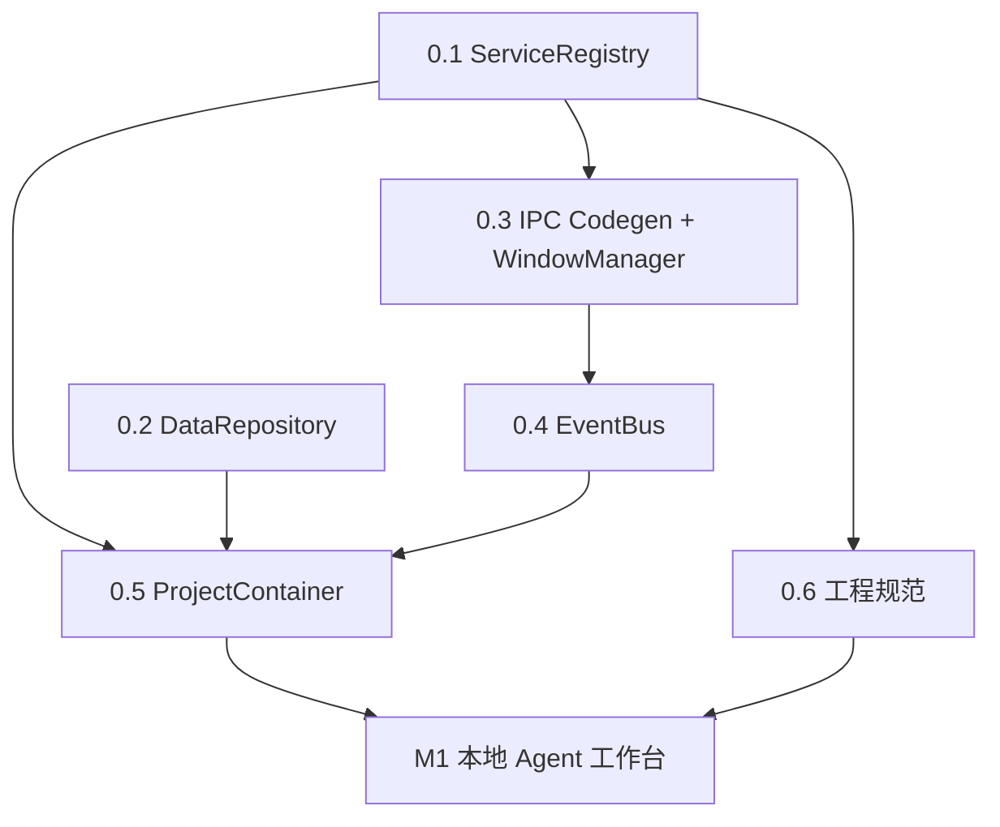

# 架构前置改造建议

> **Last-Updated**: 2026-04-25 / **Revision**: 2 / **Scope**: Phase 0 基础设施 + 3 年期扩展接口
>
> CC Connect 融合前的架构重构指南，后续代码迁移的唯一技术基准。Synapse 未上线、无历史包袱，允许一次大规模重构。
>
> **Revision 2 增量**（本次）：新增 §15 长期扩展性与性能蓝图（12 个扩展方向 + 25 个接口 + 首位消费者对齐表 + 明确不做清单）；各 Phase 增加"扩展预留"小节；硬约束新增 5 条；风险表新增 6 项。

## 0. 速读

M1 之前必须完成 5 项结构改造 + 1 项工程规范：

| Phase | 名称 | 解决什么 | 工作量 |
|---|---|---|---|
| 0.1 | ServiceRegistry | 模块级单例 + 手写启停顺序 | 2-3 天 |
| 0.2 | DataRepository | 三套并存存储 + 无加密/迁移/备份统一 | 3-4 天 |
| 0.3 | IPC 模块化 + Codegen + WindowManager | Channel 五处双写 | 4-5 天 |
| 0.4 | EventBus | 点对点推送，20+ 事件类型撑爆 channel | 2 天 |
| 0.5 | ProjectContainer | 单例塞不下 project-scoped 状态 | 2-3 天 |
| 0.6 | 工程规范 | 大规模迁移无统一地基 | 2 天 |

总工作量 **15-18 工程日**。不做：Zustand 全局改造、设计系统迁移、NestJS/tRPC。

**长期承诺**：本次重构显式为 **12 个长期扩展方向**预留接口（插件系统、多端口网络服务、多进程/headless、可观测性、权限审计、数据归档/FTS、任务队列/限流、模块间通信规则、配置分层、i18n/主题、前端代码分割、开发者工具），详见 **§15 长期扩展性与性能蓝图**。目标：这次大重构**完成后 3 年内不需要再做结构性调整**，新功能只在既有扩展点上叠加。

## 1. 自我审查

### 修正的遗漏

1. **preload sandbox** 不能运行时 `require`（`@/Users/liyang/Documents/code/github/Synapse/desktop/electron/preload.ts:5-8`），模块化只能用**构建时 codegen**。
2. **多窗口广播**：`contentWindowService` 已能开独立窗口，事件总线必须支持按 scope 过滤 + 多窗口路由。
3. **Synapse repository active vs CC project active**：两层独立，UI 上是两个独立切换器，不合并。
4. **测试、日志轮转、错误边界**：Agent 日志量大，必须轮转。合并进 Phase 0.6。
5. **safeStorage**：API key 加密用 Electron 原生 `safeStorage`（Keychain/DPAPI/keyring），不自造轮子。

### 关键取舍

- **不引入 DI 框架**（InversifyJS/tsyringe）：装饰器 + 反射和 Vite 工具链不和，自写 200 行 `ServiceRegistry` 足够。
- **不引入 tRPC**：现有 channel+typed bridge 良好，codegen 更贴合。
- **数据迁移只向前**：未上线阶段优先迁移可靠性。
- **日志不数据库化**：JSONL 按天轮转，避免与业务数据抢 SQLite lock。
- **不用 utility process**：`child_process.spawn` 跑 Agent CLI 足够，保留"未来引入"选项。
- **Phase 5+1**：WindowManager 合并进 0.3，日志/错误/测试合并为 0.6。

### 第三轮审查：长期扩展性盲点（本次补强）

再一次审视后发现以下**影响 3 年期演化**的盲点，需要在 Phase 0 就留接口：

1. **网络服务面扩张**：未来要开 Management API（HTTP）、Bridge WebSocket、Platform Webhook、OAuth callback、Prometheus metrics、gRPC 等多个端口。如果每个服务自己开端口 → 端口冲突、TLS 散落、认证不一致。必须在 Phase 0.3 引入 `NetworkServiceRegistry`。
2. **扩展点/插件系统**：新增 content type / editor adapter / platform connector / provider / hook type / UI panel 都应该通过统一 `ExtensionPoint` 注册。当前各处硬编码枚举会阻塞未来插件系统。
3. **多进程/headless 模式**：Agent runtime 重、cron 需要"关窗口仍运行"、未来可能有 CLI-only 模式。`ProjectContainer` 需要支持 `ProcessRuntime` 抽象。
4. **任务队列 + 限流**：并发 Agent 会话、平台 rate limit、cron 同时触发、外部 API 熔断，都需要 `TaskQueue` / `RateLimiter` / `CircuitBreaker` 基础设施。
5. **可观测性不只是日志**：Metrics、Tracing、HealthCheck、诊断快照 4 件套需要在 Phase 0.6 立规范。
6. **权限与审计**：敏感操作（shell、file write、外部网络、插件加载）必须统一走 `PermissionGuard` + `AuditSink`。
7. **数据规模压力**：会话百万级消息、FTS 搜索、自动归档、vacuum 维护，Phase 0.2 需预留钩子。
8. **模块间通信规则**：`modules/*` 之间绝对不能直接 import 彼此实现，必须通过 `ServiceRegistry.get` 或 `EventBus`。这条约束要成为硬约束。
9. **配置分层**：默认 < 全局 < 仓库 < 项目 < 会话，`DataRepository.core.config` 要支持层叠覆盖。
10. **版本与兼容性**：App 版本、数据 schema 版本、IPC 协议版本、扩展 API 版本需要统一管理。
11. **前端代码分割**：未来 tab 数量扩大到 10+，路由级 `React.lazy` 必须从 Phase 0.6 开始引入习惯。
12. **开发者工具**：`DebugPanel`（运行时查看 registry / container / eventbus 状态）、IPC logger、event replay 是规模化协作必备。

**这些盲点不增加 5+1 Phase 的数量**，而是在现有 Phase 内部加"扩展预留"小节 + 在文档末尾的 §15 系统化展开。

### 硬约束

所有后续 PR 必须遵守：

- 禁止 `export default new XxxService()` 形式全局单例 → 必须经 ServiceRegistry。
- 禁止裸 `ipcMain.handle` → 必须通过 IpcRegistry。
- 禁止裸 `webContents.send` → 必须通过 EventBus。
- 禁止裸 `fs.writeFile` 持久化业务数据 → 必须通过 DataRepository。
- 禁止裸 `http.createServer` / `net.createServer` → 必须通过 NetworkServiceRegistry。
- 禁止 `modules/A` 直接 `import` `modules/B` 的实现 → 必须通过 ServiceRegistry 或 EventBus。
- 禁止 `fs.writeFile(config-like-path)` → 必须通过 DataRepository。
- 渲染层只允许 `window.synapse.*` 访问 Electron 能力。
- `runtime/*` 是基础设施，不依赖 `modules/*` 和业务代码。
- 所有敏感操作必须走 `PermissionGuard` + 记录 `AuditSink`。
- 所有新 content type / editor adapter / connector / provider / hook 必须通过 `ExtensionPoint` 注册。

## 2. 目标与非目标

### 目标

1. 主进程服务容器 + 生命周期。
2. IPC 模块化 + codegen。
3. 统一事件总线。
4. 统一数据仓库（加密/迁移/备份）。
5. 项目作用域容器。
6. 工程规范（日志/错误/测试/约束）。

### 非目标

- 不重写现有业务功能。
- 不引入新 UI 框架/状态管理/样式系统。
- 不迁移 CC Connect 业务代码（M1 以后）。
- 不做性能优化、国际化、主题系统。

## 3. Phase 依赖图与时间线



```text
Day 01-03   Phase 0.1
Day 04-07   Phase 0.2   (可与 0.3 并行)
Day 04-08   Phase 0.3
Day 09-10   Phase 0.4
Day 11-13   Phase 0.5
Day 14-15   Phase 0.6
Day 16-18   缓冲 + 回归
```

**里程碑**：5 Phase 完成后，`main.ts` 不超过 120 行，只负责 `whenReady` → 启动 ServiceRegistry → 创建主窗口 → `before-quit` 钩子。

## 4. Phase 0.1 ServiceRegistry 与生命周期

### 现状

`@/Users/liyang/Documents/code/github/Synapse/desktop/electron/main.ts:175-228` 手写启动顺序 + 散落 try/catch；`main.ts:255-259` 只清理 3 个服务，加到 20+ 个会频繁遗漏。

### 核心接口

```ts
// desktop/electron/runtime/service-registry/types.ts

export type ServiceCriticality = "fatal" | "degraded"

export interface ServiceContext {
  readonly logger: StructuredLogger
  readonly dataRepo: DataRepository
  readonly eventBus: EventBus
  readonly registry: ServiceRegistry
}

export interface ServiceDescriptor<Instance = unknown> {
  readonly id: string                      // "core.config" / "agent.runtime"
  readonly dependsOn?: readonly string[]
  readonly criticality: ServiceCriticality
  create(ctx: ServiceContext): Instance | Promise<Instance>
  start?(instance: Instance, ctx: ServiceContext): Promise<void> | void
  stop?(instance: Instance, ctx: ServiceContext, timeoutMs: number): Promise<void> | void
  reload?(instance: Instance, ctx: ServiceContext): Promise<void> | void
}

export interface ServiceRegistry {
  register<T>(d: ServiceDescriptor<T>): void
  startAll(): Promise<{ degraded: Array<{ id: string; error: Error }> }>
  stopAll(timeoutMs: number): Promise<void>
  get<T>(id: string): T
  reload(id: string): Promise<void>
  inspect(): ReadonlyArray<{
    id: string
    status: "pending" | "starting" | "running" | "stopped" | "failed"
    criticality: ServiceCriticality
    dependsOn: readonly string[]
    lastError?: Error
  }>
}
```

### 启停语义

- 启动：拓扑排序，dependsOn 先起。fatal 失败抛错中断，degraded 失败记录继续。
- 停止：启动反序。单 stop 超时 5000ms，总超时 15000ms（对齐 `main.ts:266-270`）。
- 热重载：只对声明 `reload` 的服务有效。
- 循环依赖：启动前检测，抛 `CircularDependencyError` 列出环。

### 文件结构

```text
desktop/electron/runtime/service-registry/
├── index.ts
├── types.ts
├── registry.ts
├── topo.ts
├── errors.ts
└── __tests__/
```

### 迁移步骤

**Step 1** 建框架 + 单测跑通。

**Step 2** 迁现有服务为 descriptor（保留现有单例内部实现，`create` 返回它们）：

| 现有 | id | criticality | dependsOn |
|---|---|---|---|
| `configStore.load()` | `core.config` | fatal | — |
| `initializeAppIcon()` | `core.app-icon` | degraded | — |
| `logStore` | `core.logging` | fatal | — |
| `initDataStore()` | `core.data-store` | degraded | `core.config` |
| `updateService.initialize()` | `core.update` | degraded | `core.config` |
| `repositoryStore.watchRepository(*)` | `repo.watch` | degraded | `core.config` |
| `repositoryMaintenanceService` | `repo.maintenance` | degraded | `repo.watch` |
| `createTray()` | `ui.tray` | degraded | `core.app-icon` |
| `pendingPushesService` | `repo.pending-pushes` | degraded | `core.data-store` |

**Step 3** 收敛 `main.ts`：

```ts
app.whenReady().then(async () => {
  const registry = buildServiceRegistry()
  await registry.startAll()
  createMainWindow(registry)
})
```

`before-quit` 换成 `await registry.stopAll(15000)`。

**Step 4** IPC handler 注册本 Phase 暂保留原样，但保证在 `core.*` 启动之后执行；Phase 0.3 完成后合并进各 service 的 `start`。

### 扩展预留

为长期扩展留的钩子，本 Phase 接口中显式体现：

```ts
// 扩展 ServiceContext（Phase 0.1 即留位）
export interface ServiceContext {
  readonly logger: StructuredLogger
  readonly dataRepo: DataRepository
  readonly eventBus: EventBus
  readonly registry: ServiceRegistry
  readonly metrics: MetricsRegistry          // Phase 0.6 实现，0.1 预留
  readonly tracer: Tracer                    // Phase 0.6 实现，0.1 预留
  readonly permissionGuard: PermissionGuard  // Phase 0.6 实现
  readonly processRuntime: ProcessRuntime    // 多进程抽象，§15 展开
}

export interface ServiceDescriptor<Instance = unknown> {
  readonly id: string
  readonly dependsOn?: readonly string[]
  readonly criticality: ServiceCriticality
  /** 可选：声明此服务运行在哪个进程。默认 "main" */
  readonly runIn?: "main" | "utility" | "worker"
  create(ctx: ServiceContext): Instance | Promise<Instance>
  start?(instance: Instance, ctx: ServiceContext): Promise<void> | void
  stop?(instance: Instance, ctx: ServiceContext, timeoutMs: number): Promise<void> | void
  reload?(instance: Instance, ctx: ServiceContext): Promise<void> | void
  /** 可选：服务健康检查，由 Phase 0.6 HealthCheck 汇总 */
  checkHealth?(instance: Instance): Promise<HealthStatus>
}
```

未来新服务（无论是 Agent runtime、插件宿主、headless 后台）都按这套契约注册，不需要再改 ServiceRegistry 本身。

### 验证

- 单测：拓扑、fatal 中断、degraded 收集、timeout、循环检测。
- 集成：启动 inspect 全 running，关闭 15s 内全 stopped。
- 回归：现有功能不变。

## 5. Phase 0.2 统一数据仓库

### 现状

- `configStore` → `userData/config.json` 未加密/无版本号。
- `data-store` → SQLite 独立生态（MCP），不服务业务数据。
- `exportBackup/importBackup` 只覆盖部分。
- 零加密路径：API key / credentials / webhook secret 无处安放。

### Namespace 策略

| Namespace | 后端 | 加密 | 量级 | 用途 |
|---|---|---|---|---|
| `core.config` | Json | 否 | 小 | 应用配置 |
| `core.identity` | Json | 否 | 小 | 用户身份 |
| `secrets` | EncryptedJson | **是** | 小 | API key/token/secret |
| `providers` | Json | `secretRef` | 小 | Provider 定义 |
| `projects` | Json | 否 | 小 | CC Project/Workspace |
| `connectors` | Json | 部分 | 小 | Connector 定义 |
| `scheduler` | Json | 否 | 小 | Cron/Heartbeat |
| `hooks` | Json | 否 | 小 | Hook 规则 |
| `conversations` | Sqlite | 否 | **大** | 会话/消息/事件 |
| `audit` | JsonLines | 否 | **大** | 审计追加 |
| `outbox` | Sqlite | 否 | 中 | 出站队列 |
| `business-db` | 直通现有 data-store | 否 | 中 | 用户业务表 |

**原则**：敏感字段只落 `secrets`，其他 namespace 只存 `secretRef: string`。

### 核心接口

```ts
// desktop/electron/runtime/data-repo/types.ts

export interface DataRepository {
  namespace<T>(name: string): DataNamespace<T>
  exportAll(options?: { includeSecrets?: boolean }): Promise<BackupPayload>
  importAll(payload: BackupPayload, options?: { merge?: boolean }): Promise<void>
  inspect(): ReadonlyArray<{ namespace: string; backend: string; schemaVersion: number; rowCount?: number }>
}

export interface DataNamespace<T> {
  readonly name: string
  getSingleton(): Promise<T | null>
  setSingleton(value: T): Promise<void>
  list(filter?: Partial<T>): Promise<T[]>
  get(id: string): Promise<T | null>
  upsert(item: T & { id: string }): Promise<void>
  remove(id: string): Promise<void>
  onChange(listener: (change: DataChangeEvent<T>) => void): () => void
}

export interface BackupPayload {
  format: "synapse-backup-v1"
  exportedAt: string
  namespaces: Array<{
    name: string
    schemaVersion: number
    encrypted: boolean
    data: unknown | string        // string = 未解密的加密段
  }>
}

export interface Migration<From, To> {
  readonly from: number
  readonly to: number
  migrate(data: From): To | Promise<To>
}

export interface NamespaceSchema<T> {
  readonly name: string
  readonly backend: "json" | "encrypted-json" | "sqlite" | "jsonl"
  readonly currentVersion: number
  readonly migrations: readonly Migration<unknown, unknown>[]
  readonly validate: (data: unknown) => data is T
}
```

### 加密实现

```ts
// desktop/electron/runtime/data-repo/backends/encrypted-json.ts

import { safeStorage } from "electron"

export class EncryptedJsonBackend implements DataBackend {
  async read(filePath: string): Promise<unknown> {
    if (!safeStorage.isEncryptionAvailable()) {
      throw new EncryptionUnavailableError()
    }
    const cipher = await fs.readFile(filePath)
    return JSON.parse(safeStorage.decryptString(cipher))
  }
  async write(filePath: string, value: unknown): Promise<void> {
    const cipher = safeStorage.encryptString(JSON.stringify(value))
    await writeAtomic(filePath, cipher)
  }
}
```

- macOS: Keychain（entry 名 `Synapse Safe Storage`）
- Windows: DPAPI
- Linux: kwallet/Gnome Keyring；**无 keyring 时不降级成明文**，抛 `EncryptionUnavailableError`，UI 提示配置密钥环。

### 迁移执行

- namespace 首次 `get` 时读 version tag，落后则按顺序执行链。
- 先写临时文件 → validate 通过 → 原子替换。
- 失败保留原文件 + 写 `.migration-error` 诊断。
- 迁移函数必须幂等。
- 只向前迁移，不支持回退。

### 文件结构

```text
desktop/electron/runtime/data-repo/
├── index.ts
├── types.ts
├── repository.ts
├── namespace.ts
├── migrations.ts
├── errors.ts
├── backends/
│   ├── json.ts
│   ├── encrypted-json.ts
│   ├── sqlite.ts
│   └── jsonl.ts
├── schemas/
│   ├── core-config.ts
│   ├── core-identity.ts
│   ├── secrets.ts
│   ├── providers.ts           # M1 用，本 Phase 预留
│   ├── projects.ts
│   └── ...
└── __tests__/
```

### 迁移步骤

**Step 1** 框架 + JSON/JSONL/Encrypted backend + 单测。

**Step 2** 迁 `core.config`。`configStore` 改为薄封装调 `dataRepo.namespace("core.config")`。为老 `config.json` 写 `v0→v1` 迁移（加顶层 `schemaVersion: 1`）。

**Step 3** 迁 `core.identity`、`repo.pending-pushes`、`repo.repositories`，每个带迁移测试。

**Step 4** 预留 `secrets` + `providers` 的 schema，不接数据。

**Step 5** 集成 SqliteBackend 包装现有 data-store。对外 API 不变，MCP 仍然直接 better-sqlite3。

**Step 6** 重写 `@/Users/liyang/Documents/code/github/Synapse/desktop/electron/services/config-backup-service.ts` → 调 `dataRepo.exportAll/importAll`，IPC 通道不变。

### 扩展预留（长期）

**配置分层**：`core.config` namespace 支持多层覆盖（实现在 M1 之后补）：

```ts
export interface LayeredConfig<T> {
  readonly defaults: T                // 代码内置默认
  resolveFor(scope: {
    repositoryId?: string
    projectId?: string
    sessionId?: string
  }): Promise<T>                       // 按 scope 解析后的有效配置
  setAt(scope: ConfigScope, patch: Partial<T>): Promise<void>
  watchResolved(scope, listener): () => void
}
```

覆盖优先级：`default < global < repository < project < session`。

**数据规模预留**：

- **索引规范**：每个 `SqliteBackend` namespace 必须声明索引（`idx_messages_session_created_at` 等），随 migration 一起建。
- **全文搜索**：`conversations` namespace 预留 `FTS5` virtual table hook，M2 时启用。
- **自动归档**：注册 `core.data-maintenance` service（Phase 0.1 的 degraded service），每日凌晨 vacuum + 归档 N 天前数据到 `archive/<yyyy-mm>.sqlite`。
- **冷热分离**：`DataNamespace.list()` 默认只查热库，显式 `includeArchive: true` 才跨归档。
- **数据规模监控**：MetricsRegistry 定期 emit `data_repo.row_count{namespace}`、`data_repo.file_size{namespace}`。

**备份策略抽象**：

```ts
export interface BackupStrategy {
  readonly id: string                   // "local-zip" / "s3" / "icloud"
  readonly displayName: string
  snapshot(payload: BackupPayload): Promise<BackupArtifact>
  restore(artifact: BackupArtifact): Promise<BackupPayload>
  list(): Promise<BackupArtifact[]>
}

export interface BackupRegistry {
  register(strategy: BackupStrategy): void
  list(): readonly BackupStrategy[]
}
```

默认注册 `local-zip`。未来可插入 `s3` / `icloud` 等云备份实现，不需要改 DataRepository。

**导入/导出互操作**：

```ts
export interface NamespaceExporter<T> {
  readonly namespace: string
  readonly format: "json" | "csv" | "markdown" | "sqlite"
  export(items: T[]): Promise<Uint8Array | string>
}

export interface ExporterRegistry {
  register<T>(exporter: NamespaceExporter<T>): void
  exportAs(namespace: string, format: string): Promise<Blob>
}
```

用户未来可以把会话导出成 Markdown、把数据表导出成 CSV，无需改核心。

### 验证

- 单测：各 backend、迁移链、加密失败、备份脱敏、合并导入。
- 集成：临时 userData 模拟 v0 config，启动后自动迁到 v1 无丢失。
- 回归：配置导出/导入 UI 不变。

## 6. Phase 0.3 IPC 模块化 + Codegen + WindowManager

### 现状（五处双写）

1. `@/Users/liyang/Documents/code/github/Synapse/desktop/electron/ipc/channels.ts:3-88` canonical table。
2. `@/Users/liyang/Documents/code/github/Synapse/desktop/electron/preload.ts:8-126` 手工复制 channel 字符串。
3. `@/Users/liyang/Documents/code/github/Synapse/desktop/electron/preload.ts:140-290` 手工绑定 bridge 方法。
4. `@/Users/liyang/Documents/code/github/Synapse/desktop/src/types/bridge.ts` 10KB 类型。
5. 12 个 handler 文件手工 `handleValidatedIpc(channel, handler)`。

preload sandbox 不能 require，现状靠 `satisfies` 编译期兜底。窗口管理散落在 `main.ts` / `content-window-service.ts` / 多处 `BrowserWindow.getAllWindows()`。

### 模块描述

```ts
// desktop/electron/runtime/ipc/types.ts

export interface IpcMethodDescriptor<Req = unknown, Res = unknown> {
  readonly kind: "invoke" | "send"
  readonly channel: string
  readonly request: ZodSchema<Req>
  readonly response?: ZodSchema<Res>
  readonly handler: (ctx: IpcHandlerContext, req: Req) => Promise<Res> | Res
}

export interface IpcEventDescriptor<Payload = unknown> {
  readonly kind: "event"
  readonly channel: string
  readonly payload: ZodSchema<Payload>
  // 触发走 EventBus，此处仅为 codegen 生成订阅
}

export interface IpcModule {
  readonly id: string
  readonly methods: Readonly<Record<string, IpcMethodDescriptor>>
  readonly events: Readonly<Record<string, IpcEventDescriptor>>
}

export interface IpcRegistry {
  register(module: IpcModule, handlerCtx: IpcHandlerContext): () => void
}
```

**示例**：

```ts
// desktop/electron/modules/content/ipc.ts

import { z } from "zod"

export const contentIpcModule: IpcModule = {
  id: "content",
  methods: {
    list: {
      kind: "invoke",
      channel: "synapse:content:list",
      request: z.object({ contentType: z.enum(["rule", "skill", "prompt"]) }),
      response: z.array(contentSummarySchema),
      handler: async (ctx, req) =>
        ctx.services.get<ContentService>("content.service").list(req.contentType),
    },
  },
  events: {
    updated: {
      kind: "event",
      channel: "synapse:content:updated",
      payload: contentUpdatedEventSchema,
    },
  },
}
```

### 构建时 Codegen

`scripts/generate-ipc.ts`：

输入：`desktop/electron/modules/*/ipc.ts`

输出：

```text
desktop/electron/generated/
├── channels.ts
├── preload.generated.ts
└── bridge-types.generated.ts

desktop/src/generated/
└── electron-bridge-client.ts
```

**为什么 codegen**：preload sandbox 不能 require；codegen 保持 preload 为扁平函数字面量，绕过限制同时消除手工同步。

**触发**：
- Dev: vite plugin 监听 `modules/*/ipc.ts` 变更自动重生成。
- Build: `pnpm build` 前 `pnpm generate:ipc` prebuild。
- CI: generated 与源描述 diff 则报错。

**提交 git**：是。方便 PR 评审 + clone 可直接跑 + CI 比对闸门。

### WindowManager

```ts
// desktop/electron/runtime/window/manager.ts

export interface WindowDescriptor {
  readonly id: string
  readonly role: "main" | "detail" | "overlay"
  readonly create: (ctx: WindowContext) => BrowserWindow
  readonly shouldReuse?: (existing: BrowserWindow, openRequest: unknown) => boolean
}

export interface WindowManager {
  register(d: WindowDescriptor): void
  open(id: string, payload?: unknown): BrowserWindow
  broadcast(channel: string, payload: unknown, filter?: (win: BrowserWindow) => boolean): void
  close(id: string): void
  list(): ReadonlyArray<{ id: string; role: string; webContentsId: number }>
}
```

EventBus 广播调 `WindowManager.broadcast`。业务代码不再直接 `BrowserWindow.getAllWindows()`。

### 文件结构

```text
desktop/electron/runtime/ipc/
├── types.ts
├── registry.ts
├── validation.ts           # 从 validated-ipc.ts 迁移 + zod
├── errors.ts
└── __tests__/

desktop/electron/runtime/window/
├── manager.ts
└── __tests__/

desktop/electron/modules/    # 新目录，按 feature 组织
├── content/{index,ipc,service}.ts + __tests__/
├── repository/
├── config/
├── identity/
├── editor-scan/
├── update/
├── logging/
├── data-store/
└── ...

desktop/electron/generated/  # codegen 产物，提交 git
desktop/src/generated/
scripts/generate-ipc.ts
```

### 迁移步骤

**Step 1** 建 `runtime/ipc` + 引入 `zod`。

**Step 2** 写 codegen，先覆盖 invoke + event。

**Step 3** 按简单到复杂逐模块迁移：
1. `shell` → 2. `cli` → 3. `identity` → 4. `user-profile` → 5. `log` → 6. `update` → 7. `editor-scan` → 8. `editor` → 9. `config` → 10. `repository` → 11. `content`（最复杂）→ 12. `data-store`（包一层 IpcModule）

每迁一个：建 `modules/<id>/ipc.ts` → 旧 `ipc/<id>-handlers.ts` 标 deprecated → `channels.ts` 对应块删 → `pnpm generate:ipc` 比对 → service `start` 里 `ipcRegistry.register(module)` → e2e。

**Step 4** 全部迁完删旧：
- `ipc/channels.ts`（generated 替代）
- `ipc/*-handlers.ts`
- `types/bridge.ts`（generated 替代）
- `preload.ts` 改为 `export * from "../generated/preload.generated"`
- `electron-bridge.ts` 改为导入 generated client

**Step 5** 迁窗口管理：
- `createMainWindow` → `WindowManager.open("main")`
- `contentWindowService.openDetailWindow` → `WindowManager.open("content-detail", payload)`
- 删 `services/content-window-service.ts`
- 所有 `BrowserWindow.getAllWindows()` → `WindowManager.broadcast`

### 扩展预留（长期）

#### NetworkServiceRegistry：统一管理所有对外端口

未来场景：MCP server HTTP、Management API、Bridge WebSocket、Platform Webhook、OAuth callback、Prometheus metrics、remote debug、手机 App 反向控制——都会开端口。本 Phase 引入注册器雏形：

```ts
// desktop/electron/runtime/network/types.ts

export interface NetworkServiceDescriptor {
  readonly id: string                   // "mcp-http" / "management-api" / "bridge-ws"
  readonly role: "http" | "websocket" | "tcp" | "grpc"
  readonly preferredPort?: number       // 建议端口，冲突时自动选下一个可用
  readonly bindAddress?: string         // "127.0.0.1" (默认) | "0.0.0.0" | specific iface
  readonly tls?: TlsConfig              // 可选 TLS
  readonly auth?: AuthStrategy          // "none" | "bearer" | "mtls" | "local-token"
  readonly handler: NetworkRequestHandler
  readonly onPortAssigned?: (port: number) => void
}

export interface NetworkServiceRegistry {
  register(d: NetworkServiceDescriptor): Promise<{ port: number; bindAddress: string }>
  unregister(id: string): Promise<void>
  list(): ReadonlyArray<{ id: string; port: number; role: string; bindAddress: string }>
  /** 端口冲突时的策略：fail | next-available | ask-user */
  readonly conflictPolicy: PortConflictPolicy
}
```

**核心价值**：

- **端口冲突自动处理**（`next-available` 算法扫描可用端口）。
- **默认绑 `127.0.0.1`**：除非显式 `0.0.0.0`，防止意外暴露。
- **统一认证**：`auth: "local-token"` 自动生成并写入 `DataRepository.secrets`，renderer 端自动注入 header。
- **统一 TLS**：CA 自签证书一次生成，多服务共享。
- **统一审计**：所有对外请求自动记录 `AuditSink`。
- **防火墙感知**：mac/Win 首次绑定非 loopback 端口时，OS 会弹防火墙提示，我们要在 UI 层面提前告知用户。

**本 Phase 工作量**：只搭骨架 + 单测，不接任何实际服务。现有 MCP HTTP server 在 M2 之前保持原样，M2 时迁入。

#### IPC 协议版本

```ts
// desktop/electron/generated/channels.ts
export const IPC_PROTOCOL_VERSION = 1
```

每次破坏性修改 IPC schema 时 `+1`。renderer 启动时第一次握手校验：

```ts
await window.synapse.system.handshake({ clientVersion: IPC_PROTOCOL_VERSION })
// 主进程若版本不匹配返回 { ok: false, serverVersion: 2 } → renderer 提示刷新或升级
```

这个机制对未来**扩展/插件**尤其重要：扩展声明"我需要 IPC_PROTOCOL_VERSION >= N"，不兼容则拒绝加载。

#### 窗口多元化

`WindowManager` 设计已经支持多角色。未来新增：

- **session window**（CC 会话独立开窗）：`role: "detail"`, 复用已有机制。
- **overlay window**（全局快捷键触发的 quick prompt）：`role: "overlay"`, 无边框置顶。
- **command palette**（类 VSCode Ctrl+Shift+P）：`role: "overlay"`。
- **headless 模式**：不创建任何 BrowserWindow，但 WindowManager 的其他能力（broadcast）会降级为 no-op。

所有新窗口通过 `WindowManager.register` 注册，无需改核心。

### 验证

- 单测：zod 校验生效，无效请求返结构化错误。
- Codegen 测试：mock 模块 → 生成 AST 与预期一致。
- 集成：DevTools 调 `window.synapse.content.list(...)` 返回正确数据。
- NetworkServiceRegistry 单测：端口冲突自动选下一个、auth token 生成、conflict policy 生效。
- CI 闸门：generated 与源一致性比对。

## 7. Phase 0.4 统一事件总线

### 现状

- 主进程事件靠散落 callback（`main.ts:230-234`）。
- 推送靠 handler 自拿 sender（`content-handlers.ts:36-40`）。
- 每种事件一个 channel：现 5 个，CC `core.Event` 20+ 类型会爆。

### 设计

```ts
// desktop/electron/runtime/event-bus/types.ts

export type EventDomain =
  | "repository" | "content" | "update" | "data-store"
  | "agent"        // M1
  | "connector"    // M3
  | "scheduler"    // M4

export interface DomainEvent<D extends EventDomain = EventDomain, T extends string = string, P = unknown> {
  readonly domain: D
  readonly type: T                  // "session.started" / "message.delta"
  readonly payload: P
  readonly timestamp: string
  readonly scope?: {
    projectId?: string
    sessionId?: string
  }
}

export interface EventBus {
  on<D extends EventDomain>(domain: D, listener: (event: DomainEvent<D>) => void): () => void
  onType<D extends EventDomain, T extends string>(
    domain: D, type: T,
    listener: (event: DomainEvent<D, T>) => void,
  ): () => void
  emit<D extends EventDomain>(event: DomainEvent<D>): void           // 广播 renderer
  emitInternal<D extends EventDomain>(event: DomainEvent<D>): void   // 仅主进程
}
```

**IPC 通道**：每 domain 一个（`synapse:events:repository` 等），payload 是 `DomainEvent` 整体。

### 多窗口路由

`emit` 流程：
1. 主进程内 listener。
2. `WindowManager.broadcast(channel, event, filter)`。
3. filter 默认所有窗口；`agent` domain 可按 scope 过滤。

### Renderer 客户端

```ts
// desktop/src/runtime/event-bus-client.ts（codegen）

export interface EventBusClient {
  on<D extends EventDomain>(domain: D, listener: (event: DomainEvent<D>) => void): () => void
  onScoped<D extends EventDomain>(
    domain: D,
    scope: { projectId?: string; sessionId?: string },
    listener: (event: DomainEvent<D>) => void,
  ): () => void
}
```

内部 `EventRouter`：每 domain 订阅 IPC 一次，listener 注册只在 router 加 callback。

### 事件不做持久化

- 量大。
- "快照 + 增量"模式：快照从 `DataRepository`，增量从 `EventBus`。
- 窗口关了不用回放。
- **例外**：audit event 单独走 `DataRepository.audit` namespace。

### 文件结构

```text
desktop/electron/runtime/event-bus/
├── types.ts
├── bus.ts
├── broadcaster.ts         # 对接 WindowManager
└── __tests__/

desktop/src/runtime/event-bus-client.ts
```

### 迁移步骤

**Step 1** 建 EventBus + 单测（subscribe/emit/跨 domain 隔离/listener 异常不影响其他/取消订阅后不回调）。

**Step 2** 迁 5 个现有事件：

| 旧 channel | 新 domain + type |
|---|---|
| `synapse:repository:updated` | `repository` + `updated` |
| `synapse:repository:progress` | `repository` + `progress` |
| `synapse:repository:pending-pushes-updated` | `repository` + `pending-pushes-updated` |
| `synapse:update:state-changed` | `update` + `state-changed` |
| `synapse:update:open-update-page` | `update` + `open-page` |
| `synapse:data-store:changed` | `data-store` + `changed` |

**未上线**，直接切换不兼容。

**Step 3** 删旧 `sendToRenderer` 辅助函数 + 旧 channel 定义。

### 扩展预留（长期）

#### 背压（Backpressure）

Agent 会话的 `message.delta` 可能每秒百次，renderer 慢订阅者会堆积。预留背压策略：

```ts
export interface EventBusEmitOptions {
  /** 慢订阅者处理策略。默认 "coalesce" */
  readonly backpressure?: "drop-oldest" | "drop-newest" | "coalesce" | "block"
  /** 合并窗口（ms），仅 coalesce 有效。默认 16（约 60fps） */
  readonly coalesceWindowMs?: number
  /** 订阅端队列上限。超过则按策略丢弃 */
  readonly maxQueueSize?: number
}

emit<D extends EventDomain>(event: DomainEvent<D>, options?: EventBusEmitOptions): void
```

Phase 0.4 先实现 `coalesce`（按 `domain+type+scope` key 合并 16ms 内的事件），其他策略作为 future hook。

#### 事件采样与回放（开发者工具）

```ts
export interface EventRecorder {
  startRecording(filter?: EventFilter): RecordingHandle
  stopRecording(handle: RecordingHandle): Promise<RecordingArtifact>
  replay(artifact: RecordingArtifact, speed: number): Promise<void>
}
```

仅开发模式启用。用于复现 bug、做演示、写测试 fixture。与 Phase 0.6 `DebugPanel` 集成。

#### 跨进程事件桥

未来有 utility process / headless daemon 时，EventBus 的 bus 层要能跨进程。接口预留：

```ts
export interface EventBusBridge {
  /** 把事件从 source bus 镜像到 target bus */
  bridge(source: EventBus, target: EventBus, filter?: EventFilter): () => void
}
```

本 Phase 不实现，但 `EventBus` 的内部 `emit` 实现不能假设"只有主进程订阅者"。

### 验证

- 单测：上述场景全覆盖；`coalesce` 合并正确；慢订阅者不阻塞快订阅者。
- 集成：两窗口，一个操作仓库另一个收到事件；`agent` scope 过滤只发匹配窗口。
- 回归：同步进度、更新状态、data-store 变更通知行为不变。

## 8. Phase 0.5 项目作用域容器

### 背景

CC Connect 要求 project-scoped engine。每个 project 持有独立 Provider 绑定、Agent runtime、session map、workspace binding、权限策略、cron/heartbeat/hook。

### 现状问题

现有服务全是模块级单例。"单例 + `Map<projectId, State>`"硬塞会频繁跨 project 状态泄漏。

### 容器契约

```ts
// desktop/electron/runtime/project-container/types.ts

export interface ProjectContext {
  readonly projectId: string
  readonly projectMeta: ProjectMetadata
  readonly logger: StructuredLogger            // 带 projectId 前缀
  readonly dataRepo: ProjectScopedDataRepo     // 自动前缀 project ID 的 namespace
  readonly eventBus: ScopedEventBus            // emit 时自动填充 scope.projectId
  readonly globalRegistry: ServiceRegistry     // 只读访问全局服务
}

export interface ProjectScopedService<Instance = unknown> {
  readonly id: string
  readonly dependsOn?: readonly string[]
  create(ctx: ProjectContext): Instance | Promise<Instance>
  start?(instance: Instance, ctx: ProjectContext): Promise<void> | void
  stop?(instance: Instance, ctx: ProjectContext): Promise<void> | void
}

export interface ProjectContainer {
  readonly projectId: string
  get<T>(id: string): T
  inspect(): ReadonlyArray<{ id: string; status: string }>
  dispose(): Promise<void>
}

export interface ProjectContainerRegistry {
  open(projectId: string): Promise<ProjectContainer>
  close(projectId: string): Promise<void>
  list(): ReadonlyArray<{ projectId: string; openedAt: string }>
  registerService(service: ProjectScopedService): void
}
```

### 与 ServiceRegistry 的关系

- 全局服务（configStore、updateService、repositoryStore）在全局 ServiceRegistry。
- Project-scoped 服务（Agent runtime、session manager、connector binding、cron scheduler）在 `ProjectContainerRegistry.registerService` 注册模板。
- `open(projectId)` 按模板创建实例、拓扑启动。
- `close(projectId)` 反序 dispose。
- 容器间完全隔离：project A 的 Agent runtime 拿不到 project B 的 session。

### 生命周期

```text
切换到 project X
  -> renderer 调 synapse.projects.activate(X)
  -> ProjectContainerRegistry.open(X)
    -> 加载 metadata
    -> 创建所有 scoped service
    -> 拓扑启动
  -> EventBus emit { domain: "project", type: "activated", scope: { projectId: X } }

关闭 project X
  -> ProjectContainerRegistry.close(X)
    -> 反序 stop
    -> 清理资源（kill 子进程、close WebSocket）
```

**空闲回收**（对齐 CC idle reaper）：注册 `idle-reaper` 全局服务，周期检查打开的 project，N 分钟无活跃会话则自动 close。

### Renderer active project 与 active repository 并存

```ts
// desktop/src/app-shell/active-project.tsx（独立于 active-repository-switch）

export function useActiveProject(): ProjectMetadata | null
export function useActiveProjectActions(): {
  activate: (projectId: string) => Promise<void>
  close: (projectId: string) => Promise<void>
}
```

UI：顶部仓库切换器不变，新增项目切换按钮（仅在会话/项目/连接/自动化 4 个 tab 可见）。

### 文件结构

```text
desktop/electron/runtime/project-container/
├── index.ts
├── types.ts
├── registry.ts
├── container.ts
├── scoped-data-repo.ts
├── scoped-event-bus.ts
├── idle-reaper.ts
└── __tests__/

desktop/src/app-shell/
├── active-project.tsx
└── use-active-project.ts
```

### 迁移步骤

**Step 1** `ProjectContainerRegistry` 骨架 + 单测。

**Step 2** `ScopedEventBus` + `ProjectScopedDataRepo`：
- `ScopedEventBus.emit` 自动填 `scope.projectId`。
- `ProjectScopedDataRepo.namespace("foo")` 实际读写 `projects/<projectId>/foo` 子目录。

**Step 3** `idle-reaper` 全局服务，依赖 `ProjectContainerRegistry`。

**Step 4** Renderer 侧 `active-project.tsx`。

**Step 5** 本 Phase 不迁任何现有业务，只搭好容器。M1 的 Agent runtime 作为首个落地样例。

### 扩展预留（长期）

#### ProcessRuntime：多进程抽象

未来 Agent runtime、平台连接器、cron daemon 可能要独立进程。`ProjectScopedService.runIn` 字段对应背后有 `ProcessRuntime`：

```ts
// desktop/electron/runtime/process/types.ts

export type ProcessKind = "main" | "utility" | "worker" | "child"

export interface ProcessHandle {
  readonly kind: ProcessKind
  readonly pid?: number
  send<T>(channel: string, payload: T): Promise<void>
  on(channel: string, listener: (payload: unknown) => void): () => void
  kill(signal?: NodeJS.Signals): Promise<void>
  readonly status: "starting" | "running" | "stopped" | "crashed"
}

export interface ProcessRuntime {
  spawn(descriptor: ProcessDescriptor): Promise<ProcessHandle>
  list(): readonly ProcessHandle[]
  /** 进程崩溃时的重启策略 */
  readonly restartPolicy: "never" | "always" | "exponential-backoff"
}
```

本 Phase 只定义接口 + main process 直跑的 trivial 实现。M3 之后按需实现 `utility` / `worker`。

#### Headless 模式

长期目标：支持"无 UI 后台模式"，用于：

- CLI 子命令（`synapse agent run <task>`）
- 服务器模式（一台机器跑多个用户的 Agent daemon）
- 云同步节点

**预留机制**：

```ts
// desktop/electron/runtime/runtime-mode.ts

export type RuntimeMode = "gui" | "headless" | "cli"

export interface RuntimeContext {
  readonly mode: RuntimeMode
  readonly registry: ServiceRegistry
  readonly container: ProjectContainerRegistry
}

export function bootstrap(mode: RuntimeMode): Promise<RuntimeContext>
```

`bootstrap("gui")` = 现在的行为（Electron 主窗口）；`bootstrap("headless")` = 不创建 BrowserWindow，WindowManager 降级为 no-op，MCP server/Management API 继续运行。Phase 0.5 不实现 headless，但 `bootstrap` 接口设计好。

#### Project 粒度的资源配额

```ts
export interface ProjectQuota {
  readonly maxConcurrentSessions?: number
  readonly maxConnectorConnections?: number
  readonly maxMonthlyTokens?: number
  readonly diskQuotaBytes?: number
}

ProjectContainerRegistry.setQuota(projectId, quota)
```

用于未来多用户/多项目时的配额管理。M1 全部不设上限，但 API 存在。

### 验证

- 单测：open/close 幂等、跨 project 隔离、idle reaper 按时关闭、scope 正确注入。
- 集成：mock `echo.service`（scoped），两个 project 同时打开互不影响；close 后检查 listener count 无泄漏。
- ProcessRuntime：trivial 实现的 spawn/kill/status 正确。

## 9. Phase 0.6 工程规范与可观测性

不改结构，是约定与工具。

### 日志

**分级**：`trace` / `debug` / `info` / `warn` / `error` / `fatal`。

**结构化**：

```json
{
  "timestamp": "2026-04-25T10:30:00.000Z",
  "level": "info",
  "module": "agent.runtime",
  "message": "Session started",
  "context": { "projectId": "...", "sessionId": "..." }
}
```

**输出**：主日志 `userData/logs/synapse.log`，> 10MB 切分为 `synapse-YYYY-MM-DD-N.log`，保留 7 天。

**独立日志文件**：Agent/会话相关服务用 `userData/logs/agent-<date>.log`，避免淹没主日志。

**改造**：`@/Users/liyang/Documents/code/github/Synapse/desktop/electron/services/log-store.ts` 补：
- 按大小/按天切分
- 按 module 前缀分流
- log level 运行时配置（`DataRepository.core.config.logLevel`）
- Renderer log viewer 聚合多文件

### 错误处理

- **主进程未捕获**：`main.ts:97-103` 扩展为记录到 `crash.log`，连续 3 次 crash 进入安全模式（仅启动 core 服务）。
- **子进程崩溃**：Agent CLI / ffmpeg / STT 的 spawn 必须挂 `on('exit')`，异常退出通过 EventBus 发 `agent.process-died`。
- **用户友好错误**：所有 IPC 返给 renderer 的错误必须是 `{ code, message, details?, retriable }`，renderer 统一 toast/dialog。
- **禁止吞错**：`catch {}` 空块和 `catch (e) { /* ignore */ }` 不允许。要么处理、要么上抛、要么降级成 `logger.warn` + 显式注释。

### 测试范式

| 层级 | 工具 | 范围 |
|---|---|---|
| 单元 | Vitest | `runtime/*` 全部 + 各 module service 内部逻辑 |
| IPC 集成 | Vitest + electron-mock-ipc | IpcModule 端到端（mock main/renderer） |
| E2E | Playwright + electron | 关键流程（首次启动、切换仓库、创建内容、导入备份） |

**覆盖率目标**：`runtime/*` 80%+，业务代码 60%+。

**命令**：

```text
pnpm desktop:test         # 所有单测
pnpm desktop:test:ipc     # IPC 集成
pnpm desktop:test:e2e     # E2E
pnpm desktop:test:ci      # CI 串联
```

### CI 闸门

- Lint + typecheck 通过
- 单测 + IPC 集成全绿
- `pnpm generate:ipc` 无 diff
- E2E 关键流程通过
- 禁用 API 扫描（`grep` 检查 `ipcMain.handle` 只在 `runtime/ipc/` 出现）

### 代码约束更新 AGENTS.md

本 Phase 后更新 `AGENTS.md` 加入：

- 禁止 `export default new XxxService()` 形式单例
- 禁止裸 `ipcMain.handle/on`
- 禁止裸 `webContents.send`
- 禁止裸 `fs.writeFile` 持久化业务数据
- 禁止 `catch {}` 空块
- 渲染层只允许 `window.synapse.*`
- 新模块必须在 `desktop/electron/modules/<feature>/` 或 `desktop/src/modules/<feature>/`
- `runtime/*` 不依赖 `modules/*` 和业务代码

### 可观测性（Metrics / Tracing / HealthCheck / Diagnostics）

**MetricsRegistry**：OpenTelemetry 命名约定的轻量实现。

```ts
// desktop/electron/runtime/observability/metrics.ts

export interface MetricsRegistry {
  counter(name: string, labels?: Record<string, string>): Counter
  gauge(name: string, labels?: Record<string, string>): Gauge
  histogram(name: string, labels?: Record<string, string>, buckets?: number[]): Histogram
  /** Prometheus 格式导出，供 NetworkServiceRegistry 注册的 /metrics 端点消费 */
  toPrometheus(): string
  /** 内存中快照，供 DebugPanel 展示 */
  snapshot(): MetricsSnapshot
}
```

Phase 0.6 仅做主进程内存聚合 + DebugPanel 展示。M3/M4 时扩展为 Prometheus 暴露。

**Tracer**：最小 span 抽象。

```ts
export interface Tracer {
  startSpan(name: string, parent?: SpanContext): Span
}

export interface Span {
  setAttribute(key: string, value: unknown): void
  setStatus(status: "ok" | "error", message?: string): void
  addEvent(name: string, attrs?: Record<string, unknown>): void
  end(): void
}
```

跨服务调用链：ServiceRegistry 包装每个 service 方法时自动 `startSpan`。未来能串起 utility process、renderer 的 trace。

**HealthCheck 聚合**：

```ts
export interface HealthCheckAggregator {
  /** 汇总所有 service 的 checkHealth 结果 */
  checkAll(): Promise<OverallHealth>
  /** HTTP 健康端点，供 NetworkServiceRegistry 注册 */
  handler: NetworkRequestHandler
}

export interface OverallHealth {
  status: "healthy" | "degraded" | "unhealthy"
  components: Record<string, ComponentHealth>
  timestamp: string
}
```

**DiagnosticsSnapshot**：一键生成诊断包（zip）。

```ts
export interface DiagnosticsCollector {
  collect(): Promise<DiagnosticsArtifact>
  // 包含：
  //  - 最近 N 条日志
  //  - registry.inspect()
  //  - dataRepo.inspect()
  //  - metrics snapshot
  //  - 当前 project container 列表
  //  - 系统信息（OS / Node / Electron 版本）
  //  - 不含任何 secrets / message content
}
```

UI 上"设置 → 诊断 → 导出报告" 按钮触发。

### 权限与审计

**PermissionGuard**：所有敏感操作的统一闸门。

```ts
// desktop/electron/runtime/security/permission-guard.ts

export type PermissionAction =
  | "fs.write"
  | "fs.read.outside-userdata"
  | "shell.exec"
  | "network.connect"
  | "network.listen"
  | "extension.load"
  | "agent.spawn"
  | "secret.read"
  | "secret.write"

export interface PermissionRequest {
  readonly action: PermissionAction
  readonly actor: ActorIdentity        // "user" | "extension:xxx" | "agent:yyy"
  readonly resource: string
  readonly context: Record<string, unknown>
}

export interface PermissionGuard {
  check(request: PermissionRequest): Promise<PermissionResult>
  /** 注册策略 */
  registerPolicy(policy: PermissionPolicy): void
}

export interface PermissionPolicy {
  decide(request: PermissionRequest): "allow" | "deny" | "prompt" | "defer-to-next"
}
```

**默认策略**：user 发起的所有操作 `allow`；extension/agent 发起需要 `prompt` 或走显式 allow list。M1 时为 CC Connect 的 `runAs/allowFrom/shell gate` 提供实现基座。

**AuditSink**：独立的审计日志。

```ts
export interface AuditEvent {
  readonly action: PermissionAction
  readonly actor: ActorIdentity
  readonly resource: string
  readonly outcome: "allowed" | "denied" | "failed"
  readonly timestamp: string
  readonly metadata?: Record<string, unknown>
}

export interface AuditSink {
  record(event: AuditEvent): void
}
```

实现落在 `DataRepository.audit` namespace（JSONL backend），不可删除不可修改。UI 提供查看器，但不提供删除。

### 任务队列与限流

```ts
// desktop/electron/runtime/scheduling/task-queue.ts

export interface TaskQueue {
  enqueue<T>(job: Job<T>): Promise<T>
  readonly concurrency: number
  readonly pending: number
  readonly running: number
  pause(): void
  resume(): void
}

export interface Job<T> {
  readonly id: string
  readonly priority?: "low" | "normal" | "high"
  readonly timeout?: number
  readonly retry?: RetryPolicy
  run(signal: AbortSignal): Promise<T>
}

// 按资源 key 限流
export interface RateLimiter {
  acquire(key: string, cost?: number): Promise<void>
  configure(key: string, policy: { capacity: number; refillPerSecond: number }): void
}

// 熔断
export interface CircuitBreaker {
  execute<T>(key: string, fn: () => Promise<T>): Promise<T>
  readonly state: Record<string, "closed" | "open" | "half-open">
}
```

Phase 0.6 只落骨架 + 单测。CC Connect 的 Agent 并发、Provider rate limit、平台连接器、cron 调度都会在 M1/M3/M4 基于这三件套。

### 扩展点（Extension Points）

未来做插件系统的前置：

```ts
// desktop/electron/runtime/extension/types.ts

export interface ExtensionPoint<T> {
  readonly id: string                  // "content.types" / "editors" / "connectors" / "providers"
  register(contribution: T): () => void
  list(): readonly T[]
}

export interface ExtensionRegistry {
  definePoint<T>(id: string): ExtensionPoint<T>
  listPoints(): readonly string[]
}
```

**Phase 0.6 第一批扩展点**（把现有硬编码枚举迁到 ExtensionPoint）：

- `content.types`：现 `CONTENT_TYPE_DEFINITIONS`（rule/skill/prompt）。
- `editors`：现 editor adapters（Cursor/VSCode 等）。
- `editor-scan.providers`：现 editor-scan 各实现。

**未来扩展点**（M1+）：

- `agents`：Codex / Claude Code / Gemini / Qwen。
- `providers`：OpenAI / Anthropic / Azure / Bedrock / 自建。
- `platforms`：Feishu / Slack / Telegram / Discord / WeChat。
- `hooks`：pre-turn / post-turn / on-permission 等触发点。
- `ui.panels`：顶层 tab、侧边栏 panel、设置页分区。

**统一效果**：未来做插件系统时，只需给这些 ExtensionPoint 加一层 "from loaded plugin" 的来源标记，不用重构业务代码。

### i18n / 主题预留

不实现，但为未来预留：

```ts
// desktop/src/runtime/i18n.ts

export interface I18nProvider {
  t(key: string, params?: Record<string, unknown>): string
  readonly locale: string
  setLocale(locale: string): Promise<void>
}

// 硬约束：从 Phase 0.6 开始，所有用户可见文案通过 t() 取值
// 现有硬编码中文作为默认 locale 字典 zh-CN 的内容
```

**渐进迁移**：不立即抽所有文案，但新增文案必须走 `t()`。文案字典先只有 `zh-CN`，未来加 `en-US` 时补翻译即可。

主题类似：`ThemeProvider` 接口占位，实现暂复用 shadcn 的 `next-themes` 或自写。

### 前端代码分割与性能

**硬约束（Phase 0.6 开始生效）**：

- 顶层 tab 的模块根组件必须 `React.lazy`：`const ModuleRules = lazy(() => import("./modules/rules"))`。
- 每个模块内部 > 300 行的组件考虑二次拆分。
- 长列表（会话列表、消息列表、日志）必须用 `react-window` / `react-virtuoso`。
- Monaco / 大图表懒加载。
- 路由切换必须有 `Suspense fallback`。

**性能回归测试**（Phase 0.6 引入）：

```text
desktop/tests/perf/
├── app-startup.bench.ts       # 冷启动时间
├── tab-switch.bench.ts        # tab 切换时间
└── message-list.bench.ts      # 长列表滚动 FPS
```

CI 不阻塞，但历史趋势入 Grafana / Datadog（或本地 JSON 记录）。

### 开发者工具（DebugPanel）

开发模式（`process.env.NODE_ENV !== "production"`）下注入：

```ts
// desktop/src/runtime/debug-panel.tsx

// 访问方式：DevTools console 输 synapseDebug.open()
// 面板展示：
//   - ServiceRegistry.inspect()   表格
//   - ProjectContainerRegistry.list()
//   - DataRepository.inspect()
//   - MetricsRegistry.snapshot()
//   - EventBus 最近 N 事件流
//   - NetworkServiceRegistry.list()
//   - HealthCheckAggregator.checkAll()
```

本 Phase 只搭骨架（一个空壳 panel），各子模块上线时各自补充数据源。

### 模块间通信约束

`modules/*` 之间**禁止直接 import**。允许的通信方式：

1. 通过 `ServiceRegistry.get<T>(id)` 取其他模块暴露的 service 实例。
2. 通过 `EventBus.emit/on` 异步通信。
3. 共享类型从 `desktop/src/types/` 引入（只类型，不含实现）。

**ESLint 规则**（Phase 0.6 加入）：

```json
{
  "no-restricted-imports": ["error", {
    "patterns": [{
      "group": ["../../modules/*/service", "../../modules/*/internal"],
      "message": "禁止跨模块直接 import 实现，通过 ServiceRegistry 或 EventBus 通信"
    }]
  }]
}
```

### 文件结构

```text
desktop/electron/runtime/
├── logging/
│   ├── logger.ts
│   ├── rotator.ts
│   └── __tests__/
├── observability/
│   ├── metrics.ts
│   ├── tracer.ts
│   ├── health.ts
│   ├── diagnostics.ts
│   └── __tests__/
├── security/
│   ├── permission-guard.ts
│   ├── audit-sink.ts
│   └── __tests__/
├── scheduling/
│   ├── task-queue.ts
│   ├── rate-limiter.ts
│   ├── circuit-breaker.ts
│   └── __tests__/
├── extension/
│   ├── registry.ts
│   └── __tests__/
├── network/                    # Phase 0.3 引入
│   └── __tests__/
├── process/                    # Phase 0.5 引入
│   └── __tests__/
└── runtime-mode.ts             # Phase 0.5 引入

desktop/src/runtime/
├── debug-panel.tsx
├── i18n.ts
└── event-bus-client.ts

desktop/tests/
├── unit/
├── ipc/
├── perf/
├── fuzz/                       # 针对外部输入的混淆测试
└── e2e/

.github/workflows/ci.yml
```

## 10. 风险与备选方案

| 风险 | 后果 | 应对 |
|---|---|---|
| Codegen bug | IPC 全面失效 | 单测覆盖核心路径；CI 比对闸门；保留回滚 commit |
| safeStorage Linux 不可用 | 用户无法保存 API key | 抛 `EncryptionUnavailableError` + UI 指导配置 keyring；**不降级明文** |
| 迁移脚本失败 | 用户数据不可读 | 失败保留原文件 + 写 `.migration-error`；手工恢复指南写入文档 |
| 拓扑排序 bug | 服务启动顺序错 | 单测覆盖环检测；inspect 可视化依赖图 |
| 大量日志 I/O 压力 | 主进程卡顿 | 日志异步写 + 按 module 分流；轮转 |
| project 泄漏 listener | 内存涨 | 集成测试 listener count；每次 close 后断言归零 |
| 依赖升级破坏 codegen | 构建失败 | 锁死 zod/ts-morph 版本；CI 防呆 |
| 扩展点接口稳定性 | 未来插件 ABI 破坏 | 扩展点接口用 `readonly` + 版本号；破坏性改动走 semver major |
| NetworkServiceRegistry 端口扫描慢 | 启动卡 | 端口扫描异步；allocate 成功再通知 renderer |
| 权限 prompt 风暴 | 用户体验差 | PermissionGuard 支持"批量同意"+"remember choice for session" |
| Metrics 累计占内存 | 长时间运行 OOM | 环形缓冲 + 固定上限 + 周期 flush |
| 扩展方向过多执行稀释 | 每项半成品 | Phase 0 只搭接口 + 单测，实现放 M1+；§15 明确"接口 vs 实现"边界 |
| 长期接口预留过度工程 | 维护负担 | 每个接口有对应"现在的消费者"或"M1 确定消费者"，无消费者的抽象不入库 |

**备选方案**：

- **IPC 方案**：若 codegen 反复出 bug，退回"运行时 Proxy + 白名单 channel"（preload 定义固定方法前缀 `call(channel, ...args)`，renderer 用 Proxy 包装）。代价是失去类型推导。
- **加密方案**：若 safeStorage 在目标 Linux 发行版上不稳定，退回 `node-keytar`（已废弃但仍可用），或要求用户手工设置主密码（PBKDF2 + AES-GCM）。
- **数据存储**：若 better-sqlite3 编译问题严重，改用 LevelDB。

## 11. FAQ

**Q: 为什么不用 NestJS？**
A: 太重。NestJS 的装饰器 + 反射在 Vite 不友好，且带来大量运行时开销。我们只需要 200 行级的轻量 registry。

**Q: 为什么不用 tRPC？**
A: tRPC 假设 HTTP/WebSocket，适配 Electron IPC 要写适配层。现有模式 + codegen 更贴合且侵入小。

**Q: 为什么不把 Agent runtime 放 utility process？**
A: utility process 的 IPC 接口更受限，调试更难。`child_process.spawn` 跑 Agent CLI 已足够隔离。保留未来引入的可能性。

**Q: 为什么 generated 文件要提交 git？**
A: 评审 bridge 接口变化、clone 后直接可跑、CI 比对闸门。

**Q: 为什么 project-scoped 不用 worker_threads？**
A: Worker 无法共享 better-sqlite3 连接，跨 thread IPC 成本不低。project 隔离通过容器 + 子进程足够。

**Q: 为什么数据迁移只向前？**
A: 未上线阶段数据兼容价值低于迁移脚本可靠性。双向迁移意味着每次 schema 变更要写 2 倍代码 + 2 倍测试。如果用户真的需要回退版本，通过"导出 → 降版本 → 导入"手工流程解决。

**Q: EventBus 和 ServiceRegistry 的关系？**
A: EventBus 是全局 service（`core.event-bus`），在 Phase 0.4 实际实现。ServiceRegistry 启动时第一批就起 EventBus 实例，后续服务通过 `ctx.eventBus` 拿到它。

**Q: ProjectContainer 之间能不能共享资源？**
A: 原则不共享。但全局资源（Provider profile、系统配置、身份）在全局 registry，project container 通过 `ctx.globalRegistry` 只读访问。

**Q: 为什么把日志作为工程规范而非 Phase 0.1 的一部分？**
A: 日志的分级、轮转、结构化是约定问题，不是架构问题。Phase 0.1 只需要一个 `StructuredLogger` 接口占位，实现可以是现有 `log-store` 的直接适配；规范和工具在 Phase 0.6 统一落实。

## 12. 现状代码映射表

| 现状文件 | 去处 |
|---|---|
| `desktop/electron/main.ts` | 简化为 registry 启停钩子 |
| `desktop/electron/preload.ts` | 由 codegen 生成 |
| `desktop/electron/ipc/channels.ts` | 由 codegen 生成 |
| `desktop/electron/ipc/*-handlers.ts` | 各自拆进 `modules/<id>/ipc.ts` |
| `desktop/electron/ipc/validated-ipc.ts` | 并入 `runtime/ipc/validation.ts` |
| `desktop/electron/ipc/utils.ts` | 并入 `runtime/ipc/` 或删除 |
| `desktop/electron/services/config-store.ts` | 薄封装 + `core.config` namespace |
| `desktop/electron/services/log-store.ts` | 改造为 `runtime/logging` |
| `desktop/electron/services/config-backup-service.ts` | 并入 `DataRepository.exportAll/importAll` |
| `desktop/electron/services/content-window-service.ts` | 迁入 `runtime/window` |
| `desktop/electron/services/tray-service.ts` | 注册为 `ui.tray` service |
| `desktop/electron/services/update-service.ts` | 注册为 `core.update` service |
| `desktop/electron/services/repository-*.ts` | 合并进 `modules/repository/` |
| `desktop/electron/services/content-*.ts` | 合并进 `modules/content/` |
| `desktop/electron/services/editor-*.ts` | 合并进 `modules/editor/` / `modules/editor-scan/` |
| `desktop/electron/services/*-pool-service.ts` / 辅助 | 保留或拆到对应 module |
| `desktop/electron/data-store/` | 保留 + 包装一层 `DataRepository.business-db` |
| `desktop/src/types/bridge.ts` | 由 codegen 生成 |
| `desktop/src/lib/electron-bridge.ts` | 改为导入 generated client |
| `desktop/src/app-shell/*` | 不动 |
| `desktop/src/modules/*` | 不动 |
| `desktop/src/App.tsx` | 不动（顶层 tab 加法在 M1 时做） |

## 13. 迁移 Checklist 模板

每个 Phase 结束必须通过以下清单：

**代码质量**：

- [ ] 新增代码有对应单测，覆盖率 ≥ 80%
- [ ] 现有功能的 e2e 流程无行为变化
- [ ] 相关文档已更新（本文档 + `AGENTS.md` 如涉及约束）
- [ ] `pnpm desktop:test:ci` 通过
- [ ] `pnpm generate:ipc` 无 diff
- [ ] 如改动数据格式，已写迁移 + 迁移测试
- [ ] 如改动 IPC schema，generated 文件已提交

**架构约束**：

- [ ] 没有新增未被 registry 管理的全局单例
- [ ] 没有新增裸 `ipcMain.handle` / `webContents.send` / `fs.writeFile`
- [ ] 没有新增裸 `http.createServer` / `net.createServer`（必须走 NetworkServiceRegistry）
- [ ] 没有 `modules/*` 之间的直接 import
- [ ] 没有新增 `catch {}` 空块
- [ ] 新增敏感操作已走 PermissionGuard + AuditSink

**长期扩展性**：

- [ ] 新增对外网络端口已注册到 NetworkServiceRegistry
- [ ] 新增硬编码枚举类（如 content type）已通过 ExtensionPoint 注册
- [ ] 新增用户可见文案走 `t()`
- [ ] 新增顶层路由组件已 `React.lazy`
- [ ] 新增 SqliteBackend namespace 已声明索引
- [ ] 新增长耗时操作已通过 TaskQueue 或声明 rate limit
- [ ] 新增 service 已实现 `checkHealth()`（如适用）
- [ ] 新增 metrics 遵循 `synapse_*` 命名约定

## 14. 开工前最后检查

- [ ] 确认团队理解"未上线无历史包袱"的重构自由度
- [ ] 确认 15-18 工程日预算可用
- [ ] 确认 `zod`、`better-sqlite3`（已有）、`playwright`、`electron-mock-ipc` 依赖可接受
- [ ] 确认 CI 运行时间增量可接受（预估 +5min）
- [ ] 确认 generated 文件入 git 政策
- [ ] 创建架构重构 feature branch（建议 `feat/phase-0/architecture-foundation`）
- [ ] 每个 Phase 一个 PR，逐个评审
- [ ] **确认 §15 的 12 个长期扩展方向由 Phase 0 的接口覆盖**
- [ ] **确认 AGENTS.md 会同步更新以固化硬约束**

## 15. 长期扩展性与性能蓝图

本节系统化展开 **未来 1-3 年可能遇到的扩展诉求**，以及 Phase 0 为其预留的接口位置。每项按 "需求场景 / 接口位置 / 实现时点 / 性能考量" 四段式说明。

**阅读本节的前提**：Phase 0 **不实现** 以下任何一项的完整业务功能，只保证**接口已存在且未来扩展时不需要改核心基础设施**。

### 15.1 插件/扩展系统

**需求**：允许第三方（或企业内部团队）为 Synapse 写扩展，贡献新的 content type、editor adapter、平台连接器、AI provider、Agent runtime、UI panel。

**接口位置**：Phase 0.6 `ExtensionRegistry` + `ExtensionPoint<T>`。

**实现时点**：M5 或之后（先让核心稳定、扩展点被官方代码验证过后再对外开放）。

**关键设计决策**（Phase 0 就要想清楚）：

- 扩展加载方式：动态 `import()` 第三方 npm 包、或读本地目录、或从远程 registry 下载。
- 扩展运行时隔离：VM / Worker / utility process，防止第三方代码污染主进程。候选方案：`vm2`（已废弃风险高）或 `Node worker_threads`。
- 扩展权限：每个扩展声明 `permissions: ["fs.read", "network.connect"]`，通过 `PermissionGuard` 强制。
- 扩展 API 版本：扩展 manifest 声明 `synapseApi: "^1.0.0"`，不兼容时拒绝加载。
- 扩展市场：先不做，`ExtensionPoint` 暴露的 contribution 纯本地文件。

**性能考量**：扩展加载必须懒，不影响冷启动；扩展代码运行时间超阈值自动熔断。

### 15.2 多端口网络服务

**需求**：
- **MCP HTTP server**（已有）：用户业务数据暴露给外部 AI 客户端。
- **Management API**（M2）：CC Connect 的 HTTP 控制面，供外部脚本/CI 调用。
- **Bridge WebSocket**（M3）：外部 adapter 接入。
- **Platform Webhook**（M3）：Feishu/Slack/Telegram webhook 回调。
- **OAuth callback**：平台 OAuth 认证回跳。
- **Prometheus metrics**（M4+）：`/metrics` 端点。
- **gRPC API**（长期）：企业集成。
- **Remote control**（未来）：手机 App 反向控制桌面。

**接口位置**：Phase 0.3 `NetworkServiceRegistry`。

**实现时点**：MCP HTTP 在 Phase 0 之后立即迁入；其他按 CC Connect 阶段演进。

**关键设计**：

- 所有端口**默认 127.0.0.1**。暴露到 0.0.0.0 必须用户显式授权 + `PermissionGuard` + UI 警告。
- 端口冲突：`preferredPort` 被占用则自动选下一个可用端口并通过 EventBus 通知 UI。
- 认证：本机调用用 `local-token`（首次生成，存 `secrets`，读取写 `userData/access-tokens/`）；跨机调用必须 mTLS 或 OAuth。
- 审计：所有非 loopback 请求自动 `AuditSink.record`。

**性能考量**：HTTP 服务用 `fastify`（比 express 快 3-5 倍），WebSocket 用 `ws`，统一挂在 `NetworkServiceRegistry` 的内置 dispatcher 上。

### 15.3 多进程 / Headless

**需求**：
- Agent runtime 独立进程，主进程崩溃不影响会话。
- 关闭窗口后后台继续运行 cron / connector。
- CLI 模式：`synapse agent run <task> --output json`。
- 服务器模式：无 GUI 跑 daemon。

**接口位置**：Phase 0.1 `ServiceDescriptor.runIn` + Phase 0.5 `ProcessRuntime` + Phase 0.5 `RuntimeMode`。

**实现时点**：
- `runIn: "main"` 从 Phase 0 可用（默认）。
- `runIn: "child"`（spawn 子进程）M1 Agent CLI 引入时实现。
- `runIn: "utility"` / `"worker"` M3+ 按需。
- Headless 模式 M4+。

**关键设计**：

- 进程间通信走 Electron 原生 IPC（main ↔ utility）或 Node `MessagePort`（main ↔ worker）。
- 跨进程 ServiceRegistry 镜像：子进程启动时 handshake 主进程拿 service list，本地做代理。
- 跨进程 EventBus：`EventBusBridge` 把事件在进程间镜像，订阅者无感。
- 崩溃重启：`ProcessRuntime.restartPolicy`，指数退避，连续失败 N 次降级为手动。
- Headless 启动器：`packages/cli/` 新增（本 Phase 不建，只留规划）。

**性能考量**：子进程启动开销大，只对"长生命周期"服务值得。短任务仍然留在主进程。

### 15.4 可观测性（Metrics / Tracing / Health）

**需求**：随着用户量/功能量增大，需要回答："当前慢在哪？""是哪个服务崩了？""昨天 3 点发生了什么？"

**接口位置**：Phase 0.6 `MetricsRegistry` / `Tracer` / `HealthCheckAggregator` / `DiagnosticsCollector`。

**实现时点**：
- Phase 0.6 内存聚合 + DebugPanel 可查。
- M3 添加 `/metrics` HTTP 端点（通过 `NetworkServiceRegistry`）。
- M4+ 接入 OpenTelemetry SDK（可选）上传到远端。

**关键 Metrics 命名约定**（建立规范，所有代码遵守）：

```text
# Counter
synapse_service_started_total{service=...}
synapse_ipc_request_total{module=...,method=...,status=...}
synapse_agent_session_started_total{agent=...,project=...}
synapse_connector_message_received_total{platform=...}

# Gauge
synapse_project_active_count
synapse_agent_session_active_count{project=...}
synapse_connector_connected{platform=...,connector_id=...}
synapse_data_repo_file_size_bytes{namespace=...}

# Histogram
synapse_ipc_request_duration_seconds{module=...,method=...}
synapse_agent_turn_duration_seconds{agent=...}
synapse_data_repo_query_duration_seconds{namespace=...,op=...}
```

### 15.5 安全与审计

**需求**：
- 敏感数据加密。
- 敏感操作可追溯。
- 扩展代码不能越权。
- 外部访问（Management API / Bridge）有认证。

**接口位置**：Phase 0.2 `secrets` namespace + safeStorage；Phase 0.6 `PermissionGuard` + `AuditSink`；Phase 0.3 `NetworkServiceRegistry.auth`。

**实现时点**：Phase 0 全部接口就绪；实际策略配置在 M1 引入 CC Connect 的 runAs/allowFrom 时接入。

**审计策略**：

- 所有 `PermissionGuard.check` 自动写 `AuditSink`。
- 所有外部网络请求（NetworkServiceRegistry 触发或 outbound fetch）自动记录。
- 所有 secret 读取（API key 使用）记录"谁在何时为何使用"。
- 审计日志 **append-only**，用户无法删除（但可导出、可查看）。

**安全硬编码原则**：

- 永远不要把 secret 写入普通日志。
- 永远不要把 secret 放进 EventBus payload。
- 日志输出经过 `redact(value)` 函数扫描 `/key|token|secret|password/i` 自动脱敏。

### 15.6 数据规模与性能

**需求**：重度用户 1 年累积 10万+ 会话、百万+ 消息、千万+ 事件。

**接口位置**：Phase 0.2 数据后端抽象 + 索引 + FTS + 归档。

**实现时点**：
- Phase 0.2 建立规范：所有 SqliteBackend namespace 必须有索引声明、必须参与归档注册。
- M2 conversations 启用 FTS5。
- M3 启用自动归档（每日凌晨 vacuum + 热/冷分离）。

**性能规则**：

- 任何对 namespace 的**全表扫描查询**需要 code review 显式批准。
- `list()` 必须分页（默认 limit=100，hard max=1000）。
- `onChange` 订阅者数量监控，超阈值告警。
- Sqlite PRAGMA：`journal_mode=WAL`, `synchronous=NORMAL`（平衡写入性能和持久化）。

### 15.7 任务队列与限流

**需求**：
- 同时 10 个 Agent 会话，避免把 CPU 跑满。
- 每个 Provider 有 rate limit（比如 Anthropic 50 req/min），不能超。
- 每个平台连接器有消息 rate limit。
- 外部 API 失败熔断。

**接口位置**：Phase 0.6 `TaskQueue` / `RateLimiter` / `CircuitBreaker`。

**实现时点**：Phase 0.6 骨架；M1 Agent runtime 引入时作为第一个消费者。

**命名约定**：

```text
# TaskQueue instance id
agent.sessions                  # Agent 并发
provider.<provider-id>          # Provider API 调用
connector.<platform>.<id>       # 每个连接器出站消息
scheduler.cron                  # cron 并发触发

# RateLimiter key
provider:openai:org-xxx         # 每个 org
provider:anthropic:user-default
connector:feishu:bot-xxx:outbound
```

### 15.8 配置分层

**需求**：
- 默认值：代码内置。
- 全局：用户设置。
- 仓库级：不同仓库不同偏好（如不同仓库用不同 editor）。
- 项目级：不同 CC project 不同 Agent 偏好。
- 会话级：单次会话临时覆盖（如临时提高 temperature）。

**接口位置**：Phase 0.2 `LayeredConfig<T>` 扩展预留。

**实现时点**：Phase 0.2 只放接口；M1/M2 逐步落实层级。

**规则**：

- 子层可以**只覆盖部分字段**，未覆盖的字段继承父层。
- 写入时必须指定"写到哪一层"。
- 读取时通过 `resolveFor(scope)` 得到最终值。
- 变更通知：`watchResolved(scope)` 监听整个解析链，任何层变更都回调。

### 15.9 i18n 与主题

**需求**：支持英文版、日文版；支持深色/浅色/高对比度主题。

**接口位置**：Phase 0.6 `I18nProvider` + `ThemeProvider` 接口占位。

**实现时点**：i18n M5 或之后；主题可以在 M2 启用（shadcn 原生支持 `next-themes`）。

**渐进规则**：

- **硬约束从 Phase 0.6 起**：新增用户可见文案**必须**通过 `t(key)` 取值（即使目前只有中文字典）。
- 现有硬编码文案**不强制迁移**，但被重构时顺手抽出。
- 字典放在 `desktop/src/locales/zh-CN.json` 等文件，按模块分 namespace。

### 15.10 前端性能与代码分割

**需求**：顶层 tab 数量从 6 涨到 10+，每个 tab 对应的代码量可能都很大。

**接口位置**：无新接口，是**代码习惯约束**（Phase 0.6 硬约束）。

**规则**：

- 顶层 tab 组件必须 `React.lazy` + `Suspense`。
- Monaco editor、chart 库、大 icon 包必须懒加载。
- 长列表用 `react-window` 或 `react-virtuoso`。
- 图片用 `loading="lazy"`。
- Bundle analyzer（`vite-bundle-visualizer`）周期运行，任何单 chunk > 500KB 必须审查。

**启动性能目标**：

- 冷启动到第一屏可交互 < 2.5s（目前实测约 1.8s，保持）。
- Tab 切换 < 200ms。
- 会话消息列表 10000 条滚动 60fps。

### 15.11 备份 / 灾难恢复

**需求**：
- 自动本地快照（每日）。
- 云备份（S3 / iCloud / Google Drive）。
- 时光机：选择时间点恢复。

**接口位置**：Phase 0.2 `BackupStrategy` + `BackupRegistry`。

**实现时点**：
- Phase 0.2 默认 `local-zip` 策略；"设置 → 备份"UI 暴露。
- M4+ 按用户需求加云后端。

**策略**：

- 快照存放 `userData/backups/<timestamp>.zip`，保留最近 7 份 + 每月首份。
- 快照内容：全部 namespace 导出（`secrets` 默认脱敏，提示用户是否导出明文）。
- 恢复流程：新 Synapse 实例导入快照，旧数据备份到 `userData/pre-restore-backup/`。

### 15.12 开发者工具与调试性

**需求**：规模化开发、社区贡献、bug 复现。

**接口位置**：Phase 0.6 `DebugPanel` + Phase 0.4 `EventRecorder`。

**实现时点**：Phase 0.6 骨架；随各模块上线补数据源。

**DebugPanel 最终形态**（参考 React DevTools / Redux DevTools）：

- Services tab：ServiceRegistry 树形展示，点击查看依赖、状态、metrics。
- Data tab：DataRepository namespace 列表，点击查看 rows。
- Events tab：EventBus 时间轴，可 filter / pause / export / replay。
- Network tab：NetworkServiceRegistry 端口列表 + 最近请求。
- Projects tab：ProjectContainer 列表 + 各 scoped service 状态。
- Health tab：HealthCheckAggregator 汇总。
- IPC tab：IPC 调用日志（开发模式下自动开启）。
- Diagnostics：一键生成 artifact。

### 15.13 统一接口总览（检查清单）

Phase 0 完成后，`desktop/electron/runtime/` 应该包含以下**全部**接口（不含业务实现）：

```text
runtime/
├── service-registry/          # §4 Phase 0.1
│   └── ServiceRegistry, ServiceDescriptor, ServiceContext
├── data-repo/                 # §5 Phase 0.2
│   ├── DataRepository, DataNamespace
│   ├── BackupStrategy, BackupRegistry           # §15.11
│   ├── NamespaceExporter, ExporterRegistry      # §15.11
│   ├── LayeredConfig                            # §15.8
│   └── Migration, NamespaceSchema
├── ipc/                       # §6 Phase 0.3
│   ├── IpcRegistry, IpcModule, IpcMethodDescriptor, IpcEventDescriptor
│   └── IPC_PROTOCOL_VERSION                     # §15.2
├── window/                    # §6 Phase 0.3
│   └── WindowManager, WindowDescriptor
├── network/                   # §15.2
│   └── NetworkServiceRegistry, NetworkServiceDescriptor, AuthStrategy
├── event-bus/                 # §7 Phase 0.4
│   ├── EventBus, DomainEvent, EventBusEmitOptions
│   ├── EventBusBridge                           # §15.3
│   └── EventRecorder                            # §15.12
├── project-container/         # §8 Phase 0.5
│   ├── ProjectContainerRegistry, ProjectContainer, ProjectScopedService
│   ├── ProjectContext, ScopedEventBus, ProjectScopedDataRepo
│   └── ProjectQuota                             # §15.3
├── process/                   # §15.3
│   └── ProcessRuntime, ProcessHandle, ProcessDescriptor
├── observability/             # §15.4
│   ├── MetricsRegistry, Counter, Gauge, Histogram
│   ├── Tracer, Span
│   ├── HealthCheckAggregator, HealthStatus
│   └── DiagnosticsCollector
├── security/                  # §15.5
│   ├── PermissionGuard, PermissionAction, PermissionRequest, PermissionPolicy
│   └── AuditSink, AuditEvent
├── scheduling/                # §15.7
│   ├── TaskQueue, Job, RetryPolicy
│   ├── RateLimiter
│   └── CircuitBreaker
├── extension/                 # §15.1
│   └── ExtensionRegistry, ExtensionPoint
├── logging/                   # §9 Phase 0.6
│   └── StructuredLogger, LogRotator
├── runtime-mode.ts            # §15.3
└── bootstrap.ts               # §15.3 RuntimeContext
```

```text
desktop/src/runtime/
├── i18n.ts                    # §15.9
├── theme.ts                   # §15.9
├── event-bus-client.ts        # §7
└── debug-panel.tsx            # §15.12
```

**验收标准**：Phase 0 合并前，这个清单上每一项都有接口文件 + 至少一个单测。未实现的方法 `throw new Error("not implemented")` 但签名完整。

### 15.14 演进节点与消费者对齐

为确保接口不是纯空想，每个预留接口都标注**首位消费者**：

| 接口 | 首位消费者 | 节点 |
|---|---|---|
| `ServiceRegistry` | 全部现有 service | Phase 0.1 |
| `DataRepository.core.config` | `configStore` 迁移 | Phase 0.2 |
| `DataRepository.secrets` | Provider API key | M1 |
| `EncryptedJsonBackend` | Provider API key | M1 |
| `IpcRegistry` | 全部现有 IPC handler | Phase 0.3 |
| `WindowManager` | 主窗口 + 详情窗口 | Phase 0.3 |
| `NetworkServiceRegistry` | MCP HTTP server 迁入 | Phase 0.3+ / M2 |
| `EventBus` | 现有 5 个事件 | Phase 0.4 |
| `ProjectContainerRegistry` | CC Agent runtime | M1 |
| `ProcessRuntime` | Agent CLI 子进程 | M1 |
| `PermissionGuard` | CC runAs / shell gate | M1 |
| `AuditSink` | CC 权限变更审计 | M1 |
| `MetricsRegistry` | 各 service 启动计数 | Phase 0.6 |
| `Tracer` | IPC 调用链 | Phase 0.6 |
| `HealthCheckAggregator` | 每个 core service | Phase 0.6 |
| `TaskQueue` | Agent 并发控制 | M1 |
| `RateLimiter` | Provider API 限流 | M1 |
| `CircuitBreaker` | 平台连接器熔断 | M3 |
| `ExtensionPoint<ContentType>` | 现有 rule/skill/prompt | Phase 0.6 |
| `ExtensionPoint<Agent>` | Codex/Claude Code | M1 |
| `ExtensionPoint<Provider>` | OpenAI/Anthropic | M1 |
| `ExtensionPoint<Platform>` | Feishu/Slack 等 | M3 |
| `LayeredConfig` | 项目级 provider 覆盖 | M1 |
| `BackupStrategy` | 本地 zip 默认实现 | Phase 0.2 |
| `I18nProvider` | 现有中文文案 | Phase 0.6 |
| `DebugPanel` | ServiceRegistry 可视化 | Phase 0.6 |

**原则**：如果某个接口 **M1 之前没有确定的消费者**，推迟到实际需要时再加，避免空想设计。

### 15.15 不在本次重构做（明确非目标）

- **远端同步协议**（CRDT / OT）：跨设备数据同步将来再设计，Phase 0 不预留。
- **多租户服务端**：Synapse 仍是单用户桌面应用，服务端多租户是另一个产品形态。
- **区块链 / 去中心化**：不在视野内。
- **实时协作**（多人同时编辑）：不在视野内。
- **自研 LLM runtime**：继续通过 Agent CLI / Provider API 代理。
- **可视化编程/低代码编辑器**：不在视野内。
- **AI Agent 训练数据标注工具**：不在视野内。

明确写下"不做什么"比"做什么"更重要——防止后续讨论时反复回到这些方向。

---

## 16. 文档版本与更新规则

- 本文档是活文档，任何偏离需先改文档再改代码。
- 文档顶部维护 `Last-Updated: YYYY-MM-DD / Revision: N`。
- 每个 Phase 完成后更新对应 §4-§9 的"验证"小节，勾选完成项。
- 新发现的扩展需求先进 §15；若演变出需要在 Phase 0 就改的接口，再回到对应 Phase 修订。
- 和 AGENTS.md 的硬约束保持同步：本文档的约束是源，AGENTS.md 摘要同步。
